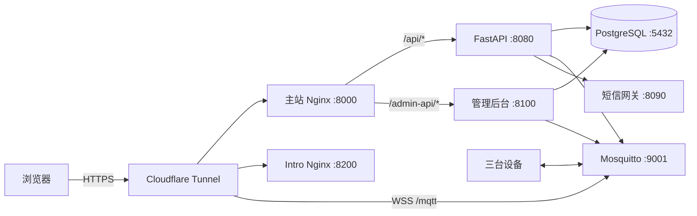

# ASTRA 统一接口文档

版本：1.0  
核对日期：2026-08-17  
覆盖范围：主前端、控制 API、后台控制面板、MQTT/WSS、Intro 静态站

> 本文档只记录接口、变量名和访问边界，不包含密码、AccessKey、Cookie、Tunnel Token 等密钥值。

## 1. 系统入口

| 模块 | 公网入口 | 本机入口 | 服务 |
|---|---|---|---|
| 主前端 | `https://astroy.xyz/` | `http://127.0.0.1:8000/` | `web` / Nginx |
| WWW 跳转 | `https://www.astroy.xyz/` -> `https://astroy.xyz/` | - | Nginx 308 |
| 控制 API | `https://astroy.xyz/api/...` | `http://127.0.0.1:8080/` | `api` / FastAPI |
| API 健康检查 | `https://astroy.xyz/health` | `http://127.0.0.1:8080/health` | `api` |
| 后台控制面板 | `https://astroy.xyz/admin` | `http://127.0.0.1:8100/` | `admin-console` |
| 后台 API | `https://astroy.xyz/admin-api/...` | `http://127.0.0.1:8100/admin-api/...` | `admin-console` |
| Intro | `https://intro.astroy.xyz/` | `http://127.0.0.1:8200/` | `intro-web` / Nginx |
| MQTT/WSS | `wss://mqtt.astroy.xyz/mqtt` | `mqtt://127.0.0.1:1883` / WS `127.0.0.1:9001` | Mosquitto |
| PostgreSQL | 不开放公网 | 容器内部 `postgres:5432` | PostgreSQL 17 |
| 短信网关 | 不开放公网 | 容器内部 `sms-gateway:8090` | `sms-gateway` |



## 2. 鉴权与角色

### 2.1 主站账户

- Cookie：`astra_session`，HttpOnly；生产环境应设置 `AUTH_COOKIE_SECURE=1`。
- 同时支持 `Authorization: Bearer <token>`。
- 默认会话周期：7 天，可通过 `AUTH_SESSION_DAYS` 调整。
- 浏览器调用必须带 `credentials: include`。

| 角色 | 查看设备与遥测 | 发送设备命令 | 后台管理 |
|---|---:|---:|---:|
| `user` | 是 | 否 | 否 |
| `operator` | 是 | 是 | 否 |
| `admin` | 是 | 是 | 是 |

### 2.2 后台控制面板

- Cookie：`astra_admin_console`，HttpOnly、SameSite=Strict，HTTPS 下为 Secure。
- 后台会话有效期：8 小时；会话保存在后台进程内存中，重启后台服务会要求重新登录。
- 只允许 `admin` 角色登录。
- 本机只读预览可使用 `X-ASTRA-Preview: 1`，仅限直接来自 `127.0.0.1` 或 `::1` 且不存在转发头的请求。

## 3. 主前端页面路由

主前端使用 Hash 路由：

| 路由 | 页面 |
|---|---|
| `/#overview` | 观测总览 |
| `/#power` | 能源系统 |
| `/#environment` | 环境、天气、屋顶和设备供电 |
| `/#flat` | 电动平场板 |
| `/#profile` | 个人中心与账户设置 |
| `/#login` | 登录、注册和找回密码 |

当前前端数据路径：

- 账户、验证码、天气：通过同源 HTTP API。
- 实时遥测与控制：浏览器当前直接连接 `wss://mqtt.astroy.xyz/mqtt`。
- 正式对外控制建议统一改用 `POST /api/v1/devices/{device_id}/commands`，避免向浏览器提供 MQTT 控制账号，并使用服务端审计、ACK 和失败重试。
- 前端在线显示：MQTT 已连接且设备最近 30 秒内发过消息才显示在线。
- 服务端离线告警：默认 120 秒，可用 `DEVICE_OFFLINE_SECONDS` 调整。

## 4. 主控制 API

本机 OpenAPI：

- `http://127.0.0.1:8080/docs`
- `http://127.0.0.1:8080/redoc`
- `http://127.0.0.1:8080/openapi.json`

当前 Nginx 只公开 `/api/` 与 `/health`，公网未单独代理 `/docs` 和 `/openapi.json`。

### 4.1 账户接口

| 方法 | 路径 | 鉴权 | 请求/说明 |
|---|---|---|---|
| POST | `/api/v1/auth/verification/request` | 否 | `{channel,target,purpose}`，发送注册或找回验证码 |
| POST | `/api/v1/auth/register` | 否 | `{channel,target,code,password,display_name}` |
| POST | `/api/v1/auth/login` | 否 | `{identifier,password}`，成功后写入会话 Cookie |
| GET | `/api/v1/auth/me` | 登录 | 返回当前用户 |
| POST | `/api/v1/auth/session/refresh` | 登录 | 轮换当前会话 |
| POST | `/api/v1/auth/logout` | 登录 | 退出当前会话，204 |
| POST | `/api/v1/auth/logout-all` | 登录 | 撤销该账户全部会话，204 |
| POST | `/api/v1/auth/password/recover` | 否 | `{channel,target,code,password}` |
| POST | `/api/v1/auth/password/change` | 登录 | `{current_password,new_password}`，新密码至少 9 位 |
| PATCH | `/api/v1/auth/profile` | 登录 | `{display_name}` |

验证码请求示例：

```json
{
  "channel": "phone",
  "target": "13800138000",
  "purpose": "register"
}
```

登录示例：

```json
{
  "identifier": "user@example.com",
  "password": "your-password"
}
```

### 4.2 天气接口

| 方法 | 路径 | 参数 | 鉴权 |
|---|---|---|---|
| GET | `/api/astro` | `lat`、`lon` | 否 |
| GET | `/api/weather/forecast` | `latitude`、`longitude`、`timezone=auto`、`forecast_days=7`、`hourly=...` | 否 |
| GET | `/api/weather/geocoding` | `name`、`count=7`、`language=zh` | 否 |

这些接口是 7Timer 和 Open-Meteo 的同源代理，属于预报或模型推算，不是天文台现场传感器实测。

### 4.3 设备、遥测、命令和告警

| 方法 | 路径 | 鉴权 | 参数/返回 |
|---|---|---|---|
| GET | `/api/v1/devices` | 登录 | 设备列表 |
| GET | `/api/v1/devices/{device_id}/latest` | 登录 | 最新遥测；无数据时 404 |
| GET | `/api/v1/devices/{device_id}/telemetry` | 登录 | `limit=100`，范围 1-2000 |
| POST | `/api/v1/devices/{device_id}/commands` | `operator/admin` | `{command,args}` |
| GET | `/api/v1/commands/{command_id}` | 登录 | 查询 `queued/sent/retrying/acknowledged/failed` |
| GET | `/api/v1/alerts` | 登录 | `status=open|resolved`，`limit=100` |
| GET | `/api/v1/events/stream` | 登录 | SSE，`text/event-stream` |

命令请求示例：

```json
{
  "command": "motor_forward",
  "args": {}
}
```

命令创建响应：

```json
{
  "id": "UUID",
  "status": "sent",
  "payload": {
    "schema": 1,
    "id": "UUID",
    "device": "esp32-001",
    "ts": "2026-08-17T10:00:00Z",
    "command": "motor_forward"
  }
}
```

默认命令最多尝试 3 次、每 5 秒重试一次，由 `COMMAND_MAX_ATTEMPTS` 和 `COMMAND_RETRY_SECONDS` 控制。

## 5. 后台控制面板 API

### 5.1 登录和只读接口

| 方法 | 路径 | 鉴权 | 参数/说明 |
|---|---|---|---|
| GET | `/admin-health` | 否 | 本机后台健康检查 |
| POST | `/admin-api/login` | 否 | `{identifier,password}`，仅管理员 |
| POST | `/admin-api/logout` | 后台 Cookie | 退出，204 |
| GET | `/admin-api/metrics` | 管理员/本机预览 | 系统、数据库、网络和服务状态 |
| GET | `/admin-api/traffic/history` | 管理员/本机预览 | `range`、`services` |
| GET | `/admin-api/users` | 管理员/本机预览 | 账户列表；预览模式自动脱敏 |
| GET | `/admin-api/clients` | 管理员/本机预览 | `limit=100`，范围 1-500 |
| GET | `/admin-api/devices` | 管理员/本机预览 | 设备、最后状态、遥测数量 |
| GET | `/admin-api/mqtt/accounts` | 管理员/本机预览 | MQTT 用户名和固件同步能力，不返回密码 |
| GET | `/admin-api/audit` | 管理员/本机预览 | `limit=30`，范围 1-200 |

流量历史参数：

- `range`: `10m`、`30m`、`1h`、`6h`、`24h`、`1w`、`1mo`
- `services`: 逗号分隔的 `api,mqtt,postgres,tunnel`

### 5.2 管理写接口

以下接口必须使用管理员后台 Cookie，不允许只读预览调用。

| 方法 | 路径 | 请求/说明 |
|---|---|---|
| POST | `/admin-api/services/{service}/restart` | `service`: `postgres`、`mqtt`、`api`、`sms`；30 秒冷却 |
| PATCH | `/admin-api/users/{user_id}` | `{display_name?,email?,phone?,password?}`；账户密码至少 9 位 |
| PATCH | `/admin-api/users/{user_id}/permissions` | `{role,disabled}` |
| DELETE | `/admin-api/clients/{session_id}` | 撤销指定客户端会话 |
| GET | `/admin-api/export?scope=...` | `operational/accounts/audit/all`，下载脱敏 JSON |
| POST | `/admin-api/mqtt/accounts/{username}/password` | `{password,sync_firmware}`；MQTT 密码至少 12 位 |
| POST | `/admin-api/devices` | `{device_id,device_type,name,mqtt_password?}` |
| PATCH | `/admin-api/devices/{device_id}` | `{enabled}` |
| DELETE | `/admin-api/devices/{device_id}?purge=false` | 删除设备；`purge=true` 同时删除历史和命令 |

限制：`backend-controller` 的 MQTT 密码不能从后台页面修改，必须通过服务器环境变量和 Mosquitto 认证文件统一轮换。

## 6. MQTT/WSS 协议

### 6.1 连接参数

| 字段 | 值 |
|---|---|
| 公网 URL | `wss://mqtt.astroy.xyz/mqtt` |
| 本机 TCP | `127.0.0.1:1883` |
| 本机 WebSocket | `127.0.0.1:9001` |
| QoS | 1 |
| 设备 ID | `esp32-001`、`mppt-001`、`ef-001` |
| 用户名/密码 | 每台设备独立 Mosquitto 账户；不要写入本文档或前端源码 |

### 6.2 Topic 方向

| Topic | 发布方 | 订阅方 | 用途 |
|---|---|---|---|
| `devices/{deviceId}/telemetry` | 设备 | API、前端 | 遥测上报 |
| `devices/{deviceId}/status` | 设备 | API、前端 | online/offline/心跳 |
| `devices/{deviceId}/reported` | 设备 | API、前端 | 命令 ACK 或错误 |
| `devices/{deviceId}/command` | API/授权控制端 | 设备 | 即时命令 |
| `devices/{deviceId}/desired` | API/授权控制端 | 设备 | 保留的期望配置 |

设备 ACL 原则：只能写自己的 `telemetry/status/reported`，只能读自己的 `command/desired`。

### 6.3 消息示例

遥测：

```json
{
  "schema": 1,
  "device": "esp32-001",
  "ts": "2026-08-17T10:00:00Z",
  "seq": 101,
  "dht_temperature": 22.4,
  "dht_humidity": 48.2,
  "rain_detected": false,
  "roofPosition": 0
}
```

状态：

```json
{
  "schema": 1,
  "device": "esp32-001",
  "ts": "2026-08-17T10:00:00Z",
  "status": "online"
}
```

命令：

```json
{
  "schema": 1,
  "id": "UUID",
  "device": "esp32-001",
  "ts": "2026-08-17T10:00:00Z",
  "command": "motor_stop"
}
```

ACK：

```json
{
  "schema": 1,
  "device": "esp32-001",
  "id": "UUID",
  "ts": "2026-08-17T10:00:01Z",
  "ok": true,
  "result": "stopped"
}
```

## 7. Intro 静态站

Intro 不调用主站 API，也不要求登录，是独立的只读静态网站。

| 路径 | 内容 |
|---|---|
| `/` 或 `/index.html` | 项目简介 |
| `/architecture.html` | 系统架构 |
| `/nodes.html` | 软硬件设计 |
| `/process.html` | 实物搭建 |
| `/outcome.html` | 成果总结 |
| `/future.html` | 后续规划 |
| `/assets/css/site.css` | 站点样式 |
| `/assets/js/site.js` | 导航、滚动和图片预览交互 |
| `/assets/images/web/...` | 压缩展示图 |
| `/assets/images/original/...` | 灯箱原图 |

## 8. 通用状态码

| 状态码 | 含义 |
|---:|---|
| 200/201/202 | 成功、创建成功、请求已接受 |
| 204 | 成功且无响应体 |
| 401 | 未登录或会话过期 |
| 403 | 角色权限不足 |
| 404 | 设备、命令、会话或资源不存在 |
| 409 | 状态冲突，例如设备禁用或账号重复 |
| 422 | JSON 或查询参数校验失败 |
| 429 | 验证码、登录或服务重启操作过于频繁 |
| 502 | 上游天气、服务控制器或网关不可用 |

## 9. 必要环境变量

仅列变量名；值应保存在 `.env`、Docker Secret 或服务器密钥管理器中。

- 数据库：`POSTGRES_DB`、`POSTGRES_USER`、`POSTGRES_PASSWORD`、`DATABASE_URL`
- MQTT：`MQTT_HOST`、`MQTT_PORT`、`MQTT_USERNAME`、`MQTT_PASSWORD`
- 账户：`AUTH_SECRET`、`ADMIN_EMAIL`、`ADMIN_PASSWORD`、`AUTH_COOKIE_SECURE`
- 邮箱：`SMTP_HOST`、`SMTP_PORT`、`SMTP_USERNAME`、`SMTP_PASSWORD`、`SMTP_FROM`
- 短信：`SMS_GATEWAY_MODE`、`SMS_WEBHOOK_TOKEN`、`ALIYUN_PNVS_ACCESS_KEY_ID`、`ALIYUN_PNVS_ACCESS_KEY_SECRET`、`ALIYUN_PNVS_SIGN_NAME`、`ALIYUN_PNVS_TEMPLATE_CODE`
- Cloudflare：`CLOUDFLARED_TOKEN_FILE`

## 10. 快速验证

```powershell
# 主站与 API
Invoke-WebRequest https://astroy.xyz/ -UseBasicParsing
Invoke-RestMethod https://astroy.xyz/health

# 后台与 Intro
Invoke-WebRequest https://astroy.xyz/admin -UseBasicParsing
Invoke-WebRequest https://intro.astroy.xyz/ -UseBasicParsing

# 本机 OpenAPI
Invoke-WebRequest http://127.0.0.1:8080/openapi.json -OutFile openapi.json
```

MQTT/WSS 验证应使用 MQTTX，并使用专用测试账号；不要使用 `backend-controller` 或设备生产密码进行日常测试。
