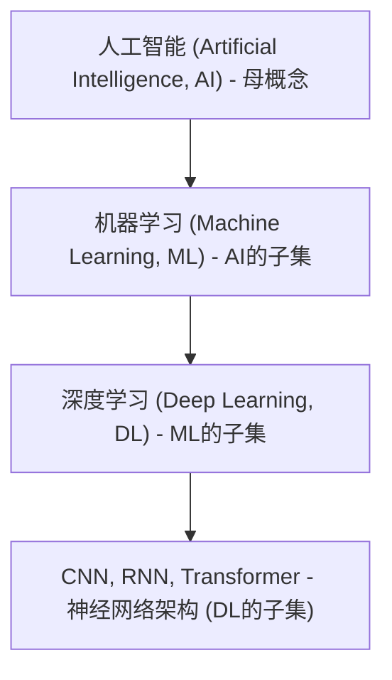

# CNN 与 RNN 架构形象化解构

本笔记采用形象化隐喻与具体实例，对深度学习中两大经典时序与特征提取架构——卷积神经网络（CNN）与循环神经网络（RNN）进行通俗化翻译。

## 📌 前置科普：CNN 和 RNN 算是 AI 吗？

**是的，它们绝对属于 AI。** 为了理清它们在整个技术图谱中的具体定位，可以通过以下同心圆包含关系图来理解：

### 层级定位解析

* **人工智能（AI，最外层母概念）**：凡是能让计算机模拟人类智能行为的技术，都属于 AI。这既包括现代的神经网络，也包括早期的硬编码 `if-else` 规则与决策系统。
* **机器学习（ML，AI 的子集）**：不依靠人类手动编写规则，而是让计算机从大量数据中自动寻找规律并进行预测的技术。
* **深度学习（DL，ML 的子集）**：特指利用多层人工神经网络来模拟人脑进行特征提取和学习的技术。
* **CNN & RNN（DL 的底层架构）**：它们是深度学习中最经典的两类底层神经网络算法架构。通过实现“特征自动提取”与“时序上下文记忆”（摆脱了人类手动设计特征的局限），它们展现了核心的机器“智能”，因此自然属于 AI。

---

## 卷积神经网络（Convolutional Neural Network, CNN）

**卷积神经网络**是指==一种主要包含卷积计算且具有深层结构的前馈神经网络，其核心特征是通过局部连接和权重共享来自动提取输入数据的局部空间或局部时序特征==。

> 🔗 **横向关联**：本词条的 [局部滑动卷积机制] 与 [[AI技术演进与创新金字塔]] 中的 [时序卷积网络 TCN] 形成**因果/上下游**关系——CNN 提供了一维空间/时间滑窗卷积的数学特征提取手段，而 TCN 则是将其具体应用在处理长序列建模的并行架构中。

### 一、 核心要素与运作机制 (Mechanism)
* **卷积核（Kernel / Filter）**：一个固定大小的数矩阵（如 3x3），在输入图像或序列上进行平移滑动。
* **局部连接（Local Connection）**：每个输出神经元仅与输入数据的局部区域连接，聚焦局部特征。
* **权重共享（Weight Sharing）**：滑动过程中使用的是同一个卷积核的参数，大幅减少训练的参数量，并保证平移不变性。
* **下采样/池化（Pooling）**：对提取到的特征进行筛选压缩（如 Max Pooling 取局部最大值），降低空间分辨率并过滤噪点。

### 二、 形象化解构：比喻与具体实例 (Metaphor & Example)
* **形象比喻**：手持放大镜巡检的 **“拼图侦探”**。
  * 侦探拿着一个小放大镜（卷积核），从左到右、从上到下扫视整张画作。每次只看放大镜里的局部线条（局部连接），认出边缘、夹角等线索，最后由总部把这些线索碎片拼装起来（池化与全连接），最终识别出整张画画的是什么。
* **具体实例**：让 CNN 识别一张“猫”的图片。
  1. **第一层（细节线索）**：小滑窗扫过图像，提取出“斜线”、“弧线”等最基础的几何边缘。
  2. **第二层（局部拼装）**：将提取到的基本边缘合并，组装识别出“尖角（猫耳）”、“圆形（猫眼）”、“胡须”等部件。
  3. **第三层（全局定性）**：汇总所有部件，发现图片中同时有“猫耳 + 猫眼 + 胡须”，最终判定“这是一只猫”。

---

## 循环神经网络（Recurrent Neural Network, RNN）

**循环神经网络**是指==一种具有节点定向循环连接的神经网络架构，其核心特征是在处理序列数据时通过内部隐状态进行历史信息的单向循环传递，从而实现时间步之间的记忆关联==。

> 🔗 **横向关联**：本词条的 [隐状态循环传递缺陷] 与 [[AI技术演进与创新金字塔]] 中的 [线性注意力 RWKV / 状态空间模型 Mamba] 形成**对照/上下游**关系——传统 RNN 无法并行训练且易遗忘长程依赖，而 Mamba 和 RWKV 则是吸收了其极速推理的优势，并重塑数学公式打破了其无法并行训练的死穴。

### 一、 核心要素与运作机制 (Mechanism)
* **循环单元（Recurrent Cell）**：同一套计算公式在不同的时间步被重复调用。
* **隐状态（Hidden State, $h_t$）**：模型的内部“记忆体”。在每个时间步 $t$，模型不仅接收当前输入 $x_t$，还会读取上一时间步传递过来的隐状态 $h_{t-1}$。
* **时间展开（BPTT）**：在训练阶段，循环体按时间步展开成一条长链进行反向传播更新参数。
* **遗忘与消失**：由于长链上参数的连续相乘，导致梯度在传播很远后极易发生指数级收缩（梯度消失）或膨胀（梯度爆炸），导致模型丢失长距离的历史信息。

### 二、 形象化解构：比喻与具体实例 (Metaphor & Example)
* **形象比喻**：边跑边记的 **“健忘日记手”**。
  * 日记手沿着一条时间走廊向前跑。每到一个房间（时间步），他就把房间里的新事物（当前输入）与他在脑子里存的日记摘要（隐状态）混合起来，重新写一行摘要存在脑子里，再跑向下一个房间。但因为脑容量有限（隐状态维度固定），如果走廊太长（超长文本），跑向后面时，他就会把最开始房间里的重要日记忘得一干二净（梯度消失与遗忘）。
* **具体实例**：让 RNN 预测句子的下一个字：“今天天气很冷，我出门穿了羽绒___”。
  1. **时间步 1**：输入“今天” ➔ 隐状态记下 `[时间: 今天]`。
  2. **时间步 2**：输入“天气很冷” ➔ 混合前文，隐状态更新为 `[今天 + 冷]`。
  3. **时间步 3**：输入“我出门” ➔ 混合前文，隐状态更新为 `[今天冷 + 出门]`。
  4. **时间步 4**：输入“穿了羽绒” ➔ 综合当前记忆 `[冷 + 出门 + 穿羽绒]` ➔ 预测输出“服”。

---

## 三、 多维度对比表格 (Comparison)

以下表格对比了 CNN 与 RNN 两大传统深度学习架构在数据/时序处理逻辑上的底层差异：

| 维度 | 卷积神经网络 (CNN) | 循环神经网络 (RNN) |
|---|---|---|
| **核心机制** | 局部卷积核在数据上进行空间/时间滑动扫描 | 隐状态 $h_t$ 随时间步单向递推传递 |
| **计算并行度** | 极高（滑窗计算各局部位置互不依赖，可高并发） | 极低（第 $t$ 步计算必须强依赖并等待第 $t-1$ 步完成） |
| **长程依赖能力** | 较弱（受限于卷积核的窗口大小与感受野范围） | 较差（极易发生梯度消失或长程历史记忆遗忘） |
| **推理时空开销** | 计算量随输入序列长度增加而呈线性或平方增加 | 恒定（每次计算只需处理当前步并单向传递隐状态） |
| **典型应用场景** | 图像识别、计算机视觉、一维时序信号特征提取 | 早期文本生成、机器翻译、连续传感器数据流 |

最关键的差异点在于：CNN 侧重于空间维度的“拼图扫描”（能高并发但视野相对狭窄），而 RNN 侧重于时间维度的“流水账日记”（能连贯递推但无法并行训练）。

---

## 💡 记忆锚点与口诀

* **CNN 记忆锚点**：放大镜（局部扫描）+ 拼图（层层组装）。
* **RNN 记忆锚点**：传话筒（一步一步传）+ 健忘症（传久了会忘）。
* **极简口诀**：
  > “卷积扫描拼局部，并行计算图像出；”
  > “循环递推记历史，时间链条写故事。”

---

## 四、 数据库索引

| # | 概念名称 | 英文/缩写 | 类型 | 所属维度 | 横向关联词条 | 记忆口诀/关键词 | 重要性 |
|---|---------|-----------|------|---------|------------|----------------|--------|
| 1 | 卷积神经网络 | Convolutional Neural Network / CNN | 深度学习 | 经典架构 | [[AI技术演进与创新金字塔]] | 放大镜与拼图 | ⭐⭐⭐⭐⭐ |
| 2 | 循环神经网络 | Recurrent Neural Network / RNN | 深度学习 | 经典架构 | [[AI技术演进与创新金字塔]] | 传话筒与健忘症 | ⭐⭐⭐⭐⭐ |

---
## 参考来源

1. 经典深度学习基础理论教程。
2. 用户提供材料及横向笔记 [[AI技术演进与创新金字塔]]。
