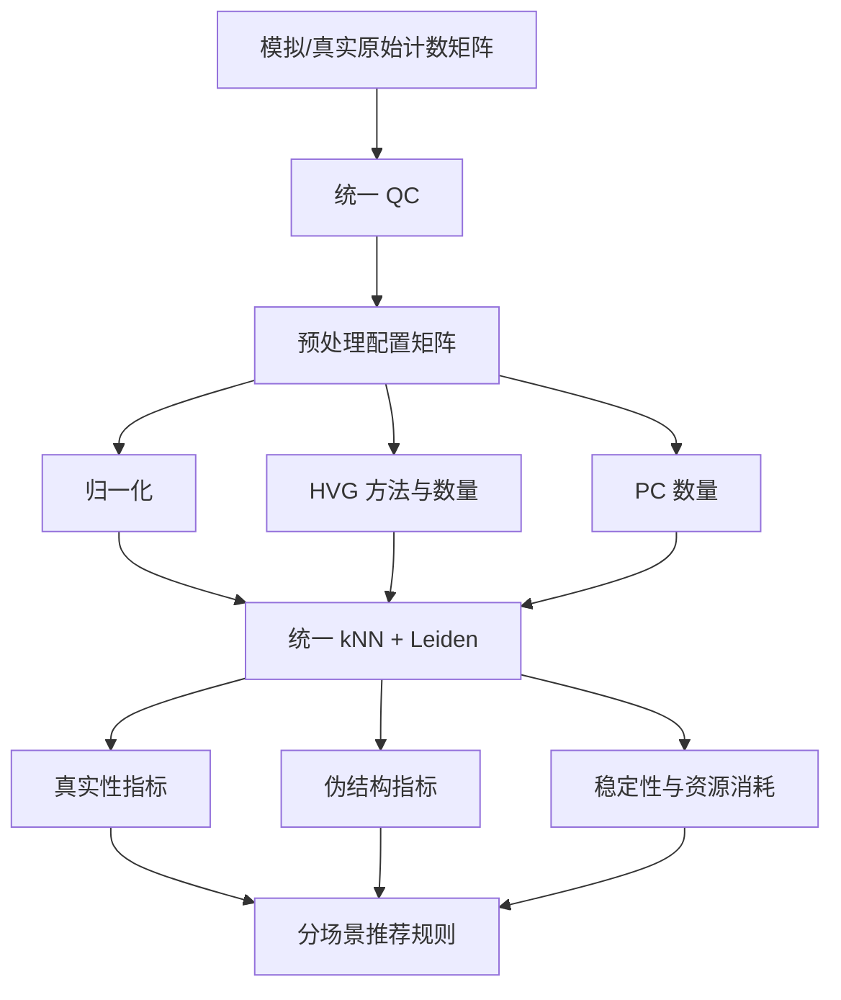

# 单细胞预处理与聚类有效性：开题汇报 PPT 设计

> 建议时长：10–12 分钟；建议页数：11–13 页。  
> 核心叙事：标准流程中的预处理选择会改变聚类结论，因此需要统一 benchmark 量化其影响，并形成分场景选择建议。

## 1. 标题页（20 秒）

**题目：** 单细胞转录组预处理选择对聚类有效性的影响  
**副标题：** 基于模拟与公开数据的系统评价  

页面只保留题目、姓名、课题组和日期。背景可使用一张低透明度的 UMAP 或“基因×细胞”表达矩阵图。

## 2. 研究背景：单细胞分析流程（50 秒）


**讲述重点：**

- scRNA-seq 已形成相对标准的分析流程。
- 归一化、HVG 数量和 PC 数量通常依赖默认参数或经验。
- 这些选择会改变细胞间距离，因而可能改变邻接图和最终聚类。

## 3. 科学问题：算法总能给出簇，但簇未必真实（60 秒）

页面建议左右对照：

- 左图：真实离散的 3 个群体。
- 右图：一条连续轨迹被 Leiden 或层次聚类切成 3 段。

**核心文字：**

> 聚类算法一定会输出分组；真正的问题是，这些分组代表离散生物学群体，还是预处理和算法共同制造的伪结构？

补充说明：UMAP 上分开的“岛”、较高轮廓系数和显著 marker，都不能单独证明存在真实细胞类型。

## 4. 研究假设与目标（45 秒）

**研究假设：**

1. 预处理选择对弱分离、稀有群体、低深度和连续数据的影响大于对强分离数据的影响。
2. 增加 HVG 或 PC 数量可能提高真实结构检出能力，也可能提高 Null 数据中的伪簇率。
3. 不存在适用于所有数据的唯一最佳预处理配置，但可以形成分场景建议。

**研究目标：**

- 建立统一、可复现的预处理 benchmark。
- 量化真实结构恢复、伪结构控制、稳定性和计算成本。
- 为不同细胞数、测序深度和结构类型提供选择建议。

## 5. 研究范围：比较什么，不比较什么（45 秒）

| 模块 | 主实验 | 扩展实验 |
|---|---|---|
| QC | 固定数据自适应规则 | 宽松与严格 QC |
| 归一化 | LogNormalize、scran、SCTransform | Pearson residual |
| 特征选择 | Seurat VST、scran modelGeneVar | Deviance-based |
| HVG 数量 | 1,000、2,000、4,000 | 其他数量 |
| PC 数量 | 10、20、50 | 数据驱动 PC 选择 |
| 聚类 | 固定 kNN + Leiden | resolution 敏感性 |

**边界：** 从未归一化 UMI 计数矩阵开始，以 PCA/邻接图为预处理输出；FASTQ 比对不纳入主课题。

## 6. 数据与实验场景（60 秒）

### 模拟数据

| 场景 | 主要评价问题 | 建议规模 |
|---|---|---:|
| Null 单群体 | 是否无中生有产生簇 | 2k、10k cells |
| 3–5 个离散簇 | 能否恢复真实结构 | 2k、10k、20k |
| 1%–5% 稀有簇 | 是否丢失小群体 | 5k、20k |
| 连续/分支轨迹 | 是否错误离散化 | 5k、20k |
| 低/中/高深度 | 对稀疏和深度的鲁棒性 | 固定 10k |

### 公开真实数据

- 10x PBMC 3k/10k：流程调试与常规场景。
- FACS 分选 PBMC、细胞系混合：相对可靠标签。
- CITE-seq：用蛋白标签辅助验证 RNA 聚类。
- 多供体或发育数据：评价批次、个体差异和连续结构。

来源：10x Genomics Datasets、CELLxGENE、GEO、Single Cell Expression Atlas、ExperimentHub。

## 7. Benchmark 技术路线（60 秒）



公平性原则：使用同一套输入、随机种子和聚类流程；同时报告固定 resolution 的实际表现与有限调参后的最佳表现。

## 8. 评价指标（50 秒）

| 目标 | 指标 |
|---|---|
| 恢复真实分区 | ARI、NMI、簇数误差 |
| 稀有群体 | precision、recall、F1 |
| 控制伪结构 | Null 假阳性率、连续轨迹错误离散化率 |
| 稳定性 | 不同随机种子/重采样间 ARI |
| 技术混杂 | 聚类与批次、UMI、线粒体比例的关联 |
| 计算成本 | 运行时间、峰值内存、磁盘占用 |

选择方法时先约束 Null 假阳性率和批次伪簇，再比较 ARI、稀有簇召回率和效率；不把所有指标简单平均成一个总分。

## 9. 实验结果页：当前应如何呈现（60 秒）

如果尚未完成实验，本页标题应写成 **“预实验与预期结果形式”**，不要写成已经得到的结论。

建议先完成一个最小预实验：

```text
数据：PBMC 3k + 2,000-cell Null 模拟 + 3-cluster 模拟
配置：3 种归一化 × HVG 1000/2000 × PC 10/20
聚类：固定 kNN 和 Leiden resolution
重复：每个模拟条件 10 次
```

首批结果展示四张图：

1. 不同配置下的 UMAP 对照图，仅用于直观展示。
2. 配置 × 场景的 ARI 热图。
3. Null 假阳性率—离散簇 ARI 散点图。
4. PC/HVG 数量变化时簇数和稳定性的折线图。

汇报措辞示例：

> 当前完成了分析框架和最小预实验设计。正式实验将检验观察到的参数敏感性是否能在多次模拟和独立真实数据中复现。

## 10. 预期结果展示模板（50 秒）

### 主图 A：性能—风险图

- 横轴：Null 假阳性率，越低越好。
- 纵轴：离散簇场景平均 ARI，越高越好。
- 点颜色：归一化方法。
- 点大小：运行时间或峰值内存。

左上区域代表“伪簇少、真实结构恢复好”。这张图应作为最终汇报的主结果。

### 主图 B：参数敏感性曲线

- 横轴：PC 或 HVG 数量。
- 纵轴：ARI、簇数或稳定性。
- 分面：细胞数、测序深度、结构类型。

### 主图 C：决策表

最终给出“数据特征—推荐配置—风险提示”，而不是宣布一个适用于所有数据的冠军。

## 11. 可行性分析（45 秒）

**数据：** 全部使用公开计数矩阵和模拟数据，不依赖湿实验。  
**软件：** R/Seurat、scran、Splatter，均为开源工具。  
**设备：** Xeon E5 + RTX 2080 Super + 400 GB 外置 SSD；主流程依赖 CPU 和内存，GPU 仅用于可选的 scVI。  
**可控规模：** 主实验以 2k–20k cells 为主，30k–100k cells 只对入选配置扩展。  
**主要风险：** 组合数量膨胀、模拟器偏倚、真实标签不完美。  
**应对：** 分阶段筛选、使用两个模拟来源、加入半模拟与多种真实数据。

内存容量需要在正式运行前确认；若为 32 GB，主实验控制在 20k–30k cells，若为 64 GB 可扩展至约 50k cells。

## 12. 未来计划（50 秒）

| 阶段 | 工作 | 输出 |
|---|---|---|
| 第 1–2 周 | 环境、配置系统、PBMC 3k 流程 | 可复现基线 |
| 第 3–4 周 | 最小模拟与 12 个配置 | 首批 4 张图 |
| 第 2–3 月 | Null、离散簇、稀有簇、轨迹 | 主 benchmark |
| 第 4 月 | 5 个公开真实数据集 | 外部验证 |
| 第 5 月 | 上游参数交互与敏感性分析 | 推荐规则 |
| 第 6 月 | 整理代码、报告和 PPT | 脚本、图表、论文初稿 |

## 13. 总结页（30 秒）

保留三句话：

1. 聚类结果会受到归一化、HVG 和 PC 数量的共同影响。
2. 评价预处理不能只看 ARI，还必须同时控制 Null 伪簇和连续过程错误离散化。
3. 本课题的主要成果是可复现 benchmark 和分场景选择建议，自动推荐工具作为后续扩展。

## 答辩可能追问

### 为什么不直接开发新方法？

首先需要确认现有方法在什么场景失效。独立 benchmark 能提供证据；如果发现稳定、可预测的失效规律，再据此开发自动选择方法更合理。

### 为什么不只使用真实数据？

真实数据的细胞标签并非绝对真值，也无法知道 Null 场景。模拟数据用于计算假阳性率和功效，真实数据用于检验模型外可重复性，两者缺一不可。

### 为什么 UMAP 不能证明聚类真实？

UMAP 是非线性二维可视化，形状受到邻居数、距离和随机种子影响；它适合展示，不是统计证据。

### 为什么固定聚类算法？

课题要估计预处理的影响。如果同时改变聚类算法，就无法区分差异来自预处理还是聚类器。聚类算法比较可作为后续扩展。

### 最终是否会推荐一个最佳方法？

预期不会存在全局最优方法。最终提供的是在控制伪簇风险前提下，针对数据规模、测序深度、稀有群体和连续结构的条件化建议。
