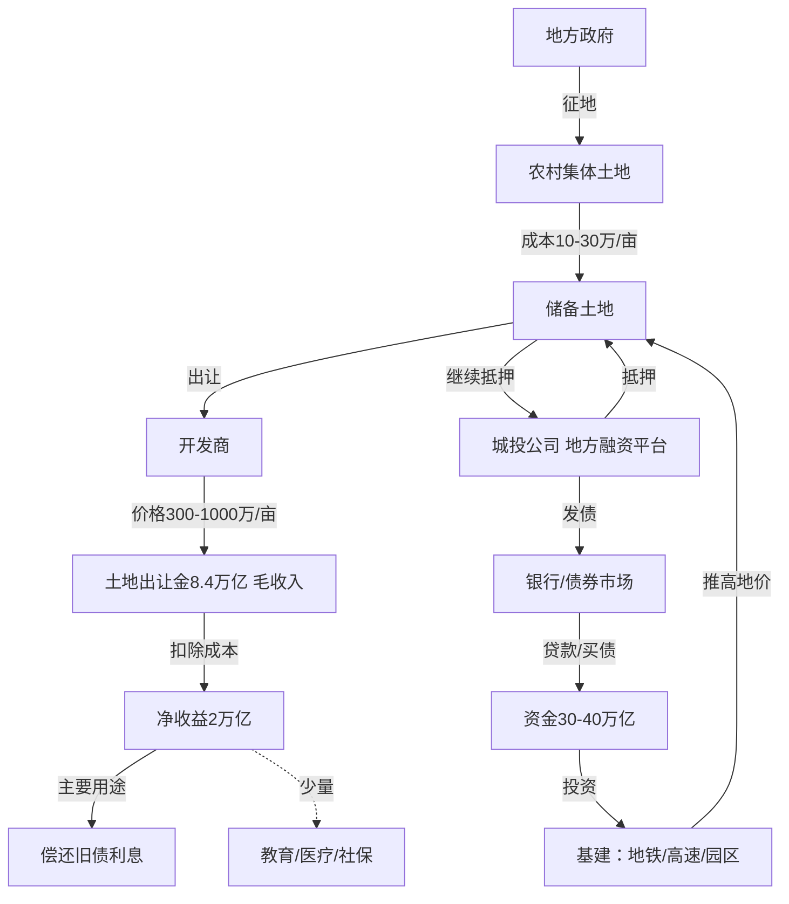

---
tags:
  - 世界经济政治
  - 中国经济政治
  - 土地财政
  - 地方债务
  - 分税制
  - 城投债
关联:
  - "[[中国房地产泡沫为何突然破裂：制度扭曲与压缩弹簧效应]]"
  - "[[东亚经济政治：发展型国家、存量博弈与冷极化]]"
  - "[[制度经济学：市场的非自然性、交易成本与产权的社会塑造]]"
  - "[[分配阀门的再校准：考研退潮、考公升温与学硕转博的制度逻辑（2025-2026）]]"
---

# 土地财政的双重依赖：流量与存量的断裂

> - **根节点**：为什么说"地方政府高度依赖土地财政"，但土地出让净收益只占地方综合财力的9%？这两个数字矛盾吗？土地财政的本质是"卖地赚钱"还是"土地抵押借债"？中国的模式与石油国家、其他土地国有制国家有何根本区别？
> - **叙事逻辑**：澄清常见误解（毛收入vs净收益、收入vs支出）→ 土地财政的双重依赖（流量16% vs 存量268%）→ 真实运作机制（土地-信用-债务循环）→ 与石油诅咒、其他国家的对比 → 2022-2024危机的实证 → 收束
> - **立场说明**：本笔记是对"土地财政"这一中国独有制度的精确机制分析，纠正"地方政府80-90%收入靠卖地"这一流行但错误的说法，同时揭示比这个数字更致命的真相——57万亿债务依赖土地抵押维持。
> - **来源标注**：财政部《政府性基金预算执行情况》、审计署《地方政府债务审计报告》、中国指数研究院《土地市场报告》、Wind资讯《城投债统计》；笔记作者原创综合分析，2026-09-19。

---

## 一、常见误解的澄清：三组数字的混淆

### 1.1 误解一：毛收入 vs 净收益

**流行说法（错误）**：
> "2020年全国土地出让金8.4万亿，地方公共预算收入10.5万亿，土地出让金占80%"

**错在哪里**：

| 项目 | 金额（万亿） | 说明 |
|---|---|---|
| **土地出让毛收入** | 8.4 | 拍卖土地的总收入 |
| **减：征地拆迁补偿** | -3.2 | 补偿被征地农民、拆迁户 |
| **减：土地开发成本** | -1.8 | 平整土地、七通一平 |
| **减：城市建设配套** | -0.9 | 道路、管网、绿化 |
| **减：其他成本** | -0.5 | 行政成本、耕地占用税 |
| **= 土地出让净收益** | **~2.0** | **实际可支配的"纯利润"** |

**净收益率**：

$$
\text{净收益率} = \frac{2.0}{8.4} = 23.8\%
$$

> 📌 **关键澄清**：地方政府卖地8.4万亿，真正到手的只有约2万亿（24%），其余76%都花在了成本上。**"土地出让金占财政80%"这个说法，用的是毛收入，未扣除成本，且分母用错了口径。**

---

### 1.2 误解二：公共预算 vs 综合财力

**流行说法（错误）**：
> "土地出让金占地方财政收入40-50%"

**错在哪里**：混淆了两个财政口径。

| 财政口径 | 金额（万亿） | 包含什么 |
|---|---|---|
| **公共预算收入** | 10.5 | 税收为主（增值税、所得税等） |
| **政府性基金收入** | 2.0 | 土地出让净收益为主 |
| **中央转移支付** | 8.3 | 中央给地方的转移支付 |
| **其他收入** | 0.6 | 国有资产经营收入等 |
| **= 地方综合财力** | **21.4** | **地方政府实际可支配的全部收入** |

**正确的占比**：

$$
\text{土地出让净收益占综合财力} = \frac{2.0}{21.4} = 9.3\%
$$

> 📌 **关键澄清**：土地出让净收益属于"政府性基金收入"，不属于"公共预算收入"。如果只看公共预算（10.5万亿），土地净收益占19%；如果看综合财力（21.4万亿），只占9%。

---

### 1.3 误解三：收入 vs 支出

**流行说法（错误）**：
> "土地相关收入占地方财政30%（包括卖地收入+房地产税收+债务利息）"

**错在哪里**：**债务利息是支出，不是收入。**

| 项目 | 性质 | 金额（万亿） |
|---|---|---|
| 土地出让净收益 | **收入** | +2.0 |
| 房地产相关税收 | **收入** | +1.5 |
| **= 土地相关总收入** | **收入** | **+3.5** |
| | | |
| 债务利息 | **支出** | **-3.0** |
| 征地拆迁补偿 | **支出** | -3.2 |
| 教育医疗社保 | **支出** | -15.0 |

**正确的占比**：

$$
\text{土地相关收入占综合财力} = \frac{3.5}{21.4} = 16.4\%
$$

> 📌 **关键澄清**：地方政府每年要偿还债务利息3万亿，这是支出（要还的钱），不是收入（赚的钱）。把利息算进"土地相关收入"是会计概念的根本性混淆。

---

## 二、土地财政的双重依赖：流量 vs 存量

### 2.1 维度一：流量依赖（收入层面）

**问题**：土地相关收入占地方财政收入多少？

**答案**：

| 项目 | 金额（万亿） | 占综合财力比例 |
|---|---|---|
| 土地出让净收益 | 2.0 | 9% |
| 房地产相关税收 | 1.5 | 7% |
| **合计** | **3.5** | **16%** |

**房地产相关税收包括**：

- 建筑业增值税
- 房地产企业所得税
- 契税（买房交易税）
- 土地增值税
- 房产税（试点，金额极小）

**结论**：

> 从流量（收入）角度，地方财政对土地的依赖度是**16%**。
>
> 这个数字不算低，但也没有到"80-90%"那么夸张。

---

### 2.2 维度二：存量依赖（债务偿付）

**问题**：土地价值维持对债务偿付有多重要？

**答案**：

| 项目 | 数据 |
|---|---|
| 地方政府显性债务 | 37.4万亿（2023） |
| 城投债（隐性债务） | 20万亿（估计） |
| **债务总规模** | **57万亿** |
| 年化利息（5%） | 2.9万亿 |
| 每年到期本金 | 7-10万亿 |
| 能否展期（借新还旧） | **取决于土地抵押价值** |

**债务偿付压力**：

$$
\text{债务偿付占综合财力} = \frac{\text{每年到期本息10万亿}}{\text{综合财力21万亿}} = 47\%
$$

**关键机制**：

> 地方政府每年综合财力21万亿，要偿还10万亿债务本息（占47%）。
>
> 这10万亿中，只有1-2万亿能用当年收入还，其余8-9万亿**必须借新债**。
>
> 能否借到新债，**完全取决于土地抵押价值维持**。

---

### 2.3 两个维度的对比

| 依赖类型 | 占比 | 如果土地价值暴跌会怎样 |
|---|---|---|
| **流量依赖** | 16% | 损失3.5万亿收入，可以靠压缩支出（欠薪、减支）撑一段时间 |
| **存量依赖** | 268%（债务/GDP） | 土地抵押价值缩水→借不到新债→无法还旧债→**债务违约、财政崩溃** |

**类比**：

- 一个人，工资收入占总收入16%（不算高）
- 但这个人背了总收入4.7倍的债务，每年要还本息占收入47%
- 还债的钱，靠抵押房产借新债
- 一旦房产贬值，借不到新债→破产

**这就是地方政府的处境。**

---

## 三、土地财政的真实机制：不是收入，是信用基础

### 3.1 错误理解 vs 正确理解

| 错误理解 | 正确理解 |
|---|---|
| 地方政府靠"卖地收入"运转 | 地方政府靠"土地信用"借债运转 |
| 土地出让金直接用于日常支出 | 土地出让金主要用于**偿还债务** |
| 土地收入占财政80-90% | 土地作为**抵押品**撬动的债务，是财政收入的数倍 |

---

### 3.2 真实的运作链条



**关键洞察**：

> 土地出让金净收益2万亿，但它作为**信用基础**，撬动了30-40万亿的债务融资。
>
> **真正的依赖不是那2万亿收入，而是"土地能持续作为抵押品"这个预期。**

---

### 3.3 数据：债务规模的演变

| 年份 | 地方显性债务 | 城投债（隐性） | 合计 | 土地净收益 | 债务/净收益 |
|---|---|---|---|---|---|
| **2015** | 16万亿 | 12万亿 | 28万亿 | 2.3万亿 | **12倍** |
| **2020** | 25.5万亿 | 18万亿 | 43.5万亿 | 2.0万亿 | **22倍** |
| **2023** | 37.4万亿 | 20万亿 | 57.4万亿 | 1.5万亿 | **38倍** |

**数据来源**：
- 财政部《地方政府债务余额》
- Wind资讯《城投债发行统计》
- 国际清算银行《中国信贷缺口报告》

**结论**：

> 地方政府真正依赖的不是2万亿的土地出让金，而是用土地作抵押借来的**57万亿债务**。
>
> 如果土地价值暴跌，地方政府不是少赚2万亿，而是**57万亿债务无法展期、地方财政崩溃**。

---

## 四、为什么这个机制是中国独有：四个条件的交集

### 4.1 土地财政成立的四个前提

| 条件 | 说明 | 中国是否满足 | 其他国家 |
|---|---|---|---|
| **1. 土地国有** | 政府垄断土地供给 | ✅ | 大多数国家土地私有 |
| **2. 地方分权** | 地方政府有独立卖地权 | ✅ | 新加坡、越南是中央集权 |
| **3. 财权事权不匹配** | 支出责任大、税收权力小 | ✅ | 联邦制国家地方有税权 |
| **4. 债务软约束** | 地方政府不会破产（中央兜底预期） | ✅ | 美国地方政府可破产 |

**只有中国同时满足这四个条件。**

---

### 4.2 条件1：土地国有

**全球土地制度对比**：

| 国家 | 土地制度 | 政府能否卖地赚钱 |
|---|---|---|
| **美国** | 私有（政府仅持有28%联邦土地） | ❌ 无地可卖 |
| **英国** | 私有（王室+私人） | ❌ 无地可卖 |
| **新加坡** | 90%国有 | ✅ 但卖地收入归中央，非地方 |
| **越南** | 国有 | ✅ 但地方政府权力小，收入归中央 |
| **中国** | 国有（城市）+集体（农村） | ✅ 且地方政府可独立操作 |

**关键**：

> 其他社会主义国家（越南、古巴）也是土地国有，但**地方政府无权自行卖地**——收入归中央，再分配给地方。
>
> **中国的独特性**：1994年分税制改革后，**地方政府有卖地权，且收入归地方**（不上交中央）。

---

### 4.3 条件2-3：分税制的后果

**1994年分税制改革**：

| 税种 | 改革前 | 改革后 | 结果 |
|---|---|---|---|
| **增值税** | 地方全留 | 中央拿75%，地方拿25% | 地方税收锐减 |
| **企业所得税** | 地方全留 | 中央拿60%，地方拿40% | 地方税收锐减 |
| **个人所得税** | 地方全留 | 中央拿60%，地方拿40% | 地方税收锐减 |

**但支出责任**：

| 支出项目 | 中央负担 | 地方负担 |
|---|---|---|
| **教育** | 10% | 90% |
| **医疗** | 20% | 80% |
| **社保** | 30% | 70% |
| **基建** | 10% | 90% |

**结果**：

> 地方政府收入占全国财政收入的 45%，但支出占全国财政支出的 85%。
>
> **缺口 = 40%，只能靠卖地填补。**

**对比联邦制国家**：

| 国家 | 地方税权 | 地方支出 | 是否需要卖地 |
|---|---|---|---|
| **美国** | 州有独立税权（州所得税、房产税） | 州负责教育、医疗 | ❌ 靠税收就够 |
| **德国** | 州有独立税权 | 州负责教育、治安 | ❌ 靠税收就够 |
| **中国** | 地方无独立税权（税种由中央定） | 地方负责教育、医疗、基建 | ✅ 必须卖地 |

---

### 4.4 条件4：债务软约束

**美国**：
- 地方政府可以破产（底特律2013年破产）
- 银行借钱给地方政府会谨慎评估风险
- 没有"中央兜底"预期

**中国**：
- 地方政府法律上不能破产
- 银行（多为国有）相信"中央会兜底"
- 城投债被视为"准国债"
- **软约束→过度借贷→债务规模失控**

---

## 五、与石油诅咒的对比：房地产杠杆 vs 石油租金

### 5.1 表面的相似性

| 经典资源诅咒（石油国家） | 中国的劳动力-土地诅咒 |
|---|---|
| **资源**：石油、矿产 | **资源**：低成本劳动力 + 低成本土地 |
| **垄断者**：国家控制油田 | **垄断者**：国家控制户籍 + 土地所有权 |
| **租金来源**：石油出口 | **租金来源**：农民工剩余价值 + 土地出让金 |
| **政府收入**：石油租金（不依赖税收） | **政府收入**：卖地（不依赖税收） |
| **荷兰病**：制造业萎缩 | **房地产病**：制造业利润率 < 房地产 |
| **寻租**：精英争夺石油开采权 | **寻租**：精英争夺土地开发权 |

---

### 5.2 根本的区别：资源属性与杠杆机制

#### 区别1：资源的可再生性

| 维度 | 石油 | 土地（作为房地产基础） |
|---|---|---|
| **物理属性** | 不可再生，开采一桶少一桶 | 土地本身固定，但价值可再生产 |
| **价值来源** | 自然资源，内在价值 | 社会建构，价值取决于信用/预期 |
| **价格决定** | 国际市场（OPEC、需求） | 本国政策、信贷、预期 |
| **价值耗尽** | 物理耗尽（储量有限） | 信用耗尽（预期崩溃） |

**关键差异**：

> **石油的价值是自然禀赋**——地底下有多少桶油，就有多少价值，开采完了就没了。
>
> **土地的价值是社会建构**——同一块地，价格可以从10万/亩涨到1000万/亩，取决于信贷、预期、政策，没有"物理耗尽"，只有"信用耗尽"。

---

#### 区别2：收入机制（租金 vs 杠杆）

| 维度 | 石油国家 | 中国土地财政 |
|---|---|---|
| **收入机制** | 直接出口石油赚美元 | 抵押土地借债赚人民币 |
| **杠杆率** | 低（卖多少赚多少） | 极高（2万亿撬动57万亿） |
| **收入稳定性** | 取决于国际油价 | 取决于能否借新债还旧债 |
| **破产机制** | 油价暴跌→外债违约（委内瑞拉） | 房价暴跌→土地抵押不足→城投债违约 |

**石油国家的逻辑**：

```
开采石油 → 出口赚外汇 → 政府分配租金
```

**中国土地财政的逻辑**：

```
储备土地 → 抵押给银行 → 借债30万亿 → 投资基建 → 推高地价 → 继续抵押 → 借新债还旧债
```

**关键差异**：

> **石油国家是"资源-收入"模式**——卖多少赚多少，无杠杆。
>
> **中国是"资源-信用-债务"模式**——用土地作抵押，加杠杆借债，杠杆率高达28倍。

---

#### 区别3：投资来源

**石油国家（如沙特）**：

| 资金来源 | 规模 | 用途 |
|---|---|---|
| 石油出口收入 | 每年3000-4000亿美元 | 政府直接支配 |
| 主权财富基金 | 8000亿美元（储备） | 海外投资 |
| 外债 | 低（外汇储备充足） | 基本不借 |

**中国地方政府**：

| 资金来源 | 规模 | 用途 |
|---|---|---|
| 土地出让净收益 | 每年2万亿 | 少量用于基建 |
| 城投债 | 存量57万亿 | **主要资金来源** |
| 银行贷款 | 计入城投债 | 基建、还旧债 |

**关键差异**：

> **沙特的基建投资，用的是石油出口赚的现金**——"自己的钱"。
>
> **中国地方政府的基建投资，用的是抵押土地借来的债务**——"银行的钱"。

**投资来源的本质差异**：

| 国家 | 投资资金 | 谁承担风险 |
|---|---|---|
| **沙特** | 石油出口收入（现金） | 政府自己（油价跌了政府少赚） |
| **中国** | 银行信贷（债务） | **储户+银行+最终中央政府**（房价跌了全社会埋单） |

---

#### 区别4：危机传导机制

**石油国家的危机（委内瑞拉2014-2016）**：

```
国际油价暴跌（$100→$30）
  ↓
石油出口收入锐减
  ↓
无法偿还美元外债
  ↓
主权违约
  ↓
进口崩溃、恶性通胀
```

**中国土地财政的危机（2022-2024）**：

```
房价下跌30%
  ↓
土地流拍率70%
  ↓
土地抵押价值缩水
  ↓
银行拒绝展期城投债
  ↓
地方政府无法借新债还旧债
  ↓
城投债违约、地方财政崩溃
```

**关键差异**：

> **石油国家危机源于外部冲击**（国际油价，本国无法控制）。
>
> **中国土地财政危机源于内部信用崩溃**（房价预期逆转，是本国政策与信心的产物）。

---

### 5.3 更准确的类比：委内瑞拉石油抵押外债

| 委内瑞拉（2000-2014） | 中国（2000-2020） |
|---|---|
| 石油储量价值1万亿美元 | 土地储备价值100万亿人民币 |
| 抵押石油借外债1500亿美元 | 抵押土地借债57万亿人民币 |
| 每年卖油还息100亿美元 | 每年卖地还息3万亿人民币 |
| 油价暴跌→石油价值缩水→外债违约 | 房价暴跌→土地价值缩水→城投债违约 |
| 主权违约→恶性通胀（年通胀10,000,000%） | 地方财政危机→欠薪、减支（尚未到委内瑞拉程度） |

**结论**：

> 中国的土地财政，本质上类似委内瑞拉"抵押石油借外债"的模式，而非沙特"卖石油赚租金"的模式。
>
> **区别在于**：
> - 委内瑞拉抵押的是**自然资源**（石油），中国抵押的是**社会建构资源**（土地价值）
> - 委内瑞拉借的是**美元外债**，中国借的是**人民币内债**（控制权更强，但最终也是债务）

---

## 六、2022-2024年危机的实证：从流量到存量的崩溃

### 6.1 危机的两个阶段

#### 阶段一：流量层面（收入下降）

| 年份 | 房价 | 土地出让金（毛收入） | 净收益 | 房地产税收 | 土地相关收入合计 |
|---|---|---|---|---|---|
| **2020** | 峰值 | 8.4万亿 | 2.0万亿 | 1.5万亿 | 3.5万亿 |
| **2022** | -15% | 6.7万亿 | 1.4万亿 | 1.2万亿 | 2.6万亿 |
| **2023** | -30% | 5.8万亿 | 1.2万亿 | 0.9万亿 | 2.1万亿 |
| **2024** | -35% | 5.0万亿（估） | 1.0万亿（估） | 0.8万亿（估） | 1.8万亿（估） |

**影响**：

- 土地相关收入从3.5万亿→1.8万亿（-49%）
- 占综合财力从16%→8%
- **地方政府开始欠薪、减支、基建停工**

---

#### 阶段二：存量层面（债务违约）

| 年份 | 土地抵押价值 | 能借新债规模 | 到期债务 | 缺口 | 城投债违约数 |
|---|---|---|---|---|---|
| **2020** | 100万亿（估） | 6万亿 | 8万亿 | 2万亿（可覆盖） | 个位数 |
| **2022** | 85万亿 | 4万亿 | 9万亿 | 5万亿 | 20起 |
| **2023** | 70万亿 | 2万亿 | 10万亿 | **8万亿** | **83起** |
| **2024** | 65万亿（估） | 1万亿（估） | 10万亿 | **9万亿** | 持续爆发 |

**数据来源**：
- 中指研究院《百城房价指数》
- Wind资讯《城投债违约统计》
- 财政部《地方债务余额》

**关键**：

> 2020年，土地价值高，能借新债6万亿，缺口2万亿可以用卖地收入填补。
>
> 2023年，土地价值跌30%，只能借新债2万亿，缺口8万亿**无法填补**→城投债违约83起。

---

### 6.2 两个层面的叠加效应

```
流量崩溃（收入-49%）
  +
存量崩溃（借不到新债）
  ↓
地方财政全面危机
  ↓
欠薪、减支、基建停工、社会不稳定
```

**实际案例**：

| 地区 | 流量影响 | 存量影响 | 结果 |
|---|---|---|---|
| **贵州独山县** | 土地卖不出去 | 城投债400亿无法偿还 | 实质性破产 |
| **天津** | 土地出让金-60% | 城投债2万亿承压 | 大规模裁员 |
| **河南** | 土地流拍率70% | 城投债1.5万亿风险 | 村镇银行暴雷 |

---

## 七、收束：土地财政的本质与危机

### 7.1 三个数字记住土地财政

| 数字 | 含义 | 危机时会怎样 |
|---|---|---|
| **16%** | 土地相关收入占地方综合财力（流量） | 收入减半，可以撑一段时间 |
| **47%** | 债务本息偿付占地方综合财力（支出压力） | 借不到新债，立刻崩溃 |
| **268%** | 地方债务/GDP（存量，依赖土地抵押维持） | 债务无法展期，系统性金融风险 |

---

### 7.2 土地财政的本质

**表面**：地方政府"卖地赚钱"

**实质**：地方政府"用土地作抵押借债"

**机制**：

```
土地垄断（国有制）
  ×
地方分权（有卖地权）
  ×
财权事权不匹配（支出85%、收入45%）
  ×
债务软约束（中央兜底预期）
  ↓
土地-信用-债务循环
  ↓
杠杆率28倍（2万亿撬动57万亿）
```

---

### 7.3 与石油诅咒的本质区别

| 维度 | 石油国家（沙特） | 中国土地财政 |
|---|---|---|
| **资源属性** | 自然禀赋（物理储量） | 社会建构（信用/预期） |
| **收入机制** | 卖石油赚现金（无杠杆） | 抵押土地借债（高杠杆） |
| **投资来源** | 石油出口收入（自己的钱） | 银行信贷（别人的钱） |
| **危机触发** | 外部冲击（油价暴跌） | 内部信用崩溃（预期逆转） |
| **风险承担** | 政府自己 | 储户+银行+全社会 |

---

### 7.4 为什么这只会发生在中国

**四个条件的交集**：

1. 土地国有（垄断供给）
2. 地方分权（有卖地权）
3. 财权事权不匹配（支出85%、收入45%）
4. 债务软约束（中央兜底预期）

**其他国家为什么没有**：

- **新加坡**：土地国有，但中央集权，无地方政府
- **越南**：土地国有，但地方分权不足
- **美国**：土地私有，且地方有独立税权（房产税）
- **沙特**：有石油租金，但不加杠杆

**只在中国1994年后同时满足。**

---

## 八、数据库索引

| # | 概念 | 类型 | 核心批判点 | 横向关联笔记 | 重要性 |
|---|---|---|---|---|---|
| 1 | 土地出让净收益 vs 毛收入 | 会计澄清 | 常被误导为80%，实际9% | — | ⭐⭐⭐⭐⭐ |
| 2 | 流量依赖 16% | 收入分析 | 土地相关收入占综合财力 | [[中国房地产泡沫为何突然破裂]] | ⭐⭐⭐⭐⭐ |
| 3 | 存量依赖 268% | 债务分析 | 债务/GDP，依赖土地抵押 | [[制度经济学]] | ⭐⭐⭐⭐⭐ |
| 4 | 土地-信用-债务循环 | 核心机制 | 2万亿撬动57万亿 | [[东亚经济政治]] | ⭐⭐⭐⭐⭐ |
| 5 | 四个条件交集 | 制度分析 | 为何只在中国1994年后出现 | [[分配阀门的再校准]] | ⭐⭐⭐⭐⭐ |
| 6 | vs 石油诅咒 | 国际比较 | 资源属性、杠杆机制的根本差异 | — | ⭐⭐⭐⭐⭐ |
| 7 | 2022-2024危机实证 | 经验证据 | 流量-49%、存量违约83起 | [[中国房地产泡沫为何突然破裂]] | ⭐⭐⭐⭐⭐ |

---

## 参考来源

1. 财政部：《2020-2023年全国政府性基金预算执行情况》
2. 审计署：《地方政府债务审计报告》（2020-2023）
3. 中国指数研究院：《土地市场报告》（2020-2024）
4. Wind资讯：《城投债发行与违约统计》（2020-2024）
5. 国际清算银行：《中国信贷缺口报告》（BIS China Credit Gap）
6. 分税制改革：1994年国务院《分税制财政管理体制改革方案》
7. 整理日期：2026-09-19

---

*本笔记为 [[中国房地产泡沫为何突然破裂：制度扭曲与压缩弹簧效应]] 的机制补充，揭示土地财政"流量16% vs 存量268%"的双重依赖结构；版本 v1.0。*
