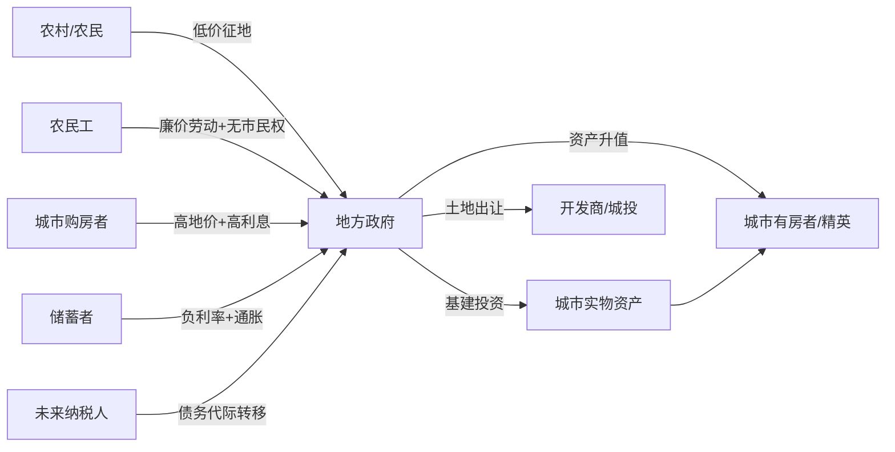

---
tags:
  - 世界经济政治
  - 中国经济政治
  - 土地财政
  - 地方债务
  - 分配正义
  - 代际剥削
  - 房地产
关联:
  - "[[土地财政的双重依赖：流量与存量的断裂]]"
  - "[[中国房地产的终局：城市化幻觉、金融化断裂与资产负债表衰退]]"
  - "[[中国房地产泡沫为何突然破裂：制度扭曲与压缩弹簧效应]]"
  - "[[储蓄-出口模式的政治经济学：权力、阶级与转型困境]]"
  - "[[老龄化与未来15年宏观税负：社保支出扩张、合理区间与2039窗口期]]"
  - "[[中国灵活就业人口激增：失业蓄水池与社会风险]]"
  - "[[2025中国蓝领群体就业研究报告：3亿灵活就业蓄水池、优劳优得转型与权益随行治理拆解]]"
---

# 土地财政的政治经济学：攫取、崩溃与代际剥削

> - **根节点**：土地财政如果不出"三条红线"，能否软着陆？如果没有软着陆的可能，那么这二十年它究竟从中国人身上攫取了多少、以什么机制攫取、由谁承担？
> - **叙事逻辑**：软着陆的可行性（三种路径）→ 庞氏结构的数学不可持续性 → 三条红线的真实位置（触发器而非原因）→ 渐进改革在政治经济学上的不可能 → 为何只能是硬着陆 → 攫取的六重机制与量级 → 攫取的方向性（谁向谁转移）→ 与东亚、拉美、石油国家的比较 → 收束：攫取未停止，只是换了形式
> - **立场说明**：本笔记是 [[土地财政的双重依赖：流量与存量的断裂]] 的续篇。前篇回答"是什么"（流量 16% vs 存量 268% 的双重依赖），本篇回答"为什么必然崩溃"与"代价由谁承担"。
> - **方法论警告（重要）**：本篇涉及大量**量级估算**。与财政收支数据（有官方口径可核）不同，"攫取总量"在方法论上**无法被精确统计**——它依赖对"合理地价""合理利率""合理工资"的反事实假设，而这些假设本身是规范判断。因此：
>   - 所有加总数字均为**量级估计（order-of-magnitude）**，误差范围可达 ±50%；
>   - 六个机制之间存在**部分重复计算**（如"土地垄断地租"与"高房价强制储蓄"共享同一笔钱的不同侧面）；
>   - 数字的作用是**揭示结构与方向**，而非提供可引用的统计事实。
>   凡是看到"精确到个位数的攫取总量"，应当先怀疑其方法论。
> - **来源标注**：财政部政府性基金预算、审计署债务审计、中指研究院房价指数、Wind 城投债统计、国家统计局居民收支与人口数据；反事实推理部分为笔记作者原创分析，2026-09-19。

---

## 一、问题一：没有"三条红线"，能否软着陆？

### 1.1 先定义"软着陆"

| 维度 | 软着陆 | 硬着陆（2022-2025 实际路径） |
|---|---|---|
| **房价** | 年跌 3-8%，持续 10-15 年，名义跌幅 <30% | 高点回落 30-50%，3-5 年内完成 |
| **土地出让金** | 年降 10-15%，地方有适应期 | 2021 峰值 8.7 万亿 → 2024 约 4.9 万亿（-44%） |
| **债务** | 展期 + 置换 + 逐步消化，无公开违约潮 | 城投非标违约、定融暴雷、利息依赖借新还旧 |
| **居民部门** | 资产负债表缓慢修复，消费不塌方 | 提前还贷、消费降级、资产负债表衰退 |
| **财政运行** | 收入温和下降，支出刚性可控 | 欠薪、减支、基建停工、"三保"告急 |

**软着陆的判定标准**其实只有一条：

> **名义 GDP 增速 ≥ 债务增速**，且这个收敛是**平滑**发生的。

因为只要名义 GDP 增速高于债务增速，债务/GDP 比值就会下降——这是唯一不引发违约的降杠杆路径。低通胀 + 高实际增长的组合就是温和放水（名义 GDP 高增速），这可以稀释债务。

---

### 1.2 三条理论上的软着陆路径

#### 路径 A：日本式"缓慢放气"

**机制**：

```
房价长期横盘或阴跌（年 -2~3%）
  ↓
土地出让金缓慢下降，地方逐步适应
  ↓
中央提高转移支付比例，填补缺口
  ↓
同时推进税制改革（房产税、地方税权）
  ↓
用 15-20 年完成依赖切换
```

**日本为什么做到了**：

| 条件 | 日本 | 中国 |
|---|---|---|
| **泡沫破裂时的发展水平** | 人均 GDP 约 2.5 万美元（1991） | 人均 GDP 约 1.3 万美元（2022） |
| **中央财政空间** | 中央政府债务可扩张至 GDP 250%+ | 中央显性债务/GDP 约 25%，但需承担隐性债务兜底 |
| **社会安全网** | 全民医保年金，失业率 <5% | 医保覆盖高但待遇低，青年失业率高企 |
| **外部环境** | 美日同盟、全球化上升期、日元可自由兑换 | 贸易摩擦、技术封锁、资本管制 |
| **人口结构** | 老龄化但已富 | **未富先老** |
| **资产结构** | 家庭资产分散（存款、保险、股票） | 家庭资产 60-70% 集中于房产 |

**结论**：日本能"失去三十年"而不崩，前提是**在泡沫破裂前已经是发达国家**，且外部环境友好。中国不具备这两个前提。**"日本化"对中国而言是乐观情景，不是悲观情景。**

---

#### 路径 B：新加坡式"持有税 + 公共住房替代"

**机制**：

```
开征房产税（持有环节）
  ↓
替代土地出让金（交易环节）
  ↓
同时大规模建设公共住房
  ↓
稳定房价预期，剥离住房的金融属性
  ↓
完成从"卖地财政"到"税收财政"的切换
```

**新加坡的特殊条件**：

| 维度 | 新加坡 | 中国 |
|---|---|---|
| **土地** | 约 90% 国有，政府垄断供地 | 城市国有 + 农村集体，政府垄断供地 |
| **房产税** | 占财政收入可观份额，累进税率 | 沪渝试点十年，规模极小，未推广 |
| **公共住房** | 约 80% 居民住组屋 | 保障房覆盖比例低，且多位于远郊 |
| **人口规模** | 约 570 万 | 14 亿（约 250 倍） |
| **政府能力** | 强能力 + 低腐败 + 长期规划 | 强能力 + 土地寻租 + 官员短期任期 |
| **政治约束** | 一党长期执政，政策连续性高 | 一党执政，但官员任期 5 年、考核短期化 |

**为什么无法复制——三个具体障碍**：

1. **房产税在政治上不可行**：城市中产（体制的稳定基础）的 60-70% 财富在房产上。开征持有税等于对核心支持群体直接征税，且会立即刺破房价预期。上海、重庆 2011 年试点至今未扩大，不是技术问题，是政治问题。

2. **公共住房的财政成本无法承受**：新加坡组屋体系是持续 50 年、每年占 GDP 相当比例的投入建成的。中国要覆盖同等比例人口，年投入需求以万亿计，而地方财政正在萎缩。

3. **激励结构反向**：土地出让金是**一次性、大额、当期**收入；房产税是**小额、持续、跨任期**收入。官员任期制下，理性选择永远是卖地。

---

#### 路径 C：中央兜底 + 债务货币化

**机制**：

```
中央政府发行特别国债
  ↓
置换地方隐性债务（城投债等）
  ↓
央行配合（购债 / 降准 / 结构性工具）
  ↓
地方债务转为中央债务
  ↓
用温和通胀 + 时间稀释债务实际价值
```

**这是三条路径中唯一被部分采用的**（2023 年以来的一揽子化债、特殊再融资债、2024 年之后的债务置换安排，方向即此）。但它是**拖延机制，不是解决方案**，原因在于：

| 障碍 | 说明 |
|---|---|
| **规模黑洞** | 显性地方债务约 40 万亿 + 城投有息债务数十万亿；全部上移会显著推高中央杠杆 |
| **道德风险** | 全额兜底 = 奖励过去十五年的过度借贷，下一轮借贷会更激进 |
| **通胀的社会成本** | 通胀是累退税：底层持有现金、无实物资产，受损最重。而中国社会稳定对物价敏感度极高 |
| **汇率约束** | 大幅货币化会压迫汇率，而汇率稳定是资本管制与外资信心的锚 |
| **分配后果** | 债务货币化 = 用全体储户的购买力偿还地方政府的投资失误 |

**这一路径的真实后果**：不是"解决"，而是**把地方政府的债务转化为全体居民的隐性税**——通过长期低利率（存款利率下行）+ 温和通胀，让储户承担。

> **三条路径的共同点**：都需要**存量利益的重新分配**。
> 路径 A 要中央出钱，路径 B 要城市中产出钱，路径 C 要储户出钱。
> **没有一条路径是"不付出代价"的。这就是软着陆困难的根源——不是技术问题，是政治问题。**

---

### 1.3 为什么软着陆在数学上极难：债务的指数结构

土地财政的运转依赖一个隐含条件：

$$
\text{抵押品价格增速} \geq \text{债务利率}
$$

**推演**：

设地方政府债务余额 $D_t$，抵押品（土地）价值 $L_t$，债务利率 $r$，地价增速 $g_L$。

```
借新还旧的条件：新债额度 ≥ 到期本息
新债额度 ∝ 抵押品价值 L
因此需要：L 的增速 ≥ r（债务利率）
```

**只要 $g_L < r$，抵押品就覆盖不了债务，融资链条自动收紧**——不需要任何政策触发。

**中国的历史数据**：

| 时期 | 地价/房价年均增速 | 城投融资成本 | 差（$g_L - r$） | 状态 |
|---|---|---|---|---|
| **2005-2010** | +15~20% | 6-7% | **+8~13%** | 杠杆良性扩张 |
| **2010-2015** | +10~15% | 6-7% | **+3~8%** | 继续扩张 |
| **2015-2020** | +5~8% | 5-6% | **0~+2%** | 接近临界 |
| **2021-2024** | **-5~-15%** | 5-7% | **-10~-22%** | **链条断裂** |

**关键结论**：

> 2021 年前后，$g_L$ 由正转负，而 $r$ 是刚性的。**这不是政策选择的结果，是数学的必然。**
>
> 土地财政的融资模式隐含要求"资产价格永远上涨"，而任何"永远上涨"的资产价格在数学上都不存在。

---

### 1.4 "三条红线"的真实位置：触发器，不是原因

**三条红线（2020 年 8 月）**：

| # | 指标 | 阈值 |
|---|---|---|
| 1 | 剔除预收款后的资产负债率 | ≤ 70% |
| 2 | 净负债率 | ≤ 100% |
| 3 | 现金短债比 | ≥ 1.0 |

**作用机制**：

```
限制房企融资
  ↓
房企拿地能力骤降
  ↓
土地流拍、地价下行
  ↓
地方政府的抵押品缩水
  ↓
借新还旧链条断裂
```

**流行误解**：

> "如果不出三条红线，土地财政还能再撑十年。"

**为什么这个说法是错的**——三个结构性因素在 2020-2025 年间独立触发了同一个结果：

| 结构性因素 | 临界点 | 机制 |
|---|---|---|
| **城镇化增速见顶** | 2020 年前后 | 年新增城镇人口从 2000 万级降至 1000 万级，增量购房需求大幅萎缩 |
| **人口总量转负** | 2022 年 | 购房主力年龄段（25-45 岁）人口绝对下降 |
| **居民杠杆见顶** | 2020 年前后 | 居民债务/GDP 升至 60% 以上，接近发达国家水平，加杠杆空间耗尽 |
| **房价收入比极端化** | 2016 年后 | 一线城市房价收入比 30 倍以上，支付能力被彻底透支 |
| **棚改货币化退出** | 2018 年后 | 三四线城市的定向放水结束，需求回归真实水平 |

**结论**：

> 三条红线不是危机的制造者，而是**危机的提前触发器**。
>
> 没有三条红线，链条会在 2023-2025 年间因需求端自然衰竭而断裂——**而且规模更大、更无准备**。三条红线至少给了政策制定者三年的准备期（虽然这个机会并未被有效利用）。
>
> **更重要的是**：三条红线还起到一个政治作用——它为危机提供了一个**可归因的政策标签**。危机的真实原因（增长模式的不可持续）被替换为一个可讨论的"政策是否过严"的技术问题。这是危机叙事的转移，不是危机原因的揭示。

---

### 1.5 更深一层：为什么渐进改革在政治上不可能

**软着陆需要的是"渐进、可预期、有补偿"的改革**。但在中国的决策结构中，这类改革几乎不可能发生：

| 软着陆所需的改革 | 触动谁 | 政治可行性 |
|---|---|---|
| **开征房产税** | 城市中产、多套房持有者、地方官员 | 极低（试点十年未推广） |
| **提高劳动报酬占比** | 资本、出口部门、地方招商竞争 | 极低（与出口竞争力直接冲突） |
| **削减低效基建投资** | 地方官员（政绩）、建筑国企、劳务链条 | 极低（短期 GDP 与就业冲击） |
| **允许地方破产/债务重组** | 银行、债券持有人、地方信用体系 | 低（会引发系统性风险） |
| **大幅增加中央转移支付** | 中央财政、富裕省份 | 中（受制于中央自身财力） |
| **放开户籍、给农民工市民权** | 城市既得利益者 | 低（社保、教育、医疗成本剧增） |

**历史切片：中国式改革的节奏模式**

| 改革 | 酝酿期 | 执行方式 | 即时后果 |
|---|---|---|---|
| **分税制（1994）** | 长期争论 | 当年强力推行 | 地方财政骤紧 → 土地财政的起点 |
| **国企改革 / 下岗（1998）** | 长期争论 | 集中三年推进 | 数千万人下岗，社会阵痛 |
| **房地产调控（2016）** | 多年积累 | "房住不炒"定调 + 棚改转向 | 三四线需求断层 |
| **三条红线（2020）** | 内部酝酿 | 一次性公布 | 房企暴雷潮 |
| **教培整顿（2021）** | 短期 | 一纸文件 | 全行业消失 |

**模式识别**：

```
问题长期积累（利益集团阻止早期干预）
  ↓
压力上升到不可回避
  ↓
最高层决定动刀
  ↓
为显示决心，政策口径一次到位、不留缓冲
  ↓
市场预期瞬间反转
  ↓
硬着陆
```

**这不是某个人的风格问题，而是决策结构的产物**：

- **缺乏事前辩论渠道**：没有公开的政策辩论，问题无法被"小步试探"地处理；
- **缺乏利益补偿机制**：改革受损方没有谈判渠道，只能接受，因而阻力被压缩到"是否动"这一个节点上；
- **多层代理的激励扭曲**：中央定调、地方执行，地方为免责会选择"层层加码"或"躺平不干"，两个极端都放大波动。

> **核心判断**：软着陆需要的不是更好的技术方案，而是**让利益相关方能提前博弈、让受损方能获得补偿**的制度空间。
>
> 这个空间不存在，所以中国的问题总是以"拖延 → 积压 → 急转 → 硬着陆"的形态释放。

---

### 1.6 软着陆的最终判决

| 层面 | 能否软着陆 | 理由 |
|---|---|---|
| **技术层面** | 理论上可以 | 货币化 + 通胀可以稀释债务（如日本） |
| **数学层面** | 不可以 | 抵押品价格增速 < 债务利率，融资链条自动断裂 |
| **政治层面** | 不可以 | 任何解决方案都要动存量利益（中产 / 储户 / 地方） |
| **制度层面** | 不可以 | 缺小事前置的博弈空间和补偿机制，只能"拖延-急转" |
| **结构层面** | 不可以 | 城镇化见顶 + 人口负增长 + 杠杆见顶，需求端不可逆 |

**综合判断**：

> 土地财政不存在"软着陆"路径。唯一的选择是**硬着陆的形式**：
> - **集中式硬着陆**（三条红线式）：短期剧痛，但问题快速暴露
> - **分散式硬着陆**（拖延式）：长期慢性疼痛，代价被摊到十年以上
>
> 中国的实际路径是**混合型**：核心城市房价缓慢下行（分散式），三四线城市已实质崩盘（集中式），债务以展期和置换方式长期挂账（账面不违约）。

---

## 二、问题二：土地财政构成了怎样的攫取？

### 2.1 分析框架：攫取的方向性

讨论"攫取"最容易犯的错误，是把它当成一个**总量问题**。但真正的结构在**方向**上。土地财政的财富转移有五个明确方向：



**五个转移方向**：

| 方向 | 从 | 到 | 机制 |
|---|---|---|---|
| **1. 空间转移** | 农村 | 城市 | 低价征地 + 农民工廉价劳动 |
| **2. 阶层转移** | 无房者 | 有房者 | 房价上涨的资产效应 |
| **3. 代际转移** | 未来纳税人 | 当代支出者 | 债务挂账 |
| **4. 时间转移** | 储蓄者 | 借款人 | 金融抑制下的负实际利率 |
| **5. 部门转移** | 居民部门 | 政府部门/企业部门 | 居民加杠杆为地方与房企降杠杆 |

**关键洞察**：

> 说"土地财政攫取了全体中国人"是不准确的。**它攫取的对象和受益的对象都是中国人**——它是一个**国内财富再分配机制**，只是这个再分配的方向高度偏向城市、有产者、当代和体制内。

---

### 2.2 机制一：土地垄断定价（地租）

**机制**：

```
政府垄断一级土地市场（唯一供给方）
  ↓
控制供地节奏（"饥饿供地"）
  ↓
土地价格远超其取得成本与开发成本
  ↓
差额 = 政府获取的垄断地租
```

**价差结构**：

| 层级 | 征地补偿（对被征地农民） | 出让价格 | 倍数 |
|---|---|---|---|
| **一线城市** | 数万至数十万/亩 | 数百万至数千万元/亩 | 数十倍至百倍 |
| **二线城市** | 数万至十余万/亩 | 数百万/亩 | 数十倍 |
| **三四线城市** | 数万/亩 | 数十万至数百万/亩 | 数倍至数十倍 |

> ⚠️ **方法论说明**：以上数字为**量级区间**，具体倍数在个案间差异极大，且"征地补偿"的口径（是否含安置房、社保、留用地）在不同地区完全不同。引用具体倍数需谨慎。

**规模**：

- 2015-2024 年全国土地出让收入累计约 60 万亿（毛收入）
- 扣除征地拆迁补偿、土地开发等成本后的净收益，累计约 15-20 万亿
- 也就是说，**毛收入中的大部分最终以成本形式回流社会**（补偿给被征地者、施工企业），**真正构成政府净攫取的是净收益部分**

> 📌 **重要校正**：这正是 [[土地财政的双重依赖：流量与存量的断裂]] 1.1 节所澄清的问题——**讨论攫取时必须区分毛收入与净收益**。用 60 万亿说"政府拿走了 60 万亿"是错误的；用 15-20 万亿更接近，但仍须扣除"合理的土地增值收益"（这部分本应归土地权利人）。

---

### 2.3 机制二：住房的强制需求（把居住权金融化）

**机制**：

```
户籍制度 → 教育、医疗、养老与户籍挂钩
  ↓
学区制度 → 房产与优质教育绑定
  ↓
婚姻市场 → 房产成为婚配的硬门槛
  ↓
住房从"消费品"变为"准入凭证"
  ↓
需求被制度性强制 → 需求曲线失去价格弹性
  ↓
房价脱离收入约束
```

**结果**：

| 指标 | 中国（一线） | 中国（全国均） | 国际合理区间 |
|---|---|---|---|
| **房价收入比** | 25-40 倍 | 10-15 倍 | 3-6 倍 |
| **房贷支出/家庭收入** | 50-70% | 30-45% | <30% |
| **家庭资产中房产占比** | 70%+ | 60-70% | 30-50%（美国约 25%） |
| **居民债务/GDP** | — | 60%+ | — |

**这里的关键不是"房价高"，而是"房价高得不必要"**：

> 如果一个城市的房价高，是因为土地稀缺 + 人口流入（如伦敦、旧金山），那是市场结果。
>
> 中国的房价高，很大程度上是**制度设计人为创造的稀缺**——限制供地（饥饿供地）、把公共服务的准入权绑定在产权房上、限制集体建设用地入市。**这些是制度选择，不是自然约束。**

---

### 2.4 机制三：代际转移（债务挂账）

**机制**：

```
当代政府借债 → 建设基建 → 当代人享受（部分）
  ↓
债务挂账 → 未来偿还
  ↓
基建随折旧贬值，但债务是刚性的名义金额
  ↓
未来的纳税人/居民，为已折旧的资产继续付息
```

**规模**：

| 项目 | 量级 | 说明 |
|---|---|---|
| **地方显性债务** | 约 40 万亿+ | 官方口径 |
| **城投有息债务** | 数十万亿 | 口径争议大，估算区间宽 |
| **合计（宽口径）** | 60-90 万亿区间 | 不同机构估算差异显著 |
| **年利息支出** | 数万亿 | 占地方综合财力比重高 |

> ⚠️ **口径警告**：城投债务的统计口径是当前中国经济数据中最具争议的一项。不同机构（IMF、Wind、各家券商）的估算差异可达数十万亿。因此，**任何基于"精确债务总额"的攫取估算都应被视为方向性而非定量结论**。

**代际归属**：

```
债务发生期：2010-2025
付息期：2025-2050+
受益人：2010-2025 的城市有房者、基建使用者
付费人：2025 年后仍在纳税/工作的人
```

**关键的不对称**：

- 基建的寿命：道路 10-15 年，桥梁 50 年以上，管网 20-30 年，地铁 30-50 年
- 债务的寿命：可以无限展期，本金名义值不变，利息不断累积
- **因此存在一个时间窗口**：资产已折旧，债务仍在偿

---

### 2.5 机制四：农民工的双重补贴

这是最隐蔽的机制，也是规模最被低估的机制。它的结构是：

```
农民工的生命周期被"跨界切割"：

劳动力再生产（抚养、教育、养老）→ 在农村，成本极低
  ↓
劳动能力使用（最有生产力的 20-45 岁）→ 在城市，工资低于其边际产出
  ↓
养老与医疗 → 部分回到农村，社保待遇差异巨大

结果：
  城市获得了净劳动贡献
  农村承担了净抚养成本
  农民工本人丧失了两端的保障
```

**机制分解**：

| 项目 | 内容 | 受益方 |
|---|---|---|
| **工资差** | 同等岗位，农民工实际到手 + 社保 + 福利低于城市户籍职工 | 用工单位、地方招商竞争力 |
| **社保缺口** | 养老保险、医保、工伤覆盖不足或转移接续困难 | 地方社保基金、财政 |
| **土地权益** | 进城后宅基地、承包地的处置受限，且多与户籍绑定 | 土地指标制度 |
| **公共服务** | 子女教育（随迁子女入学门槛）、住房保障的排他性 | 城市财政 |
| **养老差距** | 城乡养老金待遇差距达数十倍 | 财政 |

**这是"强制储蓄"模式最核心的支撑**（详见 [[储蓄-出口模式的政治经济学：权力、阶级与转型困境]] 第 2.3 节）：中国的高储蓄率、低单位劳动成本、高出口竞争力，很大一部分建立在**数亿人无法在当地定居**这一制度事实之上。

**规模**：难以精确估算。量级上，可以这样理解——**约 3 亿人，在约 30 年间，其一生中的大部分剩余价值被转移到了城市与出口部门**。这是土地财政之外，另一条同等重要甚至更重要的攫取通道。

> 📌 这也解释了为什么 [[中国灵活就业人口激增：失业蓄水池与社会风险]] 与 [[2025中国蓝领群体就业研究报告：3亿灵活就业蓄水池、优劳优得转型与权益随行治理拆解]] 中的"3 亿"这个数字反复出现——**它不是巧合，而是同一个制度结构在不同维度上的投影**。

---

### 2.6 机制五：金融抑制与通胀税

**机制**：

```
居民高储蓄（源于社保缺失 + 预防性储蓄）
  ↓
金融抑制：存款利率被压低（利率管制、银行体系垄断）
  ↓
实际利率长期为负或接近零
  ↓
储蓄的购买力被转移给：借款人（政府、房企、国企）
  ↓
同时 M2 持续高速扩张，稀释存量货币的购买力
```

**数据**：

| 年份 | M2 | 名义 GDP | M2/GDP |
|---|---|---|---|
| **2000** | 约 13 万亿 | 约 10 万亿 | 约 1.3 |
| **2010** | 约 73 万亿 | 约 41 万亿 | 约 1.8 |
| **2020** | 约 219 万亿 | 约 101 万亿 | 约 2.2 |
| **2024** | 约 300 万亿+ | 约 130 万亿 | 约 2.3 |

**通胀税的分配后果**：

| 群体 | 资产结构 | 通胀的影响 |
|---|---|---|
| **底层** | 现金、存款为主 | **净损失**（储蓄贬值，无资产对冲） |
| **中产** | 房产 + 存款 | 部分对冲（房产保值，存款贬值） |
| **顶层** | 房产 + 股权 + 海外资产 | **净受益**（实物资产与外币资产升值，且是借款人） |

> 📌 **这是攫取机制中最"累退"的一项**：它按持有现金的比例征税，因此**对穷人的税率最高**。这也是为什么中国的基尼系数长期高于官方公布水平的一个被忽视的原因。

---

### 2.7 机制六：资源错配（机会成本）

**机制**：

```
房地产/基建的高回报（由政策与信贷共同创造）
  ↓
资本、土地、劳动力流向房地产与基建
  ↓
制造业与创新的融资成本上升（挤出效应）
  ↓
"房地产病"（Dutch Disease 的中国版本）
  ↓
全要素生产率增速下行
```

**证据结构**：

| 指标 | 房地产/基建部门 | 制造业 |
|---|---|---|
| **信贷占比** | 高 | 相对不足，尤其民企 |
| **利润率（账面）** | 高（含土地增值） | 低 |
| **研发强度** | 极低 | 较高但受融资约束 |
| **上市公司结构** | 银行 + 地产占利润比重大 | 制造业利润占比与融资占比错配 |

**这一机制的代价最难估算，也最容易被忽略**——因为它不是"钱被拿走了"，而是"钱没去该去的地方"。它是**潜在的、未实现**的产出损失。

> 📌 与 [[中国主流经济学研究的政策聚焦与系统性回避拆解]] 呼应：这一机制之所以在主流讨论中缺位，是因为它的代价无法被计入任何一方当年的账目。

---

### 2.8 攫取结构的总览（量级，非精确）

| 机制 | 数量级 | 主要承担者 | 主要受益者 | 可统计性 |
|---|---|---|---|---|
| **① 土地垄断地租** | 十万亿级（净收益） | 购房者、被征地农民 | 地方政府 | 中（毛收入可查，合理增值部分不可查） |
| **② 住房强制需求** | 与①高度重叠 | 城市新购房者、婚龄青年 | 地方政府、早期购房者 | 低 |
| **③ 债务代际转移** | 数十万亿（存量） | 未来纳税人 | 当代支出者、债权人 | 低（债务口径争议大） |
| **④ 农民工双重补贴** | 数十万亿级 | 农民工、农村 | 城市、出口部门、用工企业 | 极低 |
| **⑤ 金融抑制/通胀税** | 十万亿级 | 储蓄者（尤其底层） | 借款人、有实物资产者 | 低（依赖反事实利率） |
| **⑥ 资源错配（机会成本）** | 十万亿级 | 全体国民 | 无（纯损失） | 极低（反事实） |

> ⚠️ **不可加总**：①与②共享同一笔资金的不同侧面；③是存量而非流量；⑤与所有其他机制重叠（通胀同时稀释债务和储蓄）。**任何"合计 XX 万亿"的数字都应被视为修辞而非统计。**

---

## 三、攫取的方向性：谁向谁转移

### 3.1 一张转移矩阵

| 从 ↓ / 到 → | 地方政府 | 银行/金融 | 城市有房者 | 出口/制造企业 | 农村/农民工 |
|---|---|---|---|---|---|
| **城市新购房者** | +++++（地租） | ++++（利息） | +++（房价上涨的接盘） | — | — |
| **农民工** | ++（人口红利） | — | ++（廉价服务） | ++++（工资差） | 被自身所属群体分摊 |
| **农村/被征地农民** | +++++（征地差价） | — | +（粮食与土地指标） | ++（劳动力） | — |
| **储蓄者** | ++（低成本融资） | ++++（存贷利差） | + | ++（低融资成本） | — |
| **未来纳税人** | +++++（债务） | +（债务持有） | — | — | — |
| **城市有房者** | +（后续购房税） | +（利息） | 内部代际转移 | — | — |

**读法**：每一行是一个"付出方"，每一列是一个"受益方"。

**结论**：

> 1. **最大的付出方是"未来纳税人 + 城市新购房者 + 农民工"三方**；
> 2. **最大的受益方是"地方政府 + 银行体系 + 早期城市有房者"三方**；
> 3. **农村与城市有房者之间的关系是"土地指标的对价"，而城市有房者和城市新购房者之间的关系是"代际内的接盘链条"**。

---

### 3.2 代际账本

假设一个人的生命周期大致对应三个"窗口"：

| 出生世代 | 成年期 | 受益于基建 | 承担的债务 | 净位置 |
|---|---|---|---|---|
| **1960-1970 年代出生** | 1990-2010 | 是（参与建设、享受升值） | 极少（债务发生在其财富形成后期，且可转嫁） | **大幅受益** |
| **1980 年代出生** | 2010-2030 | 是（享受基建，但已需高价购房） | 中等 | **获益较少** |
| **1990 年代出生** | 2020-2040 | 部分（基建已存，但就业与房价双重挤压） | 重（高房价接盘 + 债务偿息） | **净承担** |
| **2000 年代及以后出生** | 2040+ | 否（基建进入折旧期） | 最重（债务本金 + 利息 + 老龄化的社保缺口） | **纯承担** |

> 📌 这是**三重叠加**：土地财政的债务 + 老龄化的社保缺口（详见 [[老龄化与未来15年宏观税负：社保支出扩张、合理区间与2039窗口期]]）+ 人口减少导致的人均负担上升。
>
> **1990 年后出生的中国人，同时是这三条曲线的交汇点。**

---

## 四、国际比较：中国的攫取模式独特在哪

### 4.1 与东亚经济体比较

| 维度 | 日本（1955-1990） | 韩国（1960-1995） | 中国（1994-2020） |
|---|---|---|---|
| **攫取机制** | 高储蓄 + 主银行制 + 土地增值 | 财阀 + 出口 + 土地 | 土地财政 + 户籍 + 金融抑制 |
| **政治出口** | 民主化（1945 后）+ 工会 | 民主化（1987）后工资快速上涨 | **无出口**（分配阀门不可调） |
| **转折点** | 1990 泡沫破裂 | 1997 亚洲金融危机后转型 | 2021 后 |
| **转折时的发展水平** | 发达国家 | 接近发达国家 | **中等收入** |
| **转折后的分配** | 存量守成、代际固化 | 内需驱动、工资占比回升 | 存量博弈、向下挤压 |
| **转型是否成功** | 保持富裕但停滞 | **成功转型为内需经济体** | **未完成转型，仍在其中** |

**关键对比**：

> 日本、韩国的攫取机制之所以最终"软着陆"，不是因为政策更聪明，而是因为**它们的攫取在中途被打断了**——民主化 + 工会 + 选举政治，使劳动者的议价能力上升，工资占比提高，攫取被"自我限制"。
>
> 中国的攫取机制**没有这个出口**。缺少让劳动者议价的制度渠道，攫取只能一路推进到物理极限（土地卖完、人口红利耗尽、债务不可持续）为止。

---

### 4.2 与拉美比较

| 维度 | 拉美（1980s 债务危机） | 中国（2020s） |
|---|---|---|
| **债务类型** | 美元外债 | **人民币内债** |
| **债权人** | 国际银行、IMF | **本国银行、本国居民** |
| **危机形式** | 汇率崩溃、恶性通胀、主权违约 | 缓慢违约、展期置换、资产负债表衰退 |
| **调整方式** | 结构性改革（华盛顿共识）、紧缩 | 行政化债、货币化、隐性违约 |
| **社会后果** | 失去的十年 + 收入分配恶化 | **失去的十年（进行中）+ 分配继续恶化** |

**核心差异**：

> 拉美借的是**别人的钱**（美元），所以危机表现为"外部债权人追债"；
>
> 中国借的是**自己的钱**（人民币存款），所以危机表现为"内部人慢慢承担"——储户的低利率、地方政府的欠薪、未来的通胀、年轻人的就业困难。
>
> **这更隐蔽，但代价相同，甚至因为可以拖延，分配更不公平。**

---

### 4.3 与石油国家比较

| 维度 | 石油租金国（沙特） | 中国土地财政 |
|---|---|---|
| **资源** | 自然禀赋（不可再生） | 制度建构（可无限"复制"但价值可变） |
| **收入来源** | 直接出口收汇 | **抵押资源借债** |
| **杠杆** | 低 | **极高**（土地是信贷抵押品，不只是收入来源） |
| **风险承担** | 政府自身 | 全社会（储户、购房者、未来纳税人） |
| **租金分配** | 福利赎买（公民分租金） | 基建投资（精英主导的资本形成） |
| **是否能持续** | 取决于储量与油价 | 取决于抵押品价格能否持续上涨 |

**最本质的区别**：

> 沙特是"卖油 → 收钱 → 分配"。资源耗尽时，只是变穷，但**不欠谁的钱**。
>
> 中国是"抵押土地 → 借钱 → 投资 → 推高地价 → 借更多钱"。资源（土地）不会耗尽，但**抵押品的估值会崩**——崩的时候，欠的钱是刚性的。

**这更接近委内瑞拉模式（抵押石油借外债），而非沙特模式（卖石油收租金）。** 区别在于中国借的是本币内债，有更多拖延空间，代价是**危机被摊薄成二十年的慢性攫取**。

---

## 五、崩溃之后：攫取停止了吗？

### 5.1 攫取的"形式切换"

2022-2025 年的房地产下行，改变的是**攫取的形式**，而非攫取本身：

| 攫取机制 | 2020 年前的形式 | 2022 年后的形式 | 是否减轻 |
|---|---|---|---|
| **土地垄断地租** | 高地价 → 高房价 | 地价下行，但**公用事业涨价、水电燃气、交通费**成为地方收入新渠道 | 转移而非减少 |
| **住房强制需求** | 房价上涨预期 | **租金与保障房体系**（部分城市租金上涨） | 部分减轻（房价跌了） |
| **债务代际转移** | 债务快速扩张 | **化债 + 展期 + 新债换旧债**，总量继续增长 | **未减轻，只是延后** |
| **农民工补贴** | 工资差 + 社保缺失 | 工资差缩小，但**就业机会减少、灵活就业化**（见 [[中国灵活就业人口激增：失业蓄水池与社会风险]]） | 形式变化 |
| **金融抑制/通胀税** | M2 高速扩张 | 存款利率下行至历史低位，**实际利率可能为负** | **加重** |
| **资源错配** | 房地产吸纳资本 | 资本转向**地方政府主导的战略性产业**（半导体、新能源） | 形式变化，错配程度待观察 |

**结论**：

> 房地产的崩溃**没有终止攫取，只是改变了攫取的载体**。
>
> 当土地不再能卖钱时，地方政府转向：
> 1. **公用事业涨价**（水、电、燃气、公交）——这是最直接的居民税
> 2. **罚款与行政收费**（部分地区的"罚没收入"异常增长）
> 3. **社保费率与基数上调**
> 4. **资产处置**（出售国有资产、特许经营权）
> 5. **新的债务**（化债本身产生新的债务）

---

### 5.2 一个容易被忽略的转折：从"向上征收"到"向下征收"

| 时期 | 攫取的主要对象 | 攫取的方式 | 政治成本 |
|---|---|---|---|
| **2000-2020** | 增量：新购房者、农民工、未来纳税人 | 分享增长（"做大蛋糕"） | 低（每个人都在变好，只是分配不均） |
| **2020 后** | 存量：现有中产、储蓄者、体制内基层 | 直接削减（降薪、降息、涨价） | **高**（有人绝对变差） |

**这是根本性的变化**：

> 2000-2020 年的攫取之所以能持续，是因为它建立在**增长**之上——蛋糕每年变大，即使分配不均，多数人的绝对状况仍在改善，反抗的动力不足。
>
> 2020 年后的攫取建立在**存量**之上——蛋糕不再变大，攫取变成零和甚至负和。这时被攫取者的绝对状况下降，**政治成本骤然上升**。
>
> **这是所有依赖增长合法性的体制在增速下行时面临的核心困境。**

---

## 六、收束：三个判断

### 6.1 判断一：软着陆在技术上不是问题，在政治上不可能

软着陆的技术方案是清楚的（房产税 + 公共住房 + 债务货币化 + 社保补足），日本、新加坡都提供了先例。

**但它需要"让利益受损方获得补偿"的制度空间**——而这个空间在中国不存在。因此，中国的问题总是以"长期拖延 → 积累压力 → 突然急转 → 硬着陆"的方式释放。

**三条红线的历史地位**：它不是危机的起因，而是一次**提前的、有政治意图的引爆**。它把一场不可避免的崩盘提前了 2-3 年，代价是短期的剧痛，收益是获得了应对时间（虽然这个时间没有被很好地利用）。

---

### 6.2 判断二：攫取的本质不是"数量"，而是"方向"

土地财政的核心特征不是"拿走了多少"，而是**"从谁那里拿、给谁"**：

| 方向 | 机制 |
|---|---|
| **农村 → 城市** | 低价征地 + 农民工廉价劳动 + 土地指标制度 |
| **年轻人 → 年长者** | 高房价接盘 + 债务代际转移 |
| **储蓄者 → 借款人** | 金融抑制 + 通胀税 |
| **无房者 → 有房者** | 资产价格上涨的分配效应 |
| **未来 → 现在** | 债务挂账 + 基建折旧 |

**这五个方向合起来，构成了一个巨大的、系统性的、制度化的财富再分配机制**——它把中国社会的财富从农村、年轻、无产、未来四个方向抽取，输送到城市、年长、有产、当代四个方向。

> 说"这是攫取"和说"这是投资"都不完整。更准确的描述是：**这是一场以"发展"为名、由体制主导、按制度位置分配收益与成本的强制性财富再分配。**

---

### 6.3 判断三：攫取没有结束，只是换了形式

房地产的崩溃是一个**转折点**，不是**终点**：

| 之前 | 之后 |
|---|---|
| 从增量中攫取 | 从存量中攫取 |
| 通过土地 | 通过公用事业、社保、通胀、税费 |
| 政治成本低（大家变好） | 政治成本高（有人变差） |
| 受益方：城市有房者、体制、出口部门 | 受益方收缩（地方政府、债权人、体制核心） |

**最终判断**：

> 土地财政不是中国的"经济政策"，而是中国**分配体制的具体形态**。它不存在"停止"的问题——只要分配体制不变，它就会以新的载体继续存在。
>
> 观察中国经济未来十年的关键，不是"房价会不会涨"，而是**"攫取的下一个载体是什么"**。目前可见的候选：公用事业价格、社保费率、通货膨胀、国有资产的处置，以及最危险的——**对存量的直接征收（如财产税、遗产税，或某些形式的"共同富裕"再分配）**。

---

## 七、数据库索引

| # | 概念 | 类型 | 核心批判点 | 横向关联笔记 | 重要性 |
|---|---|---|---|---|---|
| 1 | 软着陆的三种路径 | 反事实分析 | 日本/新加坡/货币化，均需存量利益重分配 | [[土地财政的双重依赖：流量与存量的断裂]] | ⭐⭐⭐⭐⭐ |
| 2 | 债务利率 vs 抵押品增速 | 数学约束 | $g_L < r$ 时融资链条自动断裂 | [[中国房地产的终局]] | ⭐⭐⭐⭐⭐ |
| 3 | 三条红线 = 触发器而非原因 | 政策分析 | 结构性因素独立触发同一结果 | [[中国房地产泡沫为何突然破裂]] | ⭐⭐⭐⭐⭐ |
| 4 | 拖延-急转-硬着陆模式 | 制度分析 | 分税制、国企改革、教培整顿的共同节奏 | [[储蓄-出口模式的政治经济学]] | ⭐⭐⭐⭐⭐ |
| 5 | 攫取的五重方向 | 分配分析 | 农村→城市、年轻→年长、储蓄者→借款人 | [[老龄化与未来15年宏观税负]] | ⭐⭐⭐⭐⭐ |
| 6 | 农民工双重补贴 | 结构分析 | 劳动力再生产与使用的地理切割 | [[中国灵活就业人口激增]] | ⭐⭐⭐⭐⭐ |
| 7 | 金融抑制与通胀税 | 货币分析 | 累退税：对穷人税率最高 | — | ⭐⭐⭐⭐ |
| 8 | 本币内债 vs 美元外债 | 国际比较 | 危机更隐蔽，代价分摊更不公平 | [[储蓄-出口模式的政治经济学]] | ⭐⭐⭐⭐⭐ |
| 9 | 攫取的形式切换 | 趋势判断 | 崩溃后转向公用事业、社保、通胀 | [[中国主流经济学研究的政策聚焦与系统性回避拆解]] | ⭐⭐⭐⭐⭐ |

---

## 参考来源

1. 财政部：《全国政府性基金预算执行情况》（2015-2024）
2. 审计署：《地方政府债务审计报告》
3. 国家统计局：《国民经济和社会发展统计公报》《农民工监测调查报告》
4. 中指研究院：《百城价格指数》《土地市场报告》
5. Wind 资讯：《城投债发行与违约统计》
6. 国际货币基金组织：《Article IV Consultation — China》（各年度）
7. 国际清算银行：《中国信贷缺口与债务结构报告》
8. 中国人民银行：《货币政策执行报告》《社会融资规模统计》
9. 学术文献：辜朝明《资产负债表衰退》、白重恩关于中国储蓄率的研究、黄益平关于金融抑制的研究、周其仁关于土地制度的研究
10. 整理日期：2026-09-19

---

*本笔记为 [[土地财政的双重依赖：流量与存量的断裂]] 的续篇。前篇回答"土地财政的机制是什么"（流量 16% vs 存量 268% 的双重依赖）；本篇回答"为什么必然崩溃"（软着陆的政治经济学不可能）与"代价由谁承担"（攫取的五重方向与代际结构）；版本 v1.0。*
