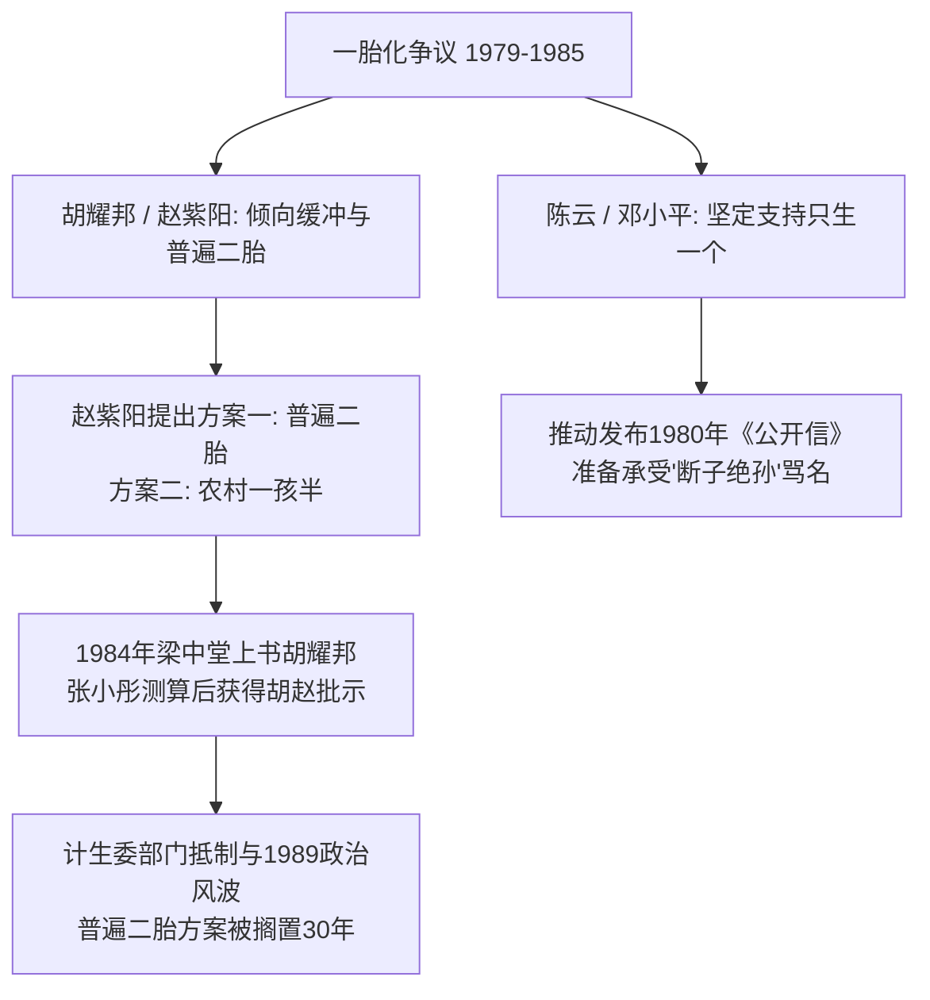
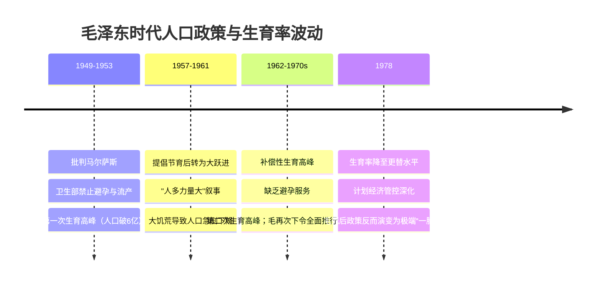

> **根节点**：作为写入宪法的基本国策，“一胎化政策”为何在实施首日即遭学者梁中堂公开反对？其对人口老龄化、劳动力与兵源短缺及经济结构逆转的预警如何一步步变成现实？梁中堂在山西翼城长达30年的“二胎试点”又揭示了怎样的体制决策盲区与制度错位？
>
> **叙事逻辑**：学术预警与理论争锋 → 决策高层政经博弈（宋建团队 vs 梁中堂，陈云 vs 胡赵） → 翼城试点推行、数据谎言与政治波折 → 计划生育的概念起源与毛时代历史演变 → 利益集团膨胀、暴力执法与统计失真 → 制度归因、人口危机与个体抗争坐标
>
> **立场说明**：本笔记根据柴静深度访谈山西省委党校梁中堂教授的转写记录整理。笔记忠实还原材料中的历史细节、学术争议、政策博弈与访谈对象的道义诉求；涉及历史事实、政治分析与个人回忆时在语气上作明确区分，不把推测伪装成确定事实。
>
> **来源标注**：来源：柴静深度访谈《计划生育与梁中堂》（山西省委党校梁中堂教授访谈实录）

---

## 📚 知识树

```txt
根节点：计划生育一胎化政策的历史演变、翼城试点与人口控制的制度逻辑
│
├── 一、政策起点与预言形成（理论争锋）
│   ├── 1979年成都人口会议：梁中堂公开质疑一胎化
│   └── 三大预警：人口老龄化、劳动力/兵源短缺与4-2-1家庭结构
│
├── 二、决策高层的学术与政治博弈（政治路线）
│   ├── 宋建控制论模型：钱学森推荐与《人民日报》宣传阵地
│   ├── 党内高层分歧：胡耀邦/赵紫阳缓冲尝试 vs 陈云刚性推动
│   └── 张小彤重新测算与胡赵批示：1985年普遍二胎窗口的错失
│
├── 三、翼城试点（1985–2015）：制度缝隙中的二胎实验（基层实践）
│   ├── 试点方案：晚婚晚育、拉开间隔、普遍二胎
│   ├── 基层真实心理：统计数据造假与“5000户独生子女”谎言
│   └── 30年运行数据：2.158生育率证明严厉一胎化毫无必要
│
├── 四、概念追溯与制度溯源（历史演化）
│   ├── 概念起源：毛泽东“计划生产”思维而非马寅初
│   ├── 马寅初《新人口论》的真实主张与历史解构（倡导二胎而非一胎）
│   ├── 毛时代三次人口波动：从禁孕到大跃进再到强制推进
│   └── 计划经济体制下的国家公权力侵入个人生育权
│
├── 五、利益异化与系统性失灵（运行后果）
│   ├── 1983年钱信中运动与3000万强制结扎/流产
│   ├── 罚款经济（社会抚养费）塑造计生部门自我膨胀链条
│   ├── 1991年“一票否决制”与“百日无孩”极极端事件
│   └── 1.8政治数据与1.22现实数据的统计遮蔽
│
├── 六、受害人群与利益相关方分层评估（社会影响）
│   └── 四维评估：农村育龄妇女、农村无子老人、独生子女家庭与基层计生干部
│
└── 七、制度根源、延伸效应与个体坐标（收束反思）
    ├── 制度归因：把人口当负担的唐吉诃德式计划经济假想敌
    ├── 历史后果：未富先老、700万新生儿与鼓励生育的新干预
    └── 个体坐标：“蚂蚁的思考与抗争”——学术独立性与道义底线
```

---

## 0、关键统计数据与数字锚点

| 数字/时间                         | 材料中的表述                                                         | 在本文中的作用                                           |
| --------------------------------- | -------------------------------------------------------------------- | -------------------------------------------------------- |
| **1979年**                  | 全国人口理论会议在成都召开，一胎化政策开始推行                       | 计划生育一胎化政策启动节点与梁中堂首发反对的时间坐标     |
| **千分之五 (5‰) / 零增长** | 1979年中央规划：1985年自然增长率降至5‰，2000年实现零增长            | 展示当时中央政府对人口计划控制的定量指标要求             |
| **14亿 / 40亿**             | 宋建团队预测：若维持1975年生育率，2000年达14亿，2050年达40亿         | 宋建控制论团队推进严厉一胎化政策的核心惊悚论据           |
| **4-2-1**                   | 梁中堂提出的独生子女家庭结构（4个老人、2个父母、1个孩子）            | 预警中国即将面临的深刻老龄化与家庭养老崩溃结构           |
| **3000万人**                | 1983年钱信中大运动中，1.4亿育龄妇女中近1/3被强制结扎或流产           | 揭示一胎化政策推进过程中极其惨烈的社会与人道代价         |
| **5000户**                  | 翼城县原报表上的独生子女家庭数                                       | 揭穿基层计生部门为应对上级考核而系统性造假的统计谎言     |
| **2.158**                   | 1985–1991年山西翼城试点期间的平均总和生育率                         | 证明放开二胎并不会引发人口爆发，一胎化属严重政策误判     |
| **5亿人**                   | 彭佩云保留的“农村一孩半政策”（一胎为女孩可生二胎）覆盖人口         | 展现赵紫阳与彭佩云在体制内防范政策全面失控的缓冲努力     |
| **55元**                    | 2008年中央政府首次出台农村基础养老金保障（每月55元）                 | 说明计生政策推行30年后国家对农村养老承诺的严重滞后与脱节 |
| **69岁**                    | 2008年山西老农因无子无力种田、持许果刀在北京站劫持谋求坐牢养老的年龄 | 极度具象化展现一胎化政策剥夺农村老人子嗣后的社会悲剧     |
| **1.22 vs 1.8**             | 2000年五普真实生育率为1.22，但官方报告长期维持1.8的虚假“政治数据”  | 揭露计生部门为维护部门利益、阻挠政策改革而制造的统计遮蔽 |
| **700万**                   | 2020年代中国年出生人口跌至700万级别，总和生育率比韩国还低            | 验证梁中堂1979年预言：鼓励生育将比当年限制生育更加困难   |
| **3.23亿 / 23%**            | 2025年中国60岁及以上老龄人口预计达到3.23亿，占比约23%                | 证明当年人口老龄化预警已完全演变成难以逆转的现实危机     |

---

## 一、政策起点与预言形成：梁中堂的异见与人口预警

1979年12月，全国人口理论会议在成都召开。彼时，中国的人口学研究自1950年代初已被作为“资产阶级伪科学”取消，人口普查中断了将近20年，学术研究基础极其薄弱。在此背景下，中央政府准备大力提倡和推广“一对夫妇只生一个孩子”，目标是到1985年将人口自然增长率降至千分之五，2000年实现人口零增长。

时年30岁的山西省委党校教师梁中堂在会上发表了少见的公开反对意见。他提交的论文直接挑战了已成定局的一胎化政策。

### 1.1 梁中堂的三大核心预警

梁中堂从农村实际生产与生活条件出发，指出一胎化政策在农村根本不可行，并提出了针对未来数十年的三大人口预警：

1. **养老与养老危机**：在国家体制只能保障城镇职工、农村完全没有社保的现实下，四个老人、两个年轻农民抚养一个孩子的架构（即4-2-1结构）在农村无法想象，农民根本无法维持基本生存。
2. **劳动力与兵源短缺**：强制限制生育将导致未来20–30年后社会年轻劳动力和国防兵源出现严重匮乏。
3. **老龄化与经济结构逆转**：人口迅速老龄化将彻底改变整个国家的经济结构与社会负担格局，当25岁以下这代人步入晚年时，社会将缺乏足够的年轻人口来支撑他们。

> 📌 **一胎化政策（One-Child Policy）**：中国政府自1979年起在全国范围内全面推行的严格限制生育政策，主张“一对夫妇只生一个孩子”。其核心假设是通过行政强制力迅速降低人口增长率以匹配计划经济资源分配。
>
> 📌 **4-2-1家庭结构（4-2-1 Family Structure）**：指由4个祖父母/外祖父母、2个父母和1个独生子女组成的金字塔型家庭结构。该结构下唯一的年轻子女需承担极高的养老与抚养负担，抵御家庭风险的能力极低。

> 🔗 **横向关联**：梁中堂在1979年对4-2-1结构与养老崩溃的预警，与 [[李克强与克强经济学分析笔记]] 中“消化四万亿副作用与地方财政崩溃”、[[中国房地产泡沫为何突然破裂：制度扭曲与压缩弹簧效应]] 中“人口红利耗尽导致购房主力人口断崖式下跌”形成**因果关系**——计划生育制造的人口结构失衡，终究在30年后演化为宏观经济消费疲软与财政兜底失效的深层根源。

---

## 二、决策高层的学术与政治博弈

一胎化政策的出台并非没有学术“理论支撑”，但这一支撑并非来自传统人口学，而是来自于国防工程与控制论领域的自然科学家团队。

### 2.1 控制论模型 vs 传统人口学

在1979年成都会议上，来自七机部第二设计院的宋建团队引入了**控制论模型（Cybernetics Model）**预测中国人口走势。经钱学森推荐，该报告直接上报中央政治局。

| 维度               | 宋建控制论团队                                   | 梁中堂人口学者方案                           |
| ------------------ | ------------------------------------------------ | -------------------------------------------- |
| **学科背景** | 自然科学、工程控制论、军事导弹研究               | 社会科学、党校人口学、农村基层调查           |
| **理论假设** | 将人口简化为可由微分方程控制的纯消耗变量         | 将人口视为生产力与社会伦理单元，考虑家庭养老 |
| **预测结论** | 维持1975年生育率，2000年人口破14亿，2050年破40亿 | 一胎化会导致严重老龄化与4-2-1结构崩溃        |
| **政策主张** | 严厉推行“只生一个”，越快越好                   | 实行“晚婚晚育、拉开间隔、普遍允许生二胎”   |
| **宣传阵地** | 获得《人民日报》全文发表与高层背书               | 论文遭拒绝发表，只能私下寄送存档             |

梁中堂连续撰写五篇论文反驳宋建团队，指出对方宣称“未来20年老龄化不严重”时，完全忽略了当这代独生子女步入晚年时社会抚养比的灾难性恶化。然而，宋建团队位高权重，梁中堂寄给《人民日报》的文章均被拒绝发表。

### 2.2 党内高层分歧：胡耀邦、赵紫阳 vs 陈云

在决策高层内部，对于一胎化政策并非没有担忧与缓和的努力：



- **胡耀邦的担忧与座谈会**：1980年3月，时任中共中央总书记胡耀邦对一胎化政策感到担忧，专门召开座谈会听取意见，并提到了梁中堂论文中强调的4-2-1结构与老龄化问题。但由于梁中堂缺乏政治背景与地方身份，未能被邀请参会。座谈会最终仍达成“只生一个是所有与会者共识”。
- **陈云的刚性推行**：主管经济的陈云是倡导“只生一个”的最坚定支持者。他认为在权衡利弊中必须选择“一代人在生育上的牺牲”，甚至表示“准备人家骂断子绝孙”。中共党史称之为共产党人的“大仁政”。1980年9月，中央以《公开信》形式向广大党团员发出只生一个孩子的倡议。
- **赵紫阳的缓解尝试**：1980年10月，赵紫阳在中央书记处会议上明确表示“在全国推行（一胎化）是抓不下去的，我在四川从来就没搞过一胎化”。赵紫阳提出了两个方案：
  1. 全面实行普遍二胎；
  2. 农村只生了一个女儿的家庭允许生二胎（即“一孩半”政策）。
- **错失的1985年历史窗口**：1984年3月，梁中堂直接给胡耀邦写信，建议实施“晚婚晚育加间隔的二胎生育政策”。胡耀邦将信批转给国家计生委主任王伟。虽然计生委内部否定了该建议，但计生委规划处干部张小彤另行测算后认为梁方案切实可行，并向中央汇报。胡耀邦与赵紫阳随即做出批示，要求有关部门认真测算并起草文件向下推行。假如此事成真，中国人在1985年即有可能获得普遍生育二孩的权利。

> 📌 **控制论人口模型（Cybernetic Population Model）**：将控制工程中的系统反馈与状态方程引入人口预测的方法。其缺陷在于把人类社会机械化，忽略了生育行为背后的经济理性、家庭抚养功能与社会自我调节机制。

> 🔗 **横向关联**：高层决策中胡耀邦、赵紫阳与陈云保守派的路线分歧，可与 [[改革开放以来中共领导人政经光谱笔记]] 中“胡赵主张包产到户与市场化，陈云坚持计划经济主导与政治保密”形成**镜像关系**——在人口政策上，陈云同样把计划经济的指标控制思维贯彻到底，而胡赵的弹性缓和努力则再次因政治体制约束而夭折。

---

## 三、翼城试点（1985–2015）：制度缝隙中的二胎实验

在张小彤的协助与山西省委的支持下，1985年7月，梁中堂的二胎方案获得批准，山西省临汾地区**翼城县**被确定为全国唯一的“晚婚晚育加间隔”二胎试点地区。

### 3.1 翼城试点的制度设计

试点放弃了一胎化行政强制，采取如下规则：

- 鼓励晚婚晚育：女子满24周岁、男子满26周岁结婚；
- 提倡晚育一胎：女子满28周岁生育第一胎；
- 允许生育二胎：女子满32周岁方可生育第二个孩子。

### 3.2 揭穿“抢生恐慌”与基层的虚假统计

试点启动前，翼城县计生委官方台账显示全县已有**5000户独生子女家庭**。计生系统官员严重担心政策一旦放开，这5000户会迅速爆发“抢生潮”。

然而，放开试点后，“抢生潮”根本没有出现。调查发现，所谓的“5000户独生子女家庭”**全都是基层为了迎合上级计划生育考核而虚报的数字**。基层干部将刚出生、还没来得及生二胎的婴儿统一填报为“独生子女”，到了二三年后再悄悄放任生育，积累了大量虚假台账。翼城试点的实施反而一举挤干了基层统计水分。

### 3.3 翼城30年实验的数据结论

从1985年到1991年，翼城县的平均总和生育率保持在**2.158**，不仅低于试点启动前的水平，更低于同期山西省和全国的平均生育率。翼城的人口增长异常平稳，经济发展与社会和谐度显著高于周边地区。

```txt
翼城试点数据对比 (1985-1991)
├── 翼城县总和生育率：2.158（人口世代更替平衡点）
├── 山西省平均生育率：高于 2.158（一胎化高压下反而引发偷生抢生）
└── 全国平均生育率：高于 2.158（行政管控导致干群关系剧烈恶化）
```

### 3.4 政治风波与试点的孤岛化

尽管翼城试点取得了巨大成功，但其命运始终笼罩在政治阴影之下：

1. **1986年科委压制**：1986年，宋建所在的国家科委团队向中央呈递报告，主张“坚决停止各种开口子的试点”。胡耀邦受压批示“坚决停止各种开口子的试点”，翼城面临消亡风险。梁中堂在人口会议上当面批驳科委代表，捍卫农民的生存权。
2. **赵紫阳的公开肯定**：1986年12月，赵紫阳在全国计划生育会议上第一次公开提到翼城试点：“山西我们还寄予希望，如果最后证明是好的，顺乎民心合乎民心，又能控制人口，当然好了，何乐而不为？”
3. **1989年后的政治清算**：1989年政治风波后，赵紫阳落马。在1989年10月的中央工作会议上，赵紫阳的人口政策被归结为“资产阶级自由化开口子”受到集体批判。李鹏、宋建、陈云、王震及前计生委主任钱信中纷纷发难。1990年，国务委员李铁印在山西视察时直接将翼城试点定性为**“赵紫阳的试验田”**。
4. **彭佩云的妥协与翼城封印**：新任国家计生委主任彭佩云在中央顶住压力，保住了农村“一孩半”政策（允许第一胎为女孩的家庭生二胎，覆盖约5亿农村人口），但翼城经验被彻底禁止向全国推广。

> 📌 **翼城二胎试点（Yicheng Two-Child Pilot Project）**：梁中堂于1985年在山西翼城县推行的“晚婚晚育、拉开间隔、普遍二胎”人口实验。该实验持续30年，用 empirically 可靠的数据证明了无需一胎化行政暴力亦可实现人口平稳控制。

---

## 四、概念追溯与制度溯源：毛泽东“计划生产”思维与计划经济逻辑

为了弄清一胎化政策的根源，梁中堂在此后前往上海社会科学院，系统梳理了中国计划生育的历史档案，打碎了官方长期塑造的“计划生育源自知识分子马寅初《新人口论》”的叙事。

### 4.1 计划生育的概念真正起源

梁中堂的研究表明，“计划生育”这一概念的定义权与发明权完全属于**毛泽东**。毛泽东将计划经济的逻辑延伸到了人类自身的繁衍，定义为：**“有时多生，有时少生，是调整的需要。”**

在计划经济体制下，国家向所有国民统一提供教育、医疗与就业，中央政府因此认为人的生产也必须由国家计划统一指令控制。

### 4.2 马寅初《新人口论》的真实主张与历史解构

官方在1980年代常将马寅初尊为“计划生育的鼻祖”以寻找学术正统性，但历史事实证明马寅初的主张与后来的“一胎化政策”存在本质区别：

1. **核心逻辑（三大矛盾）**：1957年7月马寅初发表《新人口论》，提出人口增长过快会吃掉国民收入积累、降低劳动生产率、加剧人均粮棉原料短缺，主张控制人口过快增长。
2. **真实主张（倡导生二胎）**：马寅初主张男子25岁、女子23岁结婚（晚婚），提倡普及避孕，明确提出**“一对夫妇生两个孩子”**。他从未主张过绝对剥夺二胎权利的强制“一胎化”。
3. **政治遭遇与历史错位**：1958年大跃进爆发后，马寅初被扣上“反动马尔萨斯主义”帽子遭受批判撤职。1979年平反后流行“错批马寅初，误增三亿人”的说法。后来的管理者借用了马寅初被错批的悲剧历史作为推行严厉一胎化的政治修辞背书，实际上违背了马寅初“允许生两个”的原意。

> 📌 **《新人口论》（New Population Theory）**：北京大学校长马寅初于1957年提出的人口理论。主张通过晚婚与避孕控制人口增长，倡导“一对夫妇生两个孩子”，以缓解资本积累与工业化压力。后被借用为一胎化政策的合法性背书，但其原意与行政强制一胎政策有本质差异。

### 4.3 毛泽东时代的三次人口剧烈波动

毛泽东“按国家需要调节人口”的意识形态逻辑，直接导致了新中国成立后人口曲线的极不寻常波动：



1. **第一次生育高峰（1949–1953）**：毛泽东批判马尔萨斯人口论，国家卫生部禁止避孕药具进口与人工流产，直接催生了第一次生育高峰，人口迅速突破6亿。
2. **大跃进与大饥荒（1957–1961）**：1957年毛曾短暂提出节育，但大跃进期间迅速转向“人多力量大”，随后遭遇三年大饥荒，人口出现急剧负增长。
3. **第二次生育高峰与全面计划生育（1962–1978）**：大饥荒后的补偿性生育在缺乏避孕服务的情况下引发第二次高峰。毛泽东再次改变判断，提出“人口非控制不可”，计划生育由此向农村全面展开。

到1978年毛泽东去世时，中国女性的总和生育率已经从高位的6.0以上自发下降到接近更替水平（约2.7左右）。然而，计划生育制度不仅没有退出，反而在后毛泽东时代被计划经济惯性推向了更加严厉、强制的“一胎化”极境。

> 🔗 **横向关联**：毛泽东将“人类自身繁衍”纳入计划经济指标调控的思维，与 [[文化大革命（1966–1976）：毛泽东视角下的权力清洗全解析]] 中“将国家公权力无限延伸至私人意识形态、家庭伦理与微观经济活动”形成**上下游关系**——计划生育是一权独揽的计划经济体制在人口领域的终极延伸。

---

## 五、利益异化与系统性失灵：罚款经济、暴力执法与统计失真

一胎化政策在基层的落地，演变成了一场长达三十年的社会悲剧与部门利益膨胀史。

### 5.1 1983年钱信中大运动与基层暴力

1983年，新任国家计生委主任钱信中在全国推行“大打突击运动”。据梁中堂统计：

- 当年中国育龄妇女约1.4亿人，其中近**三分之一（约3000万女性）**要么被强制结扎，要么被强制流产；
- 计生委官方文件记录了当年的做法：抄家、封门、砸锅、扒房子、毁坏庄稼、牵走牲畜、甚至突村抓人游街、变相拘禁、株连亲属相邻。

尽管钱信中在当年年底被免职，但这种暴力执法模式已经在基层沉淀为常态。

### 5.2 罚款经济与计生部门的自我膨胀

自2000年后，梁中堂停止呼吁“放开二胎”，转而直接反对“计划生育制度本身”。因为他发现了计划生育系统运行的底层的**利益驱动逻辑**：

```txt
计生部门的资金利益链条
老百姓超生 / 违规生育 
  │
  ▼
基层计生部门收取 "社会抚养费 / 超生罚款"（如收取 4-5 元）
  │
  ▼
留存 / 提成 1 元用于部门经费、人员福利与上访维稳
  │
  ▼
部门利益与超生行为深度绑定 ➔ 制造越多摩擦，计生部门获得的财权与人权越大
```

计生部门从老百姓身上每收取4-5元罚款，自身就能获得1元左右的支配资金。这种“罚款养人”的机制导致计生部门利益集团化，政策造成的社会摩擦越多，计生部门的权力与经费反而越膨胀。

### 5.3 1991年“一票否决制”与“百日无孩”事件

1991年，中央宣布对计划生育实行**“一票否决制”**，将生育指标直接与地方党政干部的升迁离任挂钩。

在极高压的考核下，基层爆发出极其野蛮的暴力事件。例如山东省冠县等地爆发**“百日无孩”事件**：从当年5月到8月，县域内所有女性不论怀第几胎、怀孕几个月，一律被强制流产，以确保全县在一百天内没有一个孩子出生。然而，此类恶性事件在官方媒体上被彻底封锁，计生系统反而在中央媒体开设固定专栏歌功颂德。

### 5.4 统计遮蔽：1.8的“政治数据”

2000年第五次全国人口普查显示，中国的总和生育率已降至**1.22**（远低于世代更替水平2.1）。然而，国家人口发展研究报告却长期人工篡改并定格在**1.8左右**。

这一维持了十余年的“1.8政治数据”成为了计生部门反对放开二胎的核心借口。他们警告称一旦放开二胎会导致每年495万的“抢生高峰”。而事实是，当2016年全面放开二胎后，全国出生人口不升反降，迅速跌至700万级别的历史新低，生育率甚至低于韩国。

> 📌 **社会抚养费/超生罚款（Social Child-Rearing Fee）**：计生部门对超生家庭征收的行政罚款。名义上用于补偿国家公共资源支出，实质上演变为地方计生部门与财税系统的利益分成资金来源。
>
> 📌 **一票否决制（One-Vote Veto System in Family Planning）**：1991年确立的干部考核制度。地方官员只要计生指标不达标，无论经济或其他政绩多突出，一律不得提拔重用并扣减绩效。该制度直接诱发了基层大规模的暴力打胎与数据造假。
>
> 📌 **百日无孩事件（"Hundred Days Without Children" Event）**：1991年发生在山东冠县等地的极端计生运动。地方官员为防止一票否决，强制在100天内剥夺辖区内所有孕妇的生育权。

---

## 六、受害人群与利益相关方分层评估

一胎化政策深刻重塑了中国社会的利益格局，对其影响人群建立如下四维评估模型：

| 受益 / 受害群体               | 规模 / 金额                                        | 法律地位                         | 受偿排序                                           | 痛苦指数与理由                                                                       |
| ----------------------------- | -------------------------------------------------- | -------------------------------- | -------------------------------------------------- | ------------------------------------------------------------------------------------ |
| **农村育龄妇女**        | 数千万人次（1983年单年即达3000万）                 | 无诉讼主体资格，遭公权力直接侵害 | 处在分配链最末端，无任何补偿                       | **极高**（身体遭强制流产/结扎摧残，心理承受巨大创伤，且求助无门）              |
| **农村无子 / 失独老人** | 数千万人（如2008年69岁持刀抢劫谋求坐牢的山西老农） | 无法定特权，缺乏社会兜底保障     | 养老资源分配末端，2008年前国家投入为零             | **极高**（丧失劳动能力后生活绝望，被迫以犯罪坐牢等极端方式谋求基本生存）       |
| **独生子女及其家庭**    | 数亿家庭（涉及4-2-1结构）                          | 响应政策的合法家庭               | 享受少量“独生子女费”（每月几元），无实际风险兜底 | **高**（承担极高的养老与失独风险，未来社会抚养比严重失衡）                     |
| **基层计生干部与部门**  | 数十万人（靠超生罚款提成维持）                     | 执法者/行政主体，免受舆论监督    | 优先享有罚款留存与绩效奖励                         | **中**（虽享受部门利益，但长期处于与群众剧烈对立状态，沦为体制暴力的执行工具） |

---

## 七、制度根源、延伸效应与个体坐标

### 7.1 制度归因：计划经济思维与假想敌怪圈

计划生育一胎化政策之所以能在中国狂飙突进近四十年，其深层制度根源在于：

1. **计划经济全能主义的延伸**：将人类生育这一最基础的个人私权与伦理行为，错置为国家公权力可以随意调控的“计划指标”。
2. **将人口视为纯粹负债的悖论**：决策者完全忽视了人不仅是消耗者，更是劳动力、创造者与经济循环的主体。体制像唐吉诃德大战风车一样，塑造了一个“人口过多导致贫困”的假想敌，用人为的社会摩擦掩盖了计划经济体制本身效率低下导致的贫困。
3. **官僚利益集团的自我强化**：一票否决考核与超生罚款经济交织，形成了庞大的计生利益集团，使其具备了极强的自我维持与抵制纠错能力。

### 7.2 延伸效应：未富先老与鼓励生育的新干预

到了2020年代，梁中堂在1979年预言的所有后果全部应验：

- 中国跨入深度老龄化社会（2025年60岁以上人口破3.23亿，占比23%）；
- 年出生人口断崖式下跌至700万左右；
- 经济面临劳动力短缺、消费萎缩与养老金缺口的三重挤压。

然而，面对危机，官方从“限制生育”迅速转向“鼓励生育（放开三胎）”。梁中堂指出，这种鼓励生育的举措**依然没有反思当年的制度错误**，依然是在延续“政府伸手干预私人生育”的旧思维，其结果势必事倍功半。

### 7.3 个体坐标：一只思索与抗争的蚂蚁

在面对“您这几十年的抗争有什么意义”的提问时，梁中堂展现了一位独立学者极其纯粹的学术良知与道义担当：

> “作为一个学者，我抗争过，我申述过，我争取过。这是做人最基本的东西吧。人终究和一个蚂蚁不一样。成全那张纸人家给您灭了，历史中记录下来了——记录我们这个蚂蚁曾经思索过、反思过、反抗过。”

梁中堂的经历证明：在体制性盲从与庞大官僚机器面前，保持独立的学术思考、深入真实的农村调查、坚守基本的道义底线，是知识分子面对历史时唯一的救赎路径。

---

## 八、数据库索引表

| #  | 概念/事件                      | 时间         | 类型          | 所属维度                     | 横向关联笔记 | 重要性        |
| -- | ------------------------------ | ------------ | ------------- | ---------------------------- | ------------ | ------------- |
| 1  | 成都全国人口理论会议           | 1979-12      | 政策/学术     | 一、政策起点与预言形成       | —           | ⭐⭐⭐⭐      |
| 2  | 一胎化政策                     | 1979         | 制度/政策     | 一、政策起点与预言形成       | [[李克强与克强经济学分析笔记]]             | ⭐⭐⭐⭐⭐    |
| 3  | 4-2-1家庭结构                  | 1979         | 社会/结构     | 一、政策起点与预言形成       | [[中国房地产泡沫为何突然破裂：制度扭曲与压缩弹簧效应]]             | ⭐⭐⭐⭐⭐    |
| 4  | 宋建控制论人口模型             | 1979         | 学术/政治     | 二、决策高层的学术与政治博弈 | —           | ⭐⭐⭐⭐      |
| 5  | 《致全体党员共青团员的公开信》 | 1980-09      | 政策/政治     | 二、决策高层的学术与政治博弈 | [[改革开放以来中共领导人政经光谱笔记]]             | ⭐⭐⭐⭐      |
| 6  | 翼城二胎试点                   | 1985–2015   | 实践/地方     | 三、翼城试点（1985–2015）   | —           | ⭐⭐⭐⭐⭐    |
| 7  | 钱信中百日突击大运动           | 1983         | 司法/人权     | 五、利益异化与系统性失灵     | —           | ⭐⭐⭐⭐      |
| 8  | 计划生育毛泽东起源论           | 1950s–1970s | 历史/制度     | 四、概念追溯与制度溯源       | [[文化大革命（1966–1976）：毛泽东视角下的权力清洗全解析]]             | ⭐⭐⭐⭐⭐    |
| 9  | 一票否决制 (计生)              | 1991         | 制度/考核     | 五、利益异化与系统性失灵     | —           | ⭐⭐⭐⭐      |
| 10 | 百日无孩事件                   | 1991         | 司法/极端事件 | 五、利益异化与系统性失灵     | —           | ⚠️ ⭐⭐⭐⭐ |
| 11 | 社会抚养费 (超生罚款)          | 2000s        | 财政/利益集团 | 五、利益异化与系统性失灵     | [[李克强与克强经济学分析笔记]]             | ⭐⭐⭐⭐      |
| 12 | 1.8政治数据遮蔽                | 2000–2015   | 统计/政治     | 五、利益异化与系统性失灵     | —           | ⭐⭐⭐⭐      |
| 13 | 马寅初《新人口论》             | 1957         | 学术/理论     | 四、概念追溯与制度溯源       | —           | ⭐⭐⭐⭐      |

---

## 九、参考来源

1. 柴静：《深度访谈：计划生育与梁中堂》（山西省委党校梁中堂教授访谈实录与文字转写）。
2. 梁中堂：《计划生育法是中国法学的耻辱》，上海社会科学院学术报告，2014年。
3. 梁中堂：《翼城二胎试点三拾年总结与人口学反思》，山西人民出版社。
4. 国家统计局：《第五次全国人口普查公报（2000年）》与《第七次全国人口普查公报（2020年）》。
5. 中共中央办公厅：《关于控制我国人口增长问题致全体共产党员、共青团员的公开信》，1980年9月25日。
