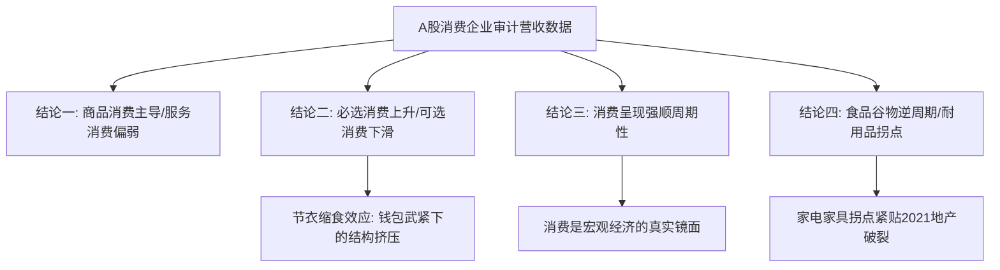

> **根节点**：高善文“背离职”事件背后的宏观逻辑是什么？CF40基于A股财务数据的报告揭示了中国消费与宏观经济怎样的真实图景？
> **叙事逻辑**：人物背景与事件定性 → 关键统计数据锚点 → CF40报告四项技术结论 → 消费结构深度对比与政策盲区 → 受害人群与利益相关方分析 → 制度归因与个体坐标
> **立场说明**：本文根据视频转写及中国金融40人论坛（CF40）开源研究报告整理；涉及宏观推断、政策评价与审计数据分析时保留材料自身的论证边界。
> **来源标注**：来源：老厉害的频道（YouTube），2026-07-31；引述研究：《CF40研究》（陈淑航，cf40research.substack.com）。

---

## 📚 知识树

```txt
根节点：高善文“背离职”与A股财务数据揭示的中国消费真实图景
│
├── 0、关键统计数据与数字锚点（数据基石）
│   ├── 样本数据：296/458家A股上市消费企业与11大涵盖行业
│   └── 趋势数据：2018年消费拐点、失业率5.5%口径与必选消费占比升降
│
├── 一、人物背景与事件定性：高善文“背离职”与“真话经济学家”的失声（宏观背景）
│   ├── 高善文背离职事件：从“封印一年”到彻底切割的制度信号
│   └── 历史三大敏感论断：18年向美开放论、23年新旧动能转型假象、失业率分子分母消失论
│
├── 二、CF40报告硬核拆解：基于A股审计数据的四项技术结论（核心事实）
│   ├── 结论一：商品消费为主导 vs 服务消费偏弱
│   ├── 结论二：必选消费提升 vs 可选消费下滑（节衣缩食对价）
│   ├── 结论三：消费强顺周期性（经济的真实镜面）
│   └── 结论四：食品谷物的逆周期特征与家具汽车的拐点
│
├── 三、消费结构深度对比与政策盲区：为何“以旧换新”救不了消费？（政策分析）
│   ├── 结构对比：商品消费 vs 服务消费 / 必选消费 vs 可选消费
│   └── 政策偏误：“以旧换新”的边际递减与财税/增值税依赖困局
│
├── 四、受害人群与利益相关方分析（社会影响）
│   ├── 农民工/反向失业人群、A股消费企业、城市常住人口
│   └── 四维分析矩阵：规模、法律地位、受偿排序与痛苦指数
│
└── 五、制度归因、延伸预测与个体坐标（终局收束）
    ├── 制度归因：终身教职制度缺失与“强供给弱需求”结构矛盾
    ├── 延伸预测：防范大规模返乡机制与真实数据重构
    └── 个体坐标：武紧钱包、防御性资产配置与认知去幻觉
```

---

## 0、关键统计数据与数字锚点

以下数据为材料中支撑核心论点的“事实与统计骨架”，保留了对官方宏观数据与企业审计财务数据的对比逻辑：

| 数字/时间 | 材料中的表述与含义 | 在本文中的论证作用 |
|:---|:---|:---|
| **296家 / 458家** | 2014年前上市消费企业296家（250商品/46服务）；2020年后补充扩大至458家（401商品/57服务，涵盖11个行业） | 说明CF40报告采用A股审计财务数据，具备极高抗造假性与连续性 |
| **11大消费行业** | 样本涵盖176个食品食物、84个纺织服装、30个家用电器、30个烟草白酒、27个日用品、17-19个汽车、14个化妆品、14个珠宝、11个运动娱乐、8个饮料企业 | 揭示A股消费行业的全景代表性与结构分布 |
| **5.5% 左右** | 官方城镇调查失业率长期维持的数值口径 | 高善文指出该数字未虚报但被“分子分母同时消失”（大规模反向返乡）所掩盖 |
| **2018年** | 贸易战与去杠杆开启年份，也是消费结构由可选向必选倾斜的转折点 | 高善文提出的“向美开放”结束点，也是中国消费走向下行的关键历史节点 |
| **2021年** | 房地产高歌猛进终结与房地产市场拐点年份 | 对应家电、家具等耐用消费品营收与占比一路下滑的转折时刻 |

---

## 一、人物背景与事件定性：高善文“背离职”与“真话经济学家”的失声

视频转写指出，国投证券（原国投产业研究院）首席经济学家高善文博士已被证实离职（材料称为“被离职”）。在过去一年中，高善文已无任何公开露面与发声渠道。此前，包括东北证券副总裁付鹏在内的多位首席经济学家相继淡出公众视野，标志着卖方研究中基于真实宏观数据与专业逻辑的客观声音遭到系统性抑压。

高善文在过去数年中发表了一系列具有深刻洞察力但尺度极大的宏观论断，材料将其归纳为三个核心维度：

1. **“改革开放是对美开放”论（2018年演讲）**：
   高善文指出，中国当年的改革开放本质上是“对美开放”；1979年的对越自卫反击战在外交与战略层面相当于向美国递交的“投名状”。随着2018年中美贸易战打响及去杠杆政策推进，中国经济面临根本性转折，甚至引发了“2018年可能是未来十年最好一年”的宏观讨论。

2. **“转型阵痛假象与周期力量”论（2023年国投证券策略会）**：
   高善文通过分析A股上市公司财务数据，将企业划分为三类：新质生产力企业、传统行业企业以及中性企业。
   
   > 📌 **新质生产力与中性企业（New Quality Productive Forces vs. Neutral Enterprises）**：新质生产力指受政策高额补贴与技术创新的高精尖产业；中性企业指理论上不受动能转换或政策倾斜冲击的常规制造业与服务业。
   
   数据分析表明，连不受新旧动能转换影响的“中性企业”营收也出现持续下降。高善文据此断言：官方所谓“转型期阵痛”只是一种叙事说辞，当下中国经济面临的核心挑战是强大的**周期性力量（Cyclical Force）**下行。

3. **失业率“分子分母消失”论（2023年PIIE论坛与国投策略会）**：
   高善文公开质疑官方GDP及就业数据。针对官方约5.5%的城镇调查失业率，他解释称该数据本身未必造假，但忽略了巨大的结构性抽离——大量在大城市失业的劳动者（如农民工、灵活就业青年）因生活成本被迫“反向返乡”。这导致城市的失业人数（分子）与常住人口总数（分母）同时减少，从而在统计指标上维持了失业率稳定的假象。

> 🔗 **横向关联**：高善文提出的“失业人口反向返乡”机制，与 [[中国灵活就业人口激增：失业蓄水池与社会风险]] 中“灵活就业与农村蓄水池缓冲功能”形成**互证关系**——后者阐述了体制如何依靠农村作为劳动力承压垫，高善文则从统计学角度揭示了这种承压机制如何导致城市失业率指标出现“数字失真”。

---

## 二、CF40报告硬核拆解：基于A股审计数据的四项技术结论

由于官方宏观统计数据存在修饰可能性，中国金融40人论坛（CF40）学者陈淑航发表于Substack（`cf40research.substack.com`）的研究报告，另辟蹊径采用**A股消费类上市公司的审计营收数据**来还原中国真实消费状况。A股上市公司财务数据受监管部门与第三方会计师事务所审计，伪造成本高，能够更真实地反映微观经济体体感。

基于对458家样本企业的纵向与横向分析，CF40报告得出了四大技术性结论：



### 结论一：商品消费占绝对主导，服务消费持续偏弱
在A股消费类企业中，商品消费占据极其庞大的份额。这一方面是因为服务业企业在A股上市的绝对数量较少（样本中仅57家服务企业），另一方面也反映出中国居民消费结构中服务型消费的真实疲软。

### 结论二：必选消费占比提升，可选消费占比下滑（节衣缩食对价）
自2020年以来，必选消费（Consumer Staples）在总消费中的占比持续攀升，而可选消费（Consumer Discretionary）占比持续走低。

> 📌 **必选消费与可选消费（Consumer Staples vs. Consumer Discretionary）**：必选消费指维持基本生存所需的商品（如粮食、食品、日用品）；可选消费指随收入增加而增加的非生存必需支出（如汽车、高端家电、珠宝、运动娱乐）。

报告强调：必选消费占比上升**并非因为居民消费了更多的粮食与食物**，而是在总预算收缩的背景下，居民“扎紧钱包、节衣缩食”，大幅削减可选消费。由于可选消费总量快速缩水，使得必需消费在分母变小后被动抬高了占比（即两者呈“相向而行”态势）。

> 🔗 **横向关联**：消费从可选向必选的被迫收缩，与 [[李克强与克强经济学分析笔记]] 中“居民与企业资产负债表被动去杠杆”形成**上下游关系**——资产负债表缩表是因，居民微观消费行为转向防御性收缩是果。

### 结论三：消费展现出明确的“顺周期”特征
2020年后，A股消费数据表现出极强的顺周期性（Pro-cyclicality）。

> 📌 **顺周期性与逆周期性（Pro-cyclicality vs. Counter-cyclicality）**：顺周期指变量变动方向与整体经济周期一致（经济好则消费增，经济弱则消费减）；逆周期指变量变动方向与经济周期相反。

数据证明，消费并不是独立于宏观经济的拉动引擎，而是经济整体运行状况的一面“镜子”。在宏观增长放缓时，寄希望于消费自我爆发是不符合经济学规律的。

### 结论四：食品谷物具强逆周期性，耐用品拐点锁定2021地产周期
在细分品类中：
* **食品与谷物**：呈现出显著的逆周期特征，与整体经济周期的相关性极低。无论经济好坏，居民都必须维持基本膳食开支。数据表明其占比从2018年开始持续攀升。
* **家电与家具**：其营收走势与房地产销售高度正相关。数据明确显示，家具家电类企业的拐点发生在**2021年**，即房地产行业见顶回落的同一时刻。
* **汽车与新三样**：尽管“新三样”（电动汽车、锂电池、光伏）在宣传中表现亮眼，但从A股消费总体占比来看，食品与谷物的营收占比依然遥遥领先于汽车，揭示了居民消费的基本盘仍固守于生存型开支。

---

## 三、消费结构深度对比与政策盲区：为何“以旧换新”救不了消费？

为了更直观地展示报告所揭示的结构矛盾，以下对消费维度及政策有效性进行对比拆解。

### 3.1 消费类型与结构特征对比

| 比较维度 | 商品消费（Goods Consumption） | 服务消费（Service Consumption） |
|:---|:---|:---|
| **A股样本代表性** | 极高（401家企业，涵盖家电、汽车、服装等） | 偏低（仅57家企业，受限于上市门槛） |
| **当下市场饱和度** | 高度饱和（居民户均拥有量趋于上限） | 依然存在较大提升与升级需求 |
| **政策倾斜度** | 获得极高补贴倾斜（如“以旧换新”政策） | 政策支持力度薄弱，缺乏针对性工具 |
| **财税与地方动力** | 高（贡献大额增值税与A股市值，见效快） | 低（征管分散，增值税贡献相对较小） |
| **核心瓶颈** | 缺乏新增需求（居民不可能买10台空调） | 行政监管过严、服务供给受限、防骗补成本高 |

> **引导句**：以上表格对比了商品消费与服务消费在当下中国政策体系与企业端呈现的截然不同的特征。
> **收束句**：**最关键的差异点在于**：当前政策将绝大部分资源注入已高度饱和的商品消费领域，而真正具备拉动空间的服务消费却因财税激励不足与行政防骗补难题而被忽视。

### 3.2 必选消费与可选消费的走势对比

| 比较维度 | 必选消费（如粮食、食品、日用品） | 可选消费（如汽车、珠宝、运动娱乐） |
|:---|:---|:---|
| **周期属性** | 逆周期 / 弱周期（需求刚性） | 强顺周期（随收入预期剧烈波动） |
| **占比走势（2018-至今）** | 持续上升（2018年后加速上升） | 持续下滑（挤压效应明显） |
| **微观驱动力** | 居民保生存、兜底开支 | 居民资产负债表缩表、削减非必要开支 |
| **对宏观经济的指示** | 占比越高，反映居民防守心态越重 | 占比越高，反映居民对未来预期越乐观 |

> **引导句**：该表格揭示了2018年以来中国居民消费结构发生深刻演变的数据真相。
> **收束句**：**最关键的差异点在于**：必选消费占比的上升并非消费升级的产物，而是可选消费总量快速收缩后造成的“被动抬升”，反映出居民全面收缩预算的体感。

### 3.3 政策盲区：“以旧换新”的边际效用递减

材料指出，当前官方推行的国家级消费补贴政策主要集中于商品消费领域（如汽车、家电“以旧换新”）。这种政策设计存在深层逻辑缺陷：

1. **边际递减效应**：商品消费在居民家庭中已高度普及，居民不会因补贴而无限叠加购买耐用品（如户均购买多台冰箱/空调）。
2. **财税与资本市场偏误**：地方政府之所以偏好补贴商品消费，是因为商品消费直接挂钩增值税（VAT）留存，且能迅速体现在A股上市制造业企业的业绩与市值上。
3. **服务消费补贴难点**：大摩（Morgan Stanley）等机构指出，若针对服务消费（如餐饮、文旅、养老、体验式消费）发放消费券或补贴，行政上极易面临“骗补”风险。政策制定者因无法有效解决行政核查成本，宁可继续套用效率低下的商品补贴模式。

> 🔗 **横向关联**：政策偏向商品制造而忽视服务消费的现象，与 [[习近平大转型：工业补贴、党有经济与中国经济的结构性下行]] 中“重供给轻需求、重工业制造轻第三产业”的宏观治理逻辑完全一致——形成了供给端过度投资与需求端持续萎缩的结构性错配。

---

## 四、受害人群与利益相关方分析

宏观经济下行与消费结构收缩对不同社会阶层和经济主体造成了异步冲击。根据受影响程度建立分层分析矩阵：

| 利益相关方/群体 | 规模 / 金额 | 法律地位 | 受偿/保障排序 | 痛苦指数 | 痛苦指数判定理由 |
|:---|:---|:---|:---|:---|:---|
| **反向返乡失业人口（农民工/青年）** | 估算数千万人级（从大城市抽离归乡） | 缺乏城市常住户籍与劳动保障 | 极低（处于社会福利与再就业保障末端） | **极高（⭐⭐⭐⭐⭐）** | 失去城市收入来源，在城市失业率统计中被“分子分母同时抹去”，缺乏失业救济与制度性兜底 |
| **可选消费与耐用品中小商家** | 涉及数百万家企业与个体户 | 独立法人 / 个体工商户 | 低（债务受偿顺位靠后，面临破产出清） | **高（⭐⭐⭐⭐）** | 受地产破裂与居民缩表双重挤压，家具、装修、珠宝等行业营收断崖式下滑，无政策补贴救助 |
| **A股上市消费企业（商品类）** | 401家上市公司（涵盖汽车、家电等） | A股上市公司，受严格监管 | 中（优先享受国家“以旧换新”政策与信贷支持） | **中（⭐⭐⭐）** | 虽然拥有融资渠道与政策补贴支持，但面临国内消费饱和与价格战（卷成本）的挤压 |
| **地方政府财税部门** | 全国31个省市自治区地方财政 | 地方行政主体 | 高（优先转移支付与税收留存） | **中（⭐⭐⭐）** | 面对土地财政衰退，急需增值税支撑，但因居民消费萎缩导致消费相关税源持续干涸 |

---

## 五、制度归因、延伸预测与个体坐标

### 5.1 制度归因：学术保护缺失与“强供给弱需求”治理沉痾

本报告所反映的经济现象与高善文被离职事件，可归因于深层次的制度困境：

1. **知识分子保障与学术自由制度的缺失（Tenure Track Missing）**：
   视频转写对比了欧美高校的终身教职制度（Tenure Track System）。

   > 📌 **终身教职制度（Tenure Track System）**：一种高等教育聘任制度，获聘学者不会因发表与主流政经叙事不符的学术研究而被剥夺工作与发言权利。

   在中国卖方研究与智库体系中，缺乏对学者客观表达的制度性保护。当经济学家因陈述审计数据与真实逻辑而面临“被离职”或“封印”时，决策层便失去了关键的反向反馈纠偏机制。

2. **“强供给、弱需求”的结构性矛盾**：
   体制长期偏好通过行政指令向生产端注入资源（补贴新质生产力、扩充产能），而忽视了需求端（居民可支配收入占比偏低、社保兜底不足）。这种治理模式导致产能过剩与消费紧缩同时爆发。

### 5.2 延伸预测：政策应对与统计重构趋势

基于当下趋势，可对未来数年的政经动态作出如下延伸推演：

1. **防范大规模返乡的行政化管控**：农业农村部等部门已出台相关文件，强调“防止大规模返乡致贫”。这预示着地方政府可能采取更多行政手段留存劳动力，或通过农村转移支付进行缓释。
2. **统计数据失真加剧与民间数据替代**：随着官方宏观指标（如失业率、GDP增速）与居民切身体感进一步脱节，市场与投资者将更加依赖类似于CF40报告这种基于A股审计数据、微观高频数据的“反向重构指标”。

### 5.3 个体坐标：普通人的策略应对

对于微观个体与家庭而言，宏观消费数据与学者遭遇提供了明确的生存参照：

1. **认清去杠杆与周期性下行现实**：放弃对“短期大刺激拉动消费/房价恢复高增长”的幻觉，接受经济运行处于深层周期性下行周期的事实。
2. **执行防御性资产与消费策略**：在个人财务规划中保留足够的现金流，缩减非必要的可选消费（如高溢价奢侈品、过度耐用品升级），优先保证必需开支与风险储备。
3. **信息获取的“去滤镜”化**：在官方宏观叙事与宏观数据被修饰的环境下，学会关注企业真实财报、上市审计数据及高频行业微观指标，建立独立、客观的宏观认知框架。

---

## 数据库索引

| # | 概念/事件 | 时间 | 类型 | 所属维度 | 横向关联笔记 | 重要性 |
|:---|:---|:---|:---|:---|:---|:---|
| 1 | 高善文背离职事件 | 2026-07 | 政治经济 | 一、人物背景与事件定性 | — | ⭐⭐⭐⭐⭐ |
| 2 | 失业率“分子分母消失”论 | 2023 | 经济统计 | 一、人物背景与事件定性 | [[中国灵活就业人口激增：失业蓄水池与社会风险]] | ⭐⭐⭐⭐⭐ |
| 3 | A股上市消费企业财务数据（296/458家） | 2024-2026 | 经济数据 | 二、CF40报告硬核拆解 | — | ⭐⭐⭐⭐ |
| 4 | 必选消费 vs 可选消费（节衣缩食对价） | 2020-2026 | 消费结构 | 三、消费结构深度对比 | [[李克强与克强经济学分析笔记]] | ⭐⭐⭐⭐⭐ |
| 5 | “以旧换新”政策与增值税偏误 | 2024-2026 | 宏观政策 | 三、消费结构深度对比 | [[习近平大转型：工业补贴、党有经济与中国经济的结构性下行]] | ⭐⭐⭐⭐ |
| 6 | 耐用消费品（家电/家具）2021年拐点 | 2021-2026 | 行业周期 | 二、CF40报告硬核拆解 | [[中国房地产泡沫为何突然破裂：制度扭曲与压缩弹簧效应]] | ⭐⭐⭐⭐ |
| 7 | 反向返乡群体（农民工/失业青年） | 2023-2026 | 社会阶层 | 四、受害人群与利益相关方分析 | [[中国灵活就业人口激增：失业蓄水池与社会风险]] | ⭐⭐⭐⭐⭐ |
| 8 | 终身教职制度（Tenure Track）缺失 | — | 制度设计 | 五、制度归因、延伸预测与个体坐标 | — | ⭐⭐⭐ |

---

## 参考来源

1. **老厉害的频道**：YouTube视频转写，《高善文背离职与CF40消费报告解读》，发布时间：2026-07-31。
2. **中国金融40人论坛（CF40）**：陈淑航，《基于A股上市企业数据的中国消费复苏与结构拆解》，Substack专栏：`cf40research.substack.com`。
3. **国投证券（原国投产业研究院）**：高善文历年公开演讲与投资策略会报告（2018年、2023年）。
4. **彼得森国际经济研究所（PIIE）**：高善文关于中国GDP与宏观数据质询研讨会记录。
