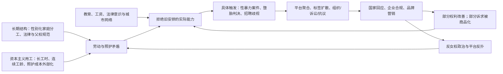

# 中日韩美欧女权主义现状、资本化与未来走向

> **根节点**：为什么当代女权主义既是女性权益运动，又会被国家治理、平台流量和消费资本共同重塑？
> **叙事逻辑**：地区现状 → 核心主张 → 组织与媒介 → 舆论/金融影响 → 国家回应 → 情绪整合与资本获利 → 个体改变与压力 → 未来走向
> **立场说明**：本文区分三层内容：公开可查事实、基于事实的结构分析、对未来趋势的谨慎推测。本文不把女权主义简化为单一阵营，也不把资本获利等同于运动本身的全部动机。
> **来源标注**：综合世界经济论坛、欧盟/EIGE、Guttmacher、政府文件、人权组织、学术研究和新闻资料；访问时间为 2026-07-30。

```txt
根节点：当代女权主义如何在权利、治理与资本之间被重塑？
├── 一、总体格局（从平权运动到情绪政治）
│   ├── 权利议题仍围绕身体、劳动、暴力与代表性
│   └── 传播形态从组织动员转向平台化、标签化与生活方式化
├── 二、地区比较（五个政治经济场域）
│   ├── 中国：低组织化、高平台化、强审查环境
│   ├── 韩国：激烈性别冲突与 4B/数字性暴力议题
│   ├── 日本：温和街头抗议与制度渐进改革
│   ├── 美国：堕胎权、DEI 与身份政治高度极化
│   └── 欧洲：制度化平权与右翼反弹并存
├── 三、资本与市场（流量、消费与金融产品）
│   ├── 女性健康、女性体育、品牌平权营销成为增长赛道
│   └── DEI/ESG 在美国遭遇政治和股东压力
└── 四、未来走向（资本化、治理化与反弹化）
    ├── 女权议题会继续进入消费、投融资与平台算法
    └── 反女权、反 DEI 与传统家庭主义也会继续组织化
```

## 0、关键统计数据与数字锚点

| 数字/时间 | 公开资料中的表述 | 在本文中的作用 |
|---|---|---|
| 2025 年全球性别差距 68.8% 弥合 | 世界经济论坛《Global Gender Gap Report 2025》称全球总体性别差距弥合 68.8%，完全平等仍需逾一个世纪 | 说明女权议题并非“已经完成”，而是在缓慢推进中遭遇反弹 |
| 美国 2025 年第 42 位，75.6% | WEF 称美国排名第 42，较 2024 年上升一位 | 美国制度代表性较强，但社会撕裂集中在堕胎权、DEI 和跨性别议题 |
| 中国 2025 年第 103 位，约 68.6% | WEF 相关资料显示中国 2025 年排名第 103 | 中国女性教育和就业规模较大，但政治代表、婚育压力和公共表达空间是关键矛盾 |
| 韩国 2025 年分数约 0.69 | Statista 概述韩国 2025 年性别差距指数约 0.69 | 韩国表面现代化程度高，但性别战争、数字性暴力和低生育形成强张力 |
| 日本 2025 年第 118 位 | 日本资料转述 WEF 指数称日本 2025 年仍为第 118 位、G7 垫底 | 日本女权的核心矛盾集中在政治经济代表性不足与保守家庭/职场规范 |
| EU 2025 年性别平等指数 63.4/100 | 欧洲性别平等研究所 EIGE 称 2025 年欧盟指数为 63.4/100 | 欧洲制度化程度高，但成员国内部差异大，暴力和薪酬差距仍显著 |
| 美国 13 州全面禁止堕胎 | Guttmacher 截至 2025 年底/2026 年资料显示 13 州实施全面堕胎禁令 | 说明美国女权运动的身体自主权议题具有直接法律后果 |
| Femtech 2025 年约 456 亿美元 | Grand View Research 估计全球女性科技/女性健康市场 2025 年为 456 亿美元 | 展示女性身体和健康诉求如何被资本转化为增长赛道 |
| 女性体育 2025 年约 25 亿美元机会 | McKinsey 讨论女性体育商业化机会，女性体育粉丝过去五年快速增长 | 展示平权叙事与新媒体、赞助和赛事版权的结合 |

> 📌 **数字锚点（Data anchor）**：指用于固定分析时间和规模的关键数据。本文使用这些数字不是为了证明某一地区“更先进”或“更落后”，而是为了避免把复杂社会运动写成纯情绪判断。

## 一、总体格局：女权主义从权利政治进入平台化情绪政治

当代女权主义的核心仍然是争取女性在身体、劳动、家庭、公共代表和安全方面的平等权利，但其传播方式已经明显改变：过去依赖政党、工会、妇女组织、NGO 和街头运动，如今更依赖社交媒体平台、短视频、标签、消费品牌、影视文娱和知识付费。

> 📌 **平台化女权（Platform feminism）**：指女权议题通过微博、小红书、TikTok、Instagram、X、YouTube 等平台传播，并受算法推荐、广告变现和内容审查共同塑造。这个概念在本文中用于解释为什么同一女权诉求会同时表现为公共抗议、情绪宣泄、消费风格和流量生意。

总体看，五个地区的女权主义已经分化成三种形态：

| 维度 | 中国 | 韩国 | 日本 | 美国 | 欧洲 |
|---|---|---|---|---|---|
| 主要形态 | 平台化、低组织化、谨慎表达 | 高冲突、线上动员强、部分拒绝婚育 | 温和抗议、法律改革、职场平权 | 高度极化、司法/选举化 | 制度化平权 + 右翼反弹 |
| 核心议题 | 性骚扰、婚育压力、职场歧视、网络厌女 | 数字性暴力、反婚育、反美貌规训、男性反女权 | 性暴力法改、职场规范、政治代表 | 堕胎权、DEI、薪酬、性别身份 | 反暴力、薪酬差距、照护劳动、移民女性权益 |
| 主要媒介 | 小红书、微博、豆瓣遗留社群、播客、海外平台 | X、YouTube、论坛、Telegram 事件舆论、街头集会 | X、署名请愿、Flower Demo、主流媒体 | TikTok、Instagram、X、NGO 邮件网络、选举动员 | NGO 网络、工会、政党、欧盟制度、街头游行 |
| 国家回应 | 法律有保护，组织化表达受限 | 数字性犯罪立法加强，但反女权政治化 | 渐进政策和刑法改革 | 联邦与州层面对冲，左右摇摆 | 欧盟层面制度推进，成员国差异大 |

最关键的差异是：欧美女权更容易进入制度和法院，东亚女权更容易进入生活方式、平台情绪和婚育选择；但韩国是例外，它的线上激进化和街头动员都强，且与低生育、男性反女权政治高度绑定。

## 二、中国：低组织化、高平台化与“婚育—就业—审查”的三重压力

中国女权主义目前更像一种“日常化的数字女权”，而不是公开、高度组织化的社会运动。公开资料显示，中国法律层面承认男女平等，2022 年修订、2023 年生效的《妇女权益保障法》加强了对性骚扰和就业歧视的规定；UNFPA China 也提到中国已有一百多部法律法规涉及妇女发展和权益保护。但另一面，人权组织和学术研究普遍指出，独立女权组织、#MeToo 话题和女权账号面临审查、封禁、骚扰或更高政治风险。

中国女权的核心主张主要包括：反性骚扰、反职场性别歧视、反家庭暴力、反婚育强制、承认女性个人发展和不婚不育选择、反网络厌女。它的受众主要是城市受教育女性、大学生、白领女性、创作者和部分海外中文圈女性。

> 📌 **日常数字女权（Everyday digital feminism）**：指女性通过生活经验分享、情绪互助、书影音讨论、消费避雷和亲密关系反思来表达性别意识，而不一定以正式组织或街头抗议出现。这个概念尤其适合解释中国平台上“小红书女性成长”“不婚不育”“反服美役”等内容。

中国女权是否发展为有组织抗争？答案要分层看。公开大规模、持续性组织化抗争空间有限；但线上议题动员、个案声援、匿名互助、法律求助、内容搬运和海外中文社群仍存在。其受打击对象主要不是所有“女性讨论”，而是被认为可能形成独立组织、跨地区动员、挑战主流家庭/婚育叙事或引发公共事件的账号和行动者。

资本在中国女权中的获利方式更隐蔽：平台通过女性焦虑、情绪共鸣和身份标签获取流量；美妆、医美、服饰、知识付费、心理咨询、法律咨询、职场课程、女性健康产品通过“女性成长”“独立女性”“悦己消费”实现变现。这里的矛盾是，女权一方面反对“服美役”和婚恋压迫，另一方面又常被平台重新导向消费升级、身体管理和自我优化。

## 三、韩国：4B、数字性暴力与低生育社会的性别战争

韩国女权主义是五个地区中冲突感最强的类型之一。其背景是高度竞争的教育和就业体系、持久的性别薪酬差距、低生育率、兵役与男性不满、数字性犯罪和强烈的美貌规训。韩国女权的代表性议题包括 #MeToo、偷拍/非法拍摄、N 号房、AI deepfake 色情、Escape the Corset，以及 4B 运动。

> 📌 **4B 运动（4B movement）**：源自韩国的激进女权生活方式，主张不恋爱、不性关系、不结婚、不生育。本文把它视为“拒绝型政治”：它不一定通过夺取制度权力表达诉求，而是通过退出亲密关系和生育秩序表达抗议。

韩国女权的传播媒介以 X、YouTube、论坛、女性社群、新闻调查和街头集会为主。数字性暴力事件反复把女性恐惧转化为公共怒火。2024 年以来韩国 deepfake 色情危机中，女性和未成年人成为主要受害者，2025 年人权观察资料称女性和女孩占向韩国政府资助机构寻求 deepfake 支援者的 97%。这说明韩国女权的核心情绪不是抽象“讨厌男性”，而是对身体安全、隐私安全和社会不惩罚施害者的恐惧。

韩国女权确实发展出了有组织抗议：例如反偷拍抗议、反 deepfake 抗议、反数字性犯罪联盟、女性团体联合行动等。国家当局也采取了实际措施，例如加强数字性犯罪处罚、推动支援中心和警方调查。但韩国政治也出现强烈反女权动员，部分政客把年轻男性的不满转化为反女权票源，甚至曾提出废除性别平等相关部门。韩国女权的受打击对象主要包括数字性犯罪者、厌女网络社群、父权家庭制度、性别化职场结构和将女性身体商品化的产业；反过来，女权主义者也成为男性网络社群、保守政客和平台围攻的对象。

资本在韩国女权中有双重获利：一端是美妆、医美、偶像产业继续利用女性外貌焦虑；另一端是“反服美役”“女性独立”“安全科技”“女性社区”也成为新的内容和消费市场。韩国的特殊之处在于，女权和低生育被强行绑定：部分舆论把女性不婚不育归咎于女权，但更深层原因是高房价、高教育成本、职场不平等和男性家庭责任不足。

## 四、日本：温和抗议、法律改革与缓慢的制度追赶

日本女权主义的公共形象比韩国温和，但议题同样尖锐。其核心问题是政治代表性低、企业高层女性少、非正规就业女性集中、性暴力法律长期保守、职场着装和照护劳动仍高度性别化。日本在 WEF 2025 全球性别差距指数中排名第 118 位，是 G7 中表现最弱者之一，这使日本女权常围绕“发达经济体内部的性别落后”展开。

日本较有代表性的组织化行动包括 #KuToo 和 Flower Demo。#KuToo 针对职场强制女性穿高跟鞋等性别化服饰规范；Flower Demo 则从 2019 年反性暴力判决不公开始，发展为每月街头集会，并对 2023 年日本性犯罪刑法改革形成舆论推动。研究资料提到，到 2023 年 Flower Demo 已有 67 个地方分支，并持续四年多。

> 📌 **Flower Demo**：日本反性暴力运动，参与者以花作为对受害者的支持符号。本文用它说明：日本女权更常以共情、见证和温和持续的街头表达推动制度变化，而不是以高强度对抗为主要形式。

日本政府对女权议题采取渐进式回应：设有内阁府男女共同参画局，推进女性参与决策、工作生活平衡、反暴力、地区性别平等等政策；政府也曾提出 2030 年上市公司高管中女性占 30% 的目标。但日本女权受到的压力来自保守家庭观、企业年功序列、长工时文化、政治老龄男性网络，以及“女性既要就业又要承担照护”的双重期待。

资本在日本的获利方式主要体现在“女性活跃”（womenomics）叙事：国家和企业将女性劳动参与视为解决老龄化、劳动力短缺和经济停滞的资源。问题在于，如果缺少托育、男性育儿、晋升机制和反歧视执行，女性活跃容易变成“让女性多工作，但家庭照护仍由女性承担”。

## 五、美国：堕胎权、DEI 与身份政治的高度极化

美国女权主义目前处在高度极化阶段。它的核心主张包括堕胎权和生殖自主、反性骚扰、同工同酬、反家庭暴力、职场 DEI、女性政治代表、LGBTQ+ 权益、照护劳动和带薪家庭假。与东亚相比，美国女权拥有更强的 NGO、法律诉讼、基金会、大学、媒体和选举动员体系。

> 📌 **DEI（Diversity, Equity and Inclusion）**：多元、公平与包容政策，常用于企业、大学和公共部门的人才、招聘、供应商和组织文化治理。本文中，DEI 是女权与资本、法律和党派政治交叉最明显的美国场域。

美国女权是否形成组织化抗议？答案非常明确：是。Women's March、Planned Parenthood、ACLU、National Women's Law Center 等组织持续推动游行、诉讼、选举动员和州层面公投。2025 年 1 月特朗普第二任期就职前，Women's March 等组织将行动重塑为 People's March，议题从女性权利扩展到生殖权、LGBTQ+、移民、气候和民主。

国家回应则呈现联邦—州、行政—司法之间的对冲。Dobbs 判决后，堕胎权回到州层面，Guttmacher 和 KFF 等资料显示，美国已有 13 个州全面禁止堕胎，另有许多州设置孕周限制；同时，部分蓝州加强保护、通过盾牌法和医保/服务便利化。特朗普政府 2025 年行政令则推动削减或终止联邦 DEI，并以“保护女性免受性别意识形态极端主义”为名重塑联邦性别政策。于是，美国女权的受打击对象既包括限制堕胎的州政府和法院，也包括反 DEI 政策、保守宗教组织、反跨性别政策和企业退缩；反过来，女权组织、DEI 部门、大学、跨性别群体和进步品牌也受到保守派诉讼、抵制和监管压力。

金融市场影响最明显体现在 DEI/ESG 和品牌风险上。2025 年后，多家美国企业因政治压力收缩 DEI 项目；但哈佛公司治理资料也显示，企业仍面临投资者、员工和消费者对 DEI 的支持与反向压力。换言之，资本不是单向“支持女权”，而是在红州/蓝州消费者、监管风险、人才招聘、股东提案和品牌声誉之间做风险对冲。

## 六、欧洲：制度化平权与右翼反弹并行

欧洲女权主义具有更强的制度化特征：欧盟层面有性别平等战略、EIGE 指数、反暴力立法、薪酬透明、董事会性别平衡等工具；成员国层面则有工会、政党、女权 NGO 和国际妇女节游行。2024 年欧盟通过首个全面打击暴力侵害妇女和家庭暴力的指令，成员国须在 2027 年 6 月 14 日前转化为国内法。EIGE 2025 指数显示欧盟性别平等分数为 63.4/100，且成员国差异从塞浦路斯 47.6 到瑞典 73.7 不等。

欧洲女权的核心主张包括：反家庭暴力和性暴力、薪酬平等、照护劳动公共化、移民女性和少数族裔女性保护、堕胎权、政治代表、反网络厌女。其传播媒介既有制度渠道，也有街头游行、工会罢工、NGO 报告、公共广播和社交平台。

欧洲确实存在组织化抗争。国际妇女节、反家暴游行、反紧缩抗议、波兰堕胎权抗议、西班牙女性罢工、法国反性暴力抗议等，都说明女权并未只停留在舆论层。与此同时，欧洲也遭遇“反性别主义”（anti-gender）和右翼传统家庭主义反弹：部分右翼政党和宗教保守组织把性别平等、LGBTQ+ 权益、移民和欧盟治理打包为“精英自由主义工程”，从而动员保守选民。

> 📌 **反性别主义（Anti-gender politics）**：指反对“性别平等/性别研究/LGBTQ+ 权益/生殖权利”的政治动员。本文用它解释为什么欧洲女权的对手不只是个别男性或企业，而是保守政党、宗教网络和民族主义叙事的结合。

资本在欧洲女权中的位置更制度化：企业通过 ESG、董事会多元化、薪酬透明、合规咨询、女性领导力培训和可持续投资产品获利。与美国不同，欧洲的平权资本化更多嵌入欧盟监管和企业治理，而不是完全依赖品牌姿态。

## 七、女权主义对金融市场和社会舆论的实际影响

女权主义对金融市场的影响主要不是“让股价立刻涨跌”，而是改变了企业的合规成本、品牌风险、消费赛道和投资叙事。

| 影响路径 | 实际表现 | 资本如何获利 |
|---|---|---|
| ESG/DEI 合规 | 企业设立 DEI、薪酬透明、反骚扰培训、董事会多元化指标 | 咨询公司、评级机构、律师事务所、人力资源服务商获利 |
| 女性健康/Femtech | 月经健康、生育健康、更年期、女性数字医疗、保险产品扩张 | 医疗科技、数据平台、药企和消费医疗品牌获利 |
| 女性体育和娱乐 | 女性赛事版权、赞助、明星运动员社媒商业价值提高 | 联赛、媒体平台、赞助商、经纪公司获利 |
| 情绪消费 | “独立女性”“悦己”“反内耗”“女性成长”成为商品叙事 | 美妆、医美、服饰、课程、心理咨询、图书和会员社区获利 |
| 品牌政治风险 | 支持或撤退 DEI 都可能引发抵制 | 企业通过立场管理获取特定消费群体，同时规避监管和舆论损失 |

> 📌 **性别镜头投资（Gender-lens investing）**：指把性别平等纳入投资筛选、影响力投资或 ESG 分析。本文中它代表资本把女权主张转译成金融产品和风险管理语言的过程。

社会舆论的实际影响则更直接：性骚扰、家暴、偷拍、堕胎、薪酬差距、女性领导力、婚育压力等议题变得更可见；但同时，“女权是否过度”“男性是否被歧视”“跨性别是否威胁女性空间”“DEI 是否违反公平”等反向议题也被组织化。女权越进入主流，反女权也越容易作为政治产品出现。

## 八、它统合了女性什么情绪和诉求，又被引导向哪里？

当代女权主义统合的女性情绪主要有五类：

| 情绪/诉求 | 来源 | 可能被引导方向 |
|---|---|---|
| 愤怒 | 性骚扰、家暴、偷拍、职场歧视、司法不公 | 抗议、诉讼、曝光、抵制、公共政策改革 |
| 恐惧 | 数字性暴力、亲密关系暴力、堕胎禁令、网络开盒 | 安全技术、法律求助、女性互助社区、亲密关系退出 |
| 疲惫 | 双重劳动、婚育压力、外貌规训、情绪劳动 | 不婚不育、低欲望生活、心理咨询、女性成长消费 |
| 尊严诉求 | 希望被承认为完整主体，而非妻子/母亲/美貌资源 | 教育、职业规划、政治参与、身体自主 |
| 孤独和互助需求 | 个体化社会中缺少稳定支持网络 | 女性社群、播客、读书会、线下互助、付费社区 |

它被引导向两个方向：一是权利化，即进入法律、政策、选举、诉讼、组织和街头抗议；二是消费化，即进入女性健康、外貌管理、心理疗愈、知识付费、女性社交和品牌忠诚。前者可能扩大公共权利，后者可能提供短期支持但也容易制造新焦虑。

## 九、对女性身心发展和未来规划的改变

女权主义对女性个体的改变是真实的。它让许多女性更早识别性骚扰、PUA、家务不平等、婚育风险和职场歧视，也让“不结婚、不生育、晚婚晚育、独居、跨国流动、深造、创业、财务独立”成为更可想象的人生选项。

但代价也很真实。女性会面对来自家庭的催婚催育、职场的隐性惩罚、网络厌女攻击、政治污名、平台审查、亲密关系冲突和“既要独立又要漂亮、既要事业又要情绪稳定”的新型压力。资本化女权还会制造另一种负担：女性似乎必须通过消费证明自己独立，通过健身、医美、穿搭、旅行、课程和心理咨询不断“升级自己”。

因此，女权对女性身心发展的影响不是单纯“解放”或“伤害”，而是扩大了选择空间，同时也把更多结构性矛盾转移到个体自我管理上。

## 十、未来判断：女权会与资本一起走向哪里？

未来女权主义大概率不会消失，而会同时走向三条路线。

第一，**治理化**。国家会继续吸收女权中的低风险议题，如反家暴、反性骚扰、促进女性就业、托育、女性健康、董事会多元化；但会压制或规训高风险议题，如独立组织化、激进抗议、反婚育政治、跨地域动员。

第二，**资本化**。资本会继续把女性诉求转化为增长市场：Femtech、女性体育、心理疗愈、教育培训、职场服务、养老与单身经济、宠物经济、保险金融、女性社区都会扩张。资本最擅长吸收“我想安全、自由、被尊重、少受伤害”的诉求，再把它转译成产品、会员、课程、保单、APP 和品牌故事。

第三，**反弹化**。反女权、反 DEI、传统家庭主义、男性权益运动和宗教/民族主义保守力量也会更组织化。尤其在经济停滞、低生育、青年男性失落、移民冲突和就业焦虑背景下，女权容易被塑造成替罪羊。

最终，女权与资本的未来关系不会是简单同盟，而是互相利用：女权需要资源、平台和可见度；资本需要女性注意力、消费能力和道德叙事。女性个体真正需要警惕的是：不要把结构性权利诉求完全交给品牌和平台替自己表达。品牌可以卖“独立女性”，但不能代替托育制度、劳动保护、反暴力执法、政治代表和真实的社会互助。

## 数据库索引

| # | 概念/事件 | 时间 | 类型 | 所属维度 | 横向关联笔记 | 重要性 |
|---|---|---|---|---|---|---|
| 1 | 全球性别差距指数 | 2025 | 数据/制度 | 总体格局 | — | ⭐⭐⭐ |
| 2 | 4B 运动 | 2010s-2026 | 社会运动 | 韩国 | — | ⭐⭐⭐ |
| 3 | Flower Demo | 2019-2026 | 社会运动/法律改革 | 日本 | — | ⭐⭐ |
| 4 | Dobbs 后堕胎权斗争 | 2022-2026 | 司法/政治 | 美国 | — | ⭐⭐⭐ |
| 5 | DEI 反弹 | 2025-2026 | 企业治理/政治 | 美国/欧洲 | — | ⭐⭐⭐ |
| 6 | EU 反暴力指令 | 2024-2027 | 法律/制度 | 欧洲 | — | ⭐⭐ |
| 7 | Femtech | 2025-2033 | 市场/资本 | 资本化 | — | ⭐⭐ |
| 8 | 平台化女权 | 2010s-2026 | 媒介/社会心理 | 中国/全球 | — | ⭐⭐⭐ |

## 参考来源

1. World Economic Forum：《Global Gender Gap Report 2025》，2025，https://www.weforum.org/publications/global-gender-gap-report-2025/
2. WEF：Benchmarking gender gaps 2025，美国排名与分数，https://www.weforum.org/publications/global-gender-gap-report-2025/in-full/benchmarking-gender-gaps-2025/
3. European Institute for Gender Equality：Gender Equality Index 2025，https://eige.europa.eu/gender-equality-index
4. European Commission：Gender Equality Strategy / Ending gender-based violence，https://commission.europa.eu/strategy-and-policy/policies/justice-and-fundamental-rights/gender-equality_en
5. European Commission：Ending gender-based violence，https://commission.europa.eu/strategy-and-policy/policies/justice-and-fundamental-rights/gender-equality/gender-based-violence/ending-gender-based-violence_en
6. Guttmacher Institute：State Bans on Abortion Throughout Pregnancy，https://www.guttmacher.org/state-policy/explore/state-policies-abortion-bans
7. KFF：Abortion in the U.S. Dashboard，https://www.kff.org/womens-health-policy/abortion-in-the-u-s-dashboard/
8. White House：Executive Order on DEI / gender ideology, 2025，https://www.whitehouse.gov/presidential-actions/2025/01/defending-women-from-gender-ideology-extremism-and-restoring-biological-truth-to-the-federal-government/
9. Federal Register：Ending Radical and Wasteful Government DEI Programs，2025，https://www.federalregister.gov/documents/2025/01/29/2025-01953/ending-radical-and-wasteful-government-dei-programs-and-preferencing
10. Human Rights Watch：World Report 2026: South Korea，https://www.hrw.org/world-report/2026/country-chapters/south-korea
11. Carnegie Endowment：The Fight Over Gender Equality in South Korea，2025，https://carnegieendowment.org/research/2025/04/the-fight-over-gender-equality-in-south-korea
12. Nature Humanities and Social Sciences Communications：Safe spaces for feminist activists online: Chinese networked feminists，2025，https://www.nature.com/articles/s41599-025-04802-2
13. Amnesty International：Human rights in China / women and LGBTI expression restrictions，https://www.amnesty.org/en/location/asia-and-the-pacific/east-asia/china/report-china/
14. UNFPA China：Gender equality and women’s empowerment，https://china.unfpa.org/en/topics/gender-equality-and-womens-empowerment
15. China Law Translate：《妇女权益保障法》修订译文，https://www.chinalawtranslate.com/en/law-on-protection-of-wome-2022/
16. Government of Japan Gender Equality Bureau，https://www.gender.go.jp/english_contents/
17. Nippon.com：No Improvement for Japan in 2025 Gender Gap Ranking，https://www.nippon.com/en/japan-data/h02444/
18. ResearchGate 摘要：Flower Demonstration 67 local branches / 2023 law reform，https://www.researchgate.net/publication/377085721_Collectivizing_trauma_everyday_experiences_empathy_and_grassroots_activism_in_Japan%27s_Flower_Demonstration_against_sexual_violence
19. McKinsey：Closing the monetization gap in women’s sports，2025，https://www.mckinsey.com/industries/technology-media-and-telecommunications/our-insights/closing-the-monetization-gap-in-womens-sports-a-2-point-5-billion-dollar-opportunity
20. Grand View Research：Femtech Market Size, Share & Trends Report，https://www.grandviewresearch.com/industry-analysis/femtech-market-report
21. Harvard Law School Forum on Corporate Governance：The Deepening DEI Dilemma，2026，https://corpgov.law.harvard.edu/2026/04/25/the-deepening-dei-dilemma/
22. UN Women / UNRISD：Understanding Backlash Against Gender Equality，2025，https://www.unwomen.org/en/digital-library/publications/2025/09/understanding-backlash-against-gender-equality-evidence-trends-and-policy-responses

---

# 补充研究：资本是否对当代女权兴起起决定性作用？

> **根节点**：资本是当代女权主义“盛行”的决定性原因，还是把既有性别矛盾放大、商品化并重新分配的结构力量？
> **叙事逻辑**：先界定“决定性” → 用六个条件逐一检验 → 排出因果先后 → 分析反馈回路 → 给出可反驳的结论。
> **立场说明**：这里的“资本”不是泛指“有钱人”，而指企业对劳动、消费、数据与平台注意力的逐利配置，以及与国家家庭制度相连的资本主义生产—再生产结构。因果判断须区分结构性条件、近端触发器、传播放大器和获利者；“从中获利”本身不能证明“制造了该运动”。
> **来源标注**：主要使用同行评审论文与 ILO、Eurostat、UN Women、OECD、世界银行等公开资料；链接访问于 2026-07-30。英文引文仅摘录支撑判断的短句，完整语境以链接原文为准。

```txt
根节点：资本是否决定当代女权的兴起？
├── 一、判准（避免把“相关”误作“决定”）
│   ├── 资本不是女权存在的充分原因
│   └── 在劳动—照护矛盾与平台商业化中具有强结构作用
├── 二、六个条件（逐项检验）
│   ├── 教育/就业：经济独立与职场惩罚并存
│   ├── 互联网：把私人经验聚合为可见的公共议题
│   ├── 婚育/照护：现代就业与无偿再生产冲突
│   ├── 人口/国家：退出婚育转化为治理问题
│   ├── 消费/品牌：诉求被转译为商品与数据
│   └── 反弹政治：经济焦虑经由政治与文化被性别化
└── 三、因果链（先结构，后触发，再商品化与反弹）
    ├── 劳动市场和照护制度制造持续成本
    ├── 教育、收入和法律意识扩大拒绝与发声能力
    ├── 平台将分散经验同步化，事件形成触发器
    └── 国家、资本与反女权力量分别吸收、商品化或反制
```

## 一、先回答：资本不是唯一决定因素，但在当代形态中具有“结构性强作用”

“决定性作用”至少可能有三种含义，必须分开。若它指**没有资本主义就不会有女权**，答案是否定的：妇女参政、受教育、婚姻法改革和劳动权运动早于今天的平台、消费和金融市场，并且在不同经济体制下都存在。若它指**只要资本扩张，女权就必然兴起**，答案仍是否定的：同样的全球市场化在中国、韩国、日本、美国和欧洲产生了不同的议题、组织强度与政策后果，说明国家制度、法律、宗教/家庭规范、社会运动传统和政治机会不能被资本变量替代。

但若它指**为什么这一次的女权以“劳动者—消费者—数据生产者—婚育决策者”的形态集中可见，并与婚育、平台和品牌高度纠缠**，资本的作用很强，特别在第三（婚育/照护）、第五（消费/平台）两个环节；它既制造一部分矛盾，也提供资源和可见度，随后又把部分诉求吸收为商品。

| 因果判准 | 对资本的检验 | 结论 |
|---|---|---|
| 必要条件 | 女权与性别平权运动早于当代平台和 Femtech，也出现在不同经济制度中 | 不是必要条件 |
| 充分条件 | 资本扩张并不自动带来女权动员；组织空间、法律和政治事件决定是否能行动 | 不是充分条件 |
| 结构性条件 | 市场对长工时、连续工龄和可随时待命的奖励，与照护责任发生稳定冲突 | 强作用，尤其在劳动/照护 |
| 近端触发器 | #MeToo、偷拍/深伪、堕胎判决、具体性暴力案件会触发集体行动 | 通常不是资本单独触发 |
| 放大与获利机制 | 平台算法、广告、品牌和服务把注意力、身份与焦虑转为收入 | 强作用，但“获利”不等于“起源” |

> 📌 **社会再生产（Social reproduction）**：指生育、养育、照护、家务和维持劳动力的日常活动。它常在家庭中以低薪或无薪方式完成；本研究用它解释为什么“女性就业增加”并不会自动消除性别不平等。

## 二、六个条件的证据与资本作用分级

### 1. 女性教育与就业：资本提供退出资源，也保留职场惩罚

女性获得教育、工资和职业网络，会提高离开暴力关系、推迟婚育、提起诉讼和表达不满的可行性。这不是单纯由企业造成的，也来自公共教育、妇女权利法和社会运动；但工资劳动使这种能力更可执行。反面是，企业对连续工龄、长工时和随叫随到的回报会把照护成本压在女性身上。

Goldin 的劳动经济学研究给出了明确机制，而非抽象的“资本压迫”说法：

> “The gender gap in pay would be considerably reduced … if firms did not … disproportionately reward individuals who labored long hours.”
>
> ——Claudia Goldin, *A Grand Gender Convergence: Its Last Chapter* (2014)，[DOI 原文](https://doi.org/10.1257/aer.104.4.1091)

这支持的是一个有限而强的判断：**企业的岗位设计是薪酬差距的机制之一**，并不推出“企业创造了所有女权诉求”。跨国数据也显示问题没有因女性进入市场而消失：Eurostat 报告欧盟 2023 年未调整性别工资差距为 **12.0%**；韩国长期是 OECD 成员中差距最高的国家之一。[Eurostat 数据说明](https://ec.europa.eu/eurostat/statistics-explained/index.php?title=Gender_pay_gap_statistics)；[OECD 韩国性别平等概览](https://www.oecd.org/en/publications/oecd-economic-surveys-korea-2024_0bd8e2d4-en/full-report/gender-equality_4cfe00dd.html)。

**资本作用评级：中—强（结构条件），但公共教育、法律与家庭规范是共同原因。**

### 2. 互联网：不是不平等的根源，而是集体识别与组织的加速器

平台把原本分散的遭遇变成可检索、可转发、可模仿的叙述；标签降低了“我是否孤立”的信息成本。因此它能把性骚扰、家暴、婚育惩罚和数字性暴力从私人经验转成公共议题。#MeToo 的跨国爆发尤其说明，具体事件与新闻、法律、组织网络同样重要，不能还原为算法的单向产物。

Mendes、Ringrose 与 Keller 对数字女权的概括是：

> “#MeToo has sparked a global conversation about sexual violence.”
>
> ——Kaitlynn Mendes, Jessica Ringrose & Jessalynn Keller (2018)，[#MeToo and the promise and pitfalls of challenging rape culture through digital feminist activism](https://doi.org/10.1177/1350506818765318)

平台资本的决定性位置在于：注意力被广告和数据逻辑排序，愤怒、恐惧和身份认同具有高互动价值；但平台也能限流、审查、商业化或被国家监管。它决定“什么更容易扩散、如何变现”，较少能独自决定“什么经验会被视为不正义”。

**资本作用评级：强放大器，不是原初原因。**

### 3. 婚育与照护：六项中资本作用最接近“结构性决定”

现代经济要求女性接受教育、进入全职竞争，并常以连续工作、长工时和地理流动来筛选；家庭又仍把大量照护责任分配给女性。矛盾不是“女性不愿承担责任”，而是公共服务和企业制度没有分担再生产成本。

Kleven、Landais 与 Søgaard 使用丹麦行政数据发现：

> “The arrival of children creates a long-run gender gap in earnings of around 20 percent.”
>
> ——[Children and Gender Inequality: Evidence from Denmark](https://doi.org/10.1257/app.20180010), 2019

该研究还指出，差距由工时、劳动参与和工资率共同驱动。即使在高福利、性别平等程度较高的丹麦仍观察到这一“child penalty”，反而说明它不能简单归咎于某一国的保守文化；同时也不能推出它只是企业造成，因为职业、部门、家庭分工和代际性别规范一起在起作用。

ILO 的全球估计提供了规模证据：2023 年，因无偿照护责任而无法进入劳动力市场的照护者中，女性约 **7.08 亿**、男性约 **4,000 万**。这意味着照护并非个人偏好，而是劳动供给与公共服务问题。[ILO《Care at work》](https://www.ilo.org/publications/major-publications/care-work-investing-care-leave-and-services-more-gender-equal-world-work)。

**资本作用评级：强，且是最接近核心的环节。** 企业用工制度和市场竞争把照护成本外部化给家庭；但国家托育、产假、税制、男性照护规范和住房成本决定了这一外部化有多严重。

### 4. 低生育与国家回应：资本通过劳动力再生产间接进入，国家才是直接行动者

当越来越多女性以晚婚、不婚、少育或离婚回应风险，问题会从个人生活升级为人口、劳动力、养老和财政问题。资本在这里关心未来劳动力、消费和服务市场，但**真正拥有生育政策、福利、户籍、税收和执法权的是国家**。因此把政策收紧或补贴直接解释为“资本命令”会过度简化。

世界银行的法律指标强调，经济机会受正式制度塑造：

> “Women, Business and the Law 2024 finds that women enjoy barely two-thirds of the legal rights of men.”
>
> ——[World Bank, *Women, Business and the Law 2024*](https://wbl.worldbank.org/en/publications)

这类指标并不证明法律必然落实，却表明国家法律并非旁枝：它决定就业、薪酬、亲职和资产权能否被主张。东亚的低生育也不能被简化成“女权导致不生育”。跨国研究通常将住房、工作时间、育儿成本、就业不稳定、性别分工与政策支持共同列为解释变量；女权更像把女性对这些成本的拒绝语言化、公共化。

**资本作用评级：中等、间接；国家治理与家庭制度更直接。**

### 5. 消费、品牌与 Femtech：资本不是起点，却最擅长把诉求改写成市场

“爱自己”“女性力量”“悦己”“大女主”可以给人命名自身价值的语言，也可能把反歧视、托育和劳动保护等公共议题缩小为购买力与个人优化。这里要区分两件事：女性健康产品、心理服务、法律服务和安全工具确能解决部分现实需求；但品牌叙事不能替代权利和公共服务。

Rottenberg 对“新自由主义女权”的核心提醒是，它把女性解放重心移向个体化责任、职业成功和自我投资：[The Rise of Neoliberal Feminism](https://doi.org/10.1093/oso/9780190901226.001.0001)。Banet-Weiser 则分析流行女权如何在商业媒体中与厌女反弹并行：[Empowered: Popular Feminism and Popular Misogyny](https://doi.org/10.1215/9781478002772)。二者提供的是理论解释，并非可直接外推到每一个品牌的因果实证。

市场规模能证明“资本看到了利润”，不能证明“资本制造了需求”。例如女性健康科技市场的商业报告估计在快速扩张，但市场研究公司预测并非独立学术因果证据，应仅作产业规模线索：[Grand View Research Femtech 报告](https://www.grandviewresearch.com/industry-analysis/femtech-market-report)。

**资本作用评级：对运动的商品化和可见度极强；对不平等的起源与集体抗争的启动则较弱。**

### 6. 男性焦虑、反女权与传统秩序：经济压力提供燃料，政治组织决定指向

收入停滞、住房压力和就业不安全会扩大青年焦虑，但它们不会自动变成反女权；同一压力也可能导向工会、反紧缩、住房运动或反移民政治。把经济困境归咎于女性权益，是政党、网红、媒体框架和既有父权规范共同完成的“归因政治”。

UN Women 与 UNRISD 的综述把反弹界定为跨越政治、社会与文化领域的现象，并强调其组织化和政策后果：[Understanding Backlash Against Gender Equality](https://www.unwomen.org/en/digital-library/publications/2025/09/understanding-backlash-against-gender-equality-evidence-trends-and-policy-responses)。在美国，企业撤回 DEI 或维持 DEI 都可能面对诉讼、抵制、招聘和声誉风险；这说明资本常是在政治极化中做风险管理，而不是单独控制议程。

**资本作用评级：中等背景因素；政治企业家、政党、宗教/家庭价值与平台传播更决定其性别化方向。**

## 三、作用的先后顺序：不是一条直线，而是“结构—能力—触发—放大—吸收/反弹”的回路

以下顺序是解释当代女权“为何在此时显得盛行”的较合理模型，而不是声称所有国家都按同一时间表发生。



| 阶段 | 主要条件 | 资本的具体位置 | 不能忽略的非资本变量 |
|---|---|---|---|
| 1 长期积累 | 家务、照护、工资与安全不平等 | 用工规则和市场竞争使照护成本私有化 | 家庭制度、法律、宗教与历史 |
| 2 能力形成 | 教育、收入、职业与社交网络 | 女性工资劳动提高退出与谈判能力 | 公共教育、城市化、权利运动 |
| 3 触发 | 性暴力、司法或生殖权事件 | 通常不是首要触发者 | 受害者、记者、组织、法院、政府 |
| 4 扩散 | 标签、短视频、社群和新闻 | 平台用算法、广告和数据放大 | 内容审查、媒体自由、组织网络 |
| 5 制度/市场吸收 | 立法、DEI、Femtech、女性营销 | 将风险与诉求转为合规、产品和品牌 | 选举、司法、官僚体系、工会 |
| 6 反弹与再循环 | 反女权、传统家庭主义、网络攻击 | 流量和品牌对立可获利 | 政党、宗教网络、民族主义与性别规范 |

关键是两条反馈：第一，有限的权利改善会提升女性退出不平等关系和再次发声的能力；第二，平台商业化和政治反弹会把公共问题重新个体化、阵营化，因而又加深对安全、照护与尊严的焦虑。资本在两条回路中都在场，但既不是唯一发动机，也不是唯一受益者。

## 四、对“资本决定论”的三个反证，以及保留其洞见的方式

| 反证 | 它否定了什么 | 仍可保留的资本分析 |
|---|---|---|
| 女权有长于当代资本市场的历史 | 否定“资本创造女权” | 当代资本重塑其议题、资源与媒介 |
| 同样市场化程度却出现不同国家路径 | 否定单变量决定论 | 比较国家的劳动、福利、组织与媒体制度 |
| 很多关键成果来自诉讼、选举、工会和街头抗议 | 否定“消费即解放” | 企业与平台会影响资源分配和议程可见度 |

因此更准确的总判断是：**资本对当代女权不是全能的“决定者”，而是深度参与的结构力量。它在劳动—照护矛盾中具有强因果地位，在平台传播中是放大器，在品牌消费中是吸收者，在反弹中是风险管理者。真正解释女权何时、何地、以何种方式兴起，必须把资本与国家、家庭、法律、社会运动和媒介制度放进同一因果模型。**

对女性个体而言，这一区分也有实际意义：购买女性健康产品、加入社群或使用平台能提供资源，但无法替代可负担托育、反歧视执法、反暴力保护、工资透明、稳定住房和可组织的公共空间。把结构性诉求只转写为“更会消费、更会自我投资”，会把制度成本再次退回给个人承担。

## 补充参考来源（论文、数据与可核查原文）

1. Claudia Goldin, “A Grand Gender Convergence: Its Last Chapter,” *American Economic Review* 104(4), 2014. [DOI](https://doi.org/10.1257/aer.104.4.1091)。
2. Henrik Kleven, Camille Landais & Jakob Egholt Søgaard, “Children and Gender Inequality: Evidence from Denmark,” *American Economic Journal: Applied Economics* 11(4), 2019. [DOI](https://doi.org/10.1257/app.20180010)；[NBER 工作论文版本](https://www.nber.org/papers/w24219)。
3. Kaitlynn Mendes, Jessica Ringrose & Jessalynn Keller, “#MeToo and the promise and pitfalls of challenging rape culture through digital feminist activism,” *European Journal of Women’s Studies*, 2018. [DOI](https://doi.org/10.1177/1350506818765318)。
4. ILO, *Care at work: Investing in care leave and services for a more gender equal world of work*, 2024. [报告页](https://www.ilo.org/publications/major-publications/care-work-investing-care-leave-and-services-more-gender-equal-world-work)。
5. Eurostat, “Gender pay gap statistics,” 更新数据表与口径说明。[链接](https://ec.europa.eu/eurostat/statistics-explained/index.php?title=Gender_pay_gap_statistics)。
6. World Bank, *Women, Business and the Law 2024*。[出版页与数据](https://wbl.worldbank.org/en/publications)。
7. Catherine Rottenberg, *The Rise of Neoliberal Feminism*, Oxford University Press, 2018. [DOI](https://doi.org/10.1093/oso/9780190901226.001.0001)。
8. Sarah Banet-Weiser, *Empowered: Popular Feminism and Popular Misogyny*, Duke University Press, 2018. [DOI](https://doi.org/10.1215/9781478002772)。
9. UN Women & UNRISD, *Understanding Backlash Against Gender Equality: Evidence, Trends and Policy Responses*, 2025. [链接](https://www.unwomen.org/en/digital-library/publications/2025/09/understanding-backlash-against-gender-equality-evidence-trends-and-policy-responses)。
