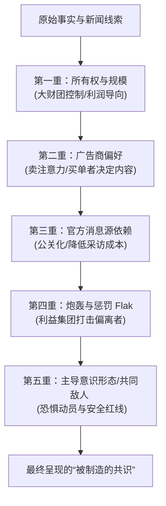

---
tags:
  - 世界经济政治
  - 媒介批评
  - 宣传模型
  - 制造共识
  - 政治经济学
关联:
  - "[[世界经济政治/奶头乐与娱乐至死：推送式媒介的工程实现与国家规训的政治经济学.md]]"
  - "[[世界经济政治/资本主义与自我定义权的垄断：从收割劳动到收割自我.md]]"
  - "[[世界经济政治/监控资本主义：行为剩余、工具主义权力与从预测到操纵.md]]"
  - "[[世界经济政治/AI与认知茧房悖论：拉动式工具、阿谀回音室与智能体OS.md]]"
---

# 制造共识：大众传媒的政治经济学与宣传模型

> - **核心定义**：**制造共识（Manufacturing Consent）**由诺姆·乔姆斯基（Noam Chomsky）与爱德华·赫尔曼（Edward S. Herman）于 1988 年在《制造共识：大众传媒的政治经济学》中提出。该理论指出，在大众民主社会中，精英阶层并非主要通过暴力的肉体消灭或赤裸的强权审查来控制社会，而是通过**操纵大众媒介的政治经济学结构，系统性地筛选出符合精英和建制派利益的新闻议程**，从而在公众中“制造”出统治阶层所需要的共识。

---

## 一、核心机制：宣传模型（Propaganda Model）的五重过滤器

任何新闻或公共讨论，在最终抵达公众之前，都必须通过以下五重过滤器的层层筛选。无法通过的内容会在这一过程中被自动边缘化、过滤或歪曲，最终留下的则是符合精英利益的“共识”。



### 1. 第一重：媒体的所有权、规模和利润导向
* **机制**：主流媒体并非中立的社会公器，而是规模庞大、需要获取利润的跨国财团。
* **逻辑**：媒体的控制权掌握在少数顶级富豪或大企业手中。这些企业的首要目标是满足股东利益和维持股价，因而天然倾向于维护私有产权和现有的全球资本主义秩序，排斥任何带有颠覆性、激进阶级斗争或根本性质疑体系的声音。

### 2. 第二重：广告许可证与资金依赖
* **机制**：媒体的盈利本质并非“读者为内容买单”，而是“媒体将读者注意力售卖给广告商（大企业）”。
* **逻辑**：广告商是媒体事实上的赞助人和判定死活的上帝。任何对大型跨国公司（如制药、能源、军工巨头）不利的深度报道，或对消费主义本质的批判，都会面临被撤销广告资金的惩罚。媒体为了生存，会主动进行自我审查，提供“对广告商友好（Advertiser-friendly）”的温和环境。

### 3. 第三重：对官方和建制消息源的依附
* **机制**：日常新闻采集成本极高。为了维持高产、准时和低成本，媒体极度依赖官方机构（白宫、五角大楼、警方、大企业公关部）提供的免费信息。
* **逻辑**：官方消息源被媒体理所当然地赋予了“客观、权威、真实”的属性。这种供求关系使得政府和大企业能够轻易主导议程，操纵新闻发布的时机与框架；而独立调查人或底层异见者的声音，因没有官方背书，常被扣上“未经证实的偏见”而直接抹杀。

### 4. 第四重：炮轰（Flak）与惩戒机制
* **机制**：“Flak”指对媒体报道的负面反应。这包括右翼游说集团的公开谴责、保守派智库的研究报告抹黑、威胁起诉、联合抵制等。
* **逻辑**：当有媒体试图突破红线时，强大的利益集团会联合发动“Flak”，以此警告和惩罚偏离轨道的媒体。这种高昂的防御成本使得媒体宁可选择平庸和安全，主动退守在体制允许的话语边界内。

### 5. 第五重：共同的敌人与主导意识形态
* **机制**：乔姆斯基时代这重过滤器表现为“反共主义”；冷战后演化为“反恐战争”、“国家安全”或特定的地缘政治外部威胁。
* **逻辑**：主导意识形态是一个社会中最无可反驳的“政治正确”。通过制造对共同敌人的恐惧（例如外部势力干涉、恐怖主义），可以迅速实现公众的恐惧动员。任何对国内政策的根本性质疑，都可以轻易被扣上“通敌”、“破坏国家安全”或“不爱国”的帽子，直接在道德上被判处死刑。

---

## 二、方法论辨析：结构性趋同 vs 精英阴谋论

“制造共识理论”在方法论上最强大的地方，在于它**不是一种阴谋论**：
* **没有幕后黑手**：它并不假设存在一个隐秘的精英俱乐部在每天开会决定新闻头条。
* **结构性的达尔文选择**：这是一种系统性的政治经济学机制。在这个系统里，只有顺应五重过滤器的从业者和媒体机构才能生存、获利并晋升；那些试图逆流而上的记者和出版物，则在日常的市场和政治竞争中被自然筛选、边缘化或淘汰。
* **内化的自我审查**：绝大多数主流媒体人都是真诚地相信自己拥有“职业操守”，但他们的职业认知和话语红线早已被上述结构化过滤器内化。正如乔姆斯基在接受采访时对一名记者所说：“我确信你相信自己所说的一切。但如果你没有内化这些话语红线，你根本坐不到你现在这个位子上。”

---

## 三、双重控制网：制造共识与奶头乐的二元钳夹

结合 [[世界经济政治/奶头乐与娱乐至死：推送式媒介的工程实现与国家规训的政治经济学.md]] 的图景，我们可以建立一个更完整的大众控制模型：

```
                              ┌──► 消极麻痹 (奶头乐/娱乐至死) ──► 针对不具威胁的底层 ──► 用感官娱乐占据注意力 (不愿思考)
                              │
大众媒介与注意力分配机制 ─────┤
                              │
                              └──► 积极规训 (制造共识/宣传模型) ──► 针对寻求参与的公众 ──► 用五重过滤器污染严肃信息 (无法思考)
```

1. **奶头乐与娱乐至死（麻痹闲暇）**：
   通过源源不断的非严肃内容（短视频、八卦、游戏、带货），让 80% 的人在变比率强化的算法操纵中获得廉价的多巴胺满足，使其**放弃对政治权力和社会不公的关切**。
2. **制造共识（规训严肃）**：
   如果剩下的人没有被“奶头乐”完全麻醉，依然试图通过新闻和媒体参与严肃政治，那么**他们能够接触到的严肃信息流也早已被过滤**。他们只能在建制派限定的议题范围内（例如：只争论堕胎权，而不争论分配体制）争吵，无法触及社会根本逻辑。

---

## 四、数字推送与算法时代的理论演化

在去中心化、算法分发和社交媒体的今天，乔姆斯基的经典模型正在被**平台化与工程化**：

1. **所有权的集中化演变**：媒体所有权从传统的报业和电视集团，集中到了少数掌控“分发算法和用户行为剩余”的科技巨头手里（Meta、Alphabet、字节跳动、腾讯）。
2. **广告的精准监控化**：传统广告演化为基于微观画像的“精准定位广告”。媒体对广告商的谄媚，退化为平台对“用户行为预测模型”变现的最大化（参见 [[世界经济政治/监控资本主义：行为剩余、工具主义权力与从预测到操纵.md]]）。
3. **消息源的AI化与降本**：信息茧房和算法分发导致了廉价公关、水军洗稿和 AI 生成内容的泛滥，官方或特定资本可以通过算法推送直接影响信息流。
4. **数字“Flak”（炮轰）的民粹化与算法放大**：现在的惩罚机制不再仅仅是官方智库的谴责，而是演化成了算法放大的集体网暴、大V带节奏、举报机制的武器化，以及平台的物理限流、黄标或封号。
5. **极化茧房作为意识形态武器**：算法不再需要单一的”反共”话语，而是通过刻意制造”我们 VS 他们”的对立、极化回音室，利用**党同伐异的愤怒情绪**来赚取流量，使公众在永无休止的内部撕裂中无法形成有效的批判性合力（参见 [[世界经济政治/AI与认知茧房悖论：拉动式工具、阿谀回音室与智能体OS.md]]）。

---

## 五、当代新闻呈现形式的过滤器矩阵：按格式而非机构分类

乔姆斯基 1988 年的模型是按**媒体机构**（哪家电视台、哪份报纸）来分析过滤器如何运作的；但在今天，同一条新闻可能同时以九种不同的**呈现形式**抵达你，而不同形式受五重过滤器影响的程度完全不同——**这意味着”这条新闻可不可信”这个问题，越来越取决于你是从哪种格式接触到它的，而不只是哪家机构发布的**。以下按呈现形式重新分类。

### 1. 新的、第六重过滤器：格式压缩（Format Compression）

在按格式分类之前，必须先引入一重乔姆斯基原始模型没有涵盖、但对今天极其关键的过滤器——它不是经济/所有权层面的过滤器，而是**媒介形式本身自带的认知过滤器**，与尼尔·波兹曼”媒介即信息”的洞察同源：

> 📌 **格式压缩过滤器（Format Compression Filter）**：指一种新闻呈现格式因其固有的时长/篇幅限制，结构性地排除了某些类型的真相——不是因为所有者或广告商不想让你知道，而是因为**这类真相根本无法被压缩进这个格式的物理限制里**。统计学意义上的不确定性、需要背景知识才能理解的因果链条、”重要但不冲突”的结构性议题，全部在压缩过程中被自动过滤掉，剩下的只能是**冲突、极端、情绪化、可以用一句话概括的内容**——这与所有权、广告商、官方消息源、Flak、意识形态这五重过滤器完全正交，是第六重独立的过滤器。

这重过滤器解释了为什么”这条新闻是真的”和”这条新闻没有说谎”，并不等于”你因此获得了对事件的准确理解”——**格式压缩造成的失真，可以在完全没有恶意、没有资本操纵、没有官方施压的情况下独立发生**。

### 2. 九种呈现形式的过滤器矩阵

| 呈现形式 | 可信度/利益集团掌控程度 | 广告商依赖程度 | 官方/建制依附程度 | 意识形态/政治正确相关性 | 格式压缩程度 |
|---|---|---|---|---|---|
| **短视频新闻**(抖音/快手/TikTok资讯) | 低——高度依赖平台算法筛选，源头常为二手剪辑，掌控权在平台推荐系统而非编辑部 | 极高——完全依赖流量变现，内容优先服务完播率而非准确性 | 中——境内平台受强监管，境外平台受品牌安全审查（不涉政治敏感） | 中低——较少直接说教，但通过选择性放大特定情绪素材间接引导 | **极高**——15~60秒的硬性时长上限，是六重过滤器里最强的一重 |
| **算法推荐图文资讯**(今日头条/腾讯新闻/百度信息流) | 中——机构来源尚存但排序权归算法，标题党化严重 | 高——信息流广告与内容混排，存在原生广告不透明问题 | 中高——需要过审的内容源被优先推荐 | 中——个性化推荐制造隐性回音室 | 中——比短视频宽松，但仍受”完读率”KPI压缩 |
| **传统电视新闻**(CCTV/CNN/Fox/BBC) | 中——机构信誉尚存，但所有权高度集中（迪士尼、康卡斯特、国家广电体系） | 高（商业台）/低（公共广播） | 高——依赖官方发布会、五角大楼/白宫记者团，BBC/CGTN更直接受国家资助 | 高——电视新闻的选题与措辞对国内政治正确高度敏感 | 中——比短视频宽松，但受限于固定时长的新闻时段 |
| **传统纸媒/深度调查报道**(NYT/WSJ/财新) | 高（相对）——仍是六种形式里事实核查最严谨的一类，但仍受所有权与广告商约束 | 中高——订阅制部分缓解广告依赖，但仍受股东与广告商双重压力 | 中——保留独立调查能力，但重大选题仍需官方回应背书以求”平衡” | 中——受众定位本身带有隐性意识形态筛选（读者群决定编辑方向） | **低**——是六种形式里格式压缩最弱的一类，能承载复杂因果链条 |
| **播客/长视频访谈** | 因人而异，波动区间最大——从独立调查记者到纯娱乐化八卦皆有 | 低到中——依赖会员订阅/单一广告商冠名，受制于单一大金主的比例反而高于传统媒体 | 低——独立性最强的一类形式，较少依赖官方通稿 | 低——较少统一意识形态约束，但主持人个人偏见影响大 | 低——时长充裕，可承载复杂论证 |
| **社交媒体自媒体/大V**(微博大V/Twitter意见领袖/公众号) | 低——事实核查环节基本缺失，人格化信任替代机构信任 | 中——软文/恰饭内容混杂，披露程度参差不齐 | 低到中——部分账号本身即官方”编制外喉舌” | **极高**——生存高度依赖精准站队特定意识形态阵营以维系粉丝忠诚 | 中——比短视频宽松，但受”爆款”逻辑压缩 |
| **官方/党媒**(新华社/人民日报/CGTN/Voice of America) | 低（作为独立信源）——本身即被审查的一方，需要交叉验证 | 低——不依赖商业广告，依赖财政拨款 | **极高**——本身即官方消息源 | **极高**——意识形态相关性是其存在的首要目的，而非副产品 | 低到中——形式严肃，但内容选择性极高 |
| **独立/非营利新闻机构**(ProPublica/ICIJ) | 高——脱离广告商与股东压力，专注调查报道 | **极低**——依赖基金会/公众捐款，是六种形式里广告依赖最低的一类 | 低——建制批判能力最强的形式之一 | 低——议题选择仍受资助方偏好影响，但约束远小于商业媒体 | 低——通常追求深度而非速食 |
| **弹幕/评论区二次传播** | 极低——群体极化与从众效应主导，”六边形战士”式反驳被淹没在情绪多数 | 无直接依赖，但受平台内容政策间接塑造 | 低——但受举报机制与关键词审查间接约束 | **极高**——评论区常是意识形态站队最激烈、最不加掩饰的场域 | 极高——单条弹幕/评论字数被硬性截断 |

### 3. 一个反直觉的排序：格式压缩有时比资本操纵更难对抗

这张矩阵揭示了一个容易被忽视的判断：**独立/非营利新闻机构在”利益集团掌控”这一维度上表现最好，但这不代表它能触达最多受众——恰恰是掌控程度最高的短视频形式，触达效率最高**。这意味着当代信息生态出现了一种结构性错配：**越接近真相的形式，传播效率越低；越远离真相的形式，传播效率越高**——这不是阴谋论式的”精英故意压制真相”，而是[[世界经济政治/奶头乐与娱乐至死：推送式媒介的工程实现与国家规训的政治经济学.md|第二节已论证的结构性趋同]]在信息真实性维度上的又一次重演：格式压缩带来的病毒式传播效率，与资本的流量变现诉求完美咬合，而深度调查报道的核查成本与格式复杂度，恰好与资本的效率诉求相悖。

> **收束判断**：评估一条新闻的可信度，今天需要同时问两个问题——“它通过了哪些经济性过滤器（所有权/广告商/官方来源/Flak/意识形态）”，以及”它所使用的格式，物理上能否承载这类信息应有的复杂度”。**一条完全没有被资本或官方操纵的新闻，依然可能因为被压缩进 15 秒短视频而彻底失真**——这是第六重过滤器区别于前五重的关键：它不需要任何人心怀恶意，失真便会自动发生。
