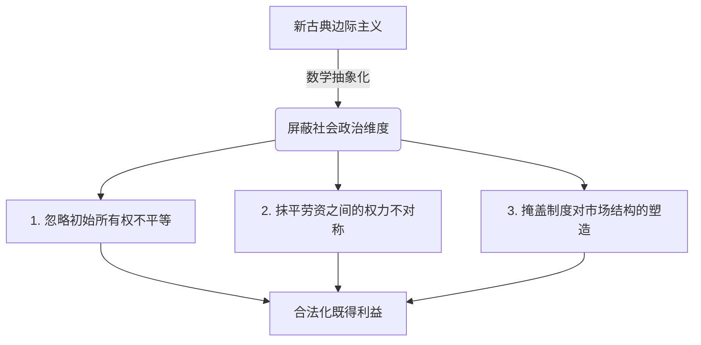

---
tags:
  - 世界经济政治
  - 经济思想史
  - 边际革命
  - 要素分配论
  - 去政治化
  - 意识形态
关联:
  - "[[世界经济政治/r_g的解药：从认识到组织化的分配政治.md]]"
  - "[[世界经济政治/两套合法性话语：为人民服务与美国梦的同构与虚伪.md]]"
  - "[[世界经济政治/资本主义与自我定义权的垄断：从收割劳动到收割自我.md]]"
  - "[[世界经济政治/价值理论三方战争：边际主义、转形问题与斯拉法.md]]"
---

# 新古典边际主义：分配正义的去政治化与数理合法性建构

> - **核心命题**：新古典边际主义（Neoclassical Marginalism）不仅是一次经济学方法论的数学革命（边际革命），更是一次极其成功的**分配政治去政治化运动**。它通过将“要素边际生产力”确立为分配的标准，把古典政治经济学中关于阶级、权力和剥削的社会斗争，成功转译为纯粹的数学优化与技术均衡，从而为资本主义的分配结构提供了近乎完美的科学合法性假面。
> - **逻辑线索**：古典劳动价值论的政治危险 → 边际革命的范式转换（主观效用与边际分析） → 要素边际生产力分配论（克拉克与欧拉定理） → 去政治化机制（“按贡献分配”的道德神话） → 理论危机（剑桥资本争论与历史证伪） → 结语

---

## 一、 范式转向：从阶级冲突到数理均衡

在 1870 年代“边际革命”（由杰文斯、门格尔、瓦拉斯推动）之前，经济学被称为**政治经济学（Political Economy）**。古典学派（斯密、李嘉图、马克思）的共同基石是**劳动价值论**。

### 1. 古典价值论的“政治危险”
古典价值论将价值归因于劳动，这不可避免地导向了一个充满政治冲突的分配图景：
*   **分配是零和博弈**：在总产出既定的情况下，利润（资本所有者的所得）和工资（劳动者的所得）是此消彼长的冲突关系。
*   **剥削的逻辑终点**：马克思将这一逻辑推向极致，指出如果劳动是价值的唯一源泉，那么资本利润就是对劳动所创造的“剩余价值”的无偿占有（剥削）。
*   **危险的结论**：分配正义的实现，只能通过阶级斗争和推翻资本所有制来完成。

### 2. 边际主义的“科学救赎”
边际主义通过彻底改写价值的定义，瓦解了上述政治危险：
*   **主观效用取代客观劳动**：价值不再由生产中投入的“客观劳动时间”决定，而是由消费者对该商品最后一单位的“主观效用评价”（边际效用，Marginal Utility）决定。
*   **从“生产端”移向“消费端”**：价值的源泉从车间里的劳动者，变成了市场中进行主观选择的消费者。剥削的本体论基础在一夜之间被抽空——既然价值是主观的，就不存在谁剥削了谁。

---

## 二、 要素边际生产力论：分配的“科学化”与去政治化

将边际分析应用到分配领域，诞生了新古典经济学的核心分配理论：**要素边际生产力分配论（Marginal Productivity Theory of Distribution）**，其主要奠基人为约翰·贝茨·克拉克（John Bates Clark）。

### 1. 要素边际分配的公式与变量释义
该理论认为，在完全竞争市场中，每一种生产要素（劳动 $L$、资本 $K$）在市场中获得的报酬，都等于该要素对生产所做出的**边际贡献**：
*   **工资（Wage）**：$W = P \times MPL$ （即劳动的边际产品价值）
*   **利息/利润（Interest/Rent）**：$R = P \times MPK$ （即资本的边际产品价值）

> 📊 **公式变量释义**：
> *   $W$（Wage）：工资，即劳动要素的单价/报酬。
> *   $R$（Rent / Interest）：利息或租金，即资本要素的单价/报酬。
> *   $P$（Price）：最终产品的市场价格。
> *   $L$（Labor）：劳动的投入量。
> *   $K$（Capital）：资本的投入量。
> *   $MPL$（Marginal Product of Labor）：**劳动的边际产品**（即：在资本 $K$ 不变的情况下，每增加一单位劳动 $L$ 所带来的额外总产出增加量 $\frac{\partial Y}{\partial L}$）。
> *   $MPK$（Marginal Product of Capital）：**资本的边际产品**（即：在劳动 $L$ 不变的情况下，每增加一单位资本 $K$ 所带来的额外总产出增加量 $\frac{\partial Y}{\partial K}$）。
> *   $P \times MPL$（Value of Marginal Product of Labor, VMPL）：**劳动的边际产品价值**，即把新增的边际产出 $MPL$ 乘以产品价格 $P$. 新古典认为，在完全竞争下，工人的工资应当且刚好等于这个价值。

### 2. 生产函数的几何图像（以科布-道格拉斯函数为例）
新古典分配理论所基于的生产函数 $Y = f(K, L)$，在几何上是一个三维空间中向右上方倾斜、且向内凹陷（凹函数，Concave Function）的曲面：
*   **三维凹曲面**：以劳动 $L$ 和资本 $K$ 为水平轴，产出 $Y$ 为垂直轴。由于**边际报酬递减规律**（$\frac{\partial^2 Y}{\partial L^2} < 0$, $\frac{\partial^2 Y}{\partial K^2} < 0$），当某一个要素单独增加时，产出增加的速度会越来越慢，这导致了曲面呈现出逐渐平缓的“穹顶”状。
*   **等产量线（Isoquants）**：如果将三维曲面水平切片并投影到 $L-K$ 基面上，就得到了向右下方倾斜、凸向原点的等产量线。它表示在技术水平不变时，生产同一产量所需的不同要素组合。

> 📌 **欧拉定理与产品分配净尽（Euler's Theorem / Exhaustion of Product）**：
> 新古典学派利用数学上的欧拉定理证明，在规模报酬不变（Constant Returns to Scale）的一阶齐次生产函数 $Y = f(K, L)$ 下，如果按照每个要素的边际生产力进行分配，总产出刚好被分配完毕，既无剩余也无亏空：
> $$Y = L \cdot \frac{\partial Y}{\partial L} + K \cdot \frac{\partial Y}{\partial K}$$
> 这在数理上宣告：**不存在任何“剩余价值”（Surplus Value）可供剥削**。每个要素所有者拿走的，恰好是其要素本身所“生产”出来的份额。
>
> 🔍 **几何直观：如何在图上体现“分配净尽”？**
> 
> 欧拉定理的“分配净尽”在几何上有两种非常精妙的体现方式：
> 
> *   **3D 空间：切平面必过原点**
>     在三维产出曲面 $Y = f(K, L)$ 上，我们在任意一点 $(L_0, K_0, Y_0)$ 处做一个**切平面**。这个切平面的倾斜程度由该点的边际生产力决定：在 $L$ 方向的斜率是 $MPL$（$\frac{\partial Y}{\partial L}$），在 $K$ 方向的斜率是 $MPK$（$\frac{\partial Y}{\partial K}$）。
>     **核心结论**：如果生产函数是规模报酬不变的，那么**在曲面上任意一点做出的切平面，都必然穿过三维坐标系的原点 $(0, 0, 0)$**。
>     这在几何上意味着：总产出 $Y_0$ 刚好可以被分解为沿两个切面方向投影的累加值（即 $L_0 \times MPL + K_0 \times MPK$），没有任何多余的“穹顶凸出”或亏空，切面与原点的零截距保证了分配的净尽。
> 
> *   **2D 均量空间：切线截距分割法 (Tangent Intercept Method)**
>     经济学常将生产函数化为“人均形式”（Intensive Form）：令 $y = \frac{Y}{L}$（人均产出），$k = \frac{K}{L}$（人均资本/资本劳动比），函数简化为二维曲线 $y = f(k)$。
>     在 $y = f(k)$ 的曲线图上，我们在任意资本劳动比 $k_0$ 处画一条**切线**：
>     1.  **切线在 Y 轴的截距高度**：刚好等于劳动的边际生产力 **$MPL$**。
>     2.  **切线从 Y 轴升到切点 $k_0$ 的高度增量**：等于资本劳动比乘以资本边际生产力，即 **$k_0 \times MPK$**。
>     3.  **高度拼合**：由于切点的高度就是总人均产出 $y_0$，图形直观地显示出：
>         $$y_0（总人均产出）= MPL（下半截截距）+ k_0 \times MPK（上半截增量）$$
>         这在二维图上表现为**切线截距与切点斜率增量的完美拼接**。产出被劳动所得和资本所得完全瓜分，无任何“剥削剩余”。

### 3. 政治效果：彻底的去政治化
这一数理证明带来了巨大的意识形态红利：
1.  **分配合法性的确立**：克拉克在《财富的分配》中直言不讳地指出，该理论的目的是证明“社会各阶层得到的财富，就是他们自己创造的财富”。财富的分配不仅是有效率的，而且是**道德上公正的**。
2.  **分配问题的“科学化”**：分配不再是一个关于权力博弈、历史制度或阶级压迫的“政治”问题，而变成了一个纯粹的**技术优化问题**（解偏微分方程）。工资低不是因为资本家心狠手黑或工会软弱，而是因为你的边际劳动生产率（$MPL$）不够高；资本收益高也不是因为垄断或特权，而是因为资本的边际贡献（$MPK$）巨大。

### 4. 帕累托最优与效率对正义的吞噬
在新古典分析中，分配的“科学化”在福利经济学中找到了其最终防线——**帕累托最优（Pareto Optimality / Efficiency）**：
*   **数理逻辑**：帕累托最优是指一种资源配置状态，在此状态下，系统已经不可能在不使任何其他人的福利变差的前提下，使至少一个人的福利变好。
*   **对再分配政策的“道德锁死”**：根据帕累托标准，任何旨在缩小贫富差距的政策（如向富人征收财富税并转移支付给穷人），由于让富人的资产减少（使其福利变差），在定义上都**不是**“帕累托改进”。因此，新古典经济学常以“损失效率”为由，否定一切自上而下的再分配努力。
*   **不公的合理化**：帕累托最优完全对**初始财富分配的公平性**保持沉默。即使 99% 的资源集中在极少数人手里，只要不剥夺这极少数人就无法改善其余人的处境，这一极度不平等的社会状态在定义上也是“帕累托最优”的。由此，新古典用**效率的合理性**吞噬了**对公平与正义的追问**。

---

## 三、 边际主义是如何掩盖权力关系的？

新古典边际主义之所以能成为现代新自由主义的底层意识形态，在于它通过高度抽象的数学模型，系统性地屏蔽了以下政治维度：

1.  **将初始所有权的“不公正”合法化**：
    边际分配论只问“要素的边际贡献”，却故意不问“要素是谁拥有的”。一个继承了百亿遗产的食利者，其资本确实在生产中做出了“贡献”（$MPK > 0$），但这并不能证明他个人占有这笔巨额回报在道德上是合理的。边际主义用**要素的生产性**悄悄替换了**要素所有者的寄生性**。
2.  **抹平了劳资双方的“权力不对称”**：
    在模型中，资本所有者和劳动者是完全平等的“要素供给者”，都在一条无摩擦的要素供求曲线上交易。但现实中，劳动具有生理极限和不可储存性（工人不工作就会饿死，而资本家可以靠存量财富支撑），这导致了谈判地位的本质不对称。边际主义用“自愿交易”的假象掩盖了“被迫接受”。
3.  **忽略了市场的“非技术性塑造”**：
    新古典理论假设边际生产力是由“技术和偏好”决定的外生变量。但实际上，劳动的边际生产力深受工会力量、最低工资法、教育机会平等性的影响；而资本的边际回报率则受到专利保护期、行业垄断程度、国家税收庇护等**制度性权力**的塑造。

### 特殊案例研究：中国市场“非技术性塑造”的体制性特征

在中国经济的语境中，市场的“非技术性塑造”表现得尤为明显，要素价格与边际生产力的背离并非由单纯的技术效率决定，而是深受以下体制和政策结构的塑造：

#### A. 劳动端：体制性议价弱势与二元劳动力市场
*   **户籍制度与公共服务剪刀差**：户籍制度将劳动力分割为城市居民与外来务工人员（农民工）。农民工在子女教育、医疗、养老等公共服务上无法享受等同待遇，这种“公共福利的扣除”实质上压低了劳动的实际回报，削弱了劳动者的谈判地位，形成了二元劳动力市场的价格扭曲。
*   **集体谈判权的结构性缺位**：中国工会体制的非对抗性特征，使得劳动者在面对资本时缺乏强力的集体谈判机制，工资增长往往依赖于政府的行政干预（如上调最低工资标准）或劳动力供求的自然相变（如“民工荒”），而非劳方自下而上的议价权力。
*   **地方政府的招商引资“逐底竞争”**：长期以来的地方 GDP 锦标赛，促使地方政府在招商引资中倾向于“亲资本”立场。在社保征收力度、劳动法合规监管等方面存在选择性执法，实质上以压低劳动力间接成本的方式向资本进行体制性输送。

#### B. 资本端：行政性租金与信贷配给扭曲
*   **行政性垄断与准入限制**：能源、电信、金融等上游行业的国有企业享有天然的准入壁垒。其高额的资本回报（$r$）并不源于企业技术上的高边际生产力（$MPK$），而是源于**行政垄断性租金**。
*   **金融抑制与信贷偏向**：国有银行体系天然偏向于国有企业和地方政府平台，民营中小企业则面临结构性信贷歧视。资本要素的价格（利息）不是由边际效率决定，而是由政治信用和所有制身份决定。历史上的低存款利率政策，实质上是居民储蓄向国有资本建设的“反向补贴”。
*   **土地财政与空间资本化**：地方政府作为土地一级的唯一垄断供应者，通过“土地财政”推动了房地产的长期繁荣。这催生了极高的地产资本增殖，而这种增殖完全是政府土地规划和空间资本化等**体制性垄断**的结果，与实体生产的技术性 $MPK$ 无关。

---

## 四、 理论缝隙与反思

即使在纯理论层面，边际主义的科学假面也曾被多次揭穿，最著名的当属 20 世纪 60 年代的**两剑桥之争（Cambridge Capital Controversy）**（英国剑桥大学的琼·罗宾逊、斯拉法 vs 美国麻省理工学院的萨缪尔森、索洛）。

### 1. 剑桥资本争论的致命一击
英国剑桥的琼·罗宾逊指出，新古典要素分配论在逻辑上存在**循环论证（Tautology）**：
*   为了计算资本的边际生产力（$MPK$），必须先知道“资本总量”（$K$）。
*   但“资本”不是可以简单累加的物理量（不能把大卡车、电脑和铲子直接相加），必须通过其货币价值来加总。
*   而评估这些资本品的货币价值，必须先知道**折现率（Discount Rate，即资本回报率/利息率 $r$）**：
    > ❓ **什么是折现率？为什么评估资本价值必须知道它？**
    > 1.  **折现率的本质**：折现率是衡量“货币时间价值”的尺度，用于将未来的预期收益折算成当下的价值。因为“明天的 100 元价值不等于今天的 100 元”，如果年折现率为 $r$，那么一年后的 100 元在今天的现值就是 $\frac{100}{1+r}$。
    > 2.  **资本价值的决定**：在经济学中，任何资本资产（如一台数控机床、一座厂房）的当前货币价值，并非取决于它的物理质量或过去的生产成本，而是取决于它**未来寿命期内预计能创造的净收益（利润流）的现值总和**。
    > 3.  **计算公式**：设某资本资产每年能产生净利润 $\Pi$，预计使用 $n$ 年，其当前的估值 $V$ 为：
    >     $$V = \sum_{t=1}^{n} \frac{\Pi_t}{(1+r)^t} = \frac{\Pi_1}{1+r} + \frac{\Pi_2}{(1+r)^2} + \dots + \frac{\Pi_n}{(1+r)^n}$$
    >     由此可见，资本品的资产总价值 $V$ 严重依赖于折现率（利息率）$r$。折现率越低，资产估值越高；折现率越高，资产估值越低。因此，在不知道利息率 $r$ 的情况下，根本无法加总出全社会的资本总量 $K$。
*   然而，新古典理论的核心目的，恰恰是要用资本的边际生产力来解释利息率（$r = MPK$）！
*   **结论**：新古典学派是在用他们试图解释的因变量（利息率 $r$）来定义并计算他们的自变量（资本总量 $K$）。这证明了 $r$ 的大小根本不是由所谓技术性的要素边际生产力决定的，而是由**社会阶级斗争、制度分配和历史权力博弈**决定的。

### 2. 历史与现实的证伪：r > g 与分配政治的重回
正如 [[世界经济政治/r_g的解药：从认识到组织化的分配政治.md]] 中所指出的，皮凯蒂的历史数据彻底打破了新古典的幻觉：
*   如果财富分配纯粹由边际生产力决定，那么资本收益率 $r$ 应该随着资本积累（边际报酬递减）而持续下降。
*   但在历史长周期中，由于制度护栏的拆除、跨国资本流动和政治权力的倾斜，资本收益率 $r$ 长期稳定在 4-5%，显著高于经济增长率 $g$（1-2%）。
*   这一差距不是技术效率的产物，而是**财富存量自我增殖与政治权力自我固化**的结果。

---

## 五、 现代主流的“修正补丁”：如何解释对边际分配的偏离？

在现实中，市场并非无摩擦，分配也极少完美符合“边际贡献等于要素报酬”的理想状态。为了解释这些明显的偏离，同时又不放弃其核心的数学最优化分析范式，现代主流经济学（新凯恩斯主义与现代微观经济学）引入了一系列“修补”和解释机制：

### 1. 名义价格粘性与工资粘性 (Nominal Price and Wage Stickiness)
*   **数理机制**：在面对总需求波动时，商品的价格（Price Stickiness）和劳动力的工资（Wage Stickiness）并不能像新古典假设的那样瞬间、灵活地向下调整以出清市场。其背后的微观基础包括**菜单成本（Menu Costs）**、**交错合同（Staggered Contracts）**以及**效率工资（Efficiency Wages）**等。
*   **去政治化效果**：它将“失业”和“经济危机”解释为系统短期内的**名义摩擦（Friction）**或信息不对称，而不是资本主义不可克服的制度性危机或剥削。政策建议由此被锁死在“通过央行微调利率来平抑波动”的技术官僚范式内，消解了自下而上的社会再分配改革动力。

### 2. 超级巨星效应 (Superstar Effect)
*   **数理机制**：由谢尔温·罗森（Sherwin Rosen）提出。在现代技术（如数字化、互联网）加持下，生产与分发的边际复制成本趋近于零。即使不同生产者之间的技能/天赋只存在微小差异，消费者也更倾向于消费“最好”的产品，从而通过规模经济使极少数人拿走全行业绝大多数的收益。
    > 💡 **名词解释：边际复制成本 (Marginal Reproduction Cost)**
    > 指每多复制、分发或传播一单位已有的产品或服务所需要追加的成本。
    > *   **传统商品**：边际复制成本高。如多生产一辆汽车需要成比例追加钢材、劳动力和厂房。
    > *   **数字化/信息商品**：边际复制成本近乎为零。如软件、音乐、算法开发完第一份（首版固定成本极高）后，让第 100 万个用户下载复制，其边际成本仅为几乎可以忽略的网页带宽或服务器电费，从而具有无限的供给弹性和极端的规模经济。
*   **去政治化效果**：它将顶层富豪、跨国高管与普通员工之间巨大的收入鸿沟（如 CEO 薪酬是普通工人的数百倍），合理解释为“在超大规模全球市场下，微小技能优势经由技术放大后的自然回报”。这掩盖了高管自我定薪的权力寻租、工会谈判权的丧失以及有利于资本的税收偏向。

### 3. 技能偏向型技术进步 (Skill-biased Technological Change, SBTC)
*   **数理机制**：指技术进步（如计算机化、自动化、人工智能）与高技能劳动呈互补关系（提升其边际产品 $MPL$ 和需求），而对低技能劳动力呈替代关系（降低其需求和实际工资）。
*   **去政治化效果**：将中产阶级萎缩、劳动力内部不平等加剧的政治后果，转译为一种“客观、中性、不可抗拒的技术演进”。这把结构性的要素分配问题，包装成了劳动者个体的“人力资本（Human Capital）积累不足”，从而将反抗社会分配不公的政治诉求，成功转化为“个人需要进行自我投资和职业技能再培训”的个体责任。

### 4. 溢价率（Markup）与消费者剩余的剥夺
*   **数理机制**：在不完全竞争（垄断、寡头或垄断竞争）市场中，企业拥有市场权力（Market Power），定价高于边际成本，即溢价率 $\text{Markup} = P / MC > 1$。企业通过这种定价方式，将原本属于消费者的**消费者剩余（Consumer Surplus）**强行转化为自身的**生产者剩余（Producer Surplus，即超额垄断利润）**。
    > 💡 **概念释义：消费者剩余与生产者剩余 (Consumer & Producer Surplus)**
    > 新古典福利经济学将交易双方获得的经济福利量化为两种“剩余”：
    > *   **消费者剩余 (Consumer Surplus)**：消费者愿意为商品支付的最高价格（支付意愿，WTP）减去其实际支付的货币价格。在供求图上，表现为需求曲线以下、价格线以上的面积。它代表了消费者获得的“心理超值满足感”。
    > *   **生产者剩余 (Producer Surplus)**：生产者实际卖出商品得到的价格，减去其最低愿意接受的价格（即边际成本 $MC$）。在供求图上，表现为价格线以下、供给曲线（边际成本曲线）以上的面积。它代表了企业获得的实际超额收益。
    > *   **剥夺与无谓损失 (Deadweight Loss)**：在完全竞争下，价格等于边际成本（$P = MC$），总剩余（两者之和）最大。而一旦出现垄断力量（$\text{Markup} > 1$），高定价会将原本属于消费者的一部分“消费者剩余”强行转移给企业（变成超额利润即生产者剩余），同时由于交易量萎缩，还会导致一部分剩余凭空消失，称为**无谓损失**。
*   **去政治化效果**：虽然这一机制承认了欧拉定理“分配净尽”的失效（企业拿走了超出技术性边际贡献的超额垄断利润），但主流经济学依然将此定位为技术性的“市场失灵（Market Failure）”和效率损失（Deadweight Loss）。它通过反垄断法（Antitrust Laws）和产业监管将其转译为纯粹的技术规制博弈，避而不谈垄断本身是资本积累和集中的必然社会历史规律。

---

## 六、 数据库索引

| # | 概念 | 类型 | 核心批判点 | 横向关联笔记 | 重要性 |
|---|---|---|---|---|---|
| 1 | 要素边际生产力论 | 理论范式 | 将分配去政治化，抹平剥削与权力结构 | [[世界经济政治/r_g的解药：从认识到组织化的分配政治.md]] | ⭐⭐⭐⭐⭐ |
| 2 | 产品分配净尽（欧拉定理） | 数学工具 | 论证不存在剩余价值，构筑科学合法性 | — | ⭐⭐⭐⭐ |
| 3 | 两剑桥之争（琼·罗宾逊） | 理论危机 | 揭示新古典资本计量的逻辑循环论证 | — | ⭐⭐⭐⭐⭐ |
| 4 | 去政治化神话 | 意识形态 | 将“要素所有者的寄生性”伪装成“要素的生产性” | [[世界经济政治/两套合法性话语：为人民服务与美国梦的同构与虚伪.md]] | ⭐⭐⭐⭐⭐ |
| 5 | 名义价格与工资粘性 | 主流修补 | 将经济危机和失业技术化为短期名义摩擦 | — | ⭐⭐⭐⭐ |
| 6 | 超级巨星效应 | 主流修补 | 将极端的贫富分化解释为规模经济下的合理技能溢价 | — | ⭐⭐⭐⭐ |
| 7 | 技能偏向型技术进步 | 主流修补 | 将结构性的不平等归因于技术演进，把分配不公转化为个人素质问题 | — | ⭐⭐⭐⭐ |
| 8 | 溢价率（Markup）与剥夺 | 主流修补 | 承认不完全竞争对消费者剩余的侵占，但通过“技术性监管”回避阶级博弈 | — | ⭐⭐⭐⭐ |
| 9 | 制度与产权分配效应 | 理论范式 | 批判要素分配的技术决定论，指出产权界定和交易成本决定了实际分配 | [[世界经济政治/制度经济学：市场的非自然性、交易成本与产权的社会塑造.md]] | ⭐⭐⭐⭐⭐ |
| 10 | 积累体制与调节模式 | 理论阶段 | 划分资本主义阶段，以数字积累体制与算法调节分析平台零工经济的转嫁机制 | [[世界经济政治/法国调节学派：积累体制、调节模式与平台零工经济的演进.md]] | ⭐⭐⭐⭐⭐ |
| 11 | 现代货币理论 (MMT) | 货币理论 | 驳斥家庭式财政预算约束，指出财政边界取决于实体资源和通胀 | [[世界经济政治/现代货币理论：主权货币的去家庭化、税收本质与实体资源约束.md]] | ⭐⭐⭐⭐⭐ |
| 12 | 生态经济学与去增长 | 生态经济 | 驳斥无限增长，开辟与分配轴正交的“生态承载力与熵约束”新维度 | [[世界经济政治/生态经济学与去增长：熵定律、生态承载力与增长拜物教的终结.md]] | ⭐⭐⭐⭐⭐ |
