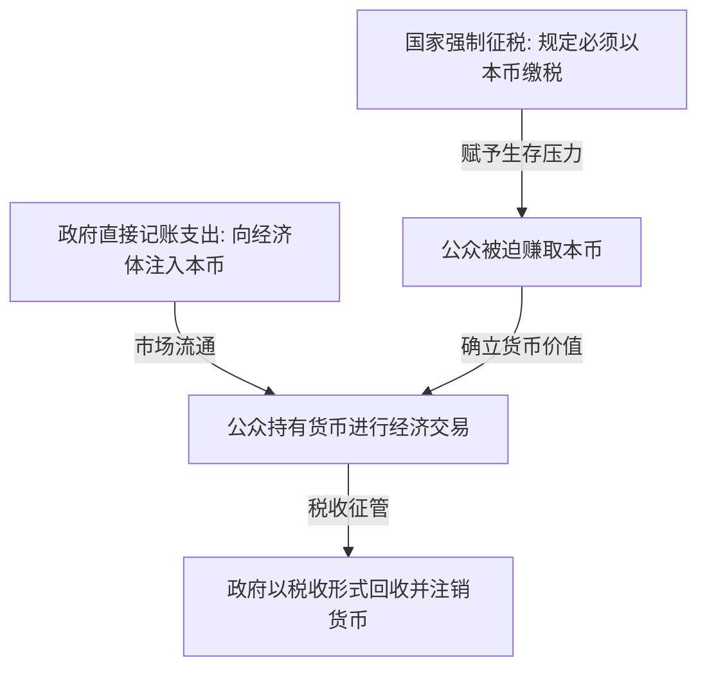

---
tags:
  - 世界经济政治
  - 经济思想史
  - 现代货币理论
  - MMT
  - 财政赤字
  - 税收本质
关联:
  - "[[世界经济政治/AI与互联网泡沫：暗光纤先例、地缘分流与生产力_生产关系.md]]"
  - "[[世界经济政治/r_g的解药：从认识到组织化的分配政治.md]]"
  - "[[世界经济政治/新古典边际主义：分配正义的去政治化与数理合法性建构.md]]"
---

# 现代货币理论：主权货币的去家庭化、税收本质与实体资源约束

> - **核心命题**：现代货币理论（Modern Monetary Theory, MMT）彻底颠覆了新古典经济学将国家财政类比为“家庭账本”的保守神话。它以凯尔顿（Stephanie Kelton）和雷（L. Randall Wray）为代表，指出对于拥有自主货币发行权的主权国家而言，并不存在“先收税、再支出”的预算硬约束。财政赤字的唯一真实限制是**通货膨胀（即实体资源的稀缺性）**，而非“名义资金短缺”。在 AI 时代，这一理论为“劳动所得税基被 AI 侵蚀是否会导致国家财政枯竭”这一经典忧虑，提供了一个完全不同的、以实体资源为核心的解放性视角。
> - **逻辑线索**：核心颠覆（去家庭化的国家财政） → MMT的运行逻辑（支出先于税收，税收驱动货币） → 真实约束是什么（通胀与实体资源） → 现代拷问：AI 侵蚀税基后的国家财政危机？ → 理论边界与国际货币层级批判 → 数据库索引

---

## 一、 核心颠覆：去家庭化的国家财政

主流经济学（新古典派）和政客们常常向公众灌输“国家财政就像家庭主妇的记账本”这一隐喻：政府必须量入为出，如果赤字过高，国家就会像借债度日的家庭一样陷入破产。

MMT 指出，这是对主权货币发行国的根本性误解，必须严格区分“货币使用者”与“货币发行者”：

1.  **家庭与企业是“货币使用者（User of Currency）”**：
    *   家庭必须先赚取货币（通过工资或利润），然后才能支出。如果支出持续大于收入，家庭必须通过借债维系，最终会面临破产。
2.  **主权政府是“货币发行者（Issuer of Currency）”**：
    *   拥有货币主权的国家（如美、日、中等）是本国法定货币的唯一源头。
    *   主权政府在逻辑上和技术上**不可能面临名义资金短缺**。政府花钱只需通过中央银行电脑键盘的敲击（记账），就可以创造无限的本国货币。
    *   因此，破产是一个仅适用于货币使用者的概念，对货币发行者而言，破产是一个伪命题。

---

## 二、 MMT的运行逻辑：支出先于税收，税收驱动货币

MMT 彻底颠覆了“先税后支”的传统因果链条，重构了财政与税收的运行逻辑：

1.  **支出先于税收（Spending before Taxing, S -> T）**：
    *   传统观念：`税收/国债 -> 财政库房 -> 拨款支出`。
    *   MMT 逻辑：`政府记账支出（注入货币） -> 市场交易与财富创造 -> 税收回收（销毁货币）`。
    *   因为公众手里原本没有法币，政府必须先把货币“花”进经济体，公众才有钱来交税。税收不是政府支出的“资金来源”，而是将多余流动性从经济体中**回收并销毁的回收阀**。
2.  **税收驱动货币（Taxes Drive Money）**：
    *   为什么公众会自愿接受一张没有金银支撑的纸币或银行数字？因为国家宣布了**强制缴税义务**，且**唯一接受本国法币缴税**。
    *   为了免于不交税而坐牢的惩罚，所有人必须出售商品或劳动来赚取政府发行的法币。是**税收的强制性**赋予了主权货币以法偿性与流通价值。

---

## 三、 真实的约束：通货膨胀与实体资源

既然主权国家能无限记账“印钞”，是否意味着政府可以无限制地提供免费福利与公共项目？MMT 给予了坚决的否定：**政府虽不受名义资金约束，但受实体资源约束（Real Resource Constraint）**。

1.  **实体资源的硬界线**：
    *   社会的真实财富不是货币符号，而是可用的**劳动力、原材料、土地、能源、工厂和技术水平**。
    *   如果经济体内存在大量闲置资源（如失业率高、工厂开工不足），政府印钞支出去雇佣失业者、建设大坝，会直接**动员这些闲置资源，增加总产出**，而不会引发通货膨胀。
2.  **通货膨胀作为唯一红线**：
    *   当经济体达到了**充分就业（Full Employment）**，所有钢材、能源和劳动力都已被占满。
    *   如果政府此时继续印钞增加支出，就是在用过多的货币去抢夺已经饱和的实体资源，这必然导致物价飙升，引发**通货膨胀**。
    *   **结论**：财政赤字的安全边界不是债务/GDP 的比例，而是**实体资源的承受力与通胀率**。

---

## 四、 现代拷问：AI 侵蚀个税税基后的财政枯竭危机？

在 [[世界经济政治/AI与互联网泡沫：暗光纤先例、地缘分流与生产力_生产关系.md]] 的逐条回应中，提出了一个核心担忧：*如果 AI 大规模替代人工，导致个人所得税（多数现代国家最大的税源）萎缩，国家是否会面临财政地基的垮塌与图尔钦式的财政枯竭？*

对于这一问题，MMT 提供了一个完全不同的、具有解放性意义的答案：

1.  **财政能力不取决于税基，而取决于生产力**：
    *   在 MMT 框架下，个税萎缩不会在技术上剥夺政府发放全民基本收入（UBI）或投资电网的“印钞能力”。政府支出的名义资金从不依赖于个税回收。
2.  **AI 极大地释放了“实体资源约束”**：
    *   传统印钞发福利会导致通胀，是因为人类劳动力和产能有物理瓶颈。
    *   但如果 AI 和全自动机器人大规模替代人工，意味着**社会的真实供给能力（粮食、电力、医疗、住房）被成倍放大，而不需要消耗同等的人类劳动力**。
    *   这意味着，实体资源约束的红线被极大地向外推移了。
3.  **重新定义财政健康的逻辑**：
    *   只要自动化的工厂和 AI 算力在实体上创造了充沛的物质财富，政府就可以直接通过记账（印钞）向国民发放 UBI，让国民去消费这些富余的物资。
    *   因为有充足的实体物资作为本币的“抵押物”，即使大量印钞也不会引发通胀。
    *   **核心结论**：决定 AI 时代财政生死存亡的，**不是政府在名义上收到了多少税，而是 AI 系统在实体上创造了多少真实的物质财富（$Y$）**。
4.  **AI 时代税收的重构定位**：
    *   如果不再需要个税来“养活政府”，税收的角色将退回到：
        *   **防止通胀**：向拥有超额 AI 算力和生产资料的寡头征税，回收其过剩的购买力，防止其囤积真实资源推高物价。
        *   **驱动货币流通**：确保普通人必须向社会提供部分稀缺资产（如土地、高端人工服务）来换取法币以缴税，维持货币的运转。

---

## 五、 理论边界与国际货币层级批判

MMT 虽然为技术性失业提供了乐观的财政解药，但在实践中面临着致命的国际和政治边界：

1.  **国际货币层级（Currency Hierarchy）的绞杀**：
    *   MMT 仅适用于能够完全以本币举债、且不依赖进口的关键主权国家。
    *   对于大多数外债累累、且高度依赖进口能源与粮食的弱势国家（处于货币层级末端），无节制印本币会导致本币大幅贬值，引发灾难性的**输入性通货膨胀**和国际收支危机。
2.  **增税的政治不可行性**：
    *   MMT 认为通胀抬头时政府应通过“增税”来销毁多余货币。但在代议制政治中，增税是一个政治阻力极大的动作。政府很难做到在通胀开始时，以技术官僚的理智迅速通过增税法案。

---

## 六、 数据库索引

| # | 概念 | 类型 | 核心批判点 | 横向关联笔记 | 重要性 |
|---|---|---|---|---|---|
| 1 | 货币发行者 vs 货币使用者 | 核心工具 | 揭示主权政府不存在先收税再支出的预算硬约束，打破家庭式赤字恐慌 | [[世界经济政治/新古典边际主义：分配正义的去政治化与数理合法性建构.md]] | ⭐⭐⭐⭐⭐ |
| 2 | 税收驱动货币 | 货币理论 | 税收不是支出的资金来源，而是赋予本币法偿性以及销毁多余流动性的回收阀 | [[世界经济政治/r_g的解药：从认识到组织化的分配政治.md]] | ⭐⭐⭐⭐⭐ |
| 3 | 实体资源约束与通胀红线 | 财政边界 | 主权国家支出的唯一限制是实体的劳动力、原材料和能源，而非名义资金 | — | ⭐⭐⭐⭐⭐ |
| 4 | AI 财政解放假说 | 现代拷问 | 只要 AI 丰富了物质财富，国家无需依赖个税即可印钞支持 UBI，财政健康由实体供给决定 | [[世界经济政治/AI与互联网泡沫：暗光纤先例、地缘分流与生产力_生产关系.md]] | ⭐⭐⭐⭐⭐ |
| 5 | 国际货币层级 | 局限性 | 弱势本币国家无法适用 MMT，面临输入性通胀和国际收支外汇约束 | — | ⭐⭐⭐⭐ |
