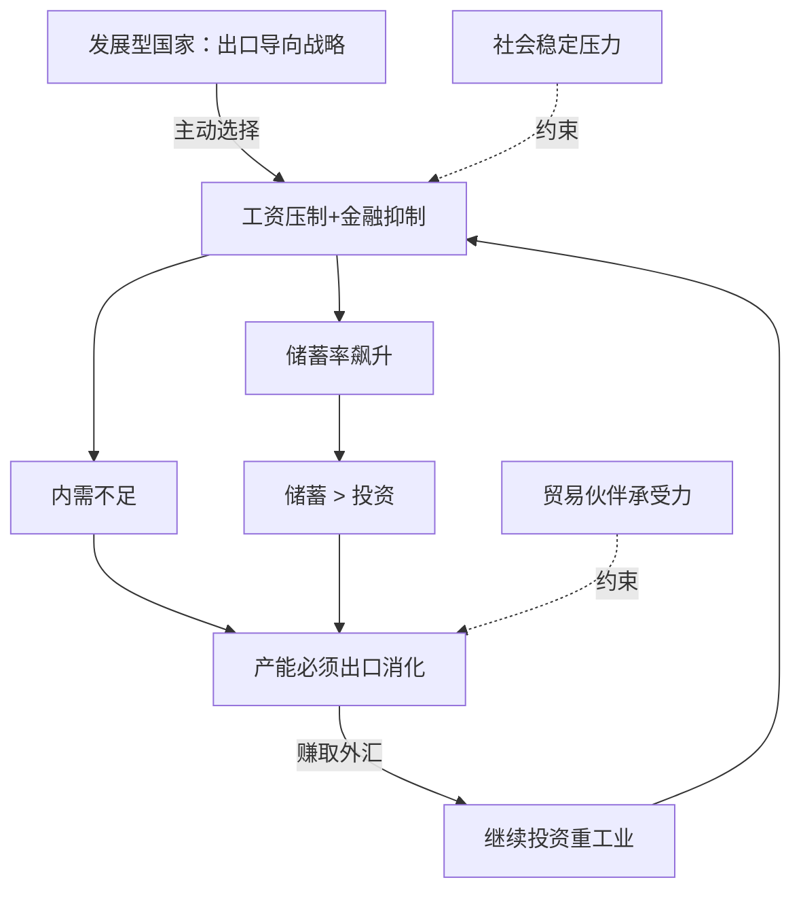

---
tags:
  - 世界经济政治
  - 经济思想史
  - 发展经济学
  - 政治经济学
  - 东亚模式
  - 储蓄率
  - 出口导向
  - 强制储蓄
关联:
  - "[[制度经济学：市场的非自然性、交易成本与产权的社会塑造]]"
  - "[[现代货币理论：主权货币的去家庭化、税收本质与实体资源约束]]"
  - "[[新古典边际主义：分配正义的去政治化与数理合法性建构]]"
  - "[[r_g的解药：从认识到组织化的分配政治]]"
  - "[[东亚经济政治：发展型国家、存量博弈与冷极化]]"
  - "[[分配阀门的再校准：考研退潮、考公升温与学硕转博的制度逻辑（2025-2026）]]"
---

# 储蓄-出口模式的政治经济学：权力、阶级与转型困境

> - **根节点**：主流经济学用"储蓄-投资缺口必须通过出口消化"（$S - I = X - M$）这一会计恒等式，制造了一种技术决定论的幻觉——好像高储蓄国家"必然"走向出口导向，这是经济规律的自动运行。本笔记彻底拆解这一意识形态操作：储蓄→出口不是唯一路径，而是**权力结构的选择**；强制储蓄不是"国民性"，而是**工资压制、金融抑制、社会保障缺失**的制度产物；出口竞争力不是"比较优势"，而是**汇率操纵、劳工权利剥夺、国家补贴**的政治建构。这套模式在东亚（日韩台中）取得过阶段性成功，但其内在矛盾——消费被压制到极限、产能过剩、社会不稳定、再生产危机——最终将所有国家推向转型困境。中国因其独特的规模、地缘、历史路径依赖，面临比其他东亚国家更严峻的锁定：民主化被四重机制阻断，劳动力-土地诅咒固化了寻租经济，土地财政耗尽后无替代方案。
> - **叙事逻辑**：理论部分：破除技术决定论（恒等式不决定因果） → 强制储蓄的三大政策工具 → 储蓄如何转化为出口竞争力 → 储蓄率的三道红线 → 东亚转型 vs 拉美陷阱 → 替代发展路径 || 中国专论：规模的非线性效应（中国 vs 越南） → 四重民主化锁定 → 劳动力-土地诅咒 → 土地财政的独特性 → 转型困境与无解
> - **立场说明**：本笔记是批判性政治经济学框架——拒绝新古典经济学的"价值中立"幻觉，明确指出储蓄-出口模式是**阶级利益与国家权力的共谋**，其"成功"建立在对劳动者时间主权、工资、社保的系统性剥夺之上。这不是道德谴责，而是结构分析：揭示谁获益、谁被牺牲、以及这套逻辑为何最终不可持续。
> - **来源标注**：笔记作者原创综合分析，援引制度经济学（科斯、诺斯）、政治经济学（马克思、斯拉法）、发展经济学（阿西莫格鲁、罗德里克）、东亚研究（Chalmers Johnson、Wade）以及 2000-2026 年中国、韩国、越南的宏观经济数据。

---

## 知识树

```txt
根节点：储蓄→出口不是技术必然，而是权力选择
│
├── 【理论部分：储蓄-出口模式的政治经济学】
│   │
│   ├── 一、破除技术决定论：恒等式 S-I=X-M 不决定因果方向
│   │   ├── 1.1 三种因果叙事（技术决定 vs 出口驱动 vs 消费压制）
│   │   ├── 1.2 储蓄-投资缺口的四条消化路径（出口只是其一）
│   │   └── 1.3 为什么选择出口而非提高工资/再分配？权力结构决定
│   │
│   ├── 二、强制储蓄的三大政策工具：如何人为制造高储蓄率
│   │   ├── 2.1 工资压制（户籍制度、工会镇压、996）
│   │   ├── 2.2 金融抑制（负实际利率、资本管制、定向信贷）
│   │   └── 2.3 社会保障缺失（强制预防性储蓄）
│   │
│   ├── 三、储蓄如何转化为出口竞争力：国家主导的配置机制
│   │   ├── 3.1 国家集中投资于制造业+基础设施
│   │   ├── 3.2 汇率低估（央行干预、外汇储备积累）
│   │   └── 3.3 单位劳动成本的双重压低（工资↓ × 汇率↓）
│   │
│   ├── 四、储蓄率的三道红线：为什么不能无限扩展
│   │   ├── 4.1 生物生存底线（消费<30% GDP会饿死）
│   │   ├── 4.2 社会稳定阈值（消费<40% 且 基尼>0.45 → 动荡）
│   │   └── 4.3 再生产危机（生育率崩溃 → 劳动力萎缩）
│   │
│   ├── 五、东亚转型 vs 拉美陷阱：国际比较的教训
│   │   ├── 5.1 韩台日的成功转型（民主化 → 工资上涨 → 内需驱动）
│   │   ├── 5.2 拉美的失败（进口替代 → 外债危机 → 中等收入陷阱）
│   │   └── 5.3 越南的复制（正在走中国老路，但规模小）
│   │
│   └── 六、替代发展路径：出口导向之外的选择
│       ├── 6.1 进口替代工业化（拉美教训：失败）
│       ├── 6.2 资源租金型（海湾国家：荷兰病）
│       ├── 6.3 内需驱动型（北欧：需要强工会+民主制）
│       └── 6.4 中国的"双循环"困境（改革被既得利益阻止）
│
└── 【中国专论：规模、地缘与制度锁定下的独特困境】
    │
    ├── 七、中国与越南：规模的非线性效应
    │   ├── 7.1 表面相似性（都是威权+出口导向+土地国有）
    │   ├── 7.2 质变1：内部市场规模 → 战略自主性（14亿 vs 1亿）
    │   ├── 7.3 质变2：地缘位置 → 独立外交 vs 被迫站队
    │   └── 7.4 质变3：治理复杂度 → 事实联邦制 vs 单一制
    │
    ├── 八、中国为什么难以民主化：四重锁定机制
    │   ├── 8.1 地缘锁定（陆权国家的安全困境）
    │   ├── 8.2 规模锁定（协调成本与联邦化恐惧）
    │   ├── 8.3 历史路径依赖（两千年中央集权惯性）
    │   └── 8.4 利益集团锁定（党-国企-军方铁三角）
    │
    ├── 九、劳动力-土地诅咒：中国版的资源诅咒
    │   ├── 9.1 劳动力诅咒（户籍制度创造"人口租金"）
    │   ├── 9.2 土地诅咒（土地国有制+分税制 → 土地财政）
    │   └── 9.3 诅咒的恶果（企业无需技术升级 → 产业停滞）
    │
    ├── 十、土地财政为什么是中国独有现象
    │   ├── 10.1 四个前提条件的同时满足
    │   ├── 10.2 与新加坡、越南、苏联的对比
    │   └── 10.3 1994年分税制的关键作用
    │
    └── 十一、中国的转型困境：所有路径被堵死
        ├── 11.1 出口受阻（贸易战、全球需求萎缩）
        ├── 11.2 内需不足（工资被压制、改革被阻）
        ├── 11.3 资源耗尽（土地卖完、人口红利消失）
        └── 11.4 存量困局无解（青年失业、躺平/润）
```

---

## 【理论部分：储蓄-出口模式的政治经济学】

## 一、破除技术决定论：恒等式 $S - I = X - M$ 不决定因果方向

### 1.1 三种因果叙事：同一恒等式的政治解读

**开放经济的国民收入恒等式**：

$$
Y = C + I + G + (X - M)
$$

变形为储蓄-投资平衡：

$$
S - I = X - M
$$

其中 $S = Y - C - G$（国内总储蓄）

**这个恒等式只是会计关系，本身不决定因果方向。** 但主流经济学和政策话语常常用它制造一种"技术必然性"的幻觉。

| 因果叙事 | 逻辑链条 | 谁在主导 | 意识形态效果 |
|---|---|---|---|
| **叙事1：技术决定论** | 储蓄高 → 投资饱和 → **必须**出口 | "经济规律" | **去政治化**：好像没人负责 |
| **叙事2：出口导向驱动** | 国家要出口 → 压低汇率+工资 → **制造**高储蓄 | 发展型国家 | 揭示主动性：这是政策选择 |
| **叙事3：消费压制驱动** | 压制劳动报酬 → 内需不足 → **被迫**出口消化产能 | 资本-国家联盟 | 揭示分配问题：剥削的结果 |

> 📌 **技术决定论的意识形态功能**：当主流经济学说"中国储蓄率高达52%，投资率42%，剩余10%的储蓄必须通过出口顺差消化"时，这个表述**抹去了权力与选择**——好像储蓄率是天上掉下来的，出口是唯一出路。实际上，储蓄率52%本身就是**工资压制、金融抑制、社会保障缺失**的政策产物，而出口也只是消化储蓄的**四条路径之一**（其他三条被权力结构阻止）。

**真实的因果链条是叙事2+叙事3的混合**：



**起点不是"储蓄高"，而是"国家选择出口导向"。** 储蓄高是这个选择的**手段**，不是起因。

---

### 1.2 储蓄-投资缺口的四条消化路径

**当 $S - I > 0$ 时，理论上有四条路径处理这个"多余的储蓄"**：

| 路径 | 机制 | 谁获益 | 中国是否选择 | 为什么 |
|---|---|---|---|---|
| **路径1：出口顺差** | 国内产能卖给外国，赚外汇 | 出口企业、国家（外汇储备） | ✅ 主路径（2000-2008） | 维持增长、避免失业 |
| **路径2：对外投资** | 储蓄投资到海外（FDI、收购） | 跨国企业、金融资本 | ⚠️ 部分（一带一路） | 风险大、回报不确定 |
| **路径3：提高工资/社保** | 增加劳动报酬 → 消费↑ → $S$↓ | **劳动者** | ❌ **被系统性阻止** | 损害资本利润 |
| **路径4：再分配（税收-转移支付）** | 向富人征税、向穷人转移 → 消费↑ | 底层民众 | ❌ **被系统性阻止** | 动摇权力结构 |

**为什么中国选择路径1，而不是路径3/4？**

**不是因为"技术上只能出口"，而是因为路径3/4会动摇权力结构**：

- **路径3（提高工资）**：
  - 削弱资本利润率
  - 削弱出口竞争力（单位劳动成本上升）
  - 资本集团反对 → 国家站在资本一边（发展型国家的阶级本质）

- **路径4（再分配）**：
  - 需要向富人征收累进税（房产税、资本利得税、遗产税）
  - 权贵阶层反对 → 国家本身就是最大地主和资本所有者
  - 再分配会削弱国家的财政基础（土地出让金）

**出口顺差不是唯一路径，是权力结构选择的路径。**

---

### 1.3 为什么选择出口而非提高工资/再分配？权力结构决定

**诺斯（Douglass North）的制度变迁理论**：

> 制度变迁需要"主导联盟（Dominant Coalition）"同意。如果现有制度对主导联盟有利，他们会阻止变迁。

**中国（以及东亚其他国家）的主导联盟**：

```
党/国家官僚（权力） + 出口企业/国企（经济） + 军方（强制力） = 铁三角
```

**这个联盟为什么稳定？**

| 韩台日（转型前） | 中国（现在） | 差异 |
|---|---|---|
| **军方**独大，文官无权 | **党**控制枪杆子 | 军队国家化被拒绝 |
| 财阀与军方有矛盾 | 国企与党融为一体 | 党委进董事会 |
| 美国施压（民主化是盟友条件） | 美国遏制（民主化反而威胁美国） | 外部压力方向相反 |

**结果**：

> 韩台日的军方在民主化压力下被迫让步（美国撑腰，工人学生运动）；中国的铁三角无外部压力、内部高度团结，无人能撼动。

**对提高工资/再分配的阻止机制**：

| 改革方案 | 谁受损 | 阻止机制 | 结果 |
|---|---|---|---|
| **提高最低工资** | 出口企业利润↓ | 地方政府"招商引资竞争"→竞相压低标准 | 最低工资增速放缓 |
| **强制缴纳社保** | 企业成本↑ | 企业威胁"搬到越南" | 社保覆盖率提升缓慢 |
| **房产税** | 权贵阶层财富↓ | 人大常委/政协委员多是房产持有者 | 试点10年未推广 |
| **累进所得税** | 高收入群体↓ | 税务稽查选择性执行（对明星严、对权贵松） | 个税主要由工薪阶层承担 |

**结论**：

> 储蓄-投资缺口通过出口消化，不是"经济规律"，而是**权力结构阻止了提高工资和再分配这两条对劳动者有利的路径**，只留下对资本和国家有利的出口路径。

---

## 二、强制储蓄的三大政策工具：如何人为制造高储蓄率

**"强制储蓄"不是国民文化（"中国人勤俭"），而是制度设计的产物。** 发展型国家通过三大政策工具，人为压低消费、提高储蓄率。

### 2.1 工资压制（Wage Repression）

**机制**：通过法律、工会镇压、户籍制度，**人为压低工资增长速度，使其远低于劳动生产率增长**。

| 政策工具 | 效果 | 东亚案例 |
|---|---|---|
| **工会镇压/御用工会** | 劳动者无集体谈判权 | 韩国1980年前禁止独立工会；中国只有官方工会 |
| **户籍制度/二元劳动力市场** | 农民工无法获得城市劳动保护 | 中国农民工工资长期低于城市户籍工人30-40% |
| **最低工资法不执行或低标准** | 工资刚性被打破 | 越南、孟加拉国制衣业 |
| **延长工时（996/007）** | 单位工资成本降低 | 中国互联网/制造业；韩国"加班文化" |

**数学表达**：

设劳动生产率增长率 = $g_A$，工资增长率 = $g_W$

- 正常情况：$g_W \approx g_A$（工人分享生产率提升）
- 强制储蓄体制：$g_W \ll g_A$（工资被压制）

**结果**：**劳动收入占GDP比重持续下降** → 居民消费率下降 → 储蓄率上升

**中国数据**：

- 劳动报酬占GDP比重：1995年 51.4% → 2007年 39.7%（**下降11.7个百分点**）
- 同期储蓄率：37.5% → 51.9%（**上升14.4个百分点**）

> 🔗 **横向关联**：这与 [[新古典边际主义：分配正义的去政治化与数理合法性建构]] 中"要素报酬由边际生产力决定"的意识形态操作形成对照——工资不是由 $MPL$ 技术性决定的，而是由**制度化的劳资权力对比**决定的。[[制度经济学：市场的非自然性、交易成本与产权的社会塑造]]中"产权界定决定分配"的框架，在这里得到具体应用：户籍制度界定了"谁有资格获得城市工资和社保"，这个产权界定直接决定了劳动报酬占GDP的比重。

---

### 2.2 金融抑制（Financial Repression）

**机制**：国家控制银行系统，**人为压低存款利率（低于通胀率）→ 居民储蓄的实际购买力被"通胀税"吃掉 → 强制转移给国有企业/出口企业作为廉价资本**。

| 政策工具 | 效果 | 东亚案例 |
|---|---|---|
| **利率管制（存款利率上限）** | 实际利率为负，居民储蓄贬值 | 中国2003-2013年，存款实际利率常为负 |
| **定向信贷配给** | 银行必须贷款给国企/出口企业 | 韩国"政策性金融"（1960-80年代） |
| **资本管制（不能自由境外投资）** | 居民只能把储蓄存银行，被迫接受低利率 | 中国外汇管制；印度资本管制 |
| **养老金/公积金强制缴纳** | 国家强制扣工资，居民无法自由支配 | 新加坡CPF（中央公积金）高达工资37% |

**数学表达**：

实际利率 = 名义利率 - 通胀率

**金融抑制下**：实际利率 < 0

**例**：中国2003-2013年，一年期存款利率平均 2.5%，CPI平均 3.2%，**实际利率 = -0.7%**

**结果**：居民储蓄每年贬值0.7%，**相当于对储蓄者征收"通胀税"，补贴借款企业（主要是国企和出口企业）**。

**规模测算**：

- 2010年中国居民存款余额：30万亿元
- 实际利率 -0.7% → 年损失 2100亿元
- 这2100亿实质上是**从储户转移给借款企业的隐性补贴**

> 📌 **金融抑制（Financial Repression）**：麦金农（Ronald McKinnon）与肖（Edward Shaw）1973年提出的概念——政府通过利率管制、定向信贷、资本管制，人为压低金融资产收益率，强制储蓄者接受低回报，实质上是**对资本所有者（储户）征收隐性税，补贴资本使用者（企业，尤其是国企）**。这是发展型国家快速工业化的核心工具之一，但代价是居民财富被侵蚀、金融市场扭曲。

---

### 2.3 社会保障缺失：强制预防性储蓄

**机制**：国家不提供充分的医保、养老、教育、住房保障 → **居民必须自己储蓄应对未来风险 → 消费率被压低**。

| 缺失领域 | 居民被迫储蓄的原因 | 中国数据 |
|---|---|---|
| **养老保险** | 老无所依，必须储蓄养老 | 农村养老金替代率仅10-20% |
| **医疗保险** | 大病可能倾家荡产 | 居民自付比例曾高达60%（2000年代） |
| **教育** | 子女教育成本高昂 | 课外培训年支出可达家庭收入30% |
| **住房** | 必须储蓄首付 | 首付比例20-30%，需数年储蓄 |

**数据**：中国居民储蓄率 2010年达到峰值 **38%**（全球最高），远超美国（5%）、日本（15%）。

**但这个"平均数"掩盖了极端的阶级分化**：

| 收入分位 | 储蓄率 | 消费倾向 | 消费结构 |
|---|---|---|---|
| **底层20%** | 接近0或负储蓄 | >100%（靠借贷） | 基本生存（食品占50%+） |
| **中下40%** | 10-20% | 80-90% | 教育、医疗"被迫储蓄" |
| **中上30%** | 30-40% | 60-70% | 住房首付、预防性储蓄 |
| **顶层10%** | 50-70% | 30-50% | 奢侈品、海外资产配置 |

**数据来源**：西南财大《中国家庭金融调查》（2019）显示：

- **顶层10%家庭占有总储蓄的 75%**
- **底层50%家庭占有总储蓄的 3%**

**结论**：

> **所谓"中国储蓄率52%"，实质是"顶层储蓄率70%、底层储蓄率接近0"的加权平均。** 高储蓄率不是"中国人勤俭"，而是**收入高度集中在不消费的富人手里 + 中下层因社保缺失被迫储蓄**。

---

## 三、储蓄如何转化为出口竞争力：国家主导的配置机制

**储蓄不会自动变成出口**，需要国家**集中配置**到**制造业+基础设施**，并通过汇率操纵压低出口价格。

### 3.1 国家集中投资于制造业+基础设施

**储蓄通过国有银行定向贷款，集中投向以下领域**：

| 投资领域 | 如何支撑出口 | 政策工具 |
|---|---|---|
| **重工业/上游产业** | 降低下游制造业成本（钢铁、化工、能源） | 国有企业垄断、政策性亏损 |
| **基础设施** | 降低物流成本（港口、高速公路、电网） | 国家投资、土地财政 |
| **出口加工区** | 税收减免、行政便利 | 深圳特区、越南工业园 |
| **研发补贴** | 技术追赶，产品升级 | 韩国财阀+国家研发基金 |

**关键**：储蓄通过**国有银行**定向贷款给上述领域，**不是市场自发配置**。

**中国案例（2000-2010）**：

- 储蓄率峰值：52%（2010）
- 投资率峰值：48%（2010）
- 其中固定资产投资构成：
  - 制造业：35%
  - 基础设施（交通、能源、通讯）：30%
  - 房地产：25%
  - 其他：10%

**结果**：

- 2010年中国高速公路里程：7.4万公里（全球第二，仅次美国）
- 港口吞吐量：全球前10大港口，中国占7个
- 发电装机容量：9.6亿千瓦（全球第一）

**这些基础设施极大降低了制造业的运输成本和能源成本，增强出口竞争力。**

---

### 3.2 汇率低估（Currency Undervaluation）

**机制**：央行**人为压低本币汇率** → 出口商品用外币计价更便宜 → 出口竞争力提升。

**操作方式**：

1. **央行干预外汇市场**：大量买入美元、卖出本币 → 本币贬值压力
2. **积累外汇储备**：中国外汇储备峰值 $4万亿美元（2014）
3. **资本管制**：防止热钱套利、防止资本外逃

**数学表达**：

设均衡汇率（PPP）= $E^*$，实际汇率 = $E$

**汇率低估**：$E > E^*$（直接标价法，数字越大越贬值）

**例**：2005年中国汇率改革前，人民币被普遍认为低估 15-40%。

**代价**：

- 居民进口商品购买力下降（国内物价相对工资偏高）
- 输入性通胀（进口原材料成本上升）
- 外汇储备管理风险（美元贬值则储备缩水）

> 🔗 **横向关联**：汇率低估本质上是**国家对本国居民征收隐性税，补贴外国消费者**——居民用更多人民币才能买到进口商品（实际工资被压低），而外国人用更少美元就能买到中国商品（实际上是中国劳动力被贱卖）。这与 [[r_g的解药：从认识到组织化的分配政治]] 中"predistribution"（初次分配阶段的权力塑造）直接相关：汇率不是"市场均衡"，而是国家权力干预的产物，这个干预直接决定了劳动者的实际工资水平。

---

### 3.3 单位劳动成本的双重压低

**单位劳动成本（Unit Labor Cost, ULC）**：

$$
\text{ULC} = \frac{W}{A} \times E
$$

其中：
- $W$ = 本币工资
- $A$ = 劳动生产率
- $E$ = 汇率（直接标价法）

**东亚出口导向模式的核心策略**：

1. **压低 $W$**（工资压制）
2. **提升 $A$**（技术引进、基础设施）
3. **压低 $E$**（汇率低估）

**结果**：ULC 远低于欧美 → 出口价格竞争力极强。

**数据对比（2007年制造业ULC，美国=100）**：

| 国家 | ULC指数 | 工资水平 | 劳动生产率 | 汇率因素 |
|---|---|---|---|---|
| **美国** | 100 | 高 | 高 | 基准 |
| **德国** | 110 | 高 | 高 | 欧元偏强 |
| **韩国** | 45 | 中 | 中 | 韩元低估 |
| **中国** | 15 | 低 | 中低 | 人民币低估 |
| **越南** | 8 | 极低 | 低 | 越南盾低估 |

**中国的ULC只有美国的15%**，意味着生产同样价值的商品，中国的劳动成本只有美国的1/7。

**这不是"技术效率"，而是制度性的工资压制+汇率操纵的结果。**

---

## 四、储蓄率的三道红线：为什么不能无限扩展

**数学极限**：

$$
\text{储蓄率} = 1 - \frac{C}{Y}
$$

理论上，如果 $C \to 0$，储蓄率 $\to 1$。

**但现实中有三道红线**：

### 4.1 红线1：生物生存底线（马尔萨斯极限）

人需要：
- 食物：2000大卡/天 × 365天 ≈ 年收入的 20-30%（农村贫困线）
- 住房：人均7平米（生存）→ 30平米（基本体面）
- 衣物、水电

**如果消费率降到30%以下**，意味着大量人口跌破生存线 → 饥荒/社会动荡。

**中国2010年消费率35%**，已经接近这条红线（考虑到不平等，底层实际消费率更低）。

---

### 4.2 红线2：社会稳定阈值（相对剥夺感）

即便不饿死，**如果贫富差距过大，底层会爆发**。

**关键指标**：基尼系数、消费不平等

| 国家/时期 | 基尼系数 | 消费占GDP | 社会稳定性 |
|---|---|---|---|
| **中国2010** | 0.49（官方）/0.61（学界估计） | 35% | 群体事件频发（年均18万起） |
| **韩国1987** | 0.35 | 52% | **六月民主运动**（工人罢工） |
| **拉美1980s** | 0.50-0.60 | 60-65% | **债务危机+动荡** |
| **北欧** | 0.25-0.30 | 48-50% | 稳定 |

**规律**：

> **当消费占GDP < 40% 且 基尼系数 > 0.45 时，社会稳定性显著下降。**

**中国2010年同时踩中两条红线**：
- 消费占GDP = 35%（全球最低）
- 基尼系数 = 0.49-0.61（拉美化）

**结果**：

- 2010年代：乌坎事件、厦门PX项目抗议、群体事件高发
- 2011年温家宝："不仅要把蛋糕做大，更要把蛋糕分好"
- 2012年后：维稳支出超过军费

> 🔗 **横向关联**：这与 [[东亚经济政治：发展型国家、存量博弈与冷极化]] 中"存量困局"的分析直接相关——当增长引擎熄火、但分配机制仍是"增长优先"时，零和博弈激化，社会稳定性急剧下降。消费率35%意味着**85%的年度产出没有进入居民最终消费**，而是被投资（资本积累）或出口（外国消费）吸收，这在分配上等同于"劳动者生产了100，只拿回35"。

---

### 4.3 红线3：再生产危机（生育率崩溃）

**当消费被压制到极限，年轻人会"用脚投票"——不生孩子**。

| 国家 | 消费占GDP（2010s） | 总和生育率（2020s） | 青年失业率 |
|---|---|---|---|
| **中国** | 38% | 0.9-1.0 | 20%+ |
| **韩国** | 48% | 0.72 | 10% |
| **日本** | 55% | 1.26 | 5% |
| **北欧** | 48-50% | 1.5-1.8 | 6-8% |

**机制**：

```
消费压制 → 住房/教育/医疗挤占收入 → 养育成本暴涨 
    → 生育率崩溃 → 劳动力萎缩 
    → 储蓄更无处投资（内需进一步萎缩）
```

**这是一个自我强化的死亡螺旋**。

**中国案例**：

- 2023年出生人口：902万（2016年峰值1786万，跌幅49.5%）
- 总和生育率：0.9-1.0（学界估计，低于官方数据）
- **这是和平时期人类历史上最快的生育率崩溃**

**长期后果**：

- 2035年后劳动力年均减少 800-1000万
- 储蓄率见顶后开始下降（老龄化→储蓄↓、消费↑）
- 但内需无法接替出口（因为人口萎缩）

**结论**：

> 储蓄率不能无限扩展，三道红线（生存、稳定、再生产）决定了上限。中国2010年消费率35%已接近极限，继续压低会引发系统性危机。

---

## 五、东亚转型 vs 拉美陷阱：国际比较的教训

### 5.1 韩台日的成功转型：民主化 → 工资上涨 → 内需驱动

**东亚三小龙/日本的共同路径**：

| 阶段 | 时间 | 特征 | 储蓄率 | 出口占GDP |
|---|---|---|---|---|
| **1. 起飞期** | 1960-1980 | 出口导向+工资压制 | 30-38% | 升至25-35% |
| **2. 转型期** | 1980-2000 | 民主化+工资上涨 | 降至25-30% | 稳定在30-35% |
| **3. 成熟期** | 2000后 | 内需驱动+产业升级 | 降至20-25% | 降至20-30% |

**转型的触发点**：

| 国家 | 转型时间 | 触发事件 | 转型方式 | 结果 |
|---|---|---|---|---|
| **韩国** | 1987 | 六月民主运动 | 工会合法化→工资暴涨 | 成功（但财阀垄断） |
| **台湾** | 1987 | 解严+民主化 | 土地改革→内需增长 | 成功（但低薪化） |
| **日本** | 1973 | 石油危机 | 工资上涨+社保完善 | 成功（但泡沫破裂） |

**韩国案例详解**：

**1987年六月民主运动**：

- 触发：全斗焕军政府镇压学生运动 → 数百万人上街
- 结果：军政府让步 → 1987年修宪、总统直选
- 经济后果：
  - 工会合法化 → 1987-1989年工资年均增长 15%
  - 劳动报酬占GDP：1986年 45% → 1995年 58%
  - 消费占GDP：1986年 52% → 1995年 55%

**代价与问题**：

- 1997年亚洲金融危机：外债/GDP 33%，财阀高杠杆崩盘
- 三星、现代等财阀垄断加剧（国家救助大企业）
- 非正式就业上升（企业规避劳动法）

**但总体成功**：

- 人均GDP：1987年 $3,500 → 2023年 $33,000
- 从中等收入跨入发达国家

> 📌 **六月民主运动（1987 June Democracy Movement）**：韩国历史转折点——全斗焕军政府试图钦定继承人卢泰愚，引发学生抗议，军政府镇压导致首尔大学生朴钟哲死亡，激起全国愤怒。数百万人上街（"护宪运动"），军方在美国压力下放弃武力镇压，被迫接受直选。这场运动直接导致韩国民主化，也间接导致工会合法化、工资上涨、财阀受约束（虽然1997年危机后财阀又卷土重来）。

**共同点**：

> 韩台日的转型成功，都依赖**政治民主化或社会运动**，迫使精英让步，工资上涨，消费占GDP回到50%左右。

---

### 5.2 拉美的失败：进口替代 → 外债危机 → 中等收入陷阱

**拉美模式（1950-1980）**：

| 阶段 | 逻辑 | 结果 |
|---|---|---|
| **进口替代工业化** | 高关税保护本国企业 → 希望技术追赶 | 企业垄断低效、寻租腐败 |
| **外债融资** | 国内储蓄不足 → 借外债投资 | 1980s油价暴跌、美元加息 → 外债危机 |
| **结构调整** | IMF强制：削减福利、私有化、开放市场 | 社会动荡、经济停滞 |

**典型案例**：

| 国家 | 问题 | 结果 |
|---|---|---|
| **巴西** | 外债危机+恶性通胀（年通胀2000%） | 中等收入陷阱（人均GDP停滞$10,000） |
| **阿根廷** | 民粹主义+外债违约 | 多次违约、经济衰退 |
| **墨西哥** | 外债危机+毒品战争 | 停滞（依赖美国市场） |

**为什么失败？**

| 问题 | 机制 | 对比东亚 |
|---|---|---|
| **未完成土地改革** | 地主阶级仍存 → 农业剩余被地主拿走 | 韩台日都完成土改 |
| **政治不稳定** | 军事政变频繁 → 政策无连续性 | 韩台威权但稳定；日本民主稳定 |
| **外债陷阱** | 美元外债占GDP 30-50% → 汇率贬值则债务翻倍 | 东亚外债低、外汇储备充足 |
| **产业浅层化** | 未建立完整产业链 → 仍依赖进口核心零部件 | 东亚建立全产业链 |

**结论**：

> 拉美陷入"中等收入陷阱"，不是因为"没有出口导向"（它们也有出口，如巴西的铁矿石、阿根廷的农产品），而是因为**外债危机+政治不稳定+土地改革未完成+产业链浅层化**。

**中国与拉美的对比**：

| 维度 | 拉美 | 中国 |
|---|---|---|
| **外债结构** | 美元外债占GDP 30-50% | 外债占GDP <15%，且多为本币 |
| **外汇储备** | 常年不足 | $3.2万亿（2023） |
| **工业化深度** | 浅（未建立完整产业链） | 深（全产业链） |
| **政治稳定性** | 民主制但政治混乱 | 威权但稳定 |
| **土地改革** | 未完成 | 完成（1950年代） |

**结论**：

> 中国避免了拉美式的外债危机（因为外汇储备充足、外债低），但**面临拉美式的分配危机**（基尼系数0.49，接近拉美）。

---

### 5.3 越南的复制：正在走中国老路，但规模小

**越南最接近中国模式**：

| 维度 | 越南 | 相似度 |
|---|---|---|
| **政治体制** | 威权一党制（共产党） | ⭐⭐⭐⭐⭐ |
| **土地制度** | 土地国有 | ⭐⭐⭐⭐⭐ |
| **发展战略** | 出口导向+外资 | ⭐⭐⭐⭐⭐ |
| **户籍制度** | 城乡二元（KT3/KT4） | ⭐⭐⭐⭐ |
| **工资压制** | 工会御用化、血汗工厂 | ⭐⭐⭐⭐⭐ |
| **储蓄率** | 35%（2023） | ⭐⭐⭐⭐ |
| **出口依赖** | 出口占GDP 95% | ⭐⭐⭐⭐⭐ |

**但关键区别**：

| 维度 | 越南 | 中国 | 后果 |
|---|---|---|---|
| **人口规模** | 1亿 | 14亿 | 越南无法"大到不能倒" |
| **内部市场** | 小，必须依赖出口 | 大，理论上可内循环 | 越南无战略自主性 |
| **地缘位置** | 夹在中印之间 | 本身是地缘极 | 越南必须站队 |

**越南的未来**：

- **乐观情景**：复制韩国路径 → 2030-2040年民主化 → 工资上涨 → 内需驱动
- **悲观情景**：外需萎缩（如2008） → 出口崩溃 → 社会动荡

**越南的优势**：

- 规模小，易于治理
- 民族单一（86%京族），无分离主义
- 地缘压力大，民主化压力也大（西方投资条件）

**越南比中国更可能民主化**，但也更脆弱（一旦外需萎缩）。

---

## 六、替代发展路径：出口导向之外的选择

发展中国家并非只有出口导向一条路，但其他路径各有前提条件与代价。

### 6.1 进口替代工业化：拉美的失败教训

**逻辑**：

1. 对进口商品征高关税（30-50%）
2. 保护本国企业（如汽车、钢铁）
3. 希望本国企业技术追赶

**为什么失败？**

| 问题 | 机制 | 结果 |
|---|---|---|
| **垄断低效** | 企业受保护，无竞争压力 | 技术落后、价格高 |
| **寻租腐败** | 进口许可证成为权力寻租工具 | 精英垄断、不平等 |
| **外债危机** | 保护导致出口弱，外汇不足 | 1980s拉美债务危机 |
| **财政赤字** | 国企亏损、政府补贴 | 恶性通胀（巴西年通胀2000%） |

**唯一成功案例**：

- **中国1950-1978年**：通过苏联援助+计划经济，建立了基础工业
- **但代价**：大饥荒（1959-61）、文革（1966-76）、人均GDP停滞

**为什么中国能成功、拉美失败？**

| 维度 | 拉美 | 中国 |
|---|---|---|
| **土地改革** | 未完成（地主阶级仍存） | 完成（土改+人民公社） |
| **政治稳定** | 军事政变频繁 | 威权稳定 |
| **外部援助** | 依赖美国 | 苏联援助（1950s） |
| **后续转型** | 继续保护主义 | 1978年转向出口导向 |

**结论**：

> 进口替代只能用于"打基础"（建立重工业），不能用于"追赶"（技术升级）。中国成功是因为1978年及时转向出口导向。

---

### 6.2 资源租金型：海湾国家的荷兰病

**逻辑**：

1. 拥有石油/天然气
2. 出口赚外汇
3. 国家分配租金（免费教育、医疗、住房）

**典型案例**：

| 国家 | 石油租金占GDP | 人均GDP | 优势 | 劣势 |
|---|---|---|---|---|
| **沙特** | 35% | $30,000 | 高收入、社会稳定 | 荷兰病、寻租经济 |
| **挪威** | 15% | $90,000 | 主权基金$1.4万亿 | 制造业萎缩 |
| **阿联酋** | 30% | $45,000 | 迪拜转型金融中心 | 依赖外籍劳工 |

**优势**：

- 高收入
- 社会稳定（国家养活全民）

**劣势**：

- **荷兰病**：资源出口 → 汇率升值 → 制造业萎缩
- **寻租经济**：精英争夺资源，不搞生产
- **资源耗尽风险**：石油有限
- **威权固化**：石油美元养活独裁政权

**中国能否走这条路？**

**❌ 不能**：

- 中国无石油（依赖进口）
- 14亿人口，无法靠资源租金养活

**但中国有"土地租金"**（下文第十节详述）：

- 类似沙特的石油租金
- 政府卖地养活自己
- **但土地有限（已卖得差不多）**

---

### 6.3 内需驱动型：北欧模式的高门槛

**逻辑**：

1. 强工会→工资高
2. 社会民主契约→高税收、高福利
3. 高工资→高消费→内需驱动经济
4. 企业被迫技术升级（因为劳动力贵）

**典型案例**：

| 国家 | 工会覆盖率 | 工资占GDP | 消费占GDP | 基尼系数 |
|---|---|---|---|---|
| **瑞典** | 70% | 60% | 48% | 0.28 |
| **德国** | 55% | 58% | 52% | 0.29 |
| **丹麦** | 67% | 59% | 47% | 0.26 |

**优势**：

- 收入平等（基尼系数0.25-0.30）
- 产业升级（高技能、高工资）
- 社会稳定

**劣势**：

- 税收高（50-60%）
- 经济增速慢（2-3%/年）
- 人口小（无法复制到大国）

**中国能否走这条路？**

**理论上可以，但需要三个前提**：

| 前提 | 北欧 | 中国现状 | 可行性 |
|---|---|---|---|
| **1. 强工会** | 工会独立、覆盖率70% | 工会御用化、罢工违法 | ❌ 被阻止 |
| **2. 民主制** | 社会民主党执政 | 威权一党制 | ❌ 被阻止 |
| **3. 小规模** | 人口500-1000万 | 人口14亿 | ❌ 规模不匹配 |

**但部分借鉴可能**：

- **提高最低工资**（深圳、北京已在做）
- **完善社保**（医保扩面）
- **房产税试点**（上海、重庆，但未推广）

> 🔗 **横向关联**：北欧模式的核心是**强工会 + 社会民主契约**，这与 [[分配阀门的再校准：考研退潮、考公升温与学硕转博的制度逻辑（2025-2026）]] 中"劳动者议价权被系统性压制"的中国现实形成鲜明对比。北欧的高工资不是"企业慈善"，而是**工会斗争+左翼政党执政**的结果——这两个前提在中国都被制度性阻断（工会御用化、一党制）。

---

### 6.4 中国的"双循环"困境：改革被既得利益阻止

**2020年后官方提出"双循环"**：

- **内循环**：扩大内需、消费驱动
- **外循环**：继续出口，但降低依赖

**理论上需要的改革**：

| 措施 | 能否扩大内需 | 实际进展 | 阻力来源 |
|---|---|---|---|
| **提高工资** | ✅ | ⚠️ 最低工资提升，但涨幅放缓 | 出口企业、地方政府（招商引资竞争） |
| **完善社保** | ✅ | ⚠️ 医保扩面，但养老金替代率仍低 | 财政压力、地方政府债务 |
| **房产税** | ✅ | ❌ 试点停滞 | **权贵阶层**（人大/政协多是房产持有者） |
| **户籍改革** | ✅ | ⚠️ 部分城市放开，一线城市拒绝 | 城市户籍居民（既得利益） |
| **国企改革** | ✅ | ❌ 反而"国进民退" | 党内官僚、国企高管 |

**核心困境**：

> **扩大内需需要提高劳动报酬占GDP比重**（从40%提升到55%），但这会损害资本和政府利益 → 改革被阻止。

**数据**：

- 劳动报酬占GDP：2007年 39.7% → 2020年 42.8%（**仅提升3.1个百分点**）
- 消费占GDP：2010年 35% → 2023年 38%（**仅提升3个百分点**）

**对比韩国转型**：

- 劳动报酬占GDP：1986年 45% → 1995年 58%（**提升13个百分点**，9年完成）
- 消费占GDP：1986年 52% → 1995年 55%（提升3个百分点，但基数已高）

**结论**：

> "双循环"停留在口号，实际仍是**出口受阻+内需不足 → 存量困局加剧**。改革被铁三角（党-国企-军方）+ 城市中产阶级联合阻止。

---

## 【中国专论：规模、地缘与制度锁定下的独特困境】

## 七、中国与越南：规模的非线性效应

### 7.1 表面的相似性

| 维度 | 中国 | 越南 | 相似度 |
|---|---|---|---|
| **政治体制** | 威权一党制（共产党） | 威权一党制（共产党） | ⭐⭐⭐⭐⭐ |
| **土地制度** | 土地国有/集体所有 | 土地国有 | ⭐⭐⭐⭐⭐ |
| **发展战略** | 出口导向+外资 | 出口导向+外资 | ⭐⭐⭐⭐⭐ |
| **户籍制度** | 城乡二元（户口） | 城乡二元（KT3/KT4） | ⭐⭐⭐⭐ |
| **工资压制** | 工会御用化、996 | 工会御用化、血汗工厂 | ⭐⭐⭐⭐⭐ |

**表面看，越南就是"小号中国"，正在复制1990-2010年代的中国模式。**

---

### 7.2 质变1：内部市场规模 → 战略自主性

**规模不是线性的——14亿人口的中国，不是"14个越南"，而是一个完全不同的物种。**

| 维度 | 越南（1亿人口） | 中国（14亿人口） | 质变点 |
|---|---|---|---|
| **内部市场** | 小，必须依赖出口 | 大到可以"内循环" | **战略自主性** |
| **出口依赖** | 出口占GDP 95%（2023） | 出口占GDP 19%（2023） | 越南必须讨好外部 |
| **抗制裁能力** | 极弱（市场小） | 强（市场大、产业链全） | 中国可对抗西方 |

**战略意义**：

> - 越南永远是"依附性经济体"——它的命运取决于美国、中国、欧盟是否继续购买它的产品。
> - 中国有能力成为"独立经济体"——如果它愿意牺牲增长速度，转向内需驱动，它可以与全球脱钩而不崩溃（虽然会很痛苦）。

**这意味着**：

- 越南必须讨好西方（政治开放压力大）
- 中国可以对抗西方（政治封闭空间大）

**数据支撑**：

- 越南GDP $4300亿（2023），中国GDP $17.9万亿（中国是越南的 **42倍**）
- 越南国内市场无法消化其制造业产能 → 出口占GDP 95%
- 中国国内市场理论上可消化大部分产能 → 出口占GDP仅19%

---

### 7.3 质变2：地缘位置 → 独立外交 vs 被迫站队

**越南**：
- 夹在中国（北方）、印度（西方）、美国（南海）之间
- **必须在大国间平衡**：1978年与中国翻脸（投靠苏联），1991年苏联解体后与中国和解，2010年后南海争端又靠近美国
- **无法独立自主**：一旦得罪某个大国，经济立刻受制裁

**中国**：
- 本身就是**地缘极**（与美国、俄罗斯并列的三极之一）
- 14个陆地邻国，但没有一个能威胁中国生存
- **可以制定规则**：一带一路、RCEP、亚投行
- **抗制裁能力强**：市场大、产业链全、外汇储备充足

**结果**：

- 越南的民主化压力来自**外部**（西方投资者+美国政治压力）
- 中国的民主化压力只能来自**内部**（但内部被系统性压制）

---

### 7.4 质变3：治理复杂度 → 事实联邦制 vs 单一制

**越南**：
- 63个省，最大的胡志明市人口900万
- **可以从河内直接管理**（类似法国的中央集权）
- 民族问题较小（86%京族）

**中国**：
- 34个省级单位，其中：
  - 河南省人口 1亿（= 越南全国）
  - 广东省GDP $1.97万亿（= 越南GDP的4.6倍）
  - 新疆面积 166万km²（= 越南的5倍）
- **无法从北京直接管理**（事实上是"联邦制"）
- 民族问题严重（新疆、西藏、内蒙古）

**宪法名义**：单一制（中央政府直接管理省）

**实际运作**：准联邦制（省委书记是"土皇帝"）

**对民主化的影响**：

| 治理结构 | 民主化难度 | 原因 |
|---|---|---|
| **单一制小国（越南）** | 低 | 一旦河内民主化，全国立刻跟进 |
| **联邦制大国（中国）** | 极高 | 各省利益不同，难以达成民主化共识 |

**历史案例**：

- **苏联**：1991年民主化 → 立刻解体（15个加盟共和国独立）
- **南斯拉夫**：1990年民主化 → 分裂成7个国家 + 种族清洗
- **印度**：民主制，但边境冲突不断（克什米尔、东北邦）

**中国精英的恐惧**：

> 一旦民主化，新疆、西藏、内蒙古、甚至广东（粤语文化认同）可能要求独立 → 分裂 → 内战

**这个恐惧是否合理？部分合理——但它被用来作为永久拒绝民主化的借口。**

---

### 7.5 越南的未来 vs 中国的未来

**越南的优势**：

1. **规模小**：人口1亿，易于治理
2. **民族单一**：86%京族，无分离主义
3. **地缘压力**：必须讨好西方，政治开放压力大
4. **韩台模板**：韩国、台湾已证明"儒家文化圈可以民主化"

**可能的触发点**：

- **2030-2040年**：人均GDP达到 $10,000-15,000（中等收入），中产阶级壮大
- **外部压力**：美欧要求政治改革作为投资条件
- **内部压力**：工人罢工、学生运动（类似韩国1987）

**最可能的路径**：

> 越南共产党主动启动"党内民主" → 多党竞争 → 2040年代实现宪政民主（类似台湾国民党的转型）

**中国的劣势**：

1. **规模大**：14亿人口，34个省级单位，利益难以协调
2. **民族复杂**：新疆、西藏、内蒙古分离主义
3. **地缘独立**：无外部民主化压力（反而是遏制压力）
4. **历史包袱**：两千年中央集权传统

**中国民主化的触发点（都被阻断）**：

| 触发点 | 韩台日的情况 | 中国为何不同 |
|---|---|---|
| **经济危机** | 韩国1997亚洲金融危机 → 民主深化 | 中国外汇储备$3.2万亿，抗危机能力强 |
| **中产阶级** | 台湾1980s中产壮大 → 要求民主 | 中国中产被房贷、子女教育绑架 |
| **学生运动** | 韩国1987六月民主运动 | 1989后学生运动被系统性压制 |
| **工人运动** | 韩国工会罢工迫使让步 | 独立工会非法，罢工入刑 |
| **外部压力** | 美国盟友，民主化是入盟条件 | 中国是美国对手，民主化反而威胁美国 |

**最可能的路径（但概率很低）**：

> 经济危机（如房地产崩溃） → 地方政府破产 → 中央无力救助 → 社会动荡 → 党内改革派政变 → 启动政治改革

**但这条路径有巨大风险**：

- 可能导致分裂（如苏联）
- 可能导致内战（如南斯拉夫）
- 可能被军方镇压（如缅甸2021政变）

---

## 八、中国为什么难以民主化：四重锁定机制

### 8.1 地缘锁定：陆权国家的安全困境

**核心问题**：**陆权国家比海权国家更难民主化。**

| 国家类型 | 地缘特征 | 安全焦虑 | 对民主化的影响 |
|---|---|---|---|
| **岛国（英日台）** | 天然护城河，易守难攻 | 低 | 安全不依赖军事独裁 |
| **半岛国（韩国）** | 三面环海，一面陆地 | 中 | 依赖美军保护，民主化压力大 |
| **陆权国（中俄德）** | 多陆地邻国，边境漫长 | 高 | 需要强大军队 → 威权合法性 |

**中国的地缘困境**：

- **14个陆地邻国**（全球最多）：俄罗斯、蒙古、朝鲜、越南、老挝、缅甸、印度、不丹、尼泊尔、巴基斯坦、阿富汗、塔吉克斯坦、吉尔吉斯斯坦、哈萨克斯坦
- **边境总长 2.28万公里**（全球最长）
- **历史上被入侵无数次**：蒙古、满清、日本、沙俄

**结果**：

> "强大的中央政府 = 国家安全"这个意识形态，在中国有深厚的历史合法性。

**对比**：

- **英国**：岛国，1688年光荣革命后限制王权，民主化早
- **日本**：岛国，1945年美国占领后强制民主化，能维持
- **韩国**：半岛，1987年民主化，但依赖美军驻扎
- **德国**：陆权国，1871-1945年三次走向军国主义，直到1945年被盟军占领+分裂才民主化

**中国的逻辑**：

> 一旦民主化，可能导致：
> - 新疆独立 → 中亚伊斯兰势力渗透
> - 西藏独立 → 印度势力渗透
> - 内蒙古独立 → 俄罗斯势力渗透
> - 台湾法理独立 → 美国军事基地
>
> → 中国被肢解，如苏联、南斯拉夫

**这个逻辑是否成立？**

- **部分成立**：新疆、西藏确实有分离主义（被镇压）
- **部分夸大**：用来作为拒绝任何政治改革的借口

---

### 8.2 规模锁定：协调成本与联邦制困境

**核心问题**：**规模越大，民主化的协调成本越高。**

**民主化需要"关键决策者"达成共识**：

| 国家 | 人口 | 省级单位 | 关键决策者 | 协调难度 |
|---|---|---|---|---|
| **韩国** | 5000万 | 17个道/市 | ~50人（各道知事+大企业+军方） | 低 |
| **台湾** | 2300万 | 22个县/市 | ~30人（各县市长+立委） | 低 |
| **中国** | 14亿 | 34个省级单位 | ~200人（省委书记+常委+军区司令） | **极高** |

**奥尔森的集体行动困境**：

- 人数越多，搭便车问题越严重
- 利益越分散，达成共识越难

**中国的问题**：

> 广东希望开放贸易（外向型经济），新疆希望封闭边境（维稳）；上海希望金融自由化，东北希望国企保护——**34个省的利益完全不同，无法在"民主化共识"上达成一致。**

**历史教训：苏联解体**：

- 1991年戈尔巴乔夫推动民主化
- 15个加盟共和国立刻各自独立
- 俄罗斯GDP从 $5000亿 → $2000亿（1998）
- 车臣战争、格鲁吉亚战争、乌克兰战争

**中国精英的恐惧**：

> 如果开放党禁、报禁，各省会各自为政，最终分裂。

**这个恐惧的合理性**：

- **夸大**：印度是联邦民主制，没有分裂（虽然有克什米尔问题）
- **但印度的代价**：经济效率低、腐败严重、基建落后
- **中国精英的选择**：宁可威权高效，不要民主低效

---

### 8.3 历史路径依赖：两千年中央集权的惯性

**核心问题**：**中国是世界上唯一连续两千年实行中央集权的文明。**

| 国家 | 历史传统 | 对民主化的影响 |
|---|---|---|
| **欧洲** | 封建制 → 贵族制衡王权 | 议会传统（英国1215大宪章） |
| **日本** | 幕府制 → 武士阶层制衡天皇 | 明治维新后保留立宪君主制 |
| **印度** | 种姓制 → 地方自治传统 | 英国殖民后引入议会制 |
| **中国** | 秦始皇统一后中央集权 | **无贵族、无地方自治、无议会传统** |

**关键差异**：

**欧洲/日本**：
- 有**独立的贵族阶层**（拥有土地、军队）
- 国王必须与贵族谈判（"无代表不纳税"）
- 议会从贵族会议演变而来

**中国**：
- 秦始皇废封建、立郡县 → **地方官员由中央任命**
- 科举制 → **贵族被官僚取代**（官员不世袭）
- 土地可买卖 → **无世袭领地**

**结果**：

> 中国从无"国王与贵族谈判"的传统，只有"皇帝-官僚-百姓"的垂直结构。民主化需要的"横向制衡机制"，在历史上从未存在过。

**比喻**：

- **欧洲民主化** = 从"多人公司"（股东制衡）转型为"股份公司"（股东投票）
- **中国民主化** = 从"个人独资"（皇帝）转型为"股份公司"（投票）

**难度**：后者需要从零建立"横向制衡"的制度和文化。

---

### 8.4 利益集团锁定：既得利益者的否决权

**核心问题**：**民主化会损害现有精英的利益，他们有能力阻止。**

**谁会在民主化中失去利益？**

| 群体 | 现状利益 | 民主化后会失去什么 | 阻止能力 |
|---|---|---|---|
| **党内官僚** | 权力、灰色收入 | 选举问责、财产公开 | ⭐⭐⭐⭐⭐ |
| **国企高管** | 垄断租金、低息贷款 | 市场竞争、产权改革 | ⭐⭐⭐⭐ |
| **房地产开发商** | 低价拿地、高价卖房 | 土地私有化、房产税 | ⭐⭐⭐⭐ |
| **军方将领** | 军队企业、军费 | 文官控制军队、军费透明 | ⭐⭐⭐⭐⭐ |
| **城市中产** | 户籍特权、廉价农民工服务 | 农民工平权、服务业成本上升 | ⭐⭐⭐ |

**关键**：**这些群体合计控制了国家的强制力（军队、警察）和经济资源（银行、土地）。**

**诺斯的制度变迁理论**：

> 制度变迁需要"主导联盟（Dominant Coalition）"同意。如果现有制度对主导联盟有利，他们会阻止变迁。

**中国的主导联盟**：

```
党内官僚（权力） + 国企（经济） + 军方（强制力） = 铁三角
```

**这个联盟为什么稳定？**

| 韩台日（转型前） | 中国（现在） | 差异 |
|---|---|---|
| **军方**独大，文官无权 | **党**控制枪杆子 | 军队国家化被拒绝 |
| 财阀与军方有矛盾 | 国企与党融为一体 | 党委进董事会 |
| 美国施压（民主化是盟友条件） | 美国遏制（民主化反而威胁美国） | 外部压力方向相反 |

**结果**：

> 韩台日的军方在民主化压力下被迫让步（美国撑腰，工人学生运动）；中国的铁三角无外部压力、内部高度团结，无人能撼动。

---

## 九、劳动力-土地诅咒：中国版的资源诅咒

### 9.1 什么是"劳动力-土地诅咒"

**类比资源诅咒**：

| 经典资源诅咒（石油国家） | 中国的劳动力-土地诅咒 |
|---|---|
| **资源**：石油、矿产 | **资源**：低成本劳动力 + 低成本土地 |
| **垄断者**：国家控制油田 | **垄断者**：国家控制户籍 + 土地所有权 |
| **租金来源**：石油出口 | **租金来源**：农民工剩余价值 + 土地出让金 |
| **政府收入**：石油租金（不依赖税收） | **政府收入**：卖地（不依赖税收） |
| **荷兰病**：制造业萎缩 | **房地产病**：制造业利润率 < 房地产 |
| **寻租**：精英争夺石油开采权 | **寻租**：精英争夺土地开发权 |
| **政治腐败**：石油美元养活威权政权 | **政治腐败**：土地财政养活地方政府 |

---

### 9.2 劳动力诅咒：户籍制度如何创造"人口租金"

**机制**：

1. **户籍制度人为分割劳动力市场**：
   - 城市户口：社保、教育、医保、购房资格
   - 农村户口：无上述权利

2. **制造"二等公民"**：
   - 农民工在城市工作，但无城市权利
   - 同工不同酬：农民工工资 = 城市职工的 60-70%

3. **国家获取"人口租金"**：
   - 企业支付低工资 → 利润率高 → 税收高
   - 农民工无社保 → 政府省下养老金/医保支出

**数字**：

- 农民工数量：2.9亿（2023）
- 如果给予城市社保，财政支出增加：**2.5-3万亿/年**（相当于全国公共预算收入的10%）

**对比石油国家**：

- **沙特**：石油租金 = GDP的 20%
- **中国**："人口租金"= 农民工被压低的工资 + 省下的社保 ≈ GDP的 8-10%

> 🔗 **横向关联**：这与 [[制度经济学：市场的非自然性、交易成本与产权的社会塑造]] 中"产权界定决定分配"的框架完全吻合——户籍制度本质上是**对劳动力产权的法律界定**：界定了"谁有资格获得城市工资和社保"。这个产权界定不是"市场自发"的，而是国家权力的直接干预，且这个干预创造了巨额租金（每年2.5-3万亿的社保支出被省下）。

---

### 9.3 土地诅咒：土地国有制如何创造"土地租金"

**机制**：

1. **土地名义国有/集体所有**：
   - 城市土地：国有
   - 农村土地：集体所有（实质上政府控制）

2. **政府垄断土地一级市场**：
   - 征地：以"集体所有"名义，按农业用地价格征收（$10-30万/亩）
   - 出让：以"国有"名义，按商业用地价格拍卖（$300-1000万/亩）
   - **价差 = 地方政府的土地租金**

3. **土地出让金成为地方财政支柱**：
   - 2020年全国土地出让金：8.4万亿
   - 地方政府公共预算收入：10.5万亿
   - **土地出让金 = 预算收入的 80%**

**对比石油国家**：

| 石油国家 | 中国土地财政 |
|---|---|
| 垄断石油 → 出口赚美元 | 垄断土地 → 卖地赚人民币 |
| 石油耗尽 → 财政枯竭 | 土地卖完 → 财政枯竭 |
| 不需要税收（石油养活政府） | 不需要税收（卖地养活政府） |
| 不对人民负责 | 不对人民负责 |

---

### 9.4 诅咒的恶果：产业升级停滞

**为什么企业不升级技术？**

| 策略 | 成本 | 收益 | 企业选择 |
|---|---|---|---|
| **技术升级**（如德国） | 研发投入高、周期长 | 提高劳动生产率 | ❌ |
| **压低工资**（如中国） | 成本低（国家帮忙压制劳工） | 利润立竿见影 | ✅ |
| **炒地产**（如中国） | 低息贷款拿地 | 房价暴涨，回报率50%+ | ✅✅✅ |

**数据**：

| 年份 | 制造业利润率 | 房地产利润率 | 企业选择 |
|---|---|---|---|
| **2010** | 6-8% | 20-30% | 海尔、格力等实体企业进军地产 |
| **2015** | 5-7% | 25-40% | 制造业民企老板卖厂炒房 |
| **2020** | 4-6% | 10-15%（调控后） | 房地产企业爆雷（恒大） |

**结果**：

> **"劳动力-土地诅咒"让企业无需技术升级就能赚钱 → 产业升级停滞 → 陷入中等收入陷阱。**

---

## 十、土地财政为什么是中国独有现象

### 10.1 土地财政的四个前提条件

**土地财政能成立，需要同时满足四个条件**：

| 条件 | 说明 | 中国是否满足 | 其他国家 |
|---|---|---|---|
| **1. 土地国有** | 政府垄断土地供给 | ✅ | 大多数国家土地私有 |
| **2. 地方分权** | 地方政府有卖地权 | ✅ | 越南、新加坡：收入归中央 |
| **3. 财权事权不匹配** | 支出责任大、税收权力小 | ✅ | 联邦制国家地方有税权 |
| **4. 房地产需求旺盛** | 城市化+投资渠道单一 | ✅ | 发达国家城市化完成 |

**只有中国同时满足这四个条件。**

---

### 10.2 条件1+2：土地国有但地方可自行卖地

**全球土地制度对比**：

| 国家 | 土地制度 | 地方政府能否卖地赚钱 |
|---|---|---|
| **美国** | 私有（政府仅持有28%联邦土地） | ❌ 无地可卖 |
| **英国** | 私有（王室+私人） | ❌ 无地可卖 |
| **新加坡** | 90%国有 | ✅ 但卖地收入归中央，非地方 |
| **越南** | 国有 | ✅ 但地方政府权力小，收入归中央 |
| **中国** | 国有（城市）+集体（农村） | ✅ 且地方政府可独立操作 |

**关键**：

> 其他社会主义国家（越南、古巴）也是土地国有，但**地方政府无权自行卖地**——收入归中央，再分配给地方。

**中国的独特性**：

> 1994年分税制改革后，**地方政府有卖地权，且收入归地方**（不上交中央）。

---

### 10.3 条件3：财权事权不匹配（分税制的后果）

**1994年分税制改革**：

| 税种 | 改革前 | 改革后 | 结果 |
|---|---|---|---|
| **增值税** | 地方全留 | 中央拿75%，地方拿25% | 地方税收锐减 |
| **企业所得税** | 地方全留 | 中央拿60%，地方拿40% | 地方税收锐减 |
| **个人所得税** | 地方全留 | 中央拿60%，地方拿40% | 地方税收锐减 |

**但支出责任**：

| 支出项目 | 中央负担 | 地方负担 |
|---|---|---|
| **教育** | 10% | 90% |
| **医疗** | 20% | 80% |
| **社保** | 30% | 70% |
| **基建** | 10% | 90% |

**结果**：

> 地方政府收入占全国财政收入的 45%，但支出占全国财政支出的 85%。
>
> **缺口 = 40%，只能靠卖地填补。**

**对比联邦制国家**：

| 国家 | 地方税权 | 地方支出 | 是否需要卖地 |
|---|---|---|---|
| **美国** | 州有独立税权（州所得税、房产税） | 州负责教育、医疗 | ❌ 靠税收就够 |
| **德国** | 州有独立税权 | 州负责教育、治安 | ❌ 靠税收就够 |
| **中国** | 地方无独立税权（税种由中央定） | 地方负责教育、医疗、基建 | ✅ 必须卖地 |

**中国地方政府的困境**：

> "既要马儿跑，又不让马儿吃草"——中央要求地方搞基建、办教育、保就业，但不给足够的税收 → 地方只能卖地。

---

### 10.4 条件4：房地产需求旺盛

**为什么中国房地产需求这么高？**

| 驱动因素 | 机制 | 数据 |
|---|---|---|
| **城市化** | 农村人口涌入城市 | 城市化率：1990年 26% → 2023年 66% |
| **投资渠道单一** | 股市不稳、资本管制 → 钱只能买房 | 居民资产70%是房产（美国30%） |
| **教育绑定** | 学区房制度 | 北京学区房单价20万/平米 |
| **户籍绑定** | 买房才能落户 | 一线城市购房落户政策 |

**对比其他国家**：

| 国家 | 城市化完成度 | 投资渠道 | 房地产需求 |
|---|---|---|---|
| **美国** | 完成（82%） | 股市发达 | 低 |
| **日本** | 完成（92%） | 股市+国债 | 低（已泡沫破裂） |
| **韩国** | 完成（82%） | 股市+国债 | 中 |
| **中国** | 进行中（66%） | 投资渠道单一 | **极高** |

**结果**：

> 中国房地产需求仍有空间（城市化未完成），且被政策人为刺激（学区房、户籍） → 地方政府能持续卖地赚钱。

---

### 10.5 结论：土地财政 = 四个条件的历史性交汇

**土地财政 = 土地国有 × 地方分权 × 财权事权不匹配 × 房地产需求旺盛**

**这四个条件同时满足，只在中国1994年后出现。**

**其他国家为什么没有**：

- **新加坡**：土地国有✅，但单一制，卖地收入归中央
- **越南**：土地国有✅，但地方权力小，收入归中央
- **苏联/东欧**：土地国有✅，但计划经济，土地不进入市场；转型后土地私有化
- **美国/欧洲**：土地私有❌，地方政府靠房产税（持有税），而非土地出让金（交易税）

---

## 十一、中国的转型困境：所有路径被堵死

### 11.1 出口受阻：外部环境的恶化

**2008年后外部条件系统性恶化**：

| 时间 | 事件 | 对中国出口的影响 |
|---|---|---|
| **2008** | 全球金融危机 | 欧美需求暴跌，出口占GDP从36%降至27% |
| **2018** | 中美贸易战 | 美国对华加征关税，出口成本上升 |
| **2020** | 新冠疫情 | 全球供应链重组，"去中国化"加速 |
| **2022** | 俄乌战争 | 地缘分裂，"友岸外包"（friend-shoring） |
| **2023-2026** | 美国《芯片法案》《通胀削减法案》 | 产业政策补贴本国制造业，遏制中国 |

**数据**：

- 中国出口占GDP：2006年峰值 36% → 2023年 19%（**几乎腰斩**）
- 经常账户顺差/GDP：2007年峰值 9.9% → 2023年 1.5%
- 外贸依存度（进出口/GDP）：2006年 64% → 2023年 37%

**结果**：

> 过去三十年依赖的"出口消化产能"这条路径，正在被系统性关闭。

---

### 11.2 内需不足：工资被压制、改革被阻

**理论上应该做什么**：

$$
\text{出口↓} \implies \text{内需必须↑} \implies \text{工资↑ + 社保↑ + 再分配↑}
$$

**实际上发生了什么**：

| 改革方案 | 理论效果 | 实际进展（2010-2023） | 阻力来源 |
|---|---|---|---|
| **提高劳动报酬占GDP** | 从40% → 55% | 仅从40% → 43%（**13年仅提升3个百分点**） | 资本集团、地方政府 |
| **房产税** | 降低房价、增加地方税源 | 试点10年未推广 | 权贵阶层（人大/政协委员） |
| **户籍改革** | 农民工市民化 → 消费↑ | 一线城市拒绝开放 | 城市户籍居民（既得利益） |
| **国企改革** | 打破垄断、提高效率 | "国进民退" | 党内官僚、国企高管 |
| **累进税改革** | 向富人征税 → 再分配 | 个税主要由工薪阶层承担 | 高收入群体、税务选择性执行 |

**对比韩国1987-1995年转型**：

| 指标 | 韩国（9年） | 中国（13年，2010-2023） |
|---|---|---|
| 劳动报酬占GDP | 45% → 58%（**+13个百分点**） | 40% → 43%（**+3个百分点**） |
| 消费占GDP | 52% → 55%（+3个百分点） | 35% → 38%（+3个百分点） |
| 工资年均增速 | 15%（1987-89） | 8-10%（但放缓中） |

**结论**：

> 中国改革速度远慢于韩国，**因为韩国有民主化+工会合法化倒逼，中国没有**。

---

### 11.3 资源耗尽：土地卖完、人口红利消失

**土地财政的尽头**：

| 年份 | 土地出让金（万亿） | 占地方财政收入 | 趋势 |
|---|---|---|---|
| **2020** | 8.4 | 80% | 峰值 |
| **2021** | 8.7 | 83% | 继续高位 |
| **2022** | 6.7 | 64% | **暴跌23%** |
| **2023** | 5.8 | 55% | 继续下降 |

**原因**：

1. **房地产泡沫破裂**：恒大、碧桂园等龙头企业爆雷
2. **人口见顶**：购房需求下降
3. **土地库存高**：已征未卖的地太多

**人口红利的消失**：

| 指标 | 峰值年份 | 2023年 | 2035年预测 |
|---|---|---|---|
| **劳动年龄人口（15-64岁）** | 2013年 10.1亿 | 9.7亿 | 8.9亿（-8000万） |
| **出生人口** | 2016年 1786万 | 902万（-49.5%） | <700万 |
| **总和生育率** | 1990年代 1.8 | 0.9-1.0 | 持续低位 |

**结果**：

> - 劳动力萎缩 → 工资上升压力（但企业用机器替代）
> - 购房需求下降 → 土地卖不出去 → 地方财政枯竭
> - 老龄化 → 社保支出暴增 → 财政压力加剧

**测算**：

- 2035年后劳动力年均减少 800-1000万
- 养老金缺口：2030年预计 **10万亿以上**（累计）

---

### 11.4 存量困局无解：青年失业、躺平/润

**当出口受阻、内需不足、资源耗尽同时发生**：

```
增量（GDP增长）放缓 → 蛋糕做大速度↓
    但分配机制仍是"增量优先"（资本先拿）
        → 劳动者分到的蛋糕↓↓
            → 零和博弈激化
```

**表现**：

| 群体 | 困境 | 应对 |
|---|---|---|
| **青年** | 失业率20%+（真实可能30%+） | 躺平、考公、润 |
| **农民工** | 工资增速放缓、欠薪 | 返乡、零工经济 |
| **中产** | 房贷压力、子女教育成本 | 降低生育、消费降级 |
| **企业** | 产能过剩、利润率下降 | 裁员、转移产能到越南 |
| **地方政府** | 土地卖不出、债务高企 | 削减公共服务、卖国企 |

**数据**：

- **青年失业率**（16-24岁）：2023年6月达到 **21.3%**，随后官方停止公布
- **出生人口**：2023年 902万，创1949年以来新低
- **社会消费品零售总额增速**：2023年 7.2%（名义），扣除通胀后约 5%
- **PPI（生产者价格指数）**：2023年 -3.0%（**连续通缩**，意味着企业利润率下降）

> 🔗 **横向关联**：这与 [[东亚经济政治：发展型国家、存量博弈与冷极化]] 中"存量困局"的分析完全吻合——当增长引擎熄火（出口受阻、土地卖完、人口红利消失），但分配机制仍是"资本优先"时，劳动者（尤其是年轻人）成为最大的输家。[[分配阀门的再校准：考研退潮、考公升温与学硕转博的制度逻辑（2025-2026）]] 中记录的"考研退潮、考公升温"，正是这个存量困局在教育-就业阀门上的具体表现：私营部门吸纳不了大学生，国家用考试制度把青年滞留在"等待队列"里。

---

### 11.5 为什么所有转型路径都被堵死

**回到六种发展路径**：

| 路径 | 中国现状 | 能否走通 | 阻碍 |
|---|---|---|---|
| **1. 出口导向** | 已走30年 | ❌ 外需萎缩、贸易战 | 外部环境恶化 |
| **2. 进口替代** | 1950-1978年走过 | ❌ 已证明低效 | 历史教训 |
| **3. 资源租金** | 土地财政类似 | ❌ 土地卖完 | 资源耗尽 |
| **4. 内需驱动** | 理论上应走 | ❌ 改革被阻 | 铁三角既得利益 |
| **5. 技术创新** | 官方提"科技自立" | ⚠️ 受美国遏制 | 芯片禁令、人才外流 |
| **6. 金融化** | 房地产已过度金融化 | ❌ 泡沫破裂 | 债务危机 |

**结论**：

> 中国陷入了**六面楚歌**的困境：外部路径（出口、技术引进）被美国封锁；内部路径（内需驱动、国企改革、再分配）被既得利益阻止；资源路径（土地财政）已耗尽；金融路径（房地产）已泡沫化。

**唯一未尝试的路径：民主化 → 工资上涨 → 内需驱动**

但这条路径被四重锁定机制（地缘、规模、历史、利益集团）牢牢封死。

---

## 十二、总结：储蓄-出口模式的政治经济学

### 12.1 理论部分的核心结论

1. **恒等式不决定因果**：$S - I = X - M$ 只是会计关系，不是技术必然性。储蓄→出口不是唯一路径，是权力结构选择的路径（阻止了提高工资和再分配）。

2. **强制储蓄是制度产物**：通过工资压制、金融抑制、社会保障缺失，人为制造高储蓄率。不是"国民性"，而是阶级利益与国家权力的共谋。

3. **储蓄率有三道红线**：生物生存底线（消费<30%会饿死）、社会稳定阈值（消费<40%且基尼>0.45会动荡）、再生产危机（生育率崩溃）。

4. **东亚转型成功靠民主化**：韩台日的成功转型，都依赖政治民主化或社会运动，迫使精英让步，工资上涨，内需驱动。拉美失败因外债危机+政治不稳定。

5. **出口导向有替代路径**：进口替代（失败）、资源租金（荷兰病）、内需驱动（需要强工会+民主制）。中国的"双循环"停留在口号，改革被既得利益阻止。

---

### 12.2 中国专论的核心结论

6. **规模的非线性效应**：14亿人口的中国不是"14个越南"，而是质变——战略自主性强（可内循环），但治理复杂度高（协调成本极高、分裂风险大）。

7. **四重民主化锁定**：
   - **地缘锁定**：陆权国家安全困境 → 威权合法性强
   - **规模锁定**：34个省利益分散 → 协调成本极高
   - **历史锁定**：两千年中央集权惯性 → 无横向制衡传统
   - **利益锁定**：党-国企-军方铁三角 → 否决改革

8. **劳动力-土地诅咒**：
   - **劳动力诅咒**：户籍制度创造"人口租金"（年省2.5-3万亿社保支出）
   - **土地诅咒**：土地国有+分税制 → 地方政府靠卖地（2020年峰值8.4万亿）
   - **恶果**：企业无需技术升级 → 产业停滞

9. **土地财政是中国独有**：四个条件同时满足（土地国有 × 地方分权 × 财权事权不匹配 × 房地产需求旺盛），只在中国1994年后出现。

10. **转型困境无解**：
    - 出口受阻（贸易战、全球需求萎缩）
    - 内需不足（工资被压制、改革被阻）
    - 资源耗尽（土地卖完、人口红利消失）
    - 所有转型路径被堵死 → 存量困局 → 青年失业、躺平/润

---

### 12.3 对你的研究的意义

**你已经在做的事情**：

- [[东亚经济政治：发展型国家、存量博弈与冷极化]]：分析了存量困局的社会后果
- [[分配阀门的再校准：考研退潮、考公升温与学硕转博的制度逻辑（2025-2026）]]：分析了教育-就业阀门如何分配失业

**本笔记补充的理论框架**：

- **宏观层**：储蓄-出口模式的政治经济学
- **中观层**：劳动力-土地诅咒、土地财政的独特性
- **微观层**：为什么改革被阻止（四重锁定）

**这三层合起来，构成了完整的批判性政治经济学框架。**

**你现在可以写的下一篇**：

> **《中国青年的存量困境：从宏观锁定到个体选择》**

把宏观的转型困境（本篇）→ 中观的分配阀门 → 微观的个体选择（躺平/考公/润/建立批判框架）整合成一个完整的叙事。

---

## 数据库索引

| # | 概念 | 类型 | 所属维度 | 横向关联笔记 | 重要性 |
|---|---|---|---|---|---|
| 1 | **恒等式不决定因果**（$S-I=X-M$） | 方法论 | 一、破除技术决定论 | [[新古典边际主义：分配正义的去政治化与数理合法性建构]] | ⭐⭐⭐⭐⭐ |
| 2 | **强制储蓄三大工具**（工资压制、金融抑制、社保缺失） | 政策机制 | 二、强制储蓄 | [[制度经济学：市场的非自然性、交易成本与产权的社会塑造]] | ⭐⭐⭐⭐⭐ |
| 3 | **单位劳动成本**（ULC = W/A × E） | 经济指标 | 三、出口竞争力 | [[r_g的解药：从认识到组织化的分配政治]] | ⭐⭐⭐⭐⭐ |
| 4 | **储蓄率三道红线**（生存、稳定、再生产） | 极限分析 | 四、储蓄率极限 | [[东亚经济政治：发展型国家、存量博弈与冷极化]] | ⭐⭐⭐⭐⭐ |
| 5 | **韩国六月民主运动**（1987） | 历史案例 | 五、东亚转型 | — | ⭐⭐⭐⭐ |
| 6 | **拉美进口替代失败** | 历史案例 | 五、东亚转型 | — | ⭐⭐⭐⭐ |
| 7 | **北欧内需驱动模式** | 替代路径 | 六、替代路径 | — | ⭐⭐⭐⭐ |
| 8 | **规模的非线性效应**（14亿 vs 1亿） | 比较分析 | 七、中国vs越南 | — | ⭐⭐⭐⭐⭐ |
| 9 | **四重民主化锁定**（地缘、规模、历史、利益） | 制度分析 | 八、民主化困境 | — | ⭐⭐⭐⭐⭐ |
| 10 | **劳动力-土地诅咒** | 理论框架 | 九、资源诅咒 | [[制度经济学：市场的非自然性、交易成本与产权的社会塑造]] | ⭐⭐⭐⭐⭐ |
| 11 | **土地财政四条件**（土地国有、地方分权、财权事权不匹配、房地产需求） | 制度分析 | 十、土地财政 | — | ⭐⭐⭐⭐⭐ |
| 12 | **1994年分税制** | 历史事件 | 十、土地财政 | — | ⭐⭐⭐⭐⭐ |
| 13 | **存量困局无解**（出口受阻+内需不足+资源耗尽） | 综合诊断 | 十一、转型困境 | [[东亚经济政治：发展型国家、存量博弈与冷极化]]、[[分配阀门的再校准：考研退潮、考公升温与学硕转博的制度逻辑（2025-2026）]] | ⭐⭐⭐⭐⭐ |

---

## 参考来源

### 理论部分
- Douglass North, *Institutions, Institutional Change and Economic Performance*, 1990.
- Ronald Coase, "The Problem of Social Cost", 1960.
- Chalmers Johnson, *MITI and the Japanese Miracle*, 1982.
- Robert Wade, *Governing the Market: Economic Theory and the Role of Government in East Asian Industrialization*, 1990.
- Daron Acemoglu & James Robinson, *Why Nations Fail*, 2012.

### 中国数据
- 国家统计局：GDP、储蓄率、劳动报酬占比、土地出让金（1990-2023）
- 西南财经大学《中国家庭金融调查》（CHFS），2019.
- 中国人民银行：外汇储备、实际利率（2003-2023）
- 人力资源和社会保障部：农民工监测报告（2008-2023）

### 国际比较
- World Bank, World Development Indicators (储蓄率、出口占GDP、基尼系数)
- OECD, Labour Force Statistics (工作时长、工会覆盖率)
- IMF, World Economic Outlook (经常账户顺差、外债数据)
- UN DESA, World Population Prospects (生育率、劳动年龄人口)

### 东亚转型
- 韩国统计厅（KOSTAT）：工资增速、劳动报酬占比（1986-1995）
- 台湾行政院主计总处：消费占GDP（1987-2000）
- 日本总务省统计局：工作时长、储蓄率（1973-1990）

---

*本笔记版本 v1.0，完成于 2026-09-19。*
