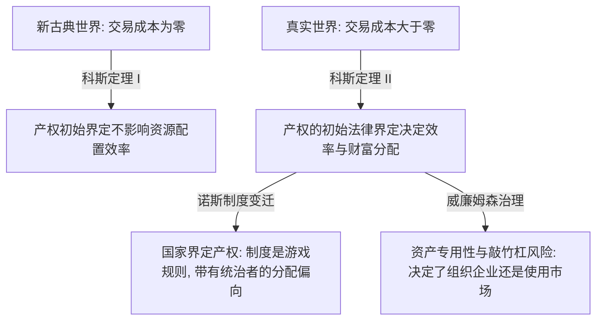

---
tags:
  - 世界经济政治
  - 经济思想史
  - 制度经济学
  - 产权
  - 交易成本
关联:
  - "[[新古典边际主义：分配正义的去政治化与数理合法性建构]]"
  - "[[r_g的解药：从认识到组织化的分配政治]]"
  - "[[奥地利学派：方法论异见、自发秩序与知识的分散协调]]"
  - "[[《国家为什么会失败》——知识树与批判性总结]]"
---

# 制度经济学：市场的非自然性、交易成本与产权的社会塑造

> - **核心命题**：制度经济学（Institutional Economics，包括老制度与新制度学派）彻底瓦解了新古典经济学“市场是自然的、外生的、无摩擦的”这一底层神话。它指出，根本不存在一个脱离社会历史和法律制度的“纯粹自由市场”，经济绩效与财富分配在本质上是由**制度（Institutions）、产权（Property Rights）和交易成本（Transaction Costs）**等游戏规则塑造的。这一理论框架有力地呼应并深化了 [[新古典边际主义：分配正义的去政治化与数理合法性建构]] 中关于“市场的非技术性塑造”的批判——要素的边际生产力从来不是纯技术参数，而是制度选择与权力博弈的结果。
> - **逻辑线索**：老制度经济学（凡勃伦与康芒斯的权力与习俗） → 新制度经济学的转向（科斯定理与交易成本） → 诺斯的制度变迁（制度是游戏规则，产权是权力界定） → 威廉姆森的治理机制（组织与市场的边界） → 制度经济学如何揭示“要素边际理论”的虚伪 → 数据库索引

---

## 一、 老制度经济学（OIE）：凡勃伦与康芒斯的习俗与权力

老制度经济学崛起于 19 世纪末的美国，直接抗衡当时正在兴起的新古典边际革命，其核心在于将经济视为一个**由法律、习俗和社会权力塑造的演进系统**：

1.  **凡勃伦（Thorstein Veblen）与“有闲阶级”**：
    *   批判新古典将人假设为“孤立的、只知道计算快乐与痛苦的计算器”。
    *   提出**“炫耀性消费（Conspicuous Consumption）”**：富人消费奢侈品并非为了获得客观物理效用，而是为了彰显社会地位和阶级壁垒。偏好不是外生给定的，而是被社会习俗和阶层竞争内生塑造的。
2.  **康芒斯（John Commons）与“交易的法律基础”**：
    *   将**“交易（Transaction）”**确立为经济分析的基本单位。交易不是自然人之间实物的自愿交换，而是**所有权（Property Rights）的法律转让**。
    *   强调“集体行动控制个体行动”。没有国家暴力、法院判决和法律秩序来界定和强制执行契约，就根本没有所谓的“市场”。市场在定义上就是法律建构的产物。

---

## 二、 新制度经济学（NIE）：科斯、诺斯与交易成本的引入

20 世纪中叶起，科斯（Ronald Coase）、诺斯（Douglass North）、威廉姆森（Oliver Williamson）等学者吸纳了新古典的微观分析工具，但彻底推翻了“无摩擦市场”的假设，构筑了新制度经济学：

1.  **科斯与“交易成本（Transaction Costs）”**：
    *   新古典理论假设信息完全且交易成本为零。科斯指出，真实世界中任何交易都存在高昂的成本（寻找交易对象、起草合同、谈判、监督与执行契约的费用）。
    *   **科斯定理第二定理**：**在交易成本大于零的现实世界中，产权的初始界定将决定资源配置的效率和最终的财富分配结果**。法律将权利赋予谁（如污染权属于工厂还是居民），直接决定了谁在博弈中占据支配地位，从而塑造了财富的流向。
2.  **诺斯与“制度是游戏规则”**：
    *   制度是**“一个社会的游戏规则”**，为人类相互交往创造了秩序、降低了不确定性。
    *   **产权的本质是国家界定的排他性权利**。诺斯指出，国家为了实现自身利益（如统治阶层的税收最大化），界定出来的产权安排并不必然是有效率的，反而往往是偏向特权阶层的。这彻底打破了“市场自发产生公平分配”的幻想。
3.  **威廉姆森与“资产专用性（Asset Specificity）”**：
    *   解释了为什么会有“企业”这一等级制组织代替“市场”交易。当一项资产（如特制模具、专用技能）只能用于特定契约关系时，企业容易面临事后的**“敲竹杠（Hold-up）”**风险。为了降低这种交易成本，人们选择用内部行政命令（企业）代替外部市场交易。
    
    > 💡 **概念解析：敲竹杠问题 (Hold-up Problem)**
    > 指在交易中，一方因为做出了**关系专用性投资（Relationship-Specific Investment）**，而在事后谈判中陷入被动，被交易对手榨取超额剩余的现象。
    > *   **核心机制**：专用性资产（如为特定汽车厂定制的模具、为特定公司开发的代码）一旦离开当前交易对手，其价值会呈断崖式下跌（退出成本极高）。由于契约本身是不完全的，交易对手在交易发生后，会利用你“撤出成本太高”的软肋，机会主义地强行要求重新谈判、压低价格。这就叫“敲竹杠”。
    > *   **劳动市场应用**：如果工人花数年时间掌握了仅在该企业内部有用的特殊技能（企业专用性人力资本），一旦劳动契约不完全，资本方就可以在事后压低其工资、恶化其劳动环境，而工人因为“跳槽后这些技能毫无价值”而被迫忍受。这就是资本利用产权优势对劳工进行的“敲竹杠”。
    
    > 💡 **概念解析：企业与市场的边界（以内部行政命令代替外部市场交易）**
    > 解决“科斯之问”（既然价格机制如此完美，为什么还会存在企业这种内部计划体系，而不是所有人都在市场上做独立契约交易？）的底层逻辑：
    > *   **市场交易（“看不见的手”）**：通过价格机制和自由契约与外部主体进行交易。当信息不对称、未来的不确定性极高，且存在专用性资产时，市场交易的合同谈判、监督以及防范“敲竹杠”的**交易成本**极高。
    > *   **内部行政命令（“看得见的手”）**：为了免去市场交易的摩擦，人们将外部交易对手收归一体化（如 GM 收购 Fisher Body）。此时，原本的交易关系转变为**企业内部的雇佣与管理关系**。管理者不需要在每次变动时重新与员工签订买卖契约，而是直接下达**行政命令**（命令员工按照图纸变动组织生产，不从则解雇），从而省去了签约与被敲竹杠的成本。
    > *   **企业的边界**：企业的规模不可能无限扩张（否则就是全社会的计划经济）。当企业内部组织一项交易所带来的**内部官僚管理成本**，刚好等于在外部市场中进行该交易所付出的**交易成本**时，企业便达到了其合理扩张的边界。

---

## 三、 制度经济学对“要素边际分配论”的解构

这部分直接呼应 [新古典边际主义：分配正义的去政治化与数理合法性建构.md](file:///c:/Users/Administrator/Desktop/h2o/obsidian/%E4%B8%96%E7%95%8C%E7%BB%8F%E6%B5%8E%E6%94%BF%E6%B2%BB/%E6%96%B0%E5%8F%A4%E5%85%B8%E8%BE%B9%E9%99%85%E4%B8%BB%E4%B9%89%EF%BC%9A%E5%88%86%E9%85%8D%E6%AD%A3%E4%B9%89%E7%9A%84%E5%8E%BB%E6%94%BF%E6%B2%BB%E5%8C%96%E4%B8%8E%E6%95%B0%E7%90%86%E5%90%88%E6%B3%95%E6%80%A7%E5%BB%BA%E6%9E%84.md) 的批判，揭示要素报酬如何被制度选择和权力结构所篡改：

1.  **要素分配不是技术决定（$MPL$/$MPK$），而是产权制度决定**：
    *   新古典宣称工资 $W = P \times MPL$。但制度经济学指出，劳动与资本在契约上是不完全的。
    *   **不完全契约（Incomplete Contracts）**：由于未来不可预测，契约无法规定所有细节。谁拥有**“剩余控制权（Residual Control Rights）”**，谁就能占有分配的剩余。在资本雇佣劳动的制度安排下，剩余控制权天然归资本所有者，导致劳动者即使提高了边际生产力，其成果也极易在事后谈判中被资本方以“敲竹杠”形式攫取。
2.  **市场价格的“政治底色”**：
    *   在真实世界中，没有一个要素价格是纯粹技术性的。工资（$W$）受制于劳动法、最低工资制、工会集体谈判产权的强弱；资本收益率（$R$）受制于知识产权保护期（如药企专利）、金融信贷配给偏向以及准入限制。
    *   因此，**不存在纯粹技术决定的要素边际贡献**。价格背后的每一个变量，在本质上都是由**制度安排和立法博弈**决定的。要素分配的去政治化，在制度经济学看来，只是掩耳盗铃。

---

## 四、 理论交叉：制度经济学 vs 奥地利学派 vs 新古典

| 维度 | 新古典经济学 | 奥地利学派 | 制度经济学（新/老） |
|---|---|---|---|
| **市场本质** | 天然存在、无摩擦（交易成本为零）、完美信息 | 自发演化、去中心化的知识发现与自发秩序 | 法律建构、存在交易摩擦、由游戏规则（制度）塑造 |
| **分配决定** | 要素的技术性边际生产力（$MPL$, $MPK$） | 行动者的主观估价与自发交易的选择 | 产权初始界定、不完全契约博弈、交易成本规避 |
| **国家与法律** | 外生变量，扮演“宏观调控”或“市场监管”角色 | 绝对的“守夜人”，任何干预都会破坏自发秩序 | 内生变量，法律是界定产权和降低交易成本的前提 |
| **核心关注点** | 资源配置效率、数理一般均衡、最优化 | 行动过程、知识的分散协调、企业家精神 | 产权制度、交易成本、制度变迁与组织治理边界 |

---

## 五、 现代拷问：平台资本主义与“私有制度”的创制

在新技术浪潮（如互联网与 AI）下，制度经济学的分析框架具有极强的现实穿透力：

1.  **超级平台作为“私有立法者”**：
    *   在传统的制度经济学中，“制度”和“产权界定”通常是由国家法律执行的。
    *   然而在 [[AI与互联网泡沫：暗光纤先例、地缘分流与生产力_生产关系|现代平台资本主义]] 中，如美团、滴滴、字节跳动等公司通过**算法规则（Algorithms as Institutions）**，在企业内部构筑了一个强有力的“私有制度环境”。
    *   平台单方面界定了骑手的接单产权、抽成比例与惩罚机制。这种“算法契约”极度不完全，且骑手面临极高的**资产专用性风险**（投入了特定配送技能和时间），使得平台可以利用算法和数据壁垒对劳方进行精准的事后敲竹杠。
2.  **国家与平台的制度共谋**：
    *   这有力地呼应了 [[《国家为什么会失败》——知识树与批判性总结|《国家为什么会失败》]] 中关于榨取性制度（Extractive Institutions）的分析。平台通过游说和规则漏洞将自身塑造成特殊的法律豁免区（如定义骑手为“自雇合作者”而非员工，规避社保产权），将自身的超额剩余榨取合法化、技术化。

---

## 六、 数据库索引

| # | 概念 | 类型 | 核心批判点 | 横向关联笔记 | 重要性 |
|---|---|---|---|---|---|
| 1 | 交易成本 (Transaction Costs) | 核心工具 | 现实世界存在摩擦，推翻了新古典无摩擦均衡的前提 | [[新古典边际主义：分配正义的去政治化与数理合法性建构]] | ⭐⭐⭐⭐⭐ |
| 2 | 产权的法律建构 | 产权理论 | 产权不是自然产生的，而是国家权力和法律制度界定的，决定分配走向 | — | ⭐⭐⭐⭐⭐ |
| 3 | 剩余控制权与敲竹杠 | 契约理论 | 契约的不完全性导致实际分配取决于谈判权和产权归属，而非技术性贡献 | [[r_g的解药：从认识到组织化的分配政治]] | ⭐⭐⭐⭐⭐ |
| 4 | 制度变迁与国家理论 | 历史演进 | 制度是博弈的游戏规则，产权设计往往服务于统治阶级的利益最大化 | [[《国家为什么会失败》——知识树与批判性总结]] | ⭐⭐⭐⭐ |
| 5 | 算法作为制度 (Algorithm as Institution) | 现代变迁 | 平台巨头通过算法确立私有契约规则，绕过国家劳动产权保护进行分配榨取 | [[AI与互联网泡沫：暗光纤先例、地缘分流与生产力_生产关系]] | ⭐⭐⭐⭐⭐ |
