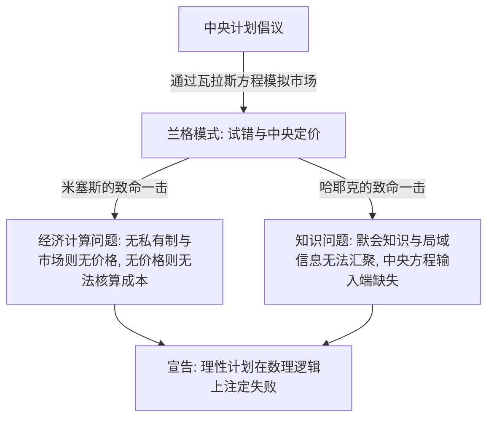

---
tags:
  - 世界经济政治
  - 经济思想史
  - 奥地利学派
  - 方法论
  - 知识问题
  - 计划经济论战
关联:
  - "[[新古典边际主义：分配正义的去政治化与数理合法性建构]]"
  - "[[价值理论三方战争：边际主义、转形问题与斯拉法]]"
  - "[[r_g的解药：从认识到组织化的分配政治]]"
  - "[[AI与互联网泡沫：暗光纤先例、地缘分流与生产力_生产关系]]"
---

# 奥地利学派：方法论异见、自发秩序与知识的分散协调

> - **核心命题**：奥地利学派（Austrian School）在经济学思想史中扮演了极其独特的“双重叛逆者”角色。它不仅从根本上反对马克思主义的计划经济与剥削叙事，同时也彻底拒绝了主流新古典经济学（Neoclassical Economics）的数理均衡建模与理性设计。它通过哈耶克的“分散知识问题”与米塞斯的“人类行动学（Praxeology）”，构建了一个去中心化、主观主义、演化论的市场秩序假说，成为两大敌对阵营共同的方法论异端。
> - **逻辑线索**：方法论之争（主观主义 vs 数理均衡） → 米塞斯的人类行动学（拒绝物理学隐喻） → 哈耶克的知识问题（作为计算系统的价格） → 计划经济可行性大论战（计算不可能定理） → 政治哲学折射（自发秩序 vs 理性建构主义） → 奥地利学派的盲区与现实拷问 → 数据库索引

---

## 一、 叛逆的起点：拒绝物理学隐喻与数理均衡

在 19 世纪末的边际革命中，新古典经济学（以瓦拉斯、杰文斯为代表）为了确立自身的“科学合法性”，系统性地借用了**古典力学**的数学框架（如拉格朗日乘数、势能均衡），试图将人类行为量化为确定性的偏微分方程。

奥地利学派则从一开始就走向了彻底相反的方法论道路：

1.  **均衡（Equilibrium）的虚妄**：
    新古典模型假设市场可以达到一个所有供求完全相等的“静态一般均衡”。奥地利学派认为，真实市场是一个**永恒的、动态的发现过程（Process of Discovery）**。均衡在现实中从未达到，经济学的核心任务是研究市场如何向均衡方向“协调”的动力学过程，而非均衡状态本身的数学性质。
2.  **主观价值的不可度量性**：
    新古典试图通过“效用函数”对人的主观偏好进行基数或序数度量。奥地利学派强调，价值是绝对主观且随时间、情境不断变化的，人脑中的主观评价无法被数学公式化，更不能在人与人之间进行加总或比较。
3.  **人类行动学（Praxeology）**：
    米塞斯（Ludwig von Mises）指出，经济学不属于自然科学，不能采用物理学的“实证观测 + 假说检验”模式。他建立了“人类行动学”体系，其基石是先验真理——**“人类行动是有目的的”**。从此出发，通过纯粹的逻辑演绎推导整个经济学定理（如边际效用递减、货币购买力变化），从而彻底排斥了数学模型在经济学理论构建中的主导地位。

---

## 二、 哈耶克与“知识问题”：作为去中心化计算系统的价格

哈耶克（Friedrich Hayek）将方法论批判引向了信息论和认识论层面，指出经济问题的本质是一个**“知识如何利用的问题”**：

1.  **分散知识（Dispersed Knowledge）的本质**：
    对经济决策最关键的知识，并不是科学家掌握的科学规律（如生产函数的技术参数），而是**“特定时间与地点的独特环境知识”**（如某地矿石今天的纯度、某家工厂设备当前的损耗、某位消费者的临时偏好偏离）。这类知识具有以下特征：
    *   **主观性与默会性（Tacit Knowledge）**：许多知识是人们在实践中“知其然不知其所以然”的技能，无法被书面化或符号化。
    *   **不可加总性**：这些碎片化的信息分散在亿万个个体的头脑中，任何单一机构都无法在不失真的前提下将其收集、整理并输送到中央。
2.  **价格机制（Price Mechanism）是一张去中心化的通信网**：
    哈耶克在《知识在社会中的利用》（1945）中提出，市场价格不是一个由拍卖人算出来的静态均衡参数，而是一个**极其精妙的通信系统**。
    *   当某种资源（如锡）变得稀缺时，千百个局部的分散事件会通过供求关系拉升锡的价格。
    *   普通消费者或企业家**无需知道**锡为什么变贵（是因为发生了地缘冲突、矿难还是技术升级），只要看到“价格上涨”这一一维信号，就会自发限制消费或寻找替代品。
    *   **结论**：价格机制以极低的信息处理成本，协调了全社会分散知识的流动，充当了去中心化的超级计算网络。

---

## 三、 计划经济可行性大论战：计算不可能定理

在 1920 至 1930 年代，奥地利学派与社会主义阵营爆发了思想史上著名的“计划经济可行性论战”：

1.  **米塞斯的“经济计算问题（Economic Calculation Problem）”**：
    米塞斯指出，社会主义消灭了生产资料私有制，这就意味着生产要素（土地、机器、原料）无法在市场上交易。既然没有交易，就不会产生这些要素的**市场价格**。没有价格作为度量衡，中央计划机关就无法进行成本收益分析（无法判断是用 1 吨煤和 10 小时工时，还是用 2 吨煤和 5 小时工时生产同一件产品更合理），计划经济最终只能走向混乱和毁灭。
2.  **对“兰格模式”的数理反击**：
    面对新古典社会主义者奥斯卡·兰格（Oskar Lange）提出的“求解成千上万个联立方程组来模拟市场”的设想，哈耶克指出，这在数学上完全是虚无的：
    *   即使超级计算机的计算能力无限大，也无法解决“输入端”的问题——因为计算所需的原始数据（每个个体的实时偏好和默会知识）根本无法以数据流的形式输入系统。
    *   兰格模型暴露了新古典经济学的根本盲区：**误将“均衡状态下的计算”等同于“现实中解决稀缺性的行动”**。

---

## 四、 奥地利学派 vs 新古典主义 vs 马克思主义

奥地利学派同时向左（马克思主义）和向右（新古典主义）开火，构成了独特的方法论三角形：

| 维度 | 马克思主义政治经济学 | 新古典边际主义 | 奥地利学派 |
|---|---|---|---|
| **价值基础** | 客观劳动价值论（价值源于无差别社会必要劳动） | 主观效用论（效用在数理上决定需求与边际收益） | 彻底的主观价值论（价值仅存在于行动者的个人主观评价中） |
| **方法论内核** | 历史唯物主义、阶级分析、矛盾动力学 | 方法论个体主义、数理建模、静态一般均衡 | 人类行动学（演绎演绎）、主观主义、动态过程论 |
| **市场本质** | 盲目无序、包含剩余价值剥夺与周期性危机 | 理性配置、在完全竞争下实现帕累托最优 | 自发秩序、去中心化的知识发现与协调网络 |
| **中央计划态度** | 支持，主张通过计划解决市场盲目性与阶级剥削 | 理论上可行（如兰格模式），或通过政府宏观干预修正失灵 | 坚决反对，认为任何形式的中央计算与理性建构都注定失败 |
| **方法论批判对象** | 批判资本家靠垄断所有权剥削剩余价值 | 试图通过数学将资本主义分配“去政治化” | 批判前两者的“理性的自负”，拒绝任何数学模型 |

---

## 五、 奥地利学派的盲区与现代拷问

尽管奥地利学派对中央计算的批判极为深刻，但它也存在着自身的根本性盲区：

1.  **“自发秩序”对剥削与集中趋势的默许**：
    哈耶克将市场视为一个自然演化出的“自发秩序”（Spontaneous Order）。然而，这个自发秩序的运行结果依然遵循 [[r_g的解药：从认识到组织化的分配政治|r > g]] 的资本积累规律。奥派将私有产权和自发演化奉为不可侵犯的自然法则，这在实践中往往沦为保护**世袭资本**和**既得利益阶层**的绝对神学，剥夺了弱者通过政治动员改变分配格局的合法性。
2.  **平台垄断与“私有强制”的盲点**：
    奥派假设所有的“强制”（Coercion）都来自于国家暴力的垄断，而自由市场上的交易都是“自愿”的。然而，在 [[AI与互联网泡沫：暗光纤先例、地缘分流与生产力_生产关系|现代平台资本主义]] 中，谷歌、Meta、字节跳动等跨国巨头凭借网络效应构筑了事实上的数字围墙。它们对个体注意力的收割、对算法规则的制定，其强制性和隐蔽性完全不亚于传统的国家机构，而奥派的方法论个体主义对此基本无能为力。
3.  **AI 与计算大辩论的复活**：
    随着大规模分布式计算、物联网、实时大数据和神经网络（AI 智能体）的发展，技术官僚们再次宣称“大数据计划经济”已经可能。然而，哈耶克的挑战依然有效：**AI 能够学习和提取那些不以文字、符号呈现，仅存在于人类具体行动中的“默会知识”吗？** 如果不能，所谓的 AI 智能决策依然只是对历史数据的静态拟合，无法应对市场演进的未知动态。

---

## 六、 数据库索引

| # | 概念 | 类型 | 核心批判点 | 横向关联笔记 | 重要性 |
|---|---|---|---|---|---|
| 1 | 人类行动学 (Praxeology) | 方法论 | 拒绝新古典的物理学隐喻，主张基于人类有目的行动的演绎推理 | [[新古典边际主义：分配正义的去政治化与数理合法性建构]] | ⭐⭐⭐⭐⭐ |
| 2 | 分散知识与默会知识 | 认识论 | 知识存在于具体情境且无法被汇总，宣告了中央计划和数理模型的致命盲区 | [[AI与互联网泡沫：暗光纤先例、地缘分流与生产力_生产关系]] | ⭐⭐⭐⭐⭐ |
| 3 | 经济计算问题 | 论战核心 | 缺乏私有产权导致要素无法定价，使得社会主义计划在逻辑上不可行 | — | ⭐⭐⭐⭐⭐ |
| 4 | 自发秩序 (Spontaneous Order) | 政治哲学 | 认为市场秩序是演化的结果而非理性设计的产物，但在实践中容易放任资本集中 | [[r_g的解药：从认识到组织化的分配政治]] | ⭐⭐⭐⭐ |
