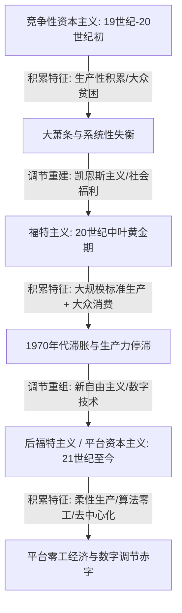

---
tags:
  - 世界经济政治
  - 经济思想史
  - 调节学派
  - 积累体制
  - 调节模式
  - 平台经济
关联:
  - "[[AI与互联网泡沫：暗光纤先例、地缘分流与生产力_生产关系]]"
  - "[[新古典边际主义：分配正义的去政治化与数理合法性建构]]"
  - "[[制度经济学：市场的非自然性、交易成本与产权的社会塑造]]"
---

# 法国调节学派：积累体制、调节模式与平台零工经济的演进

> - **核心命题**：法国调节学派（French Regulation School）彻底推翻了新古典经济学和教条马克思主义将资本主义视为“单一、静态、铁律支配之系统”的假设。该学派以阿格里亚塔（Michel Aglietta）和博耶（Robert Boyer）为代表，指出资本主义具有强大的历史自我调节与重组能力。它通过**积累体制（Regime of Accumulation）**与**调节模式（Mode of Regulation）**这对双生概念，勾勒了资本主义从“竞争性”到“福特主义”，再到如今以数字平台和算法零工为特征的**“平台资本主义 / 数字积累体制”**的阶段演进。它是分析现代零工经济和平台垄断最精确的理论工具之一。
> - **逻辑线索**：核心理论（积累体制与调节模式） → 资本主义的历史阶段演进（竞争性 → 福特主义 → 后福特主义） → 互联网/零工经济：作为新积累体制的“平台资本主义” → 调节学派对主流分析的超越 → 数据库索引

---

## 一、 核心双生概念：积累体制与调节模式

调节学派的理论核心在于解答一个历史谜题：为什么资本主义内部充满了剥削、危机与阶级对抗，却依然能够维持长周期的繁荣与稳定，没有迅速走向崩溃？

为了解释这种稳定性的历史变迁，学派提出了两个核心概念：

1.  **积累体制（Regime of Accumulation）**：
    *   指在较长历史时期内，**生产与消费之间的系统性协调方式**。它规定了社会产出如何在投资（资本开支）与消费之间分配，以确保资本的稳定增殖和社会的再生产能够良性循环。
    *   *核心关注*：生产力（劳动组织、技术水平）与社会分配（工资形成机制、消费结构）之间是否能在宏观上达成匹配。
2.  **调节模式（Mode of Regulation）**：
    *   指一系列支持、引导和巩固某种积累体制的**制度形式、社会关系和行为规范的总和**。它充当了系统内部的“制度护栏”，将劳资冲突和经济危机限制在不至于让系统瓦解的范围内。
    *   调节模式由五个核心的**制度形式（Institutional Forms）**支撑：
        *   **工资关系（Wage Relation）**：劳动力再生产的条件、工资谈判方式及社会保障制度。
        *   **货币金融体制（Monetary System）**：货币发行、信用扩张及国际金融流动的规则。
        *   **竞争形式（Forms of Competition）**：市场中企业间的竞争状态（自由竞争还是寡头垄断）。
        *   **国家与法律的作用（State Forms）**：国家对经济和社会的干预深度与法律规则界定。
        *   **国际体制（International Regime）**：主导国家间的地缘经济政治秩序和地缘贸易流动规则。

---

## 二、 资本主义的历史代际演进：从福特主义到后福特主义

调节学派将近现代资本主义历史划分为三个经典阶段：

1.  **竞争性资本主义（Competitive Capitalism，19世纪至20世纪初）**：
    *   **积累体制**：重在生产端积累。工资被压制在绝对贫困线，大众消费能力极低。由于生产力飞跃与大众消费不足的矛盾，极易引发灾难性的盲目生产过剩危机（最终导致 1929 年大萧条）。
    *   **调节模式**：国家奉行“自由放任”；劳资谈判去中心化；货币采用金本位约束。
2.  **福特主义（Fordism，20世纪中叶黄金期）**：
    *   **积累体制**：**大规模标准化生产**与**大众消费**的良性循环。亨利·福特提高工人工资（“每天 5 美元”），将工人工资转变为购买福特汽车的消费力，实现了高产出与高消费的内在挂钩。
    *   **调节模式**：国家执行凯恩斯主义；建立社会福利保障网；工会力量强盛，通过集体谈判将工资增长与劳动生产率挂钩；信用制度扩张。这一套调节模式极大缓解了资本收益率（$r$）与经济增长率（$g$）的失衡，塑造了战后黄金时代庞大的中产阶级。
3.  **后福特主义（Post-Fordism，20世纪末至今）**：
    *   **积累体制**：1970 年代由于利润率下滑和石油危机，福特主义崩溃。资本转向以信息技术为依托的**柔性生产（Flexible Production）**，推行“零库存”、全球供应链重组与外包。
    *   **调节模式**：推行去管制化（Deregulation）；系统性地削弱工会谈判权；实行以金融自由化和全球离岸流动为核心的“新自由主义”。

---

## 三、 平台零工经济：作为一种全新的“数字积累体制”

面对 21 世纪以互联网和 AI 为特征的零工经济（Gig Economy），调节学派提供了解构其政治经济学最精确的视角：它是一次**积累体制与调节模式的剧烈重组**。

1.  **新型积累体制：劳动力的柔性化与风险的极致转嫁**：
    *   在福特主义下，劳动力是一项“固定资产”，雇主需要承担员工的长期工资、医疗和养老福利。
    *   在**数字平台积累体制（Platform Capitalism）**下，劳动被完全解构。平台通过定位、算法和算力，实现了劳动供给的“即时匹配”。
    *   劳动不再以“雇佣天数”或“雇佣年限”为单位，而是被粉碎为按次计费的“微任务”（如外卖派单、网约车出行、众包审核）。
    *   **生产风险的转嫁**：平台不占有劳动工具（车子和电动车由劳动者自备），不承担闲置成本（没单时骑手无收入），也不承担事故伤亡风险。这极大降低了资本的可变成本，将一切经营风险转嫁给了处于孤立状态的个体。
2.  **失衡的调节模式：算法规制与国家制度性豁免**：
    *   传统工资关系的制度护栏（如劳动法、五险一金）被平台完全绕过。
    *   **算法即调节（Algorithmic Regulation）**：平台用数据代码代替了合同，用“骑手评分”和“算法惩罚机制”代替了管理层和工会的博弈，形成了高强度的行为规制。
    *   **国家调节赤字（Regulation Deficit）**：国家在法律界定上出现了滞后或选择性豁免，将平台骑手定性为非员工的“自雇者（Independent Contractor）”。这使得平台资本获得了不受传统福利制度约束的“超额提取权”，导致社会的再生产成本（医疗、养老、失业）被重新推回给了社会个体与国家财政。

---

## 四、 调节学派对两大传统范式的超越

调节学派之所以是描述“互联网/零工经济”最精确的分析工具，在于它超越了传统新古典与经典马克思主义的偏狭：

*   **超越新古典经济学**：
    *   新古典将外卖员、网约车司机的处境美化为“自由选择、自愿交易的斜杠青年”。
    *   调节学派指出，这并非技术自发带来的自愿选择，而是**福特主义调节网（传统产业雇佣、工会保障、国家福利）被新自由主义拆除后，劳动力在制度性弱势下唯一的生存退路**。
*   **超越经典马克思主义的静态危机论**：
    *   经典马克思主义倾向于推导资本主义的“必然灭亡”或“利润率趋向下降的铁律”，常常将历史简化为抽象的阶级对立。
    *   调节学派展示了**资本主义在历史中的异质性与自我修复力**。资本主义不是一成不变的，它通过从“福特主义”向“平台资本主义”的跃迁，重组了自身的制度形式，从而为我们分析当前的“平台霸权”提供了具体的、阶段性的历史定位和演进刻度。

---

## 五、 数据库索引

| # | 概念 | 类型 | 核心批判点 | 横向关联笔记 | 重要性 |
|---|---|---|---|---|---|
| 1 | 积累体制 (Regime of Accumulation) | 核心工具 | 描述生产与消费的系统性匹配方式，指出资本主义具有阶段性的重组能力 | [[r_g的解药：从认识到组织化的分配政治]] | ⭐⭐⭐⭐⭐ |
| 2 | 调节模式 (Mode of Regulation) | 核心工具 | 保护和维持积累体制的社会与制度护栏，揭示分配背后的政治博弈 | [[新古典边际主义：分配正义的去政治化与数理合法性建构]] | ⭐⭐⭐⭐⭐ |
| 3 | 福特主义 (Fordism) | 历史阶段 | 大规模标准化生产与大众消费的挂钩，依靠凯恩斯主义和福利国家维系 | — | ⭐⭐⭐⭐ |
| 4 | 平台/数字积累体制 | 现代变迁 | 以算法即时匹配与零工弹性雇佣为特征，实现可变成本向个体劳动者的极致转嫁 | [[AI与互联网泡沫：暗光纤先例、地缘分流与生产力_生产关系]] | ⭐⭐⭐⭐⭐ |
| 5 | 算法规制与国家调节赤字 | 制度分析 | 算法规则成为事实上的私有调节，而国家制度的漏洞赋予平台“超额资本提取权” | [[制度经济学：市场的非自然性、交易成本与产权的社会塑造]] | ⭐⭐⭐⭐⭐ |
