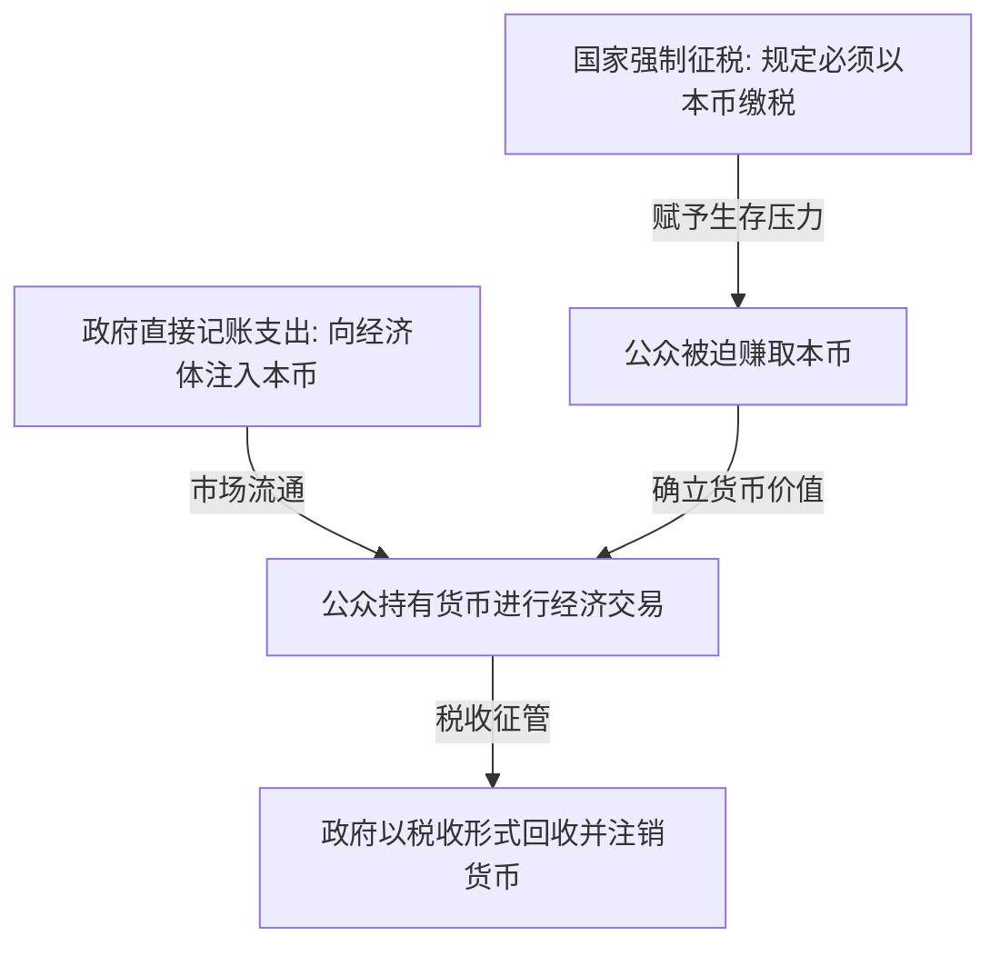

---
tags:
  - 世界经济政治
  - 经济思想史
  - 现代货币理论
  - MMT
  - 财政赤字
  - 税收本质
关联:
  - "[[AI与互联网泡沫：暗光纤先例、地缘分流与生产力_生产关系]]"
  - "[[r_g的解药：从认识到组织化的分配政治]]"
  - "[[新古典边际主义：分配正义的去政治化与数理合法性建构]]"
---

# 现代货币理论：主权货币的去家庭化、税收本质与实体资源约束

> - **核心命题**：现代货币理论（Modern Monetary Theory, MMT）彻底颠覆了新古典经济学将国家财政类比为“家庭账本”的保守神话。它以凯尔顿（Stephanie Kelton）和雷（L. Randall Wray）为代表，指出对于拥有自主货币发行权的主权国家而言，并不存在“先收税、再支出”的预算硬约束。财政赤字的唯一真实限制是**通货膨胀（即实体资源的稀缺性）**，而非“名义资金短缺”。在 AI 时代，这一理论为“劳动所得税基被 AI 侵蚀是否会导致国家财政枯竭”这一经典忧虑，提供了一个完全不同的、以实体资源为核心的解放性视角。
> - **逻辑线索**：核心颠覆（去家庭化的国家财政） → MMT的运行逻辑（支出先于税收，税收驱动货币） → 真实约束是什么（通胀与实体资源） → 现代拷问：AI 侵蚀税基后的国家财政危机？ → 理论边界与国际货币层级批判 → 数据库索引

---

## 一、 核心颠覆：去家庭化的国家财政

主流经济学（新古典派）和政客们常常向公众灌输“国家财政就像家庭主妇的记账本”这一隐喻：政府必须量入为出，如果赤字过高，国家就会像借债度日的家庭一样陷入破产。

MMT 指出，这是对主权货币发行国的根本性误解，必须严格区分“货币使用者”与“货币发行者”：

1.  **家庭与企业是“货币使用者（User of Currency）”**：
    *   家庭必须先赚取货币（通过工资或利润），然后才能支出。如果支出持续大于收入，家庭必须通过借债维系，最终会面临破产。
2.  **主权政府是“货币发行者（Issuer of Currency）”**：
    *   拥有货币主权的国家（如美、日、中等）是本国法定货币的唯一源头。
    *   主权政府在逻辑上和技术上**不可能面临名义资金短缺**。政府花钱只需通过中央银行电脑键盘的敲击（记账），就可以创造无限的本国货币。
    *   因此，破产是一个仅适用于货币使用者的概念，对货币发行者而言，破产是一个伪命题。

---

## 二、 MMT的运行逻辑：支出先于税收，税收驱动货币

MMT 彻底颠覆了“先税后支”的传统因果链条，重构了财政与税收的运行逻辑：

1.  **支出先于税收（Spending before Taxing, S -> T）**：
    *   传统观念：`税收/国债 -> 财政库房 -> 拨款支出`。
    *   MMT 逻辑：`政府记账支出（注入货币） -> 市场交易与财富创造 -> 税收回收（销毁货币）`。
    *   因为公众手里原本没有法币，政府必须先把货币“花”进经济体，公众才有钱来交税。税收不是政府支出的“资金来源”，而是将多余流动性从经济体中**回收并销毁的回收阀**。
2.  **税收驱动货币（Taxes Drive Money）**：
    *   为什么公众会自愿接受一张没有金银支撑的纸币或银行数字？因为国家宣布了**强制缴税义务**，且**唯一接受本国法币缴税**。
    *   为了免于不交税而坐牢的惩罚，所有人必须出售商品或劳动来赚取政府发行的法币。是**税收的强制性**赋予了主权货币以法偿性与流通价值。

---

## 三、 真实的约束：通货膨胀与实体资源

既然主权国家能无限记账“印钞”，是否意味着政府可以无限制地提供免费福利与公共项目？MMT 给予了坚决的否定：**政府虽不受名义资金约束，但受实体资源约束（Real Resource Constraint）**。

1.  **实体资源的硬界线**：
    *   社会的真实财富不是货币符号，而是可用的**劳动力、原材料、土地、能源、工厂和技术水平**。
    *   如果经济体内存在大量闲置资源（如失业率高、工厂开工不足），政府印钞支出去雇佣失业者、建设大坝，会直接**动员这些闲置资源，增加总产出**，而不会引发通货膨胀。
2.  **通货膨胀作为唯一红线**：
    *   当经济体达到了**充分就业（Full Employment）**，所有钢材、能源和劳动力都已被占满。
    *   如果政府此时继续印钞增加支出，就是在用过多的货币去抢夺已经饱和的实体资源，这必然导致物价飙升，引发**通货膨胀**。
    *   **结论**：财政赤字的安全边界不是债务/GDP 的比例，而是**实体资源的承受力与通胀率**。

---

## 四、 现代拷问：AI 侵蚀个税税基后的财政枯竭危机？

在 [[AI与互联网泡沫：暗光纤先例、地缘分流与生产力_生产关系]] 的逐条回应中，提出了一个核心担忧：*如果 AI 大规模替代人工，导致个人所得税（多数现代国家最大的税源）萎缩，国家是否会面临财政地基的垮塌与图尔钦式的财政枯竭？*

对于这一问题，MMT 提供了一个完全不同的、具有解放性意义的答案：

1.  **财政能力不取决于税基，而取决于生产力**：
    *   在 MMT 框架下，个税萎缩不会在技术上剥夺政府发放全民基本收入（UBI）或投资电网的“印钞能力”。政府支出的名义资金从不依赖于个税回收。
2.  **AI 极大地释放了“实体资源约束”**：
    *   传统印钞发福利会导致通胀，是因为人类劳动力和产能有物理瓶颈。
    *   但如果 AI 和全自动机器人大规模替代人工，意味着**社会的真实供给能力（粮食、电力、医疗、住房）被成倍放大，而不需要消耗同等的人类劳动力**。
    *   这意味着，实体资源约束的红线被极大地向外推移了。
3.  **重新定义财政健康的逻辑**：
    *   只要自动化的工厂和 AI 算力在实体上创造了充沛的物质财富，政府就可以直接通过记账（印钞）向国民发放 UBI，让国民去消费这些富余的物资。
    *   因为有充足的实体物资作为本币的“抵押物”，即使大量印钞也不会引发通胀。
    *   **核心结论**：决定 AI 时代财政生死存亡的，**不是政府在名义上收到了多少税，而是 AI 系统在实体上创造了多少真实的物质财富（$Y$）**。
4.  **AI 时代税收的重构定位**：
    *   如果不再需要个税来“养活政府”，税收的角色将退回到：
        *   **防止通胀**：向拥有超额 AI 算力和生产资料的寡头征税，回收其过剩的购买力，防止其囤积真实资源推高物价。
        *   **驱动货币流通**：确保普通人必须向社会提供部分稀缺资产（如土地、高端人工服务）来换取法币以缴税，维持货币的运转。

---

## 五、 理论边界与国际货币层级批判

MMT 虽然为技术性失业提供了乐观的财政解药，但在实践中面临着致命的国际和政治边界：

1.  **国际货币层级（Currency Hierarchy）的绞杀**：
    *   MMT 仅适用于能够完全以本币举债、且不依赖进口的关键主权国家（如美国、日本，其国债多为本币，且本币在国际结算中具有主导地位）。
    *   对于大多数外债累累、且高度依赖进口能源与粮食的弱势国家（处于货币层级末端），无节制印本币会导致本币大幅贬值，引发灾难性的**输入性通货膨胀**和国际收支危机。
    
    > 💡 **概念解析：弱势货币国家与“原罪”约束 (Weak Currency & The Original Sin)**
    > 指在国际货币金字塔中处于边缘或底端，其本币不被国际社会广泛接受为结算或储备手段的经济体。此类国家面临以下三个致命制约：
    > 1.  **原罪 (The Original Sin)**：在国际金融学中，特指发展中国家**无法以本国货币向国外借债**的结构性困境。它们借外债必须借美元、欧元等“硬通货”。一旦国内通胀或本币贬值，外债的本币偿还负担会瞬间暴增，瞬间推高主权债务违约的概率。
    > 2.  **硬通货进口依赖**：关键物资（如石油、天然气、粮食、高端芯片）在国际市场上只能用美元结算。弱势货币国必须维持外汇储备（美元），一旦本币暴跌或外汇枯竭，就会因无法支付美元而发生全国性的能源和粮食断供。
    > 3.  **货币政策主权丧失（美元加息的贬值传导）**：其利率政策被迫跟随美联储波动。当**美元加息**时，无风险的美元资产收益率上升，导致本币与美元的**利差收窄或倒挂**。为了追求更高且更安全的收益，全球资本会抛售本币资产，换成美元回流美国。在外汇市场上，这表现为本币的供给增加、美元的需求增加，直接导致本币贬值。弱势货币国哪怕国内经济萧条、失业率飙升（本应降息），也必须被迫**逆势加息**以防范资本外逃和汇率崩溃，丧失了独立的货币政策主权。
    
    > 💡 **概念解析：主权外币外债危机传导链 (The Anatomy of Foreign Debt Crisis)**
    > 当一个弱势货币国背负高额的外币外债（如以美元、欧元计价的国债，典型国家包括**阿根廷、土耳其、埃及、巴基斯坦、黎巴嫩、斯里兰卡、厄瓜多尔**等），一旦遭遇国内经济危机或美联储收紧流动性（美元加息），会触发以下致命的连锁反应：
    > 1.  **汇率贬值与债务放大螺旋**：全球资本外逃，本币暴涨贬值。由于债务以美元计价，本币贬值意味着**以本币衡量的真实债务本金与利息瞬间成倍暴增**（如贬值 50% 相当于债务翻倍），直接冲垮国家财政地基。
    > 2.  **印钞权失效与主权违约**：本国央行只能印本币，无法创造美元。一旦外汇储备耗尽且无法在国际市场上借新还旧，国家被迫宣布**主权违约（Default）**，被国际资本市场彻底封锁。
    > 3.  **进口瘫痪与实体经济停摆**：信用破产加之外汇枯竭，导致无法支付美元购买最基本的进口物资（燃油、粮食、药片）。国内爆发大规模停电、交通瘫痪、工业停工和生存物资短缺。
    > 4.  **输入性恶性通胀**：本币贬值带来的暴涨成本直接输入国内。若政府通过印本币来填补国内赤字或支付雇员工资，只会导致“泛滥的本币追逐极度匮乏的进口物资”，演变为恶性通货膨胀。
    > 5.  **丧失经济主权与社会动荡**：被迫向国际货币基金组织（IMF）求救。其条件通常是极为苛刻的“结构性调整”（强行削减公共福利、裁减公务员、增税、将核心国有资产私有化卖给外资），极易诱发剧烈的社会暴动和政治更迭。
    
    > 💡 **概念解析：输入性通货膨胀 (Imported Inflation)**
    > 指一个国家由于**外部因素**导致进口商品、原材料或能源的本币价格上涨，从而推高国内整体物价水平的现象。其主要传导机制包括：
    > 1.  **汇率贬值渠道**：本国货币对国际主流货币（如美元）大幅贬值。即使国际大宗商品外币价格不变，购买同样多的石油、粮食也需要支付成倍的本币，直接转化为国内成本。
    > 2.  **全球大宗商品暴涨渠道**：国际市场上的原油、天然气、化肥、粮食等核心投入品暴涨，抬高了本国企业的生产原料和能源成本，迫使国内商品价格全面跟涨。
    > 3.  **弱势货币国家的 MMT 死结**：这也是弱势货币国无法套用 MMT 的根本原因——一旦在国内通过印钞增加赤字，若国际市场对该国本币缺乏信心，本币在外汇市场上会瞬间崩溃暴跌，这会通过上述“汇率贬值渠道”瞬间输入剧烈的通货膨胀，导致名义印钞不仅没有动员闲置资源，反而摧毁了国内经济秩序。
    > 
    > 📊 **典型国家案例对比**：
    > *   **MMT 失败的弱势货币国（死结案例）**：
    >     *   **阿根廷 (Argentina)**：长期通过印比索来填补财政赤字，且背负巨额美元外债。由于公众和外汇市场对比索失去信心，比索大幅贬值，这使得高度依赖进口的工业零件和能源本币价格飞涨，最终陷入恶性循环的输入性恶性通胀。
    >     *   **土耳其 (Turkey)**：近年来奉行“降息抗通胀”的非正统政策，导致土耳其里拉汇率崩溃。由于土耳其极其依赖进口石油、天然气和核心原材料，里拉贬值立刻转为高昂的进口本币成本，输入了国内恶性通胀。
    >     *   **斯里兰卡 (Sri Lanka)**：2022 年因大幅减税和过度印钞导致主权信用破产、外汇枯竭。本币卢比崩溃后，无法进口燃料和粮食，输入性价格暴涨导致国内民生彻底瘫痪。
    *   **能享受 MMT 财政空间的强主权货币国（特权与本币内债案例）**：
        *   **美国 (USA)**：掌握美元全球霸权（顶级储备货币）。美债全部以美元计价，且全球都需要美元。即便美国大搞财政刺激、国债狂飙，也能在一定程度上通过逆差将本国通胀“出口”给全球，不受外汇短缺的制约。
        *   **日本 (Japan)**：国债占 GDP 超 260%，但 90% 以上由本国国民和央行持有，且全部为日元计价，日元具有全球避险属性。即便日本长期实施零利率和量化宽松，也从未发生外债危机或输入性通货膨胀崩盘。
        *   **中国 (China)**：国债（以及地方政府债和城投债）有 **98% 以上为人民币计价（本币内债）**，外币外债占比微乎其微（不足 2%）。债务的主要持有人是国内的商业银行、保险公司等金融机构。由于拥有独立本币发行权且债务高度本币化、内债化，中国在技术上不存在主权债务外币破产的可能，拥有极强的财政腾挪与金融救援空间。
        
        > 💡 **概念解析：避险货币与日元的独特地位 (Safe-Haven Currency & JPY's Uniqueness)**
        > 在全球外汇市场中，日元并不是唯一的避险货币。公认的全球三大避险货币包括**美元 (USD)**、**瑞士法郎 (CHF)** 和 **日元 (JPY)**：
        > *   **美元 (USD)**：凭借绝对的全球清算和储备霸权，在全球性大恐慌时，所有机构都会面临美元流动性枯竭（Dollar Shortage），从而疯狂抛售一切资产以换取美元现金。
        > *   **瑞士法郎 (CHF)**：源于瑞士永久中立国的地缘地位、高度稳定的政治制度、深厚的银行业隐私传统，以及历史上长期有黄金储备支撑。
        > 
        > **为什么同样是高债务国家，只有日元（而非希腊、意大利、英国）被公认为避险货币？**
        > 1.  **净债权国 vs 净债务国（关键区别）**：
        >     日本连续 30 多年是全球最大的**净债权国**，其国民和企业在海外拥有的资产远大于外国人在日本拥有的资产。当危机爆发时，日本发生**资本回流（Repatriation）**，海外资金结汇回国，日元随之升值。相反，美、英、意、希等国都是**净债务国**（欠全球的钱比全球欠他们的多），危机时容易面临资本外逃（Capital Outflow）压力。
        > 2.  **本币债务自主权（货币主权）**：
        >     希腊、意大利等欧元区高债务国失去了独立的货币发行权（受制于欧洲央行 ECB），如果发生主权危机，它们无法自行“印本币偿债”，面临真实的破产违约风险。而日本的国债全部以日元计价，且日本央行（BOJ）拥有完全的货币发行权，在技术上绝无违约可能。
        > 3.  **套利交易清算机制（Carry Trade Unwind，日元特有动力）**：
        >     由于日本长期通缩，维持了长达 20 多年的零利率/负利率，日元成为全球最主要的“负债/借贷货币”（投机者借廉价日元去买海外高收益资产）。当全球金融市场出现恐慌（Risk-Off）时，投机者必须抛售海外资产，**买回日元**以偿还贷款。这种“平仓操作”会在短期内对日元形成强劲的刚性买盘，这是美元和瑞郎所不具备的独特波动能。

2.  **增税的政治不可行性**：
    *   MMT 认为通胀抬头时政府应通过“增税”来销毁多余货币。但在代议制政治中，增税是一个政治阻力极大的动作。政府很难做到在通胀开始时，以技术官僚的理智迅速通过增税法案。

---

## 六、 数据库索引

| # | 概念 | 类型 | 核心批判点 | 横向关联笔记 | 重要性 |
|---|---|---|---|---|---|
| 1 | 货币发行者 vs 货币使用者 | 核心工具 | 揭示主权政府不存在先收税再支出的预算硬约束，打破家庭式赤字恐慌 | [[新古典边际主义：分配正义的去政治化与数理合法性建构]] | ⭐⭐⭐⭐⭐ |
| 2 | 税收驱动货币 | 货币理论 | 税收不是支出的资金来源，而是赋予本币法偿性以及销毁多余流动性的回收阀 | [[r_g的解药：从认识到组织化的分配政治]] | ⭐⭐⭐⭐⭐ |
| 3 | 实体资源约束与通胀红线 | 财政边界 | 主权国家支出的唯一限制是实体的劳动力、原材料和能源，而非名义资金 | — | ⭐⭐⭐⭐⭐ |
| 4 | AI 财政解放假说 | 现代拷问 | 只要 AI 丰富了物质财富，国家无需依赖个税即可印钞支持 UBI，财政健康由实体供给决定 | [[AI与互联网泡沫：暗光纤先例、地缘分流与生产力_生产关系]] | ⭐⭐⭐⭐⭐ |
| 5 | 国际货币层级 | 局限性 | 弱势本币国家无法适用 MMT，面临输入性通胀和国际收支外汇约束 | — | ⭐⭐⭐⭐ |
