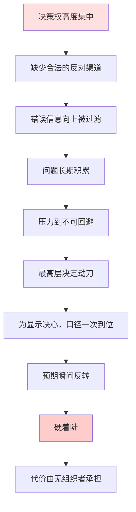

---
tags:
  - 世界经济政治
  - 比较政治经济学
  - 中国
  - 党国体制
  - 纠错机制
  - 资本与国家
  - 政策失灵
aliases:
  - "中国：高决断力与低纠错力"
关联:
  - "[[总论：资本、政治体制与经济政策]]"
  - "[[美国：多否决点、资本结构性权力与锁定]]"
  - "[[日本：共识决策与拒绝调整]]"
  - "[[德国：工资节制、欧元与出口依赖]]"
  - "[[资本与国家的双向选择：结构性权力的三个决定变量]]"
  - "[[储蓄-出口模式的政治经济学：权力、阶级与转型困境]]"
---

# 中国：高决断力、低纠错力与急转弯

> - **核心问题**：中国政体是唯一一个能同时做到"压制资本的政治权力"和"完成大规模决策"的大国体制。但为什么它在高铁、脱贫、产业政策上能做成大事，却在计划生育、房地产、清零这些议题上必然拖到不可收拾才急转？为什么"能做大事"和"不能改小事"会同时存在？
> - **叙事逻辑**：制度骨架（形式无否决点、实质有否决点）→ 决断力的来源与代价 → 纠错机制的结构性缺陷 → 急转弯模式（八次案例）→ 资本-国家关系的倒置（国家压制资本政治，资本用"退出"反击）→ 与美国的镜像对比 → 制度病理的定位 → 收束
> - **立场说明**：本笔记的分析单位是**决策结构**，而非道德评价。核心判断是：中国政体的优势（决断力）与劣势（无纠错）**来自同一个制度特征**——**决策权的高度集中**。集中使"能改"成为可能，也使"发现错误"成为不可能。这两件事不能被分开评价。
> - **来源标注**：《中国统计年鉴》、财政部与审计署公开数据、国家统计局人口与就业统计、《中国共产党章程》与国务院行政法规、中共中央历次全会决议、全国人大立法记录；理论框架借自 Tilly & Tarrow（抗争政治）、Nathan（威权韧性）、Hirschman（退出-发声-忠诚）；综合分析与理论判断为笔记作者原创，2026-09-20。

---

## 一、制度骨架：名义无否决点，实质有否决点

### 1.1 表面结构

| 机构 | 形式职能 | 实际 |
|---|---|---|
| **中共中央** | 最高决策 | **真正的决策中心**（政治局常委会为核心） |
| **国务院** | 行政执行 | 执行者，但拥有部门性议程设置权 |
| **全国人大** | 立法机关 | 形式上通过立法，实质审议有限 |
| **政协** | 协商机构 | 咨询性，无否决权 |
| **地方党委/政府** | 执行 + 局部决策 | **实质的博弈参与者** |

**形式上的否决点：几乎没有。**

> 从"党统一领导"的原则看，不存在合法的、制度化的否决权——**没有反对党、没有独立法院、没有竞争性选举、没有能制约最高层的机构。**

### 1.2 但实质存在否决点

**这是关键修正**：**名义上的无否决点，不等于实际的无否决点。**否决权以非正式的形式存在：

| 实质否决点 | 机制 | 典型表现 |
|---|---|---|
| **① 派系与派别** | 非正式联盟，通过人事与信息渠道施加影响 | 反腐揭露的派系斗争 |
| **② 部门（条条）** | 部委对政策的解释权、资源分配权 | "政令不出中南海" |
| **③ 地方（块块）** | 地方政府对执行的实际控制 | "上有政策、下有对策" |
| **④ 国有企业** | 掌握关键资源，抵抗不利改革 | 国企改革三十年进展有限 |
| **⑤ 体制内既得利益** | 现职与退休官员的网络 | 房产税试点十年未推广 |
| **⑥ 执行层的消极执行** | 不反对，但也不做 | "躺平式执行"、"层层加码"或"层层不办" |

> 📌 **这解释了一个看似矛盾的现象**：中国政体"理论上"能做任何事，但"实际上"很多事做不了。
>
> **区别在于：名义否决点（合法的反对机制）不存在，实质否决点（非正式的抵抗能力）大量存在。**
>
> **而非正式否决点的性质是"隐性的、不可见的、不可追责的"** —— 这使它比正式否决点**更危险**，因为**你无法知道谁在阻止、为什么阻止**。

### 1.3 与美国的对比

| | 中国 | 美国 |
|---|---|---|
| **正式否决点** | 无 | **极多**（filibuster、法院、州、机构） |
| **非正式否决点** | **大量，且不可见** | 少（利益集团是可见的、可被批评的） |
| **能否追责** | **不能**（谁阻止了？不知道） | 能（数据公开、投票记录、媒体调查） |
| **结果的确定性** | **不可预期**（政策可能被任何人以任何理由搁置） | 可预期（知道卡在哪一步） |

> **这是最反直觉的一点**：**美国政治看起来乱，但"卡在哪里"是可查的；中国政治看起来统一，但"谁在阻挡"是无法确定的。**
>
> **不可预期性是投资的敌人** —— 这也是后面"资本用退出反击"的制度基础。

---

## 二、决断力的来源与代价

### 2.1 决断力的来源

**中国政体在特定条件下拥有极强的决策能力**：

| 条件 | 机制 |
|---|---|
| **政治集中的决策权** | 不需要跨党派协商、不需过议会多数门槛 |
| **人事控制** | 上级任命下级 → 激励结构单向 |
| **资源动员能力** | 土地、信贷、国资、行政力量可以被统一调度 |
| **长期规划的可行性** | 五年规划、产业政策、基建计划可跨任期延续（相比 2 年任期） |
| **执行链条** | 一旦定调，执行阻力可被行政手段压制 |

### 2.2 决断力的成绩单

| 案例 | 时间 | 结果 |
|---|---|---|
| **高铁网络** | 2008-2020 | 世界最大高铁网（但债务沉重，见争议部分） |
| **脱贫（绝对贫困）** | 2012-2020 | 官方宣布清零（标准与方法有争议） |
| **产业政策（光伏、电池、电动车）** | 2010s-2020s | **全球领先**（这是最扎实的一项成功） |
| **基建（港口、电网、通信）** | 1990s-2020s | 世界一流 |
| **疫情初期封锁** | 2020 上半年 | 迅速控制（但后续代价巨大） |
| **军力现代化** | 2000s- | 快速（对美构成实质挑战） |

**这些是真实的成就，不能否认。**

### 2.3 代价：决断力的另一面

**但同一套机制同时产生**：

| 代价 | 机制 |
|---|---|
| **不能渐进调整** | 决策权集中 → 没有"小步试探"的制度空间 → 只能"不动"或"全动" |
| **不能纠正早期错误** | 反对意见无法合法表达 → 错误被过滤 → 只能等到爆发 |
| **政策成本可能被低估** | 快速执行时缺乏充分辩论 → 次生后果未被预见 |
| **地方层层加码** | 为避免"执行不力"的责任，地方会超额执行 → 放大政策冲击 |
| **或地方层层不办** | 为避免"执行过激"的责任，地方会消极执行 → 政策落空 |
| **无止损机制** | 定调后难以承认错误 → 错误持续到不可持续为止 |

> 📌 **核心机制**：**决策权集中 → 缺少合法的反对 → 缺少信息反馈 → 缺少渐进修正 → 只能"急转弯"。**
>
> **这不是某个人的风格问题，是结构问题。**

### 2.4 一个形式化的表述



**注意图中的关键路径**：**A → B → C 是整个链条的起点。**
>
> **只要 A 存在，B 和 C 就不可避免；只要 C 存在，D 就必然发生；D 到 I 就是时间问题。**

---

## 三、纠错机制的结构性缺陷

### 3.1 中国存在的纠错渠道

**必须公平地说：中国并非没有纠错机制。**只是它们都是**内部的、自上而下的、选择性的**：

| 渠道 | 机制 | 局限 |
|---|---|---|
| **巡视制度** | 中央派巡视组检查地方 | 针对腐败与违纪，非政策纠错 |
| **信访** | 民众上书 | 容量有限，且举报者承担风险 |
| **群体性事件** | 集体行动施压 | 非法定性，事后镇压风险 |
| **内部研究报告** | 智库、高校、部门研究 | 可被忽略；说真话者有职业风险 |
| **网络舆情** | 社交媒体 | 审查，且可被快速清除 |
| **最高层调研** | 领导人视察 | 信息被地方精心布置 |
| **政策试点** | 地方先行先试 | **改革开放在 1980-90 年代的主要方法，现已弱化** |

**关键的缺失**：

| 缺失的机制 | 为什么重要 |
|---|---|
| **独立媒体** | 没有独立的信息验证渠道 → 官方数据无法被核对 |
| **独立司法** | 无法通过诉讼挑战政策 |
| **竞争性选举** | 选民无法用选票惩罚错误政策 |
| **自由结社** | 受损者无法组织起来集体表达 |
| **学术自由** | 学者无法公开批评政策 |
| **反对党** | 没有制度化的替代方案与监督 |

### 3.2 一个关键的削弱：试点机制的退化

**改革开放在 1980-1990 年代之所以有效，恰恰因为存在"试错空间"**：

```
地方试点 → 允许部分失败 → 失败被报道（即使有限） → 总结 → 推广或放弃
```

**典型成功**（见 [[为朱镕基辩护：国企改革与分税制的再审判——罪在改革者还是收回改革的后来者]] 与 [[计划生育政策演变与梁中堂翼城试点]]）：

| 试点 | 结果 |
|---|---|
| **经济特区（1980）** | 成功 → 推广 |
| **农村联产承包（1980s）** | 成功 → 全国推广 |
| **翼城二胎试点（1985）** | 证明可行，但**未被采纳**（政治原因） |
| **价格双轨制** | 部分成功，部分失败（1988 价格闯关） |

**退化的机制**：

> 试错的前提是**允许失败被公开**。当媒体的独立空间收缩、学术批评被限制之后，"试点"就失去了纠错功能，退化为**"顶层设计的验证环节"** —— 即试点不是用来检验政策对不对，而是用来证明政策能执行。
>
> **这就是为什么 2010 年后的重大政策（棚改货币化、三条红线、教培整顿、清零）都是"一次性、全国化、无试点"的。**

### 3.3 信息过滤的三个层次

| 层次 | 机制 | 后果 |
|---|---|---|
| **数据的系统性美化** | 地方 GDP 数据、就业数据、财政数据的"注水"与"调节" | 中央看到的数据失真 |
| **坏消息的抑制** | 报告坏消息的人承担职业风险 | 官员理性选择"报喜不报忧" |
| **领导人调研的定点化** | 视察路线被精心安排 | 最高层看到的是"示范点" |

> **一个经典的例子是清零政策的转向（2022 年末）**：
>
> 从"动态清零不动摇"到"全面放开"发生在**数周之内**，中间没有过渡期、没有准备期（药品、ICU、疫苗加强针都没有就位）。
>
> **这就是"急转弯"的典型形态**：政策在"不动"和"全动"之间没有中间状态，因为**中间状态需要承认前一个决定有问题，而这在制度上很难表达。**

---

## 四、急转弯模式：案例清单

**这是本笔记最重要的一张表**：同一模式在七十年中的重复。

| # | 事件 | 积累期 | 转折方式 | 后果 | 纠错时间 |
|---|---|---|---|---|---|
| **1** | **大跃进** | 1957-58 | 政治动员，全面发动 | **大饥荒（1958-62）** | **直到 1962 七千人大会** |
| **2** | **文化大革命** | 1962-66 | 最高层发动 | 十年动乱 | **直到 1976 毛泽东去世** |
| **3** | **计划生育** | 1980-2013 | 缓慢但持续过久 | **生育率崩溃（不可逆）** | **2021 三孩政策，已太晚** |
| **4** | **国企改革/下岗** | 1990s 拖延 | 1998 三年集中推进 | 3000-4000 万人下岗 | 无（被视为必要代价） |
| **5** | **分税制** | 长期争论 | 1994 一次推行 | 地方财政骤紧 → **土地财政的起点** | 无（后果被 20 年后才认识） |
| **6** | **房地产调控** | 2005-2016 | "房住不炒"定调 | 三四线需求断层 | 无 |
| **7** | **三条红线** | 内部酝酿 | 2020 一次性公布 | 房企暴雷潮、土地财政崩溃 | **无（政策未撤销）** |
| **8** | **教培整顿** | 短期 | 2021 一纸文件 | 全行业消失、百万人失业 | **无（政策未撤销）** |
| **9** | **清零** | 2020-2022 | 2022 年末急转 | 感染潮 + 信心冲击 | **事后无复盘** |

**模式识别**：

```
① 同一模式重复七十年（跨越毛泽东、邓小平、江泽民、胡锦涛、习近平五个时期）
  ↓
② 说明这不是个人风格问题，是决策结构的产物
  ↓
③ 每一次都是"长期积累 → 突然急转 → 硬着陆"
  ↓
④ 每一次的代价都由无组织者承担
  ↓
⑤ 每一次都没有事后复盘（因为没有独立的问责机制）
```

> 📌 **第①条是这张表最重要的地方**：**如果一个模式跨越了意识形态、领导人风格、国际环境、发展阶段，那么它就不可能用"某个人的错误"来解释。**
>
> **它只能是结构性的。**

**一个重要的对比**：

| | 苏联 | 中国 |
|---|---|---|
| **急转弯的形式** | 1985-1991（戈尔巴乔夫改革 + 解体） | 多次，但每次幅度较小 |
| **纠错速度** | 极慢（直到体系崩溃） | 中（每次转向后恢复） |
| **为什么中国不同** | — | **经济绩效提供了缓冲**（增长使错误可以被吸收） |
>
> **这也是一个警告**：**当增长停止提供缓冲时，纠错的空间会变小，而纠错的必要性会变大。**

---

## 五、资本-国家关系：一个倒置的结构

### 5.1 表面的关系

**中国是唯一一个同时做两件相反的事的大国**：

```
吸引资本（FDI、出口加工、招商引资、外资优惠、地方政府竞争）
      +
控制资本（资本管制、国有银行主导、党委进企业、边控、平台整顿）
```

**它试图"只要资本的功能（投资、技术、就业），不给资本的政治权力"。**

### 5.2 这套设计的历史有效性（1994-2018）

| 条件 | 为什么有效 |
|---|---|
| **高回报** | 增长 8-10%，投资几乎总有回报 → 资本愿意来 |
| **可预期** | 加入 WTO（2001）提供了对外承诺 → 规则稳定 |
| **市场规模** | 14 亿人的市场不可替代 → 资本愿意接受限制 |
| **要素成本低** | 土地、劳动、环保成本低 → 利润空间大 |

> **资本接受"没有政治权力"，换取"高回报 + 可预期"。这是一个交易。**

### 5.3 交易破裂（2018 年后）

**破裂的两个原因**：

| 原因 | 机制 |
|---|---|
| **① 回报下降** | 增长降至 4-5%，多数行业产能过剩，投资回报率崩塌（ICOR > 10） |
| **② 可预期性下降** | 蚂蚁 IPO 一夜叫停、教培一夜清零、游戏版号冻结、边控随时发生 |

**当"回报"和"可预期"同时下降时，交易的理性基础消失了。**

### 5.4 资本的反击形式：不是"发声"，是"退出"

**这是本笔记与 [[资本与国家的双向选择：结构性权力的三个决定变量]] 衔接的关键**：

| 资本的选项（Hirschman） | 中国 | 效果 |
|---|---|---|
| **发声（voice）** | ❌ 被封死（工商联是附庸、无独立商会、不能公开反对） | — |
| **退出（exit）** | ⚠️ 被管制但未封死（资本外流、产能外移、移民） | 有效但有限 |
| **消极不投资（"躺平式资本"）** | ✅ **最有效、最难管制** | **这是主要形式** |

**证据**：

| 指标 | 变化 |
|---|---|
| **民营投资意愿** | 下降（企业家信心指数长期低迷） |
| **FDI** | 转为净流出（近年首次出现负值） |
| **超额储蓄** | 居民与企业存款高企，不进入投资与消费 |
| **企业家移民** | 显著上升 |
| **民营企业家公开表态** | 转为低调、避险 |

> **国家在"对抗资本"上赢了（马云、教培、滴滴、平台整顿）——但赢了对抗、输了投资。**
>
> **资本没有推翻国家，但它改变了国家能做的事。**

### 5.5 与俄罗斯的关键区别

| | 俄罗斯 | 中国 |
|---|---|---|
| **资源** | 石油、天然气、矿产 | **无足够资源，靠劳动力和土地** |
| **对资本的依赖** | **低**（卖油就够了） | **高**（需要投资、技术、出口市场） |
| **因此资本的结构性权力** | 低（国家不需要它） | **高（国家需要它）** |
| **做法** | 可以直接掠夺（尤科斯，2003） | 不能任意掠夺（会失去投资），但可以"选择性惩罚" |

> **中国的结构性约束比俄罗斯强得多。**这就是为什么中国不能像俄罗斯那样走"个人化威权 + 掠夺资本"的路——**代价会比俄罗斯大得多。**

**但 2018 年后中国部分地走了这条路**（平台整顿、民营信心下降），而结果恰恰是——**"退出的资本"用不投资惩罚了国家。**
>
> **俄罗斯是中国的"下限情景"，不是"同构情景"。**（详见 [[俄罗斯：资源租金、个人化威权与资本的零权力]]）

---

## 六、决策病理的定位

### 6.1 六国对照

| 国家 | 否决点 | 时间视野 | 纠错力 | 资本权力 | 典型病理 |
|---|---|---|---|---|---|
| **中国** | 形式无/实质有 | 顶层长/执行短 | **低** | 中（受压制，但能用"退出"反击） | **急转弯** |
| **美国** | 极多 | 短（机构补长） | **强** | **极高** | **锁定** |
| **日本** | 形式少/实质多 | 长 | 中 | 中（融合） | **僵化** |
| **德国** | 多 | 长 | 强 | 中（社团主义） | **投资不足** |
| **韩国** | 中 | **极短** | **强** | 高（财阀）但被工会抵消 | **极化** |
| **俄罗斯** | 无 | 短 | **无** | **极低**（被掠夺） | **信息崩溃** |

### 6.2 中国病理的精确表述

**"急转弯"的四个构成要素**：

| 要素 | 内容 |
|---|---|
| **① 不能渐进** | 缺少小步试错的制度空间（反对意见无法合法表达） |
| **② 不能早改** | 错误信息向上被过滤 → 只有到不可回避才被发现 |
| **③ 不能止损** | 定调后难以承认错误 → 只能坚持到不可持续 |
| **④ 一次性释放** | 转向时口径一次到位 → 预期瞬间反转 → 硬着陆 |

**这四个要素合起来定义了中国式的政策风险**：

> **不是"政策可能出错"（所有体制都会出错），而是"出错的成本会在某个时点集中爆发"。**
>
> **对投资者而言，这意味着一个特殊的风险结构：平时风险极低，但存在突然的、不可对冲的、全行业的归零风险（教培、蚂蚁、游戏版号）。**
>
> **这就是"可预期性"问题的本质** —— 不是风险高，是**风险的分布形态无法被建模**。

### 6.3 与美国病理的镜像

| 方面 | 中国 | 美国 |
|---|---|---|
| **能否做大决策** | ✅ 能 | ❌ 不能 |
| **能否改小问题** | ❌ 不能 | ✅ 能 |
| **错误的形式** | **激进**（急转弯、一刀切） | **不作为**（拖延、积累） |
| **发现错误的能力** | **低** | **高** |
| **解决问题的能力** | **高**（一旦决定） | **低** |
| **盲点** | 看不见"渐进" | 看不见"长期" |

> **两者都是"系统性失明"**，但失明的方向相反。
>
> **而两者共同的后果是一样的：问题拖到不可收拾时才处理，而代价由无组织者承担。**

---

## 七、收束：五个判断

### 7.1 判断一：决断力与无纠错来自同一个制度特征

> **决策权的高度集中**，既使"能改"成为可能，也使"发现错误"成为不可能。
>
> **这两件事不能被分开评价。你不能只要高铁和产业政策，不要三条红线和清零。**

### 7.2 判断二：正式否决点缺席，但非正式否决点大量存在

> **派系、部门、地方、国企、既得利益、消极执行**——这些都在进行实质的阻挠。
>
> **问题不是"没有阻挠"，而是"阻挠是不可见的、不可追责的"。**
>
> **结果是政策的"不可预期性"** —— 你无法知道一项政策会不会被搁置、被加码、被转向。

### 7.3 判断三：试点机制的退化是最深层的损失

> **改革开放在 1980-1990 年代的成功，靠的不是顶层设计的英明，而是试错空间的存在。**
>
> **当独立媒体、学术批评、司法审查的空间收缩后，"试点"失去了纠错功能**，退化为"顶层设计的验证环节"。
>
> **这是"能做大事"与"能改小事"之间真正的取舍点** —— 试错空间是"能改小事"的唯一制度化形式。

### 7.4 判断四：对资本的胜利是"赢了对决，输了投资"

> **国家成功压制了资本的政治权力，但资本保留了一个武器：不投资。**
>
> **这个武器不需要组织、不需要发声、不需要违反任何法律。**（详见 [[资本与国家的双向选择：结构性权力的三个决定变量]] 第三节）
>
> **中国对资本的依赖（需要投资、技术、出口市场）使这个武器特别有效。**

### 7.5 判断五：增长缓冲的消失使纠错问题变得更尖锐

> **改革开放四十年的一个隐含前提是：经济绩效提供了缓冲** —— 政策错误可以被增长吸收（下岗 3000 万人，但经济在增长，所以社会承受住了）。
>
> **当增长停止提供缓冲时**：
> - 纠错的必要性上升（问题更严重）
> - 纠错的空间下降（容错能力更低）
>
> **这两个方向的交叉，就是当前中国政治经济的核心张力。**

---

## 八、对中国的三条直接启示

| # | 启示 |
|---|---|
| **1** | **"能做大事"是真实的优势，但它的代价是"不能改小事"** ——不能只要前者 |
| **2** | **纠错渠道的缺失，在增长期可以被掩盖，在停滞期会致命** ——因为停滞期错误更难被吸收 |
| **3** | **资本不需要政治权力，也能行使权力** ——它只需要保留"不投资"这个选项。**中国的结构性约束因此比表面上强得多** |

---

## 九、版本整合补充：五类纠错障碍与阶段性反转

旧版《中国：高决断力与低纠错力》把纠错成本拆成五类，并强调同一种决断能力在不同发展阶段会发生价值反转。现将这一框架整合如下。

### 9.1 五类纠错障碍

| 障碍 | 运行机制 | 常见后果 |
|---|---|---|
| 路线合法性 | 政策错误容易被理解为路线错误 | 承认问题的政治成本过高 |
| 责任不可归因 | 集体决策与层级执行相互卸责 | 错误被挂账而非及时清算 |
| 层级信息失真 | 下级倾向上报可接受信息 | 风险暴露晚于真实拐点 |
| 异议缺少稳定出口 | 反对意见难以成为持续制度输入 | 预警依赖内部信号和偶发事件 |
| 缺少合法的政策断裂机制 | 渐进修正容易被视为摇摆 | 调整拖延后以急转弯释放 |

### 9.2 急转弯的共同形状

典型过程可压缩为四步：早期问题被视为局部偏差 → 执行加码以证明路线有效 → 成本突破财政、社会或组织承受点 → 中央迅速改变口径并要求系统同步转向。急转并非“突然发现问题”，而是渐进纠错渠道不足后的一次集中释放。

### 9.3 高决断力的阶段性反转

在追赶阶段，目标明确、技术路径成熟、资源集中能快速建设基础设施和产业能力；进入创新与存量分配阶段后，问题更依赖分散信息、利益谈判和反复试错，同样的集中决断更容易放大单一路径风险。因此，高决断力并非恒定优势或恒定负担，其价值取决于任务类型。

与日本、美国对照：中国的问题是“决定快、回头慢”，日本是“形成共识慢、确认损失更慢”，美国则是“常规改革慢、危机动员快”。三者缺失的能力不同，不能用单一的“效率高低”排序。

## 数据库索引

| # | 概念 | 类型 | 核心批判点 | 横向关联 | 重要性 |
|---|---|---|---|---|---|
| 1 | 形式无否决点 vs 实质有否决点 | 制度分析 | 非正式否决权不可见、不可追责 | [[美国：多否决点、资本结构性权力与锁定]] | ⭐⭐⭐⭐⭐ |
| 2 | 急转弯模式（跨越五期） | 决策病理 | 七十年重复 → 结构性，非个人 | [[禁酒令与拍脑袋治理：中国政策失灵的系统性解剖]] | ⭐⭐⭐⭐⭐ |
| 3 | 信息过滤的三层机制 | 信息分析 | 数据失真 + 坏消息抑制 + 调研定点化 | [[中国官僚体系结构]] | ⭐⭐⭐⭐⭐ |
| 4 | 试点机制的退化 | 制度变迁 | 从"试错"退化为"验证" | [[为朱镕基辩护：国企改革与分税制的再审判]] | ⭐⭐⭐⭐⭐ |
| 5 | 资本-国家交易的破裂 | 政治经济分析 | 高回报 + 可预期 = 交易的两根支柱 | [[资本与国家的双向选择：结构性权力的三个决定变量]] | ⭐⭐⭐⭐⭐ |
| 6 | 资本用"退出"反击 | 机制分析 | 不投资是最有效的武器 | [[俄罗斯：资源租金、个人化威权与资本的零权力]] | ⭐⭐⭐⭐⭐ |
| 7 | 增长缓冲的消失 | 趋势判断 | 纠错必要性上升 + 纠错空间下降 | [[储蓄-出口模式的政治经济学：权力、阶级与转型困境]] | ⭐⭐⭐⭐⭐ |
| 8 | 与美国病理的镜像关系 | 比较分析 | 不能改小事 vs 不能改大事 | [[总论：资本、政治体制与经济政策]] | ⭐⭐⭐⭐⭐ |

---

## 参考来源

1. 国家统计局：《中国统计年鉴》《国民经济和社会发展统计公报》《农民工监测调查报告》
2. 财政部：《全国财政决算》《政府性基金预算执行情况》
3. 审计署：《地方政府债务审计报告》
4. 中共中央历次全会决议、国务院行政法规与部门规章
5. 全国人大立法记录与法律文本
6. 理论框架：Tilly & Tarrow《抗争政治》、Nathan《威权韧性与中国政治》、Hirschman《退出、发声与忠诚》
7. 关于政策失灵与官僚行为：周雪光《中国国家治理的制度逻辑》、兰小欢《置身事内》
8. 整理日期：2026-09-20

---

*本笔记为 [[总论：资本、政治体制与经济政策]] 的国家专题之一，主题是"急转弯"——一个能做大事、但不能改小事的体制，如何使错误以"长期积累 + 突然爆发"的形式释放。版本 v1.0。*
