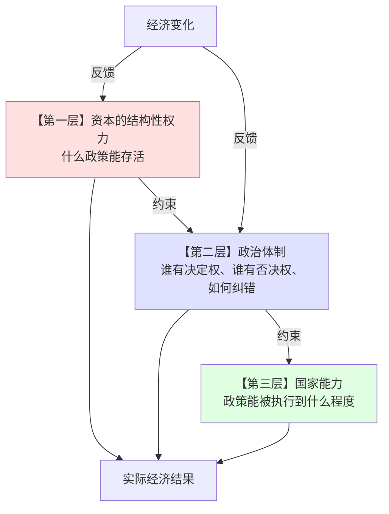

---
tags:
  - 世界经济政治
  - 比较政治经济学
  - 总论
  - 资本与国家
  - 经济政策
  - 政体比较
  - 决策病理
关联:
  - "[[资本与国家的双向选择：结构性权力的三个决定变量]]"
  - "[[美国：多否决点、资本结构性权力与锁定]]"
  - "[[中国：高决断力、低纠错力与急转弯]]"
  - "[[日本：共识决策、拒绝调整与失去的三十年]]"
  - "[[德国：工资节制、欧元与出口依赖]]"
  - "[[韩国：民主化、工资暴涨与内需转型]]"
  - "[[新加坡：可预期性作为资本的核心需求]]"
  - "[[俄罗斯：资源租金、个人化威权与资本的零权力]]"
  - "[[印度：早熟民主、国家能力与资本的戒心]]"
  - "[[拉美：总统制、比例代表与钟摆循环]]"
  - "[[欧元区：没有财政转移的货币联盟]]"
  - "[[储蓄-出口模式的政治经济学：权力、阶级与转型困境]]"
  - "[[土地财政的政治经济学：攫取、崩溃与代际剥削]]"
---

# 总论：资本、政治体制与经济政策

> - **核心问题**：一个国家的经济政策是怎么被决定的？决定它的不是"经济学是否正确"，而是三个层次的约束：**资本能做什么（结构性权力）→ 政体允许谁做决定（决策结构）→ 政策能被执行到什么程度（国家能力）**。本笔记是这一整套分析的总纲。
> - **叙事逻辑**：三个层次的约束 → 因果方向的分解（国家定义规则，资本压缩可行集）→ 政体比较的六个维度与横向总表 → 经济政策如何塑造经济变化（五个传导机制）→ 为什么"好政策"常常无法实施（损失集中、收益分散）→ 制度配套问题 → 中国的位置 → 收束
> - **方法论说明**：本系列的基本方法是**"把政策还原为政治决定的产物"**。不假设政策制定者无知或愚蠢，而是假设**他们在给定的政治结构下做出了理性的选择**——只不过这个"理性"是对政治生存的理性，而不是对经济效率的理性。这个方法的好处是：它把"为什么明知不对还要做"这个伪问题，替换为"什么样的政治结构使这个选择成为理性"这个真问题。
> - **来源标注**：综合本系列十个国家与地区专题；理论基础见 [[资本与国家的双向选择：结构性权力的三个决定变量]]；相关理论框架借自 Lindblom、Hirschman、Hall & Soskice、Linz、Mainwaring & Shugart、Esping-Andersen；综合分析为笔记作者原创，2026-09-20。

---

## 一、三个层次的约束

### 1.1 总框架

**经济政策从来不是"选择最优方案"，而是在三重约束下的一个可行解**：



**三层的含义**：

| 层次 | 内容 | 决定什么 | 谁决定 |
|---|---|---|---|
| **第一层** | **资本的结构性权力** | 可行集（哪些政策根本不在桌上） | 资本流动性、国家融资独立性、对抗力量组织度 |
| **第二层** | **政治体制** | 决策规则（谁能决定、谁能否决） | 历史与制度 |
| **第三层** | **国家能力** | 执行效果（决定了能做到几分） | 官僚素质、财政能力、社会渗透力 |

### 1.2 这三层的独立性与交互

**关键判断**：

> **三层是独立变量，不能互相替代。**
>
> - **有民主（第二层好）+ 无能力（第三层差）= 印度**
> - **有能力（第三层好）+ 无纠错（第二层差）= 中国**
> - **资本权力极高（第一层差）+ 否决点多（第二层差）= 美国**
> - **资本权力被消灭（第一层）+ 有能力（第三层好）+ 无纠错（第二层）= 俄罗斯**

> 📌 **没有任何一个制度能同时在这三层上都占优。**这是本系列最重要的一个结论：
>
> **不存在"好制度"，只存在"配上套的制度"，以及各自的盲点。**

---

## 二、因果方向：国家定义规则，资本压缩可行集

### 2.1 三个层次的拆解

| 层次 | 是什么 | 由谁决定 |
|---|---|---|
| **政治性质（form）** | 谁能做决定、按什么程序、对谁负责 | **国家的历史与制度** |
| **政治内容（content）** | 在可行集内，实际选出哪个方案 | **资本的结构性权力 + 其他有组织利益** |
| **可行集（feasible set）** | 哪些方案根本不在桌上 | **两者长期博弈的产物** |

**核心判断**：

> **国家定义博弈的规则，资本决定是否参与博弈。**
>
> **资本一般不改变"国家的性质"，但它持续改变"国家能做什么"。**

### 2.2 三个决定变量

| # | 变量 | 含义 |
|---|---|---|
| **①** | **资本流动性** | 资本能否"退出"（金融资产可汇出，油田不可移动） |
| **②** | **国家的融资独立性** | 国家是否**必须**靠资本才能运转（有无资源租金、国有银行、土地财政） |
| **③** | **对抗力量的组织度** | 劳动/社会能否抵消资本（工会、选举、媒体） |

**关键推论**：

> **民主不必然削弱资本权力，威权不必然增强国家权力。**
>
> **决定性的不是政体形式，而是"国家是否能在没有资本的情况下活下去"。**

**（详细展开见 [[资本与国家的双向选择：结构性权力的三个决定变量]]。）**

### 2.3 两个必须区分的权力形态

| | 工具性权力 | **结构性权力** |
|---|---|---|
| **形式** | 游说、捐款、旋转门 | **投资决策本身** |
| **是否需要组织** | 需要 | **不需要** |
| **可见性** | 可见 | **不可见** |
| **能否消除** | 能（竞选资金改革） | **不能** |

> **这是本系列最重要的一个理论判断**：
>
> **消除腐败与竞选资金，不能改变分配格局** ——因为它针对的是工具性权力，而真正的约束是结构性的：
>
> **只要投资由私人决定，国家就必须维持商业信心。**

---

## 三、政体比较：六个维度

### 3.1 六个维度

| # | 维度 | 决定什么 |
|---|---|---|
| **①** | **否决点（veto players）** | 能否做出大决策 |
| **②** | **时间视野** | 决策者考虑多久 |
| **③** | **纠错机制** | 错了怎么被发现、被改 |
| **④** | **损失承担者的组织度** | 谁被牺牲、能否反抗 |
| **⑤** | **与资本的关系** | 谁约束谁 |
| **⑥** | **典型病理** | 系统性失灵的形式 |

### 3.2 横向总表（本系列的核心产出）

| 国家/地区 | 否决点 | 时间视野 | 纠错力 | 资本权力 | 典型病理 | 决策形态 |
|---|---|---|---|---|---|---|
| **中国** | 形式无/实质有 | 顶层长/执行短 | **低** | 中（受压制，能用"退出"反击） | **急转弯** | 拖延→急转→硬着陆 |
| **美国** | **极多** | 短（机构补长） | **强** | **极高** | **锁定** | 常规瘫痪+危机狂飙 |
| **日本** | 形式少/实质多 | 长 | 中 | 中（融合） | **僵化** | 共识→无所作为 |
| **德国** | 多 | 长 | 强 | 中（社团主义） | **投资不足** | 规则约束→不能战略投资 |
| **韩国** | 中 | **极短** | **强** | 高（财阀）但被工会抵消 | **极化** | 民主动员→快速分配调整 |
| **新加坡** | 形式无 | **极长** | 中 | 中（**受自我约束**） | 政治封闭 | 技术官僚长期规划 |
| **俄罗斯** | 无 | 短 | **无** | **极低**（被掠夺） | **信息崩溃** | 个人化豪赌 |
| **印度** | 极多 | 短 | 强 | 中低（信心低） | **能力缺失** | 合法但无力执行 |
| **拉美** | 多 | **极短** | 有但反复 | 波动 | **钟摆** | 激进↔紧缩循环 |
| **欧元区** | 多 | 中长 | 中 | 中 | **无调整工具** | 内部贬值 |

### 3.3 三条横贯性结论

**结论一：没有"好制度"，只有"配上套的制度"**

> - **美国的否决点 + 强纠错 + 独立央行** = 稳定但僵化
> - **中国的低否决点 + 弱纠错** = 决断但脆弱
> - **德国的社团主义 + 规则约束** = 高合法性但低灵活性
> - **新加坡的威权 + 高可预期** = 长期规划但政治封闭
>
> **每种组合都有各自的结构性盲点，而盲点正是危机的来源。**

**结论二：所有病理都是"某个利益方拥有事实否决权"**

| 国家 | 谁拥有事实否决权 | 结果 |
|---|---|---|
| **中国** | 顶层 + 体制内既得利益 | 不能改小事 |
| **美国** | 参议院少数 + 利益集团 | 不能改大事 |
| **日本** | 任何受损行业 + 农协 | 不能承担痛苦 |
| **德国** | 宪法法院 + 财政规则 | 不能战略投资 |
| **韩国** | 财阀 + 工会（互相抵消） | 高度极化 |
| **俄罗斯** | 无（所以无纠错） | 灾难性错误 |
| **印度** | 各邦 + 身份团体 | 不能执行 |
| **拉美** | 补贴受益者 + 社会运动 | 不能削减 |

**结论三：政治性质决定"错误的种类"，资本决定"纠正的空间"**

> - 中国会犯"激进的错误"（急转弯）
> - 美国会犯"不作为的错误"（锁定）
> - 日本会犯"拖延的错误"（僵化）
>
> **但所有体制都不能违反"资本必须愿意投资"这个约束。**

---

## 四、经济政策如何塑造经济变化

**这是本系列的核心问题：政策不只是"干预经济"，它通过五个机制塑造经济结构本身。**

### 4.1 机制一：政策塑造分配 → 分配塑造需求结构

```
政策（工资政策、社保、户籍）
  ↓
劳动报酬占 GDP 的比重
  ↓
家庭收入 → 消费能力
  ↓
内需规模
  ↓
增长模式（内需驱动 vs 出口驱动）
```

**典型案例**：

| 国家 | 政策 | 结果 |
|---|---|---|
| **韩国（1987 后）** | 工会合法化 → 工资上涨 | 消费占 GDP 上升 → 内需转型 |
| **德国（1995-2007）** | 哈茨改革 → 工资节制 | 储蓄过剩 → 出口依赖 |
| **中国（1994-）** | 户籍 + 工资压制 + 社保缺失 | 消费占 GDP 38-40% → 出口+投资依赖 |

> 📌 **同一个恒等式（S − I = X − M），不同的政策，不同的结果。**
>
> **政策决定了"储蓄多少"和"投资多少"，因此决定了"出口多少"。**（详见 [[储蓄-出口模式的政治经济学：权力、阶级与转型困境]]）

### 4.2 机制二：政策塑造资产价格 → 资产价格塑造信用 → 信用塑造债务

```
土地政策（垄断供地、招拍挂）
  ↓
地价上涨
  ↓
土地成为抵押品
  ↓
信用创造（银行以土地为抵押放贷）
  ↓
债务扩张
  ↓
投资 → GDP
  ↓
地价进一步上涨（自我强化）
```

**这是中国土地财政的完整链条**（见 [[土地财政的双重依赖：流量与存量的断裂]]）。

**它的崩溃机制**：

> **抵押品价格增速 < 债务利率** → 融资链条自动断裂 → 不需要任何政策触发。

### 4.3 机制三：政策塑造预期 → 预期塑造资本行为

```
政策信号（是否稳定、是否可预期）
  ↓
资本的信心
  ↓
投资决策
  ↓
就业、增长、税收
  ↓
政策的政治可行性
```

**这是 [[新加坡：可预期性作为资本的核心需求]] 的核心命题**：

> **资本不怕高税率、不怕严监管、不怕威权——资本怕"边界可以移动"。**
>
> **一个明确禁止某行业的国家，好过一个随时可能禁止任何行业的国家。**

**中国 2018 年后的变化是这一机制的负面案例**：

| 政策 | 传递的信号 |
|---|---|
| **教培清零（2021）** | "任何行业都可能被一夜清零" |
| **蚂蚁 IPO 叫停（2020）** | "规则可以被临时改变" |
| **游戏版号冻结** | "审批可以无限期延迟" |
| **边控、34 条新规** | "退出可以被阻止" |

> **所以"整顿教培"吓跑的是"做新能源的"** ——**因为它传递的信息是对全部资本的，不只是对教培的。**

### 4.4 机制四：政策塑造激励 → 激励塑造行为 → 行为塑造结构

```
考核指标（GDP、税收、就业）
  ↓
官员行为（招商引资、卖地、上项目）
  ↓
资源配置（资本流向房地产、基建、出口部门）
  ↓
经济结构（房地产占 GDP 25-30%）
  ↓
路径依赖（结构本身成为政治约束）
```

**这是"政策塑造结构"最深的一层**：

> **一旦经济结构形成，它就成为政治约束** ——
>
> **房地产占 GDP 25-30%、土地财政占地方综合财力 16%、相关就业数千万 —— 这些数字使"不救房地产"在政治上不可行。**
>
> **而"救房地产"又使问题继续积累。**
>
> **这就是路径依赖的政治经济学。**

### 4.5 机制五：政策塑造"谁能承担损失"

**这是分配政治的最终落点**：

```
政策的调整方式（渐进 vs 急转）
  ↓
损失的分布（分散 vs 集中）
  ↓
损失承担者的政治权能
  ↓
是否被抗议、被反弹、被阻止
  ↓
下一次调整的方式
```

**典型案例对比**：

| 国家 | 调整方式 | 损失承担者 | 承担者的政治权能 | 结果 |
|---|---|---|---|---|
| **韩国（1987-1995）** | 快速、集中 | 财阀 | 高（可游说） | 妥协（工资上涨但有博弈） |
| **日本（1990-）** | 拖延、不调整 | **分散**（通缩、停滞） | 无（无人被点名） | 三十年停滞 |
| **美国（2008-）** | 快速出清 | **房主、失业者** | **低** | 出清较快，银行无恙 |
| **欧元区（2010-）** | 内部贬值 | **南欧青年** | **低**（只能移民） | 深度萧条十年 |
| **中国（2022-）** | 内部贬值 | **农民工、储户、地方财政** | **低** | 正在进行 |

> 📌 **核心规律**：
>
> **调整的成本不会消失，只会被分配到政治上最无力抵抗的一方。**

### 4.6 五个机制的总结

| 机制 | 政策作用于 | 最终影响 |
|---|---|---|
| **① 分配** | 劳动份额 | 需求结构、增长模式 |
| **② 资产价格** | 抵押品价值 | 信用、债务、杠杆 |
| **③ 预期** | 资本信心 | 投资、就业、增长 |
| **④ 激励** | 官员行为 | 资源配置、经济结构 |
| **⑤ 损失承担** | 调整方式 | 社会成本的分担 |

---

## 五、为什么"好政策"常常无法实施

### 5.1 损失集中、收益分散

**这是理解政策失败的最基本框架**：

| 改革 | 受益者 | 受损者 | 组织度对比 |
|---|---|---|---|
| **提高劳动报酬占比** | 全体劳动者（分散、无组织） | 资本、出口部门（集中、有组织） | **受益者弱，受损者强** |
| **开征房产税** | 无房者、年轻人（分散） | 多套房持有者、官员（集中、有组织） | **同上** |
| **提高征地补偿** | 被征地农民（分散） | 地方政府（集中、有组织） | **同上** |
| **削减能源补贴** | 全体纳税人（分散） | 城市居民（集中、能上街） | **同上** |
| **放开户籍** | 农民工（分散） | 城市居民（集中、有组织） | **同上** |
| **国企改革** | 消费者（分散） | 国企职工与管理者（集中、有组织） | **同上** |

> 📌 **这个模式在几乎所有国家、几乎所有改革中重复出现**：
>
> **受益者是"分散的未来的大多数"，受损者是"集中的当下的少数"。**
>
> **而后者能组织、能游说、能上街、能投票、能抗议。前者不能。**

### 5.2 三个层次的失效方式

**同一个"损失集中、收益分散"的问题，在不同的制度中失效的方式不同**：

| 制度 | 失效方式 | 案例 |
|---|---|---|
| **中国** | 受损者通过非正式渠道阻挠（部门、地方、国企）；顶层不做 → 积累到不可回避 → **急转弯** | 房产税试点十年未推广 |
| **美国** | 受损者通过否决点阻止（参议院、法院、游说）→ **锁定** | 气候立法、枪支管控 |
| **日本** | 受损者通过共识机制拖延 → **僵化** | 银行不良资产处理延误 7 年 |
| **德国** | 受损者通过宪法规则阻止 → **投资不足** | 债务刹车限制公共投资 |
| **印度** | 受损者通过多重否决 + 弱执行 → **无力执行** | 征地、劳工法改革 |
| **拉美** | 受损者通过抗议与选举反弹 → **钟摆** | 阿根廷的补贴改革 |
| **欧元区** | 无调整工具 → 只能靠内部贬值 | 南欧的十年萧条 |

> **这就是为什么同一个"结构性改革做不动"的现象，在不同国家有不同的表现形式——而根源是同一个：**
>
> **改革的成本落在有组织的人身上，收益落在没组织的人身上。**

### 5.3 那什么情况下改革能成

**从本系列的案例中归纳出五个条件**：

| # | 条件 | 案例 |
|---|---|---|
| **① 有一个能代表受损者的组织** | **动员**：如果受损者能组织起来，改革就能推动 | **韩国 1987**：工会合法化后，工人能要求提高工资 |
| **② 危机打破否决点** | **危机**：危机使"不改革"的成本立即可见 | **美国 2008/2020**：数周内数万亿；**欧元区 2012**：德拉吉承诺 |
| **③ 有一个强有力的执行者** | **集中**：单一多数 + 集中决策 | **印度 GST（莫迪）**；**中国的高铁** |
| **④ 补偿机制存在** | **补偿**：让受损者获得部分补偿 | **德国的社团主义协商**（工会接受节制换取就业保障） |
| **⑤ 增长提供缓冲** | **增长**：政策错误可以被增长吸收 | **中国 1990s-2010s**：下岗 3000 万人但经济在增长 |

> 📌 **这五个条件里，③是唯一一个中国充分具备的；①⑤中国不具备；②④部分具备。**
>
> **而①②④是"渐进调整"的条件** ——**这正是中国最缺的。**
>
> **所以中国的改革总是"利用③（集中）和⑤（增长缓冲）来一次性完成"** ——**而这两个恰恰是"急转弯"的燃料。**

---

## 六、制度配套问题

### 6.1 什么是制度配套（institutional complementarities）

> **制度的效率不取决于单个制度是否"好"，而取决于它与其它制度的匹配程度。**
>
> **同一套制度，在不同的配套环境中，效果可以完全相反。**

**验证**：

| 制度 | 在 A 环境 | 在 B 环境 |
|---|---|---|
| **总统制** | 美国：稳定（两党 + 强联邦） | 阿根廷：反复（多党 + 弱政党） |
| **比例代表制** | 德国：稳定（5% 门槛 + 强政党） | 巴西：碎片化（开放名单） |
| **联邦制** | 德国：协调（财政转移机制） | 阿根廷：失控（省份过度借贷） |
| **强工会** | 北欧：合作（集中谈判） | 阿根廷：僵持（补贴无法削减） |
| **土地国有** | **新加坡：补贴居民（建组屋）** | **中国：抽取居民（招拍挂）** |

> **最后一行是最有力的例子**：
>
> **新加坡和中国都垄断土地供给，但一个用它来补贴居民，一个用它来抽取居民。**
>
> **差异的根源不在土地制度，而在政治结构** ——**新加坡需要选票（即使选举不公平，也要维持基本民意基础）；中国的政治约束来自上而非下。**

### 6.2 结论

> **"照搬好制度"总是不成功，因为制度是相互依赖的系统，不是可拼装的零件。**
>
> **这也意味着：没有"最优制度"，只有"与自身历史、社会、国际位置相配的制度"。**

---

## 七、中国的位置

### 7.1 中国在三层约束中的取值

| 层次 | 中国的状况 | 后果 |
|---|---|---|
| **第一层：资本的结构性权力** | **中** ——国家压制资本政治权力，但高度依赖资本的投资功能 | **赢了对决，输了投资** |
| **第二层：政治体制** | **决断力高，纠错力低** | **急转弯** |
| **第三层：国家能力** | **强**（动员、执行、基础设施） | 能做成大事 |

### 7.2 中国的优势与劣势来自同一个特征

> **决策权的高度集中**：
> - 使"能改"成为可能（高铁、产业政策、脱贫、新能源）
> - 使"发现错误"成为不可能（计划生育、房地产、清零）
>
> **这两件事不能被分开评价。你不能只要高铁和产业政策，不要三条红线和清零。**

### 7.3 中国的核心张力

```
决策权集中
  ↓
缺少合法的反对渠道
  ↓
错误信息向上被过滤
  ↓
问题长期积累
  ↓
压力到不可回避
  ↓
急转弯
  ↓
代价由无组织者承担
```

**而增长的放缓使这个张力变得更尖锐**：

> **改革开放四十年的隐含前提是：经济绩效提供了缓冲** ——**政策错误可以被增长吸收。**
>
> **当增长停止提供缓冲时**：
> - **纠错的必要性上升**（问题更严重）
> - **纠错的空间下降**（容错能力更低）
>
> **这两个方向的交叉，就是当前中国政治经济的核心张力。**

### 7.4 与"日本化"判断的衔接

**本系列的结论对"中国会不会日本化"这个问题提供了什么**：

| 维度 | 日本 | 中国 |
|---|---|---|
| **能发现问题吗** | ✅ 能（媒体、学术、选举） | ❌ 不能 |
| **能解决问题吗** | ⚠️ 部分（共识机制阻碍） | ⚠️ 能（但会急转弯） |
| **调整时的发展水平** | **已是发达国家** | **中高收入** |
| **社会安全网** | 全民医保 + 年金 | 覆盖高但待遇低 |
| **人口转变** | 渐进的 | **未富先老，更快** |
| **外部环境** | 友好 | 敌对 |
| **家庭财富** | 相对分散 | **高度集中于房产（60-70%）** |

> **核心判断**：
>
> **"日本化"对中国而言是最好情景之一，不是最坏情景。**
>
> **但它将是"停滞在中等收入"，而不是"停滞在发达国家"** ——**这个差别的量级是巨大的。**

**（详见 [[日本：共识决策、拒绝调整与失去的三十年]] 第六节与 [[中国房地产的终局：城市化幻觉、金融化断裂与资产负债表衰退]] 第八章。）**

---

## 八、收束：八个判断

### 8.1 判断一：经济政策是政治结构的产物，不是经济学结论的应用

> **不存在"正确的政策"，只存在"在给定政治结构中可行的政策"。**
>
> **经济学提供的是"如果这样做会怎样"，政治结构决定的是"能不能这样做"。**

### 8.2 判断二：资本的结构性权力是不可消除的约束

> **它不需要游说、捐款、腐败** ——**它只需要一个事实：投资由私人决定。**
>
> **所以"消除腐败"、"竞选资金改革"、"提高透明度"都不能改变分配格局** ——它们针对的是工具性权力。

### 8.3 判断三：国家的政治性质决定"错误的种类"，资本决定"纠正的空间"

> **中国会犯激进的错误，美国会犯不作为的错误，日本会犯拖延的错误。**
>
> **但所有体制都不能违反"资本必须愿意投资"这个约束。**

### 8.4 判断四：改革失败的根本原因是"损失集中、收益分散"

> **受益者是"分散的未来的大多数"，受损者是"集中的当下的少数"。**
>
> **而后者能组织、能游说、能上街、能投票。前者不能。**
>
> **这个模式在几乎所有国家、几乎所有改革中重复出现** ——**这是政策失败的第一原理。**

### 8.5 判断五：没有"好制度"，只有"配上套的制度"

> **每个制度组合都有各自的结构性盲点，而盲点正是危机的来源。**
>
> **不存在"最优制度"，只存在"与自身历史、社会、国际位置相配的制度"。**

### 8.6 判断六：政策通过五个机制塑造经济，而不是"干预"经济

> **① 分配**（劳动份额 → 需求结构）
> **② 资产价格**（抵押品 → 信用 → 债务）
> **③ 预期**（信心 → 投资）
> **④ 激励**（官员行为 → 资源配置）
> **⑤ 损失承担**（调整方式 → 社会成本分担）
>
> **其中⑤是最难、也最重要的** ——**因为它决定了前四个能否被修正。**

### 8.7 判断七：调整的成本不会消失，只会被分配给最无力抵抗的一方

> **欧元区→南欧青年；美国→房主与失业者；日本→分散的全体（通缩）；中国→农民工、储户、地方财政。**
>
> **这是本系列所有案例中最一致的一条规律。**

### 8.8 判断八：中国的核心张力是"纠错必要性上升 + 纠错空间下降"

> **增长曾提供缓冲，使政策错误可以被吸收。**
>
> **当增长放缓时，纠错的必要性上升（问题更严重），纠错的空间下降（容错能力更低）。**
>
> **这两个方向的交叉，是当前中国政治经济的核心张力** ——**而它没有经济解，只有政治解。**

---

## 九、对中国的三条最终启示

| # | 启示 |
|---|---|
| **1** | **中国最强的能力（决断）与最深的缺陷（无纠错）来自同一个制度特征** ——不能只要前者 |
| **2** | **资本的结构性约束比任何制度约束都有效** ——中国可以对资本赢下每一次对抗，但会输掉投资 |
| **3** | **"渐进调整"需要的不是更好的经济学方案，而是"让受损者能议价、让补偿能发生"的制度空间** ——**而这个空间，正是本系列所有成功案例（韩国 1987、德国社团主义、北欧集中谈判）共有的、而中国缺失的那个东西** |

---

## 数据库索引

| # | 概念 | 类型 | 核心批判点 | 横向关联 | 重要性 |
|---|---|---|---|---|---|
| 1 | 三层约束框架 | 总纲 | 资本 → 政体 → 能力，不可互相替代 | [[资本与国家的双向选择：结构性权力的三个决定变量]] | ⭐⭐⭐⭐⭐ |
| 2 | 国家定义规则，资本压缩可行集 | 因果判断 | 资本不改制度，但改"制度能做什么" | 全部国家专题 | ⭐⭐⭐⭐⭐ |
| 3 | 政体比较六维度与总表 | 比较框架 | 十国横评 | 全部国家专题 | ⭐⭐⭐⭐⭐ |
| 4 | 政策塑造经济的五个机制 | 传导分析 | 分配、资产价格、预期、激励、损失承担 | [[储蓄-出口模式的政治经济学：权力、阶级与转型困境]] | ⭐⭐⭐⭐⭐ |
| 5 | 损失集中、收益分散 | 第一原理 | 政策失败的最基本原因 | [[拉美：总统制、比例代表与钟摆循环]] | ⭐⭐⭐⭐⭐ |
| 6 | 改革成功的五个条件 | 归纳框架 | 动员、危机、集中、补偿、增长 | [[韩国：民主化、工资暴涨与内需转型]] | ⭐⭐⭐⭐⭐ |
| 7 | 制度配套（institutional complementarities） | 理论 | 制度是系统，不是零件 | [[德国：工资节制、欧元与出口依赖]] | ⭐⭐⭐⭐⭐ |
| 8 | 土地国有：新加坡补贴 vs 中国抽取 | 比较 | 同一工具，两个方向，根源在政治结构 | [[新加坡：可预期性作为资本的核心需求]] | ⭐⭐⭐⭐⭐ |
| 9 | 中国：纠错必要性上升 + 空间下降 | 趋势判断 | 增长缓冲消失的后果 | [[中国：高决断力、低纠错力与急转弯]] | ⭐⭐⭐⭐⭐ |
| 10 | 调整成本落在最无力抵抗者 | 规律 | 全系列最一致的规律 | [[欧元区：没有财政转移的货币联盟]] | ⭐⭐⭐⭐⭐ |

---

## 参考来源

**本系列国家与地区专题**

1. [[中国：高决断力、低纠错力与急转弯]]
2. [[美国：多否决点、资本结构性权力与锁定]]
3. [[日本：共识决策、拒绝调整与失去的三十年]]
4. [[德国：工资节制、欧元与出口依赖]]
5. [[韩国：民主化、工资暴涨与内需转型]]
6. [[新加坡：可预期性作为资本的核心需求]]
7. [[俄罗斯：资源租金、个人化威权与资本的零权力]]
8. [[印度：早熟民主、国家能力与资本的戒心]]
9. [[拉美：总统制、比例代表与钟摆循环]]
10. [[欧元区：没有财政转移的货币联盟]]

**理论核心**

11. [[资本与国家的双向选择：结构性权力的三个决定变量]]
12. [[发展型国家到安全型国家：标准转换、成本与不可逆性]]

**理论文献**

12. Lindblom, Charles. *Politics and Markets* (1977)
13. Hirschman, Albert. *Exit, Voice, and Loyalty* (1970)
14. Hall, Peter & Soskice, David. *Varieties of Capitalism* (2001)
15. Linz, Juan. "The Perils of Presidentialism" (1990)
16. Mainwaring, Scott & Shugart, Matthew. *Presidentialism and Democracy in Latin America* (1997)
17. Esping-Andersen, Gøsta. *The Three Worlds of Welfare Capitalism* (1990)
18. Streeck, Wolfgang. *Buying Time* (2014)
19. Rodrik, Dani. *The Globalization Paradox* (2011)

**相关笔记**

20. [[储蓄-出口模式的政治经济学：权力、阶级与转型困境]]
21. [[土地财政的政治经济学：攫取、崩溃与代际剥削]]
22. [[土地财政的双重依赖：流量与存量的断裂]]
23. [[中国房地产的终局：城市化幻觉、金融化断裂与资产负债表衰退]]

24. 整理日期：2026-09-20

---

*本笔记为"资本与政体比较"系列的总论。核心命题是：经济政策是三个层次的约束下的可行解——资本的结构性权力决定可行集，政治体制决定决策规则，国家能力决定执行效果。三者不可互相替代，因此不存在"好制度"，只存在"配上套的制度"及其各自的盲点。版本 v1.0。*
