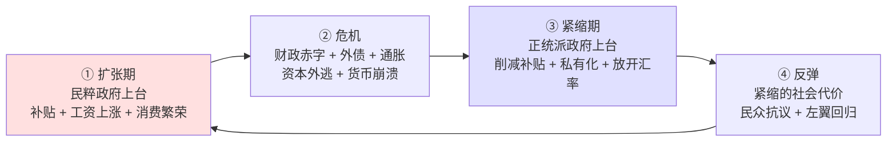

---
tags:
  - 世界经济政治
  - 比较政治经济学
  - 拉美
  - 总统制
  - 比例代表制
  - 钟摆循环
  - 中等收入陷阱
关联:
  - "[[总论：资本、政治体制与经济政策]]"
  - "[[美国：多否决点、资本结构性权力与锁定]]"
  - "[[南亚经济政治：早熟民主、无就业增长与社会断裂]]"
  - "[[储蓄-出口模式的政治经济学：权力、阶级与转型困境]]"
---

# 拉美：总统制、比例代表与钟摆循环

> - **核心问题**：拉美是全球最早民主化的发展中地区，也是分配最不平等、政策最反复的地区。为什么一个拥有选举、政党、工会、媒体的地区，会陷入"激进 → 危机 → 紧缩 → 反弹"的循环长达七十年？**当制度形式上齐全，但配套关系错位时，会发生什么？**
> - **叙事逻辑**：制度配套问题（institutional complementarities）→ 总统制 + 比例代表制 + 弱政党的组合 → 为什么这导致"组合困难" → 钟摆循环的四个阶段 → 工会与社会运动的作用（为什么补贴无法削减）→ 资源与大宗商品的周期叠加 → 三个案例（阿根廷、巴西、智利）→ 与中国和东亚的对照 → 收束
> - **立场说明**：拉美不是"民主失败的证明"，而是**制度配套（institutional complementarities）问题的样本**。它的核心教训是：**民主提供了合法性与纠错渠道，但不提供"形成稳定联盟"的能力**。这一点对中国的研究尤为重要，因为它说明"民主化"本身不是一个答案——韩国（议会制倾向 + 强政党 + 单任期总统）成功转型，阿根廷（总统制 + 比例代表 + 弱政党）反复失败，**差别不在"是否有民主"，在"制度是否配套"**。
> - **来源标注**：ECLAC（拉美经委会）统计、各国央行与统计局数据、World Inequality Database、IDB 与 IMF 报告；理论框架借自 Mainwaring & Shugart《Presidentialism and Democracy in Latin America》、Linz 关于总统制的经典批评、O'Donnell 关于委任制民主（delegative democracy）、Levitsky & Ziblatt《How Democracies Die》；综合分析为笔记作者原创，2026-09-20。

---

## 一、制度配套问题：为什么"全是好零件"却装不出好机器

### 1.1 什么是制度配套（institutional complementarities）

**核心命题**：

> **制度的效率不取决于单个制度是否"好"，而取决于它与其它制度的匹配程度。**
>
> **同一套制度，在不同的配套环境中，效果可以完全相反。**

**一个直观的例子**：

| 制度 | 在 A 环境中的效果 | 在 B 环境中的效果 |
|---|---|---|
| **总统制** | 美国：稳定（两党制 + 强联邦） | 阿根廷：反复（多党制 + 弱联邦） |
| **比例代表制** | 德国：稳定（5% 门槛 + 强政党） | 巴西：碎片化（开放名单 + 弱政党） |
| **联邦制** | 德国：协调（财政转移机制） | 阿根廷：失控（省份过度借贷） |
| **强工会** | 北欧：合作（集中谈判） | 阿根廷：僵持（补贴无法削减） |

> 📌 **这就是为什么"照搬好制度"总是不成功** ——**制度是相互依赖的系统，不是可拼装的零件。**

### 1.2 拉美的制度组合

| 制度 | 拉美的典型形态（尤其南锥体） |
|---|---|
| **政体** | **总统制**（少数例外：智利部分议会化倾向） |
| **选举** | **比例代表制**（多为开放名单） |
| **政党** | **弱、碎片化、个人化**（依赖领袖而非纲领） |
| **地方** | 联邦制（阿根廷、巴西、墨西哥）或强地方传统 |
| **工会** | **强、但是"部门性"的**（控制特定行业的补贴与岗位） |
| **社会运动** | 强（贫民窟组织、原住民运动、失业者运动） |
| **任期** | 总统固定任期，**无议会解散权** |

**这个组合的问题在哪**：见下一节。

---

## 二、总统制 + 比例代表制 + 弱政党：为什么这导致"组合困难"

### 2.1 Linz 的经典批评（1990）

**Juan Linz 论证总统制在民主化国家中更脆弱**，理由有四：

| # | 问题 | 机制 |
|---|---|---|
| **① 双重合法性** | 总统与议会各自有独立的选民授权 | 两者冲突时，没有解决机制（不像议会制有"不信任投票"） |
| **② 固定任期** | 总统任期固定，不能提前大选 | **危机中无法换人，也无法解散议会** |
| **③ 赢者通吃** | 总统选举是零和的（一人胜出） | 输家没有代表权 → 极化 |
| **④ 缺乏灵活性** | 无法像议会制那样灵活重组联盟 | 僵局只能靠"宪法外手段"解决（军事干预、弹劾、街头） |

### 2.2 加上比例代表制的问题

**比例代表制的优点**是代表性（少数派有声音）。**但在弱政党的环境下，它导致**：

| 后果 | 机制 |
|---|---|
| **政党碎片化** | 十几个甚至几十个政党进入议会 |
| **个人化政治** | 开放名单 → 选民投给个人而非政党 → 领袖依附 |
| **联盟不稳定** | 总统必须靠临时联盟执政 → 联盟随时瓦解 |
| **立法瘫痪** | 总统的议案无法通过 → 转而用行政命令 → 下一任推翻 |

### 2.3 组合起来的结果：**"组合困难"**

```
总统制：固定任期 + 双重合法性 + 零和选举
      +
比例代表制：多党碎片化 + 个人化政治
      +
弱政党：无纪律、无纲领、无长期组织
      ↓
总统难以形成稳定的立法多数
      ↓
只能靠行政命令、临时交易、庇护网络执政
      ↓
政策缺乏连续性，无法进行"需要多年才能见效"的改革
      ↓
危机时无法形成"共同承担损失"的联盟
      ↓
政策在"激进"与"紧缩"之间摇摆
      ↓
【钟摆循环】
```

> 📌 **关键判断**：
>
> **这个组合最大的问题是"无法形成稳定的长期联盟"**。
>
> **而所有的结构性改革（税制、教育、养老金、产业政策）都需要"十年以上的稳定联盟"。**
>
> **拉美的制度组合恰恰无法提供这个。**

### 2.4 一个重要的对照：韩国和德国为什么不同

| | 韩国 | 德国 | 拉美典型 |
|---|---|---|---|
| **政体** | 总统制（**单任期 5 年，不得连任**） | **议会制** | 总统制（可连任或长任期） |
| **政党** | **强、有纪律、意识形态清晰** | **强、有纪律** | 弱、个人化 |
| **选举** | 混合制 | 比例代表 + **5% 门槛** | 比例代表（多无门槛） |
| **工会** | **强 + 集中**（KCTU 等） | 强 + 集中（部门谈判） | 强但分散、部门性 |
| **结果** | **成功转型（1987-1995）** | **工资节制 + 稳定** | **钟摆循环** |

> **关键差别不是"是否民主"，而是"政党是否强、工会是否能集中谈判、制度是否配套"。**
>
> **韩国在 1987 后有强政党、集中工会、单任期总统** → **能形成一次性的、强有力的分配转向**（劳动份额 9 年 +13 个百分点）。
>
> **拉美有弱政党、分散工会、双合法性冲突** → **无法形成任何一次持续的改革**。

---

## 三、钟摆循环的四个阶段

**这是拉美政治经济的核心动态**：



### 3.1 四个阶段的详细机制

| 阶段 | 政策 | 受益者 | 受损者 | 政治后果 |
|---|---|---|---|---|
| **① 扩张** | 补贴、涨工资、扩张性财政 | 城市工人、公共部门、中产 | 出口部门、外资、债权人 | 高人气 |
| **② 危机** | 赤字扩大、外债累积、通胀上升 | 债务人、投机者 | 储蓄者、固定收入者 | 资本外逃、货币崩溃 |
| **③ 紧缩** | 削减开支、私有化、放开价格 | 债权人、外资、出口部门 | 工人、公共部门、穷人 | 抗议、社会动荡 |
| **④ 反弹** | 重新扩张 | 回到① | 回到① | 回到① |

### 3.2 为什么补贴无法削减 —— 这是关键

**补贴的受益者是有组织的，且集中在城市**：

| 补贴类型 | 受益者 | 组织度 |
|---|---|---|
| **公共部门工资** | 公务员、教师、国企员工 | **极高**（工会 + 能罢工） |
| **能源补贴** | 城市居民、交通部门 | 高（能上街） |
| **食品补贴** | 城市贫民 | 中（有社区组织） |
| **养老金** | 退休者 | **极高**（投票率高、有组织） |
| **农业补贴** | 小农、部分出口农业 | 中 |

**对照：受损者是谁**？

| 改革方案 | 谁受益 | 谁受损 | 组织度对比 |
|---|---|---|---|
| **削减能源补贴** | 全体纳税人（分散） | 城市居民（集中、能上街） | **受益者无组织，受损者有组织** |
| **削减养老金** | 未来世代（无投票权） | 退休者（有组织、投票率高） | **同上** |
| **开放贸易** | 消费者（分散） | 受保护行业工人（集中） | **同上** |
| **税制改革** | 穷人（分散、无组织） | 富人 + 中产（有组织、能游说） | **同上** |

> 📌 **这就是为什么拉美的改革总是"半途而废"** ——
>
> **每一项必要改革，都是"分散的未来受益者"对决"集中的当下受损者"。**
>
> **而在总统制 + 比例代表 + 弱政党的组合下，没有任何机制能让改革者扛过这个对决。**

### 3.3 一个典型的实例：阿根廷的补贴政治

| 补贴 | 规模（量级） | 政治后果 |
|---|---|---|
| **能源补贴** | 长期占 GDP 的 2-3% | 削减 → 电价气价上涨 → **大规模抗议** |
| **公共交通补贴** | 显著 | 削减 → 票价上涨 → 抗议 |
| **公共部门工资** | 大 | 削减 → **全国罢工** |

**结果**：

> **阿根廷在七十年间反复尝试削减补贴，几乎每次都因抗议而回撤。**
>
> **而补贴的钱从哪来？借债、印钞、征税。**
>
> **三个来源都有极限：债务有极限、印钞导致通胀、征税导致资本外逃。**
>
> **所以循环重复。**

### 3.4 一个常被忽略的叠加因素：大宗商品周期

**拉美的钟摆循环还与大宗商品价格周期同相**：

| 大宗商品价格 | 拉美经济 | 政治 |
|---|---|---|
| **上涨（2003-2011）** | 出口收入大增、无需改革 | **左翼政府扩张福利（"粉红浪潮"）** |
| **下跌（2014-2016）** | 收入锐减、赤字暴露 | **右翼政府紧缩** |
| **再上涨（2021-2022）** | 短期缓解，但通胀压力 | 摇摆 |

> **这使"制度性问题"与"外部周期"重叠** ——
>
> **资源出口型经济（智利铜、巴西铁矿石与大豆、阿根廷大豆、委内瑞拉石油、秘鲁铜）的收入随价格波动，而支出是刚性的。**
>
> **结果：繁荣时不需要改革，衰退时无力改革。**
>
> **这是"资源诅咒"与"制度化无能"的叠加。**

---

## 四、三个案例

### 4.1 阿根廷：钟摆的原型

| 时期 | 政府 | 政策 | 结果 |
|---|---|---|---|
| **1946-1955** | **庇隆** | 国有化、补贴、工资上涨、工业化 | 通胀、外汇短缺 |
| **1955-1973** | 军政府与文官交替 | 摇摆 | 不稳定 |
| **1973-1976** | 庇隆回归 | 再扩张 | 危机 |
| **1976-1983** | **军政府** | 自由化 + 外债 | **1982 马岛战争、债务危机** |
| **1983-1989** | 阿方辛 | 民主化 + 债务危机 | **恶性通胀** |
| **1989-1999** | **梅内姆** | **私有化 + 汇率锚定（1:1 美元）** | 短期成功，**2001 崩溃** |
| **2001-2002** | 危机 | **主权违约、比索崩盘、存款冻结** | 社会动荡、总统连换数人 |
| **2003-2015** | **基什内尔夫妇** | 大宗商品繁荣 + 补贴扩张 | 通胀、外汇管制 |
| **2015-2019** | **马克里** | 改革、放开管制、借外债 | **2018 货币危机、IMF 救助** |
| **2019-2023** | 费尔南德斯 | 回到补贴 + 管制 | 通胀加速 |
| **2023-** | **米莱** | **激进自由化**（美元化主张、削减补贴、取消管制） | **进行中** |

**阿根廷是"钟摆循环"最完整的样本**：七十年间反复在"庇隆主义"与"自由化"之间摆动，**两种模式都失败过，也都未能持续**。

**根本原因**：

> **两种模式都有内在缺陷**：
> - **庇隆主义**：补贴 → 赤字 → 通胀 → 资本外逃
> - **自由化**：紧缩 → 社会抗议 → 政治反弹 → 回撤
>
> **而制度组合（总统制 + 比例代表 + 弱政党 + 强部门工会）使它无法在两者之间找到"渐进调整"的中间路径。**

### 4.2 巴西：碎片化的极致

| 特征 | 内容 |
|---|---|
| **政党数量** | 众议院常有 **20-30 个政党** |
| **选举制度** | **开放名单比例代表制** → 选民投个人而非政党 |
| **后果** | 政党纪律极弱，议员频繁换党 |
| **"总统主义联盟"（presidencialismo de coalizão）** | 总统必须靠**职位与预算分配**收买议员支持 |
| **腐败** | 结构性（这是联盟政治的成本） |

**巴西的关键判断**：

> **巴西的制度组合使"治理"变成了"持续的交易"** ——**总统每天都在购买议员的支持。**
>
> **这带来两个后果**：
> 1. **政策极度短视**（为了当下过关）
> 2. **腐败是系统性的**（不是"坏人"，是"制度要求"）

**巴西也证明了一件事**：

> **在这个制度下，仍然可以进行一些改革（如 1990 年代的雷亚尔计划、2000 年代的社会政策 Bolsa Família）。**
>
> **但需要"总统个人的政治技巧"（如卡多佐、卢拉）** ——**改革依赖个人能力，而不是制度化能力。**
>
> **这是"制度配套"问题的一个变体**：**当制度不能提供稳定性时，只能靠个人弥补，而个人是会换届的。**

### 4.3 智利：部分例外

| 特征 | 内容 |
|---|---|
| **民主传统** | 相对稳定（1932-1973，1990 后） |
| **政党** | **比拉美多数国家更强、更有纪律**（左右两阵营较为稳定） |
| **工会** | 相对集中 |
| **选举制度** | 长期为**两席选区制**（binomial），2015 年后改为比例代表 |
| **资源** | **铜（国有化程度高：CODELCO）** |
| **关键** | **皮诺切特的遗产 + 民主化后的协商** |

**智利的路径很特殊**：

```
1973 政变 → 皮诺切特（1973-1990）→ 激进自由化（芝加哥学派）
  ↓
1990 民主化 → 但保留市场经济的基本框架
  ↓
中左联盟（Concertación）执政 20 年 → 渐进的社会政策
  ↓
2019 社会爆发 → 制宪进程（两次公投均被否决）
  ↓
【结果：渐进但持续，代价是结构性问题积累（养老金、教育、不平等）】
```

**智利的判断**：

> **智利是拉美最成功的案例**（人均 GDP 最高、贫困率最低之一），**但它仍然是"渐进"而不是"转型"** ——
>
> **它没有解决根本的不平等（基尼系数仍高），2019 年的社会爆发证明了这一点。**
>
> **关键条件是它有两党阵营结构（而非碎片化）** ——**这提供了拉美罕见的"稳定的长期联盟"**。

---

## 五、与东亚、中国的对照

### 5.1 拉美 vs 东亚：为什么一个成功一个反复

| 维度 | 东亚（韩国、台湾、日本） | 拉美 |
|---|---|---|
| **起飞期的政体** | **威权发展主义**（能压制消费、集中投资） | 威权与民主交替（政策不连续） |
| **土地改革** | **多数进行过**（日本、韩国、台湾） | **多数未进行**（土地高度集中） |
| **初始不平等** | **低**（土改后） | **极高**（殖民遗产） |
| **工业化方式** | 出口导向（面向外部市场） | 进口替代（面向内部市场） |
| **转型时的政治** | **有强政党/集中工会** → 能形成一次性分配转向 | **弱政党/分散工会** → 无法形成 |
| **结果** | 成功转型为内需经济体 | **钟摆循环** |

**关键差异是"初始不平等"和"土地改革"**：

> **东亚在起飞前进行了土地改革**，这带来了两个后果：
> 1. **初始不平等低** → 增长的收益分配相对均衡 → 社会张力小
> 2. **地主阶级被消灭** → 没有顽固的、反对工业化的既得利益
>
> **拉美没有土改** → 土地高度集中 → 不平等从起点就高 → 政治极化。

> 📌 **这是一个非常深刻的对照**：**东亚的成功不是因为"更民主"，而是因为在起飞前把最不平等的那部分结构拆掉了。**
>
> **韩国 1987 年的民主化能成功推向"工资上涨"，是因为它已经是一个相对平等的社会，工人组织起来的时候要求的只是"更多"，而不是"重新分配一切"。**

### 5.2 拉美的两条路与中国的相关性

| 拉美的路径 | 特征 | 中国的对应 |
|---|---|---|
| **进口替代工业化（ISI）** | 保护国内市场、国企主导、面向内需 | **1950-1978 年的中国**（已证明低效） |
| **初级产品出口 + 外债** | 卖资源、借外债、消费 | ⚠️ **中国部分类似（土地财政 = 卖资源的变体）** |
| **钟摆循环** | 政策反复 | ⚠️ **中国的"急转弯"是它的另一种形态** |

**一个重要的判断**：

> **中国的"急转弯"与拉美的"钟摆"是同一个问题的两种表现**：
>
> **都是"无法进行有补偿的、渐进的、可预期的调整"。**
>
> **区别是**：
> - **拉美**：因为制度过度分散（多党、多否决点、弱政党），**做不成任何决定** → **钟摆**
> - **中国**：因为制度过度集中（无合法反对），**只能做极端决定** → **急转弯**
>
> **两者都避免了"渐进调整"，因为它们都缺少"让受损者议价并获得补偿"的机制。**

---

## 六、收束：五个判断

### 6.1 判断一：民主提供合法性与纠错，但不提供"形成稳定联盟"的能力

> **拉美有选举、有政党、有工会、有媒体——但总统制 + 比例代表 + 弱政党的组合，使它无法形成"十年以上的稳定联盟"。**
>
> **而所有结构性改革都需要这个。**
>
> **这是制度配套问题，不是"民主有没有用"的问题。**

### 6.2 判断二：总统制的双重合法性，在弱政党环境下是致命的

> **总统与议会各有独立的选民授权，冲突时无解决机制。**
>
> **而在议会制下，僵局可以通过"不信任投票 + 提前大选"解决。**
>
> **总统制把僵局变成了制度性的死结。**（这是 Linz 的核心论点，七十年的拉美经验持续验证它。）

### 6.3 判断三：补贴无法削减，因为受益者有组织、受损者没有

> **每一项必要改革，都是"分散的未来受益者"对决"集中的当下受损者"。**
>
> **这解释了"钟摆循环"为什么无法脱离** ——**不是没人知道该怎么做，而是没人能扛过改革的阵痛期。**

### 6.4 判断四：东亚的成功秘密不在民主，在起飞前的平等

> **东亚在起飞前进行了土地改革** → **初始不平等低** → **增长收益分配均衡** → **社会张力小** → **民主化时能形成一次性的分配转向**。
>
> **拉美没有土改** → **起点就不平等** → **政治极化** → **无法形成合作**。
>
> **这是本课题最重要的一个对照** ——**它说明"平等"是"民主能做好分配"的前提条件，而不是结果。**

### 6.5 判断五：钟摆与急转弯是同一个问题的两种形态

> **两者都避免了"渐进调整"。**
>
> **拉美因过度分散而不能决定；中国因过度集中而只能极端决定。**
>
> **共同缺失的是同一个东西：让受损者能够议价、让补偿能够发生的机制。**

---

## 七、对中国的三条直接启示

| # | 启示 |
|---|---|
| **1** | **"民主化"不是一个答案** ——拉美有民主却反复失败，韩国成功是因为政党强、工会集中、且有土改基础 |
| **2** | **结构性改革需要"十年以上的稳定联盟"** ——拉美证明了"没有这种联盟会怎样"（钟摆），中国证明了"过度集中会怎样"（急转弯） |
| **3** | **初始不平等决定了后续一切** ——东亚在起飞前拆掉了最不平等的结构（土地集中），拉美没有。**这是最不可逆、也最重要的一项差异** |

---

## 数据库索引

| # | 概念 | 类型 | 核心批判点 | 横向关联 | 重要性 |
|---|---|---|---|---|---|
| 1 | 制度配套（institutional complementarities） | 理论核心 | 制度是系统，不是可拼装的零件 | [[总论：资本、政治体制与经济政策]] | ⭐⭐⭐⭐⭐ |
| 2 | 总统制的双重合法性 | 制度分析 | 冲突无解决机制 | [[美国：多否决点、资本结构性权力与锁定]] | ⭐⭐⭐⭐⭐ |
| 3 | 钟摆循环的四个阶段 | 动态模型 | 扩张→危机→紧缩→反弹 | [[储蓄-出口模式的政治经济学：权力、阶级与转型困境]] | ⭐⭐⭐⭐⭐ |
| 4 | 补贴无法削减的结构 | 分配分析 | 受益者有组织，受损者无组织 | [[德国：工资节制、欧元与出口依赖]] | ⭐⭐⭐⭐⭐ |
| 5 | 大宗商品周期与政治周期同相 | 外部因素 | 繁荣时不需要改革，衰退时无力改革 | [[俄罗斯：资源租金、个人化威权与资本的零权力]] | ⭐⭐⭐⭐ |
| 6 | 土地改革 → 初始平等 → 成功的民主化 | 比较判断 | 平等是民主能做好分配的前提 | [[韩国：民主化、工资暴涨与内需转型]] | ⭐⭐⭐⭐⭐ |
| 7 | 巴西的"总统主义联盟" | 案例分析 | 治理变成持续交易，腐败是系统性的 | [[南亚经济政治：早熟民主、无就业增长与社会断裂]] | ⭐⭐⭐⭐ |
| 8 | 钟摆 vs 急转弯 | 比较判断 | 同一个问题的两种形态 | [[中国：高决断力、低纠错力与急转弯]] | ⭐⭐⭐⭐⭐ |

---

## 参考来源

1. ECLAC（拉美经委会）：统计年鉴、社会全景（Social Panorama）
2. 各国统计局与中央银行：阿根廷 INDEC、巴西 IBGE、智利 BCCh
3. World Inequality Database（WID）：拉美分配数据
4. IDB（美洲开发银行）：发展报告
5. IMF：Article IV Reports（阿根廷、巴西、智利等）
6. Linz, Juan. "The Perils of Presidentialism" (1990)
7. Mainwaring, Scott & Shugart, Matthew. *Presidentialism and Democracy in Latin America* (1997)
8. O'Donnell, Guillermo. "Delegative Democracy" (1994)
9. Levitsky, Steven & Ziblatt, Daniel. *How Democracies Die* (2018)
10. 整理日期：2026-09-20

---

*本笔记为 [[总论：资本、政治体制与经济政策]] 的地区专题之一，主题是"钟摆循环"——当制度形式齐全但配套错位时，一个社会如何长期无法形成"共同承担损失"的联盟。版本 v1.0。*
