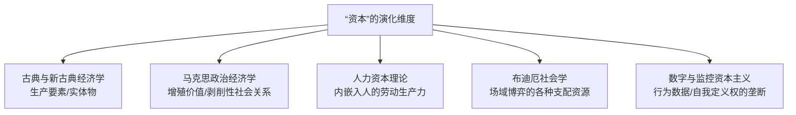

---
tags:
  - 世界经济政治
  - 经济思想史
  - 社会学理论
  - 资本主义批判
关联:
  - "[[资本主义与自我定义权的垄断：从收割劳动到收割自我]]"
  - "[[世界经济政治/政治哲学/布迪厄研究/皮埃尔·布迪厄的社会学理论.md]]"
  - "[[监控资本主义：行为剩余、工具主义权力与从预测到操纵]]"
  - "[[金融体系如何服务经济发展：资本市场水循环模型]]"
  - "[[心理学/本科生欲望分化与文化资本避险.md]]"
---
# 资本的多维概念与跨学科比较

> - **导言**：“资本（Capital）”是现代社会科学中最核心、却也最容易被误读的概念之一。在日常语境中，它常被窄化为“资金”或“金融资产”；但在经济学、社会学和政治经济学的跨学科谱系中，资本的概念经历了几次深刻的范式转换——从**生产工具（物）**，到**社会关系（人与人）**，再到**博弈筹码（文化符号）**以及**行为剩余（人脑与欲望）**。理解资本的多维面向，是剖析现代存量相变与社会博弈的关键钥匙。

---

## 一、五大核心语境下的“资本”概念定位

### 1. 古典与新古典经济学：作为“生产要素”的物理资产

* **代表人物**：亚当·斯密、大卫·李嘉图、阿尔弗雷德·马歇尔。
* **核心定义**：资本是与“劳动”和“土地”并列的**基本生产要素**之一，特指人类劳动制造出来的、用于进一步生产其他商品和服务的实物和金融资产（如机器、厂房、设备、原材料以及营运资金）。
* **理论核心**：强调**效率、配置与流动的循环**。在此框架中，资本被视作中立的效率工具，其增值源自“资本的边际生产力”或者对即时消费推迟（等待）的报酬。

### 2. 马克思主义政治经济学：作为“剩余价值榨取关系”的社会中介

* **代表人物**：卡尔·马克思。
* **核心定义**：资本不是单纯的“物”（机器在没有雇佣劳动结合时只是废铁），而是一种**以物为中介的、特定的历史性社会生产关系**。它是“能够带来剩余价值的价值”。
* **理论核心**：通过“货币-商品-增殖货币（G - W - G'）”的运动，资本家在市场上购买工人的劳动力（可变资本 $v$）并结合生产资料（不变资本 $c$），在劳动过程中无偿占有工人的剩余价值（$s$）。资本的生命力在于其**无休止的自我增殖和对雇佣劳动的剥削**。

### 3. 人力资本理论：作为“生产力投资”的人身载体

* **代表人物**：西奥多·舒尔茨、加里·贝克尔。
* **核心定义**：资本不仅存在于人之外（如厂房机器），更可以通过教育、培训、医疗健康投资等，**内嵌于劳动者自己身体中**，转化为提升生产率和未来获取更高收入的能力。
* **理论核心**：将**劳动者自身“资本化”**。这一理论试图打破马克思关于“资本对立于劳动”的论断，宣称劳动者可以通过自我投资拥有自己的“资本”（人力资本），从而在市场上获得相应的增值回报。

### 4. 布迪厄的社会学理论：作为“场域斗争砝码”的多维资源

* **代表人物**：皮埃尔·布迪厄。
* **核心定义**：资本是个人在特定的社会**场域（Field）**中积累的、可用以争夺统治权力和维持阶级差异的各种形式的资源。
* **理论核心**：资本是多维度的，且可相互兑换：
  * **经济资本**：金钱与物质财产。
  * **文化资本**：内化的文化品味（惯习）、制度化的学历文凭、客观化的书籍艺术品。
  * **社会资本**：关系网络与社会声誉（“人脉/圈子”）。
  * **符号资本**：获得社会承认、披上“合法性”外衣的上述资本（如声望、权威）。加入
  * 参见专有笔记：[[世界经济政治/政治哲学/布迪厄研究/皮埃尔·布迪厄的社会学理论.md]]。

### 5. 数字与监控资本主义：作为“行为剩余与意识垄断”的机器

* **代表人物**：肖莎娜·祖博夫、让·鲍德里亚。
* **核心定义**：在数据与智能推送时代，资本的收割边界向人的内心无限折叠，演化为对**人类行为剩余数据**以及**“我是谁、什么算成功”定义权**的垄断。
* **理论核心**：资本的核心增殖不再依赖厂房或单纯的体力压榨，而是通过窃取用户的注意力、搜索痕迹和情绪起伏，预测并操纵其未来消费（监控资本主义），并将反抗本身也收编为“身份政治商品”。
  * 参见专有笔记：[[监控资本主义：行为剩余、工具主义权力与从预测到操纵]] 和 [[资本主义与自我定义权的垄断：从收割劳动到收割自我]]。

---

## 二、不同语境下“资本”的异同点剖析

| 比较维度             | 古典/新古典经济学                      | 马克思主义政治经济学                       | 人力资本理论                                       | 布迪厄社会学理论                                       | 监控资本主义                                     |
| :------------------- | :------------------------------------- | :----------------------------------------- | :------------------------------------------------- | :----------------------------------------------------- | :----------------------------------------------- |
| **资本的载体** | 厂房、机器、金融资产                   | 商品流、生产资料、雇佣劳动                 | 劳动者的智商、技能、健康                           | 惯习、学历、社会人脉、名望                             | 用户的注意力、行为剩余、人设                     |
| **增殖源泉**   | 边际生产力与资本配置效率               | 榨取工人的**无偿剩余劳动**           | 个人生产效率的投资回报率                           | 场域中**排他性优势的兑换**                       | 算法对行为的预测与情绪回收                       |
| **阶级属性**   | **中立**（是市场要素的合理回报） | **绝对对抗**（资本家对无产者的剥削） | **弱化**（人人都可以通过奋斗成为资本持有者） | **隐蔽与代际传递**（通过符号暴力完成阶级再生产） | **行为奴役**（算法所有者对人类自我的殖民） |

### 1. 相同点：资本运行的共同“底层代码”

* **增殖性（累积逻辑）**：无论是购买机器、购买劳动力，还是考取名校学历、积攒粉丝量，资本的本性都是“为了多而投入”。它拒绝停滞，停滞即意味着贬值与死亡。
* **支配性（权力格局）**：拥有资本意味着在博弈中占有先手。古典资本雇佣劳动，布迪厄的文化资本拥有者通过 Doxa（常识）对底层施加符号暴力，算法拥有者利用算力操纵用户的选择。**资本永远在重塑支配与顺从的社会格局**。
* **可转化性（水循环模型）**：各形态资本并非孤立，而是像“水循环”一样可以相互兑换：
  $$
  \text{经济资本} \xrightarrow{\text{购买私立名校}} \text{文化资本} \xrightarrow{\text{结交同学网络}} \text{社会资本} \xrightarrow{\text{垄断高端就业}} \text{经济资本}
  $$

  * 参见：[[金融体系如何服务经济发展：资本市场水循环模型]] 和 [[心理学/本科生欲望分化与文化资本避险.md]]。

### 2. 差异点：范式碰撞的本质冲突

* **物与社会关系的对立**：
  * 主流经济学将资本“物化（Fetishism）”，探讨如何优化机器与资金的配比；
  * 马克思与布迪厄则将资本“社会化”，解构出其背后隐藏的**剥削关系、统治同盟与不平等的合法化外衣**。
* **资本“在人身外”与“入人身内”的裂变**：
  * 传统的物质资本与金融资本独立于肉体之外，容易被继承、收买或通过革命剥夺；
  * 而“人力资本”和布迪厄的“文化资本（惯习）”则长在人的血肉之躯中，其继承和传递被隐藏在“家庭氛围”和“个人天资”的伪装之下，因而具有更强的隐蔽性和代际粘性。
* **物理榨取向心智榨取的推进**：
  * 前三次工业革命的核心是榨取人身之外的自然资源以及人身上的体力、时间（榨取劳动与消费）；
  * 当代资本的榨取前线则深入到了**人的定义权和主体性**，资本的核心功能从“制造机器去生产产品”转变为“将人本身改造成机器以配合系统”（自我殖民）。

---

## 三、结语：存量相变下的“资本”新动态

在当下增长熄火、进入“存量相变”的时期，各语境下的资本概念正在发生有趣的合流：

1. **人力资本的贬值**：由于“精英过剩”，传统的“教育投资（人力/文化资本）”回报率暴跌，大量本科生面临“持证落空”的困境，不得不寻找文化资本避险。
2. **符号资本对经济资本的收编**：在互联网平台，拥有“象征/符号资本”（流量、粉丝、网络人设）的人，能够以极快的速度将其变现为经济资本，甚至将传统实体经济挤压出局。
3. **自我定义的最后争夺**：当劳动与消费的剩余空间所剩无几，资本开始收割我们的奋斗、焦虑与愤怒，通过将情绪产品化来延长其增殖的生命周期。
