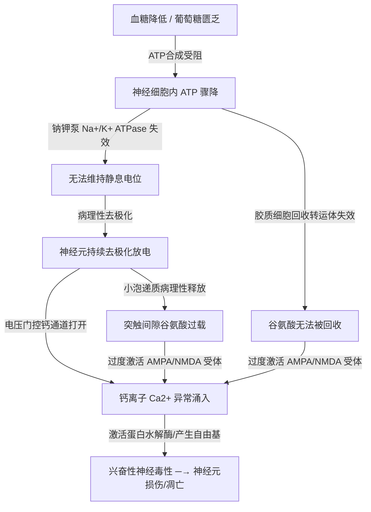

---
tags:
  - 心理学
  - 神经科学
  - 生理学
  - 能量代谢
  - 应激反应
  - ADHD
关联笔记:
  - "[[心理学/血清素系统、HPA轴与杏仁核恐惧回路.md]]"
  - "[[心理学/ADHD神经递质机制.md]]"
  - "[[心理学/长时程增强LTP与突触可塑性.md]]"
---

# 低血糖状态下的脑神经生理与病理机制

大脑是人体对血糖变化最敏感的器官。虽然脑重仅占体重的 2%，但它消耗了全身约 **20% 的葡萄糖**与 15% 的氧气。神经元几乎没有糖原储备（仅星形胶质细胞有极微量储备），且无法直接利用脂肪酸。因此，大脑是一个完全依赖血液循环持续输送葡萄糖的**“强迫性葡萄糖消费者”**。

当血糖降低（低血糖状态）时，脑神经元和神经回路会经历从**功能代偿、应激激活**到**病理性损伤**的一系列剧烈变化。

---

## 一、 核心神经细胞层面的病理机制

随着葡萄糖供应的匮乏，神经元会经历严重的“能量危机”，引发一系列级联电生理和化学反应：



### 1.1 钠钾泵（Na⁺/K⁺ ATPase）失效与细胞去极化
神经元消耗的能量中，有 50% 以上被用于驱动**钠钾泵**，以维持维持 $-70\text{ mV}$ 的静息膜电位。
当 ATP 因缺糖而生成不足时，钠钾泵停转，细胞内的钾离子外流，细胞外的钠离子大量内流，导致**神经元发生持续的病理性去极化**。这导致神经元无法维持正常的信号传导，产生电活动紊乱。

### 1.2 谷氨酸兴奋性毒性（Excitotoxicity）
去极化导致突触前膜的电压门控钙通道打开，以及星形胶质细胞上的 ATP 驱动型谷氨酸回收转运体（EAATs）因缺能而停摆。
* **结果**：大量**谷氨酸（Glutamate）**滞留在突触间隙，突触后膜上的 **AMPA 和 NMDA 受体被过度、持续激活**。
* **致命伤害**：NMDA 通道的持续开启导致大量的 $Ca^{2+}$ 洪流无节制地涌入突触后细胞。这会激活细胞内的一系列破坏性酶（如钙蛋白酶、半胱天冬酶），产生大量活性氧（自由基），直接导致**神经元结构崩解与坏死**。

### 1.3 递质合成中断
葡萄糖代谢产生的乙酰辅酶 A（Acetyl-CoA）是合成**乙酰胆碱（ACh）**的原料；同时，单胺类递质（多巴胺、去甲肾上腺素）的合成与包装（VMAT2）也是高耗能过程。
血糖不足会直接导致中枢**乙酰胆碱合成急剧减少**，这是低血糖引起急性认知功能障碍、意识模糊和脑雾的核心原因。

---

## 二、 神经网络与脑区的宏观变化

低血糖不仅破坏单个细胞，还会深刻改变脑区之间的协作关系：

### 2.1 前额叶皮层（PFC）急性“断电”
前额叶（PFC）是进化上最新、耗能最高的高级认知区域，专门负责工作记忆、抑制控制、未来决策和情绪调节。
* **优先度牺牲**：在低血糖危机中，大脑会启动“生存优先”策略，将残存的能量向维持基础生命活动的中脑和脑干倾斜。
* **认知失控**：PFC 是最先被断能的区域。这导致其对下游脑区（如杏仁核）的**自上而下抑制（Top-down inhibition）瞬间瓦解**，表现为自控力消失、多任务处理能力归零、情绪极度易怒和急躁。

### 2.2 边缘系统（杏仁核与下丘脑）的过度激活
下丘脑的血糖感受神经元（主要是葡萄糖兴奋性 GE 神经元与葡萄糖抑制性 GI 神经元）感知到血糖下跌，立即触发“生存恐慌”：
* **蓝斑核（LC）唤醒**：下丘脑激活脑干蓝斑核，引发去甲肾上腺素（NE）风暴。
* **杏仁核失控**：在失去 PFC 抑制且 NE 浓度飙升的状况下，杏仁核对环境中的危险信号高敏，放大恐惧感、警惕感，并诱发“非理性的受害者剧本”和战斗/逃跑冲动（Flight or Fight）。

---

## 三、 自主神经应激与外周躯体化表现

低血糖是严重的生存危机，下丘脑会通过激活**交感-肾上腺髓质轴（SAM）**和**下丘脑-垂体-肾上腺轴（HPA轴）**来进行血糖拮抗调控：

```
 血糖低 ──→ 下丘脑监测 ──→ 激活交感神经 & HPA轴 ──→ 爆发应激激素（肾上腺素、去甲肾上腺素、皮质醇）
                                                             │
           ┌─────────────────────────────────────────────────┘
           ▼
 【外周躯体化表现】
 震颤（手抖）、出汗、心悸（心跳加快）、饥饿感、面色苍白（外周血管收缩）
```

* **神经性缺糖症状（Neuroglycopenia）**：脑细胞直接缺糖导致的症状，如头痛、脑雾、视物模糊、言语不清、意识错乱。
* **肾上腺素能症状（Adrenergic Symptoms）**：应激激素释放导致的症状。许多患者在血糖偏低时感到的“莫名恐慌”、“心慌”和“濒死感”，实际上是**大脑内部去甲肾上腺素（NE）和外周肾上腺素暴增所引起的生理性焦虑**，而非真正的心理危机。

---

## 四、 血糖降低的时间与浓度临界点：何时会造成神经元损伤？

日常因饥饿或反应性低血糖引起的轻中度血糖波动，**绝对不会**造成脑神经元损伤。大脑只有在**血糖极低（通常低于 $1.0\text{ mmol/L}$）且伴随持续性深度昏迷**的极端状态下，才会开始出现不可逆的神经元死亡。

这一过程存在明确的血糖浓度阈值与时间窗口：

### 4.1 血糖浓度阈值与大脑状态对应表

| 血糖浓度 (mmol/L) | 大脑生理状态 | 神经损伤风险 |
| :--- | :--- | :--- |
| **正常空腹** <br/> $3.9 \sim 6.1$ | 大脑正常耗能，各项认知与执行功能正常运转。 | **无风险** |
| **轻度低血糖** <br/> $3.0 \sim 3.9$ | 激活交感神经，蓝斑核释放去甲肾上腺素（手抖、心慌、警觉）。 | **无风险**（属于生理性代偿预警） |
| **中度低血糖** <br/> $2.0 \sim 3.0$ | 前额叶（PFC）断电保护，脑雾明显，工作记忆归零，嗜睡。 | **无风险**（神经元未受实质结构损害） |
| **重度低血糖** <br/> $1.0 \sim 2.0$ | 出现意识模糊、谵妄、局灶性神经定位体征、抽搐或木僵。 | **极低**（若在短时间内迅速纠正，可完全恢复） |
| **极重度低血糖** <br/> $< 1.0$ | **等电位低血糖昏迷（Isoelectric Coma）**：脑电波（EEG）变平，脑内葡萄糖和糖原储备彻底枯竭。 | **分水岭**（神经元损伤取决于昏迷持续时间） |

### 4.2 神经元开始死亡的“时间窗口”（在等电位昏迷状态下）

当血糖降低到脑电波变平（$< 1.0\text{ mmol/L}$）并陷入昏迷后，损伤的发生以分钟为单位演进：

1. **第 1 $\sim$ 30 分钟（安全窗口）**：
   此时虽然神经电活动停止（处于昏迷状态），但细胞内的 ATP 尚未彻底耗竭。若在此期间迅速静脉注射葡萄糖或注射胰高血糖素，血糖恢复后**大脑功能可百分之百完全恢复，不留任何神经元死亡或永久性结构受损**。
2. **第 30 $\sim$ 60 分钟（损伤开始，分子临界点）**：
   * **机制**：昏迷持续 30 分钟后，细胞内的 ATP 彻底归零，钠钾泵彻底瘫痪，细胞发生完全去极化。这引爆了前述的**谷氨酸突触大泄露**。
   * **损伤分布**：NMDA 受体过度激活导致 $Ca^{2+}$ 极速超载。**海马体 CA1 区（负责长期记忆形成）**和**大脑皮层第 3、5 层（负责高级认知）**的神经元由于对缺能最为敏感，开始发生不可逆的坏死与凋亡。
3. **超过 60 分钟（严重永久性损伤）**：
   大面积皮层神经元不可逆坏死，血脑屏障彻底崩溃，伴随严重的脑水肿。此时即使恢复血糖，患者也会留下严重的永久性认知/记忆障碍，甚至退化为植物人状态或导致脑死亡。

> [!IMPORTANT]
> **结论澄清**：日常因少吃一顿饭导致的头晕、暴躁、发抖，血糖通常在 $2.8 \sim 3.5\text{ mmol/L}$ 之间，**离神经元受损的“等电位昏迷（$< 1.0\text{ mmol/L}$）”还有巨大的安全鸿沟**。身体有极强的拮抗机制保证血糖不跌入危险深渊，无需为此产生健康焦虑。

---

## 五、 脑的应急燃料：星形胶质细胞的代偿

在血糖降低的初期，大脑并不会立即崩溃，而是依赖胶质细胞进行紧急代偿：

1. **糖原分解**：大脑中唯一的糖原储备存在于**星形胶质细胞**中。
2. **乳酸穿梭（ANLS）**：星形胶质细胞通过糖原分解产生**乳酸（Lactate）**，并通过单羧酸转运体（MCTs）将乳酸输送给临近的神经元。
3. **神经元供能**：神经元将乳酸转化为丙酮酸，进入三羧酸循环合成 ATP。这被称为“星形胶质细胞-神经元乳酸穿梭（Astrocyte-Neuron Lactate Shuttle, ANLS）”，能为神经元提供数十分钟的临时能量缓冲，但容量极其有限。

---

## 六、 临床与个人管理启示（ADHD 与情绪调节）

对于具有 ADHD 特征或情绪敏感度高（如 RSD）的个体，血糖波动具有双重的破坏力：

| 维度 | 低血糖状态下的表现机制 |
| :--- | :--- |
| **ADHD 症状全面放大** | ADHD 的核心瓶颈在于前额叶（PFC）的多巴胺/去甲肾上腺素调控不足，执行功能本来就处于脆弱平衡。低血糖导致的 PFC 断能，会使原有的注意力不集中、多动、拖延、脑雾呈**指数级加重**。 |
| **“假性”情绪崩溃与内耗** | 血糖偏低引发的 HPA 轴和交感神经激活，会带来极度类似于“焦虑症发作”的躯体感（心慌、发抖）。高共情和高敏感大脑极易对此进行**元认知误读**——将“生理性缺能”误读为“我的生活一团糟/对方不爱我/我被遗弃了”，从而启动负面 DMN 进行疯狂反刍，诱发真实的情绪崩溃。 |
| **成瘾性“多巴胺代偿”的渴望** | 能量匮乏时，大脑奖赏回路会对高能、即时奖励（如高糖食物、快速多巴胺释放的 PMO/游戏行为）产生超乎寻常的病理性渴求，此时意志力（PFC）又处于下线状态，极易导致冲动控制彻底失守。 |

### 6.1 血糖波动管理指南（饮食篇）

为了维持前额叶稳定的能量与多巴胺供给，应规避反应性低血糖（餐后血糖暴跌），重建饮食结构：

#### 🚫 高升糖指数（High-GI）食物避坑清单（易引发血糖剧烈波动）：
* **精制碳水化合物**：白米饭、白面条、白馒头、白面包、即食燕麦片、年糕。
* **添加糖与甜食**：奶茶、碳酸饮料、加工果汁（脱去膳食纤维的糖水）、蛋糕、饼干、巧克力及甜点。
* **部分高糖果蔬及加工淀粉**：西瓜、荔枝、龙眼、即食土豆泥、烤红薯。
* **加工膨化食品**：薯片、爆米花、虾条等。

#### 🛡️ 建议的稳糖饮食（多巴胺与能量双赢）：
* **缓释碳水（Low-GI/复合碳水）**：燕麦（钢切或燕麦粒）、糙米、藜麦、荞麦、全麦面包、杂豆类（红豆、绿豆、鹰嘴豆）。它们水解缓慢，为大脑提供平稳、持续的葡萄糖。
* **优质蛋白质（神经递质的基石原料）**：鸡胸肉、鱼类、瘦牛肉、鸡蛋、豆腐、无糖希腊酸奶。蛋白质能延缓碳水吸收，且富含酪氨酸（多巴胺前体）和色氨酸（血清素前体）。
* **健康脂肪（髓鞘维护与长效饱腹感）**：牛油果、原味坚果（富含合成多巴胺的辅因子铁、镁）、优质橄榄油、深海鱼油（Omega-3 脂肪酸）。
* **进食策略（平抑血糖曲线）**：
  * **控糖进食顺序**：先吃膳食纤维（蔬菜） ─→ 再吃蛋白质与脂肪（肉蛋豆腐） ─→ 最后吃碳水化合物。此顺序可大幅拉平餐后血糖上升斜率。
  * **规律进食**：避免长时间空腹导致血糖断崖式下跌，可以在两餐之间适量补充坚果作为加餐。

### 6.2 鉴别诊断：如何判断当前的脑雾/情绪是“血糖低”还是“神经/心理因素（如 RSD）”？

当内耗或情绪崩溃袭来时，通过以下四个维度进行元认知诊断，避免将“生理缺能”误读为“心理危机”：

| 维度 | 低血糖（Hypoglycemia）引起的 | RSD / 神经心理因素（如感情冲突）引起的 |
| :--- | :--- | :--- |
| **1. 核心诱因** | **生理时钟强相关**：通常发生在**空腹/未进食 3-5 小时后**，或者摄入高 GI 垃圾食品后 2 小时左右（胰岛素反弹导致的反应性低血糖）。 | **事件/关系强相关**：通常有**明确的外界人际刺激源**（如对方的一句冷淡回复、约定被打破、演讲中的一次小卡壳）。 |
| **2. 躯体化特征** | **交感神经兴奋表现**：常伴有**手抖（指端震颤）、冷汗、心慌虚脱感、胃部空洞的饥饿感**。没有物理性的“胸口发紧”。 | **情绪躯体化表现**：多表现为**胸口沉重、喉咙发紧、胃部紧缩性绞痛**。通常不伴有手抖或冷汗，心慌呈“焦虑性跳动”而非虚脱。 |
| **3. 进食测试<br/>（最快诊断法）** | **“立竿见影”效应**：口服 15-20g 快速碳水（如两块糖、一杯果汁或几口面包）后，**15 分钟内脑雾显著消退，坏情绪平复**，世界重新恢复色彩。 | **无反应或仅短暂安慰**：进食后（即使吃了高糖），虽然有多巴胺的短暂反弹，但**核心的情绪痛苦（如被遗弃感、难过、愤怒）依然无法消除**，内耗继续运行。 |
| **4. 认知表现特征** | **单纯的认知降级**：大脑“转不动”、阅读困难、哈欠连天、思维呈**“散沙状”**（TPN 和 DMN 都因为缺能而难以运行）。 | **选择性的偏执与反刍**：大脑在特定负面事件上超聚焦（DMN 脱缰），产生强迫性反刍，思维呈**“火山口喷发状”**而非散沙状。 |

> [!TIP]
> **黄金元认知规则**：当你不确定自己是“心理崩溃”还是“生理低糖”时，**“先吃为敬”**。喝一杯温水，吃一小份缓释碳水配合蛋白质，静候 15 分钟。如果情绪奇迹般平复，说明刚才只是一次大脑缺油的“假警报”。

---

## 七、 高 GI 饮食为何让你更容易感到饿：胰岛素的恶性循环

### 7.1 反应性低血糖驱动的"假性饥饿"

高 GI 饮食引发的饥饿感，并不是真实的能量耗竭信号，而是胰岛素过量矫正所制造的**生化假警报**：

```
摄入高 GI 食物 (t=0)
    ↓
血糖急速升高（尖刺型曲线）
    ↓
胰腺 Beta 细胞过量分泌胰岛素（超矫正/预期性过激）
    ↓
血糖在 60 ~ 90 分钟内骤降至低于摄食前基线
    ↓
下丘脑弓形核（ARC）的饥饿感神经元（NPY / AgRP 神经元）被强烈激活
    ↓
产生强烈"饥饿感"—— 但距离上次进食不过 1 ~ 2 小时
```

这种饥饿是**由胰岛素引发的生化假信号**，与真实的能量耗竭无关。体内实际上仍有充足的糖原和脂肪储备，但低血糖信号让下丘脑误判为"面临饥荒"，驱使大脑执行高热量食物的觅食行为。

### 7.2 慢性高胰岛素血症抵抗瘦素（Leptin Resistance）

**瘦素（Leptin）** 是脂肪细胞分泌的"饱腹感激素"，其功能是向下丘脑通报"能量储备充足，停止进食"。

长期高 GI 饮食导致**慢性高胰岛素血症**，胰岛素与瘦素在受体下游共享 IRS-1 / PI3K 信号通路，持续高胰岛素会使该通路脱敏，进而削弱下丘脑对瘦素信号的响应能力：

* **结果**：脂肪细胞在分泌充足瘦素、说"我已经饱了"，但下丘脑的瘦素受体接收不到信号，仍驱动进食冲动。
* **长期后果**：瘦素抵抗是肥胖与代谢综合征的核心恶性循环之一，并随时间进行性加重。

### 7.3 Ghrelin（胃饥饿素）节律紊乱

**Ghrelin** 是驱动饥饿感的直接外周激素，正常情况下在进食后迅速被抑制。高 GI 饮食引发的血糖大幅波动，会**异常重置 Ghrelin 的分泌节律**，使进食后 Ghrelin 回弹速度过快，导致"刚吃完不久又感到饥饿"，形成持续的觅食冲动驱动。

---

## 八、 胰岛素如何直接影响意识与感觉

胰岛素并不只是外周的"血糖搬运工"。大脑本身存在大量的**中枢胰岛素受体**，胰岛素在神经系统内扮演着超出代谢调控的复杂神经信号角色。

### 8.1 胰岛素对多巴胺系统的调控：影响动机与愉悦感

胰岛素受体在**伏隔核（NAc）和腹侧被盖区（VTA）**高度表达，这两个区域是奖赏回路的核心：

| 状态 | 神经化学变化 | 主观体验 |
| :--- | :--- | :--- |
| **血糖骤升后（急性高胰岛素期）** | 胰岛素短暂增强 VTA 多巴胺神经元活性，促进 DA 释放 | 进食后的短暂愉悦感、满足感（"吃甜食会开心"的神经基础） |
| **慢性高胰岛素血症** | 胰岛素上调多巴胺转运体（DAT），加速 DA 的突触间隙回收清除，慢性降低基础多巴胺浓度 | 动机减退（Amotivation）、愉悦感迟钝（Anhedonia）、注意力进一步分散（对 ADHD 者雪上加霜） |

### 8.2 胰岛素诱发的低血糖对觉醒度的影响（蓝斑-NE 轴激活）

胰岛素引发的低血糖会激活**蓝斑（Locus Coeruleus, LC）**——大脑中去甲肾上腺素（NE）的主要来源，负责全脑的觉醒与应激：

* **心悸、手抖、冷汗**（外周交感激活的肾上腺素效应）
* **莫名焦虑感与"内心不安"**（杏仁核被大量 NE 激活，在无明确外部威胁时产生弥散性恐惧）
* **注意力高度狭窄化**（演化设计的"危机搜寻模式"，用于快速定位食物来源）

> [!WARNING]
> 这是 ADHD 大脑极难辨别"RSD 情绪发作"与"血糖性焦虑"的根本原因：两种状态激活的脑区高度重叠（杏仁核过激 + PFC 失能），主观感受几乎一致。见第六章的鉴别诊断表。

### 8.3 胰岛素对 GABA / 谷氨酸平衡的影响：意识清醒度的直接调控

这是胰岛素最直接影响"意识状态"的机制层面：

| 血糖阶段 | 神经化学变化 | 意识体验 |
| :--- | :--- | :--- |
| **血糖高峰期**（高胰岛素分泌高峰） | 中枢胰岛素增强脑内 GABA 能神经元活性 | 镇静感、放松、午餐后困倦（"饭后昏沉"） |
| **血糖快速下降过渡期** | 胰岛素介导的 GABA 抑制撤退，谷氨酸相对活跃 | 突然的"烦躁性清醒"或焦虑感 |
| **低血糖谷底** | 全脑 ATP 不足，神经元放电效率崩溃，TPN 与 DMN 双重瘫痪 | 脑雾、思维迟钝、去现实感（Derealization） |

> [!NOTE]
> **午餐后"犯困"的双重机制**：高 GI 午餐后的困倦感，是胰岛素介导的 GABA 能增强**叠加**消化系统竞争性血流分配（大量血液从大脑流向消化道进行蠕动与吸收）的双重抑制结果，而非单纯的"吃撑"。

### 8.4 胰岛素对记忆编码的直接影响（海马体）

**海马体（Hippocampus）** 的胰岛素受体密度极高，海马是负责长期记忆形成与空间导航的核心结构：

* **适当的胰岛素水平**：可增强海马突触的 LTP（长时程增强），促进学习与记忆编码——这也是摄入少量葡萄糖后即时记忆与语言流利度有所改善的神经基础之一（见 LTP 笔记中的"葡萄糖-乙酰胆碱-海马"路径）。
* **慢性高胰岛素 / 胰岛素抵抗**：损害海马的突触可塑性，长期削弱记忆编码效率，是 2 型糖尿病患者认知退化的核心机制——阿尔茨海默病因此被部分研究者称为"**3 型糖尿病**"。

### 8.5 高 GI 饮食→意识崩溃的完整闭环

```
高 GI 食物摄入 (t=0)
    │
    ├─ [0 ~ 30 min]  血糖升高 → PFC 重上线、短暂清醒、VTA 释放 DA → 愉悦感
    │
    ├─ [30 ~ 60 min] 胰岛素峰值 → 中枢 GABA↑ → 开始犯困、镇静
    │
    ├─ [60 ~ 120 min] 反应性低血糖 →
    │                   ├─ 蓝斑 NE 激活 → 莫名焦虑/心慌
    │                   ├─ 下丘脑 NPY/AgRP 激活 → 强烈饥饿感
    │                   └─ 海马 LTP 效率下降 → 学习记忆能力减弱
    │
    └─ [120 min +]   大脑渴求下一个高热量奖赏（回到起点，形成循环）
              ↕
    多巴胺系统被反复高 GI 食物激活 → DAT 上调 → 基础愉悦感基线慢性下降
              ↕
    需要更多、更频繁的糖分才能恢复"正常感"（耐受性形成）
```

> [!CAUTION]
> 这个闭环与成瘾回路（可变比率强化的多巴胺驱动）在神经机制上**几乎同构**。高 GI 饮食的习惯性依赖并非简单的"没有自制力"，而是奖赏回路与代谢系统协同产生的结构性陷阱。对于 ADHD 大脑而言，本就偏低的 DA 基线使其对这种即时奖励的抵抗力更低，极易落入此循环。

---

*创建时间：2026-06-25*
*分析整合：AI 脑能量代谢与神经生理学专题*
*性质：生理机制与认知行为整合梳理，非临床诊断*
