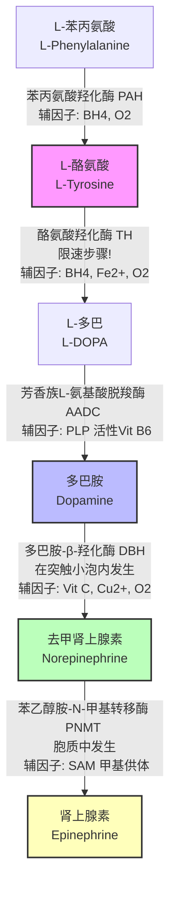

---
tags:
  - 心理学
  - 神经科学
  - 生物化学
  - 神经递质
  - 多巴胺
  - 去甲肾上腺素
关联笔记:
  - "[[心理学/ADHD神经递质机制.md]]"
  - "[[心理学/血清素系统、HPA轴与杏仁核恐惧回路.md]]"
  - "[[心理学/脑区.md]]"
---

# 儿茶酚胺递质的生物合成与代谢路径

**儿茶酚胺（Catecholamines）**是一类结构中含有**邻苯二酚（儿茶酚）基团**和**胺基**的单胺类神经递质与激素。在中枢及外周神经系统中，主要包括三种核心成员：**多巴胺（Dopamine, DA）**、**去甲肾上腺素（Norepinephrine, NE）** 和 **肾上腺素（Epinephrine, Epi）**。

它们共享同一条经典的生化合成流水线，以前体氨基酸为起点，经过一系列酶促反应逐步转化。

---

## 一、 儿茶酚胺合成路线图

---

## 二、 详细步骤及酶促反应

儿茶酚胺的生物合成主要发生在**神经元胞体、轴突末梢（突触前膜）**以及**肾上腺髓质细胞**中。以下是具体的反应步骤和辅因子：

### 2.1 准备步骤：L-苯丙氨酸 ─→ L-酪氨酸（肝脏为主）
* **催化酶**：**苯丙氨酸羟化酶（Phenylalanine Hydroxylase, PAH）**
* **辅因子**：四氢生物蝶呤（$BH_4$）、氧气（$O_2$）
* **说明**：L-苯丙氨酸是必需氨基酸，主要通过膳食摄入，在肝脏中羟化为 L-酪氨酸，随后通过血液循环穿过**血脑屏障（BBB）**进入脑内。

### 2.2 核心第一步：L-酪氨酸 ─→ L-多巴（限速步骤，胞质中发生）
* **催化酶**：**酪氨酸羟化酶（Tyrosine Hydroxylase, TH）**
* **辅因子**：四氢生物蝶呤（$BH_4$）、二价铁离子（$Fe^{2+}$）、氧气（$O_2$）
* **说明**：
  * **这是整个儿茶酚胺合成路径的“限速步骤”（Rate-limiting Step）**。TH 的活性直接决定了多巴胺和去甲肾上腺素的合成速率。
  * **调节机制**：TH 的活性受到终产物（多巴胺、去甲肾上腺素）的**反馈抑制**。当突触内递质浓度过高时，TH 活性下降；当神经元高频放电或 cAMP 浓度升高时（如多巴胺 D1 受体激活后的胞内级联反应），TH 会被磷酸化而激活，加速递质合成。

### 2.3 第二步：L-多巴 ─→ 多巴胺（胞质中发生）
* **催化酶**：**芳香族L-氨基酸脱羧酶（Aromatic L-amino acid decarboxylase, AADC）**，也称多巴脱羧酶（DDC）。
* **辅因子**：**磷酸吡哆醛（PLP，活性维生素 $B_6$）**
* **说明**：此反应速度极快，在正常生理状态下，脑内的 L-多巴一经生成，便会几乎瞬间被脱羧生成多巴胺。因此，细胞内的 L-多巴浓度通常极低。

### 2.4 第三步：多巴胺 ─→ 去甲肾上腺素（突触小泡内发生）
* **催化酶**：**多巴胺-β-羟化酶（Dopamine β-hydroxylase, DBH）**
* **辅因子**：**维生素 C（抗坏血酸）**、二价铜离子（$Cu^{2+}$）、氧气（$O_2$）
* **定位区别**：
  * 前面的步骤均在细胞质基质中进行。生成的多巴胺必须通过**囊泡单胺转运体 2（VMAT2）**被主动泵入突触小泡内部。
  * **DBH 仅存在于突触小泡的内膜上**。因此，只有进入小泡内部的多巴胺才能被转化为去甲肾上腺素。这一机制保证了新合成的去甲肾上腺素直接处于随时可以释放（Exocytosis）的就绪状态。

### 2.5 第四步：去甲肾上腺素 ─→ 肾上腺素（肾上腺髓质及少数脑区胞质）
* **催化酶**：**苯乙醇胺-N-甲基转移酶（Phenylethanolamine N-methyltransferase, PNMT）**
* **辅因子**：**S-腺苷甲硫氨酸（SAM）**，提供活性甲基。
* **说明**：
  * 小泡内的去甲肾上腺素必须首先**漏出**（Leaked out）到细胞质中。在细胞质中，PNMT 将其甲基化转变为肾上腺素。
  * 随后，肾上腺素再次通过 VMAT2 被重新泵回囊泡内储存。该反应主要发生在肾上腺髓质，在中枢神经系统中仅局限于延髓等少数核团。

---

## 三、 儿茶酚胺的代谢与降解（失活途径）

递质在突触间隙释放发挥作用后，必须被快速清除或降解，以防止突触后膜过载。清除途径包括**重摄取**与**酶促降解**：

### 3.1 重摄取（主要清除机制）
* **多巴胺转运体（DAT）** 与 **去甲肾上腺素转运体（NET）**：利用钠/氯浓度差，将突触间隙 80-90% 的递质重新泵回突触前膜。
* **临床联系**：ADHD 一线药物**哌甲酯（Methylphenidate, 专注达）**通过阻断 DAT 和 NET 产生疗效；而**托莫西汀（Atomoxetine, 择思达）**则是高选择性的 NET 阻断剂，用以升高突触间隙的去甲肾上腺素（和部分前额叶的多巴胺）浓度。

### 3.2 降解酶系统
主要由两类酶负责降解未被重摄取的、或胞质内多余的儿茶酚胺：

1. **单胺氧化酶（Monoamine Oxidase, MAO）**：
   * 分定位于线粒体外膜，分为 MAO-A（主要降解 NE 和 5-HT）和 MAO-B（主要降解 DA）。
2. **儿茶酚-O-甲基转移酶（Catechol-O-methyltransferase, COMT）**：
   * 广泛存在于突触间隙、胶质细胞和突触后膜中，催化儿茶酚环上的甲基转移。
   * **在前额叶皮层（PFC）中**，由于 DAT（多巴胺转运体）表达量极低，多巴胺的失活高度依赖 **COMT 的酶促降解**。

### 3.3 代谢终产物
儿茶酚胺在 MAO 和 COMT 的交替作用下，最终代谢为无活性的产物，并随尿液排出：
* **多巴胺（DA）** ──→ **高香草酸（Homovanillic Acid, HVA）**
* **去甲肾上腺素（NE）/ 肾上腺素（Epi）** ──→ **香草扁桃酸（Vanillylmandelic Acid, VMA）**

---

## 四、 临床与生化机制联系

| 现象 / 临床干预 | 生化机制原理 |
| :--- | :--- |
| **帕金森病治疗口服 L-DOPA，而非多巴胺** | 多巴胺分子带电荷，无法穿过**血脑屏障（BBB）**；而 L-DOPA 是中性氨基酸，能通过大中性氨基酸转运体（LAT1）顺利入脑，并在脑内被 AADC 迅速转化为多巴胺。 |
| **辅因子（Vit B6、Vit C、铁）缺乏与情绪/注意障碍** | * 铁缺乏会导致限速酶 TH（酪氨酸羟化酶）活性下降。 * 维生素 B6 缺乏导致 AADC 脱羧酶失效，影响多巴胺与 5-HT 合成。 * 维生素 C 缺乏会损害 DBH，导致去甲肾上腺素合成不足。 |
| **COMT 基因多态性（Val158Met）与认知特质** | COMT 酶活性高（Val 基因型）导致 PFC 多巴胺降解过快，工作记忆较弱但抗压能力强（“战士”特质）；COMT 活性低（Met 基因型）导致 PFC 多巴胺降解慢，工作记忆强但易受压，对情绪高敏（“谋士”特质）。 |

---

*创建时间：2026-06-25*
*分析整合：AI 神经化学与递质代谢专题*
*性质：经典生化通路梳理，非临床诊断*
