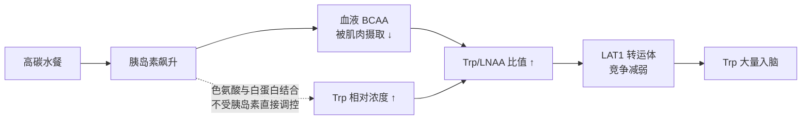
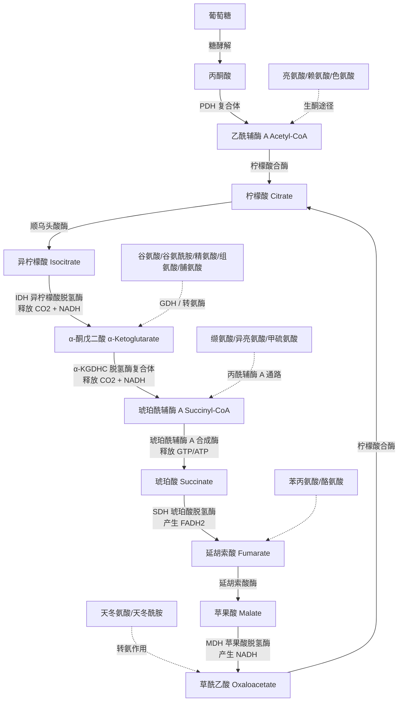
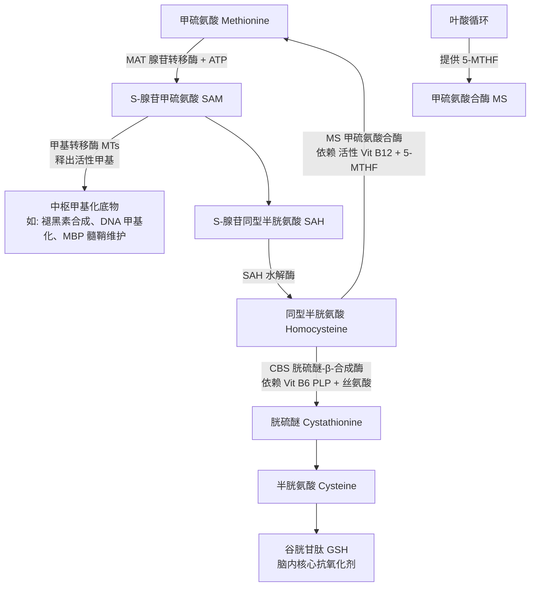
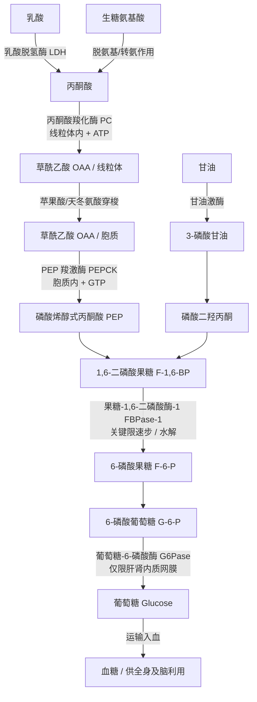
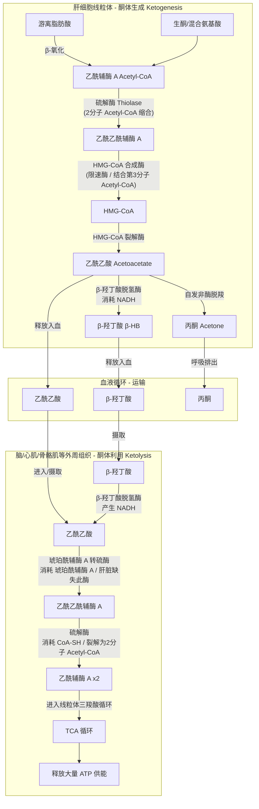

---
tags:
  - 心理学
  - 神经科学
  - 生物化学
  - 能量代谢
  - 血糖
  - 神经递质
  - 蛋白质合成
  - 氨基酸
关联笔记:
  - "[[心理学/儿茶酚胺递质的生物合成与代谢路径.md]]"
  - "[[血清素系统、HPA轴与杏仁核恐惧回路]]"
  - "[[低血糖状态下的脑神经生理与病理机制]]"
  - "[[心理学/ADHD神经递质机制.md]]"
  - "[[心理学/脑区.md]]"
---
# 晕碳的神经生化机制：血糖、氨基酸竞争与大脑代谢分流

> **根节点**：为什么摄入大量精制碳水化合物后会陷入极度困倦、脑雾甚至"断电"？其背后是简单的"血液跑去消化"，还是一套精密的氨基酸代谢与神经递质合成机制？
> **叙事逻辑**：现象界定 → 血糖–胰岛素动力学 → 氨基酸竞争与色氨酸入脑 → 5-HT / 褪黑素合成通路 → 大脑蛋白质合成与氨基酸双重身份 → 食欲素抑制与副交感主导 → 干预策略
> **立场说明**：本文以用户提供的科普性材料为骨架，补充神经化学与代谢通路的教科书级机制细节。区分"公认机制"与"研究倾向性结论"时，会在语气上做区分。
> **来源标注**：用户提供的科普整理稿（来源待补）+ 神经化学与营养学经典通路（Fernstrom 色氨酸–5-HT 假说、LAT1 转运体机制、Orexin 系统研究）。

---

## 知识树

```txt
根节点：为何一顿高碳水会让大脑"断电"？
│
├── 一、现象界定（把"晕碳"翻译成生理学术语）
│   ├── 通俗名：晕碳 / Carb Coma
│   └── 学名：餐后嗜睡（Postprandial Somnolence）
│
├── 二、血糖–胰岛素动力学（血糖过山车如何触发全身响应）
│   ├── 精制碳水 → 血糖飙升
│   ├── 胰岛素急升 → 组织葡萄糖内摄
│   └── 血糖回落与"反应性低血糖"的边缘状态
│
├── 三、氨基酸竞争与色氨酸入脑（关键环节）
│   ├── 胰岛素驱动 BCAA 进入肌肉
│   ├── 色氨酸不受胰岛素影响，血液比例上升
│   └── LAT1 转运体的"独木桥"竞争
│
├── 四、5-HT 与褪黑素合成通路（困意的化学产物）
│   ├── 色氨酸 → 5-HTP → 5-HT
│   ├── 5-HT → N-乙酰-5-HT → 褪黑素
│   └── 结果：情绪放松 + 睡意涌上
│
├── 五、氨基酸的双重身份：递质前体 vs 蛋白质合成
│   ├── 蛋白质与递质合成的分流机制
│   ├── 三羧酸循环（TCA）与生能代谢分流
│   └── SAM 循环与一碳单位中枢甲基化
│
├── 六、食欲素抑制与副交感主导（大脑警觉度关灯）
│   ├── Orexin/Hypocretin 神经元被抑制
│   ├── 副交感神经接管（"休息与消化"模式）
│   └── 胃肠血流重分布
│
└── 七、干预策略（如何避免下午的"断电"）
    ├── 进食顺序调整
    ├── 慢碳替换与 GI 控制
    ├── 总量与频次管理
    └── 餐后轻活动
```

---

## 一、现象界定：把"晕碳"翻译成生理学术语

**晕碳（俗称 Carb Coma）** 在临床与神经生理学文献中的规范术语为 **餐后嗜睡（Postprandial Somnolence）**，也称为 **食物昏迷（Food Coma）**。它指人在进食（尤其是高糖、高精制碳水餐食）后 30 分钟至 2 小时内出现的一组症状：

- 极度困倦、哈欠频发；
- 认知模糊、短时记忆变差、"脑雾"；
- 肌肉沉重、身体无力；
- 部分人伴随头晕、心慌、注意力涣散。

> 📌 **餐后嗜睡（Postprandial Somnolence）**：指进食后由多种神经内分泌机制共同引发的短暂性困倦状态。在本文中，它是我们要拆解的目标现象，其机制涉及血糖、氨基酸转运、单胺类递质合成和自主神经切换四条主线。

这不是心理性的"吃饱就想睡"的错觉，而是一套精密到可以逐步溯源的**神经内分泌反应链**。

---

## 二、血糖–胰岛素动力学：过山车如何触发全身响应

### 2.1 精制碳水 → 血糖骤升

米饭、白面、甜点、含糖饮料等**高血糖生成指数（High-GI）** 食物在小肠被迅速水解为葡萄糖，10–30 分钟内血糖即可从空腹的 4.5 mmol/L 飙升至 7–9 mmol/L 甚至更高。

### 2.2 胰岛素急升 → 组织葡萄糖内摄

胰腺 β 细胞感知血糖上升，向血液中大量释放**胰岛素（Insulin）**。胰岛素触发肌肉和脂肪细胞膜上的 **GLUT4 转运体**转位至细胞膜，把葡萄糖从血液中拉进细胞内储存或利用。

### 2.3 血糖回落与"反应性低血糖"

在餐后 60–120 分钟，胰岛素的"过度反应"可能把血糖压到低于餐前水平，形成 **反应性低血糖（Reactive Hypoglycemia）** 的边缘状态。此时大脑对葡萄糖的短暂饥饿会叠加进后续的困倦感。

> 🔗 **横向关联**：本节的"血糖–胰岛素过山车"与 [[低血糖状态下的脑神经生理与病理机制]] 中"大脑作为强迫性葡萄糖消费者"形成**上下游关系**——低血糖笔记描述血糖失守后的神经元能量危机，本文则展示这种失守是如何被精制碳水本身"人为诱发"的。

---

## 三、氨基酸竞争与色氨酸入脑：晕碳的关键环节

这一步是"晕碳"机制的**核心杠杆**。它解释了：为什么困倦的化学信使能够跨越血脑屏障，而不是被拦在门外。

### 3.1 胰岛素驱动 BCAA 进入肌肉

胰岛素不仅调节葡萄糖，也调控**血液中氨基酸的分布**。它促进**支链氨基酸（BCAA：亮氨酸 Leucine、异亮氨酸 Isoleucine、缬氨酸 Valine）** 与大多数大中性氨基酸（Large Neutral Amino Acids, LNAA）被肌肉摄取用于蛋白质合成。

结果：血液中 BCAA 浓度快速下降。

### 3.2 色氨酸"逆势上涨"

**色氨酸（Tryptophan, Trp）** 是唯一在血液中主要与**血清白蛋白结合**运输的氨基酸。这一物理特性使它**基本不被胰岛素驱动进入肌肉**。

- BCAA 下降；
- Trp 相对不变；
- 结果：**血浆中 Trp / LNAA 比值上升**。

### 3.3 LAT1 转运体：血脑屏障上的"独木桥"

大中性氨基酸进入脑内依赖血脑屏障上的**大中性氨基酸转运体 1（Large-neutral Amino acid Transporter 1, LAT1）**。这个转运体对所有 LNAA（大中性氨基酸；包括 Trp、Tyr、Phe、Leu、Ile、Val、Met、His）**都有亲和力**，但底物之间存在竞争性抑制。

> 📌 **LAT1（Large-neutral Amino acid Transporter 1）**：位于血脑屏障内皮细胞上的 Na⁺-非依赖性交换转运体，是所有大中性氨基酸进入中枢神经系统的主通道。在本文中，LAT1 是理解"色氨酸为什么能在餐后大举入脑"的物理载体。

当 BCAA 大幅撤离血浆时，Trp 面对的竞争者数量骤减，通过 LAT1 进入脑内的通量随之上升。这就是经典的 **Fernstrom–Wurtman 色氨酸–5-HT 假说**（1971 年提出，后经多轮验证与修订）的分子基础。



---

## 四、5-HT 与褪黑素合成通路：困意的化学产物

一旦色氨酸抵达中缝核（Raphe Nuclei）等 5-HT 能神经元，它就进入了一条与 [[心理学/儿茶酚胺递质的生物合成与代谢路径.md]] 中儿茶酚胺通路**并行**的合成流水线。

### 4.1 合成路径

```
色氨酸 (Tryptophan)
    ↓ 色氨酸羟化酶 (TPH)
    ↓ 辅因子：BH4、Fe²⁺、O2
5-羟基色氨酸 (5-HTP)
    ↓ 芳香族L-氨基酸脱羧酶 (AADC)
    ↓ 辅因子：PLP (活性 Vit B6)
血清素 (5-HT / 5-Hydroxytryptamine)
    ↓ 芳烷胺-N-乙酰转移酶 (AANAT，松果体夜间高活性)
N-乙酰-5-羟色胺
    ↓ 羟基吲哚-O-甲基转移酶 (HIOMT)
褪黑素 (Melatonin)
```

> 🧪 **化学命名与反应解析：从 5-HTP 到 5-HT 发生了什么？**
>
> * **5-HTP** 代表 **5-H**ydroxy**t**rypto**p**han（5-羟基色**氨**酸），最后的 **P** 代表 **Phan**（色氨酸词尾，特指其分子结构中含有羧基 $-COOH$，属于氨基酸）。
> * **5-HT** 代表 **5-H**ydroxy**t**ryptamine（5-羟**色胺**），词尾的 **T**（与 amine 连用为 Tryptamine）指**色胺**（即色氨酸脱去羧基后的单胺结构）。
> * **丢失了什么**：在由 **AADC**（芳香族 L-氨基酸脱羧酶）催化的第二步反应中，5-HTP 发生了**脱羧反应（Decarboxylation）**，脱去了一个 **羧基（$-COOH$）** 并以 $\text{CO}_2$（二氧化碳）形式释放。化学性质因而从“氨基酸”转变为了“单胺”。

### 4.2 关键要点

1. **限速酶是 TPH**（色氨酸羟化酶），其活性在正常生理状态下未被底物饱和——这意味着**只要底物 Trp 上升，产物 5-HT 就同步上升**。这是"晕碳"能通过食物触发的化学基础。
2. **AADC 是共享酶**：它同时脱羧 5-HTP → 5-HT 和 L-DOPA → DA。维生素 B6 (PLP) 缺乏会同时影响 5-HT 和多巴胺合成。
3. **5-HT → 褪黑素** 的转化主要发生在松果体，但脑内 5-HT 水平升高本身即可诱发困倦，无需完全走到褪黑素这一步。

> 🔗 **横向关联**：本节"5-HT 合成同样依赖 AADC 与 B6"与 [[心理学/儿茶酚胺递质的生物合成与代谢路径.md]] 中"AADC 是儿茶酚胺通路的第二步酶"形成**互证关系**——两篇笔记从不同底物（Trp vs Tyr）出发，共同揭示 AADC / B6 是所有单胺类递质合成的"公共咽喉"，其缺陷会同时影响情绪、警觉与困倦调控。
>
> 📌 **单胺类递质（Monoamine Neurotransmitters）**：一类含有单个氨基且由芳香族氨基酸（如色氨酸、酪氨酸、组氨酸）脱羧而来的神经递质/神经调质。
>
> **主要分类与前体对应**：
>
> 1. **吲哚胺类（Indolamines）**：以**色氨酸（Trp）**为前体，通过 TPH 和 AADC 合成，主要包括**血清素（5-HT）**和**褪黑素（Melatonin）**。在中枢调节情绪放松、食欲饱足感与睡眠开关。
> 2. **儿茶酚胺类（Catecholamines）**：以**酪氨酸（Tyr）**或**苯丙氨酸（Phe）**为前体合成，主要包括**多巴胺（DA）**、**去甲肾上腺素（NE）**和**肾上腺素（Epi）**。在中枢主导警觉、动力、唤醒与专注。
> 3. **咪唑胺类（Imidazole amines）**：以**组氨酸（His）**为前体由组氨酸脱羧酶（HDC）合成，主要为**组胺（Histamine）**。中枢组胺能神经元投射广泛，是维持觉醒的重要中枢递质。
>
> 💡 **“公共咽喉”与辅因子竞争机制**：
> 无论 5-HT 还是多巴胺，其合成第二步均高度依赖**同一个酶——芳香族 L-氨基酸脱羧酶（AADC）**，且均需**磷酸吡哆醛（PLP，活性维生素 B6）**作为辅因子。
>
> - 在高碳水饮食后，血脑屏障 LAT1 竞争减弱导致色氨酸大量入脑，第一步限速酶 TPH 迅速生成大量 5-HTP。
> - 骤增的 5-HTP 在向 5-HT 转化时，会**竞争性抢夺**有限的 AADC 酶和 PLP 辅因子。这种竞争对多巴胺的合成产生了“挤出效应”，使得脑内多巴胺/去甲肾上腺素合成受抑。
> - 这一降一升（5-HT 飙升，DA/NE 被挤压），在递质层面上使觉醒/睡眠天平瞬间失衡，拉大困意。

### 4.3 结果

- 5-HT 升高 → 情绪放松、饱足感（这也是餐后"幸福感"的化学基础）；
- 5-HT / 褪黑素协同 → 觉醒—睡眠开关向"睡眠"倾斜；
- 若同时叠加下述"食欲素抑制"，困倦感将迅速压过意志控制。

---

## 五、氨基酸的双重身份：递质前体 vs 蛋白质合成

这是补充材料中被科普稿一带而过、但在生化上极为核心的一环。氨基酸并不是只为神经递质服务——它们同时是**蛋白质合成的砖块**，两条路径共享同一批底物。

### 5.1 氨基酸的两条主要去向

| 去向                         | 通路                                             | 关键调控                                                       | 产物                             |
| ---------------------------- | ------------------------------------------------ | -------------------------------------------------------------- | -------------------------------- |
| **蛋白质合成**         | 核糖体翻译 (mRNA → 肽链)                        | mTORC1 通路（Leucine 感应）、eIF4E、S6K1                       | 结构蛋白、酶、受体、离子通道     |
| **神经递质合成**       | 单胺类合成流水线（TH / TPH / AADC / DBH / PNMT） | 底物浓度、限速酶活性、辅因子（BH4、Fe²⁺、B6、Vit C、Cu²⁺） | 5-HT、DA、NE、Epi                |
| **能量代谢**           | 转氨脱氨 → 三羧酸循环                           | 胰高血糖素、糖异生                                             | ATP、葡萄糖                      |
| **一碳单位与神经调节** | SAM 循环（Met → SAM → Hcy）                    | 叶酸、B12                                                      | 甲基化底物（供 DNA、递质、髓鞘） |

> 📌 **mTORC1（mechanistic Target of Rapamycin Complex 1）**：胞内营养与能量感应的核心枢纽。在本文中，它作为“分流开关”，决定了外周氨基酸是被拉入肌肉合成蛋白质，还是留给大脑用于合成单胺类递质。
>
> **双重激活机制与生化原理**：
>
> 1. **氨基酸信号（以亮氨酸 Leucine 为主）**：细胞质内的亮氨酸传感器 **Sestrin2** 在没有亮氨酸结合时，处于活性状态并抑制 **GATOR2** 复合物。当亮氨酸浓度升高并与其结合后，Sestrin2 与 GATOR2 解离。解除抑制的 GATOR2 进而激活溶酶体定位的 **Rag GTPases**（使 RagA/B 结合 GTP，RagC/D 结合 GDP），从而将 mTORC1 招募至溶酶体膜表面。
> 2. **胰岛素信号（生长因子信号）**：高碳水食物促使胰岛素释放，激活细胞膜上的胰岛素受体，经 **IRS-1 → PI3K → Akt** 通路，Akt 磷酸化并失活 **TSC2**（Rheb 的 GTP 酶激活蛋白）。TSC2 失活后，处于溶酶体膜上的 **Rheb-GTP**（活性状态）增多，直接变构激活已被 Rag 招募至溶酶体膜表面的 mTORC1。
> 3. **下游效应**：激活的 mTORC1 磷酸化 **4E-BP1**（释放翻译起始因子 eIF4E）和 **S6K1**（激活核糖体蛋白 S6），从而大举启动核糖体的翻译过程，促进蛋白质合成。
>
> 💡 **“晕碳”机制中的角色**：膳食亮氨酸（BCAA 的一部分）和胰岛素**缺一不可**。只有当两者同时存在时，溶酶体膜上的 mTORC1 才能被完全激活，启动肌肉中的蛋白质合成程序，将血液中的 BCAA（亮/异亮/缬）迅速抽提并锁定入肌肉。这直接导致血浆 BCAA 水平骤降，使色氨酸（Trp）在血脑屏障 LAT1 转运体上的竞争对手几乎消失，促成色氨酸大举入脑与 5-HT 的合成。

### 5.2 胰岛素如何决定分流方向

高碳水餐后：

1. **胰岛素 + Leu 双信号**同时激活肌肉中的 **mTORC1**，把 BCAA 与多数 LNAA 拽入合成蛋白质的方向；
2. 这解释了为什么力量训练者常在训练后配合"碳水 + 蛋白"——胰岛素的合成代谢窗口对**肌肉蛋白合成（Muscle Protein Synthesis, MPS）** 是高效的；
3. **副作用**：外周 BCAA 被"吸走"，色氨酸的中枢流入通道随之打开——同一套胰岛素信号，一边合成肌肉蛋白，一边让大脑陷入 5-HT 上升的困倦。

### 5.3 在大脑侧的对称过程

脑内氨基酸也同时服务两条路径：

- **神经元蛋白质合成**：突触可塑性（LTP 的晚期阶段 L-LTP）依赖新的蛋白质合成，尤其是 AMPA 受体亚基、CaMKII 等；
- **递质合成**：如前文所述。

因此，餐后升高的脑内氨基酸并非"浪费"——它一部分被拿去做结构维护（这也是为什么充足氨基酸摄入对长期认知功能至关重要），另一部分被 5-HT 通路截取而制造出即刻的困意。

> 🔗 **横向关联**：本节"L-LTP 依赖蛋白质合成"与 [[长时程增强LTP与突触可塑性]] 中"晚期长时程增强需要新蛋白质合成"形成**互证关系**——两篇笔记从代谢与突触两个角度共同指向：氨基酸不仅是递质原料，也是记忆物理写入的必需砖块。

### 5.4 三羧酸循环（TCA Cycle）与氨基酸的生能代谢分流

在正常的葡萄糖供应下，大脑主要依赖糖酵解和三羧酸循环将葡萄糖转化为丙酮酸，并进一步生成乙酰辅酶 A 以产生 ATP。然而，当外周和中枢发生剧烈的氨基酸与血糖分流时，氨基酸可以通过脱氨与转氨反应进入三羧酸循环，提供替代能量或平衡代谢中间产物。

> 📌 **三羧酸循环（TCA Cycle / Krebs Cycle）**：线粒体基质中进行的一系列酶促反应，是碳水化合物、脂类和氨基酸三大营养物质的终极共同代谢通路与能量生产中心。在本文中，它作为解明氨基酸如何通过脱氨基作用参与脑部能量补给、或在血糖波动中实现能量分流的细胞级平台。

* **转氨与脱氨进入通路**：
  - **谷氨酸（Glu）** 通过 **谷氨酸脱氢酶（GDH）** 或转氨酶（如 AST/ALT）转化为 **$\alpha$-酮戊二酸（$\alpha$-KG）**，直接注入三羧酸循环。这一反应连接了大脑氨解毒（通过谷氨酰胺合成酶将有毒游离氨转化为谷氨酰胺）与能量代谢。
  - **天冬氨酸（Asp）** 通过转氨基作用生成 **草酰乙酸（OAA）**，为 TCA 循环提供补给。
  - **支链氨基酸（BCAA）** 首先在脑中经 **支链氨基酸转氨酶（BCAT）** 催化，生成相应的酮酸，随后降解为 **乙酰辅酶 A**（生酮途径，如亮氨酸）或 **琥珀酰辅酶 A**（生糖途径，如缬氨酸、异亮氨酸），参与 TCA 循环。
* **餐后状态下的生能分流**：
  - 在高碳水餐后的高血糖阶段，脑内糖酵解极其活跃，产生充足的乙酰辅酶 A，此时氨基酸被氧化生能的比例较低，更多被分流至蛋白质合成（mTORC1 驱动）与递质合成。
  - 然而，在随后的反应性低血糖（血糖回落）阶段，中枢为了代偿能量短缺，谷氨酸与 BCAA 的转氨基反应活跃，以提供 TCA 循环中间产物（补给反应 / Anaplerosis），防止神经元发生 ATP 耗竭。



### 5.5 甲硫氨酸–SAM 循环（一碳单位代谢与中枢甲基化）

**SAM 循环（SAM Cycle / S-Adenosylmethionine Cycle）**，又称 **甲硫氨酸循环（Methionine Cycle）**，是脑内一碳单位代谢的核心引擎，对突触可塑性表观遗传修饰、神经递质代谢和髓鞘结构维护至关重要。

> 📌 **SAM 循环（SAM Cycle / S-Adenosylmethionine Cycle）**：以腺苷甲硫氨酸（SAM）为核心的一碳单位代谢循环，负责向全细胞提供甲基供体。在本文中，它是解释神经递质代谢（如褪黑素合成、儿茶酚胺降解）以及突触可塑性表观遗传修饰的生化原动力。

* **循环运转步骤**：
  1. **激活**：甲硫氨酸（Met）与 ATP 反应，在 **甲硫氨酸腺苷转移酶（MAT）** 催化下，生成 **S-腺苷甲硫氨酸（SAM）**。
  2. **甲基转移**：SAM 作为万能甲基供体，在甲基转移酶（MTs）作用下将活性甲基转移给受体（DNA、RNA、蛋白质、脂质、递质），自身转变为 **S-腺苷同型半胱氨酸（SAH）**。
  3. **水解**：SAH 在 **SAH 水解酶**催化下，可逆水解为 **同型半胱氨酸（Hcy）** 和腺苷。
  4. **再甲基化**：Hcy 在 **甲硫氨酸合酶（MS）** 的催化下重新甲基化生成 Met，该步反应高度依赖 **活性维生素 B12（甲钴胺）** 和叶酸循环提供的 **5-甲基四氢叶酸（5-MTHF）**。
  5. **转硫途径**：此外，Hcy 也可与丝氨酸结合，在 **胱硫醚-$\beta$-合成酶（CBS）**（依赖 **维生素 B6/PLP**）催化下进入转硫途径，合成半胱氨酸并最终生成谷胱甘肽（GSH，大脑核心抗氧化剂）。
* **对睡眠与神经功能的调节**：
  - **褪黑素合成的决速步**：在松果体中，血清素转化为褪黑素的最后一步，需要 **羟基吲哚-O-甲基转移酶（HIOMT / ASMT）** 利用 SAM 提供的甲基。高碳水诱导的脑内血清素升高，会加速消耗 SAM 以合成褪黑素，拉动整个甲基化循环。
  - **神经髓鞘维护**：SAM 介导的甲基化是维持**髓鞘碱性蛋白（MBP）** 结构完整的必需步骤。SAM 循环受阻（如 B12 或叶酸缺乏）会导致髓鞘脱失，加剧“脑雾”和认知迟钝。
  - **突触表观遗传**：DNA 甲基转移酶（DNMTs）依赖 SAM 对突触可塑性相关基因（如 BDNF 基因）进行甲基化修饰，调控记忆的物理写入。



### 5.6 糖异生（Gluconeogenesis）—— 维持外周与大脑的生糖底线

* **概念与生理意义**：指非糖前体物质（如生糖氨基酸、乳酸、丙酮酸、甘油等）在肝脏（主要）和肾脏中净合成葡萄糖的过程。它是机体在饥饿或空腹状态下**维持血糖浓度的唯一内源性途径**。
* **三大旁路与关键酶**（绕过糖酵解的不可逆步骤）：
  1. **旁路一（丙酮酸 ─→ 磷酸烯醇式丙酮酸 PEP）**：线粒体内的**丙酮酸羧化酶（PC）**将丙酮酸转化为草酰乙酸（OAA），经穿梭进入胞质后，由**磷酸烯醇式丙酮酸羧激酶（PEPCK）**转化为 PEP。
  2. **旁路二（1,6-二磷酸果糖 ─→ 6-磷酸果糖）**：由**果糖-1,6-二磷酸酶-1（FBPase-1）**催化。这是**糖异生最核心的限速步骤**。
  3. **旁路三（6-磷酸葡萄糖 ─→ 葡萄糖）**：由**葡萄糖-6-磷酸酶（G6Pase）**催化。该酶仅存在于**肝脏和肾脏的内质网膜上**，因此肌肉糖原无法直接补充血糖。



### 5.7 生酮途径与酮体氧化（Ketogenesis & Ketolysis）

* **概念与生理意义**：**酮体（Ketone Bodies）** 是三种小分子脂质的统称：**乙酰乙酸**、**$\beta$-羟丁酸** 和 **丙酮**。当饥饿或碳水摄入极低时，脂肪酸在肝脏进行大量的 $\beta$-氧化产生乙酰辅酶 A，超出了 TCA 循环的处理极限，便在肝细胞线粒体中转化为酮体。酮体可穿过血脑屏障，成为**大脑在葡萄糖匮乏时的替代燃料**。
* **合成与分解特点**：
  1. **限速酶**：由线粒体中的 **HMG-CoA 合成酶** 催化。
  2. **只产不消的肝脏**：肝脏缺乏**琥珀酰辅酶 A 转硫酶**（又称 Thiophorase），因此**肝脏虽能合成酮体，却无法利用酮体**。酮体合成后必须释放入血，运至外周靶组织（如脑、心肌）进行降解氧化生能。
  3. **丙酮的挥发性**：丙酮是乙酰乙酸自发脱羧产生的代谢废料，不产生能量，主要通过呼气和尿液排出。



## 六、食欲素抑制与副交感主导：大脑警觉度关灯

### 6.1 食欲素（Orexin / Hypocretin）系统被抑制

**食欲素（Orexin，也称 Hypocretin）** 是由下丘脑外侧区（Lateral Hypothalamus, LH）神经元合成的一类神经肽（Orexin A / Orexin B），是维持**觉醒、警觉、能量消耗与摄食动机**的关键。

> 📌 **食欲素（Orexin / Hypocretin）**：下丘脑外侧区分泌的两种神经肽（OX-A、OX-B），投射至蓝斑核（LC）、结节乳头核（TMN）、腹侧被盖区（VTA）等觉醒相关核团。**发作性睡病（Narcolepsy）** 患者正是因该系统神经元大量缺失而导致不可抑制的白日嗜睡。在本文中，它是理解"血糖升高为何直接导致警觉度下降"的关键中介。
>
> 📌 **结节乳头核（TMN，Tuberomammillary Nucleus）**：位于下丘脑后部的核心神经核团。
>
> - **脑内唯一的组胺（Histamine）中心**：TMN 是哺乳动物中枢神经系统中**唯一产生并释放组胺的神经核团**，向全脑（包括皮层、丘脑和基底前脑）发出广泛的投射。
> - **核心觉醒递质与“感冒药困倦”原理**：TMN 释放的组胺是维持大脑长期觉醒与专注的核心递质。市面上感冒药中的第一代抗组胺成分（如扑尔敏、苯海拉明）能穿过血脑屏障，阻断了脑内 H1 受体，因而会产生极强的困意。
> - **食欲素的下游效应器**：Orexin 神经元对 TMN 具有强烈的兴奋性驱动作用。餐后血糖升高抑制 Orexin 神经元，导致其对 TMN 的驱动力丧失，脑内组胺释放减少，大脑迅速进入昏沉状态。

关键机制：

- Orexin 神经元表达**葡萄糖抑制型**通道（K-ATP-independent 机制），血糖升高会**直接超极化**这些神经元；
- 高胰岛素也进一步抑制其放电；
- 结果：Orexin → 蓝斑核（LC）→ 大脑皮层的觉醒驱动通路被削弱，人陷入昏沉。

这与低血糖状态下 **Orexin 反被激活以驱动觅食** 形成完美的对称。

### 6.2 副交感神经接管："休息与消化"模式

饱餐激活迷走神经（Vagus Nerve），副交感神经系统主导，进入 **"Rest and Digest"** 模式：

- 心率下降；
- 胃肠蠕动与消化液分泌增强；
- 血液重新分配到胃肠道，脑血流相对降低（幅度不大，但叠加在其他机制上）；
- 中枢乙酰胆碱系统对觉醒的贡献也随之偏向"内向状态"。

> 🔗 **横向关联**：本节"Orexin 被血糖直接抑制"与 [[低血糖状态下的脑神经生理与病理机制]] 中"低血糖时下丘脑触发蓝斑核 NE 风暴"形成**镜像关系**——同一套下丘脑–蓝斑轴，在血糖过高时把觉醒关灯，在血糖过低时把觉醒调至最亮，指向**血糖是大脑警觉度的核心调节变量**。

---

## 七、干预策略：如何避免下午的"断电"

基于上述四条机制链，可以逐条对应地设计干预：

| 机制环节           | 干预策略                                     | 生化原理                                                                                                                 |
| ------------------ | -------------------------------------------- | ------------------------------------------------------------------------------------------------------------------------ |
| **血糖骤升** | 进食顺序：先蔬菜、蛋白，再碳水               | 膳食纤维与蛋白延缓胃排空，降低碳水的**血糖负荷（Glycemic Load, GL）**，胰岛素峰值随之降低                          |
| **碳水质量** | 用燕麦、藜麦、糙米、红薯替代白米、白面、甜点 | 低 GI 慢碳 → 血糖曲线平缓 → 胰岛素反应温和 → BCAA/Trp 比值波动减小                                                    |
| **总量控制** | 每餐七八分饱、避免暴饮暴食                   | 减少胰岛素释放总量，降低下游 mTOR / 单胺分流的强度                                                                       |
| **餐后活动** | 餐后 10–15 分钟散步                         | 肌肉在胰岛素非依赖模式下摄取葡萄糖（GLUT4 由收缩激活），缓冲血糖峰值                                                     |
| **蛋白搭配** | 每餐含 20–30g 优质蛋白                      | 提高 BCAA 血浆浓度，稀释 Trp/LNAA 比值，压制 5-HT 入脑                                                                   |
| **长期观察** | 若无论多少碳水都极度困倦，考虑排查           | 可能提示**胰岛素抵抗（Insulin Resistance）** 或 **反应性低血糖（Reactive Hypoglycemia）** 倾向，需要临床评估 |

### 7.1 特别提示

材料中提到的"胰岛素抵抗 / 反应性低血糖"倾向，需要与真正的临床诊断区分：偶发的餐后困倦是正常生理现象；**只有当症状持续、严重、伴随体重变化或多饮多尿**时，才建议就医做口服葡萄糖耐量试验（OGTT）与胰岛素释放曲线评估。

---

## 八、收束：从"吃饱想睡"到大脑代谢的整体图景

**归因**：晕碳并不是"血液跑去消化"那么简单，而是一条从**外周胰岛素分泌 → BCAA 内摄 → LAT1 竞争减弱 → 色氨酸中枢富集 → 5-HT/褪黑素合成 → 食欲素抑制 → 副交感主导** 的完整神经内分泌反应链。**氨基酸在其中扮演了双重角色**：既是肌肉蛋白合成的砖块，又是大脑神经递质的原料，胰岛素信号是这两条命运路径的分岔开关。

**延伸**：理解这一机制有几个连锁意义——

1. **饮食结构本身就是神经调控手段**：改变一顿饭的顺序与结构，可以直接改变下午的认知带宽；
2. **氨基酸不是可以随意大量补充的补剂**：色氨酸单独补充可能诱发嗜睡，BCAA 补剂可能压制 5-HT 影响情绪；
3. **睡眠障碍与饮食节律高度耦合**：晚餐的高碳水结构可能通过褪黑素前置分泌影响入睡时相；
4. **代谢病与情绪障碍的重叠**：胰岛素抵抗人群同时高发抑郁、焦虑，正是这条代谢–递质轴长期紊乱的结果。

**个体坐标**：对普通人而言，认识到"晕碳"是可解释、可干预的生理反应，比"意志力不够"更有价值——它把午后的困倦从道德问题还原为血糖问题，从而为具体行动（换主食、加蛋白、餐后散步）打开了空间。

---

## 九、数据库索引

| #  | 概念/机制                             | 类型         | 所属维度             | 横向关联笔记 | 重要性     |
| -- | ------------------------------------- | ------------ | -------------------- | ------------ | ---------- |
| 1  | 餐后嗜睡（Postprandial Somnolence）   | 生理现象     | 一、现象界定         | —           | ⭐⭐⭐⭐⭐ |
| 2  | 高血糖生成指数（High-GI）碳水         | 营养学概念   | 二、血糖动力学       | —           | ⭐⭐⭐⭐   |
| 3  | 胰岛素驱动 BCAA 内摄                  | 生化机制     | 三、氨基酸竞争       | [[心理学/儿茶酚胺递质的生物合成与代谢路径.md]]             | ⭐⭐⭐⭐⭐ |
| 4  | LAT1 大中性氨基酸转运体               | 分子机制     | 三、氨基酸竞争       | [[心理学/儿茶酚胺递质的生物合成与代谢路径.md]]             | ⭐⭐⭐⭐⭐ |
| 5  | Fernstrom–Wurtman 色氨酸–5-HT 假说  | 经典理论     | 三、氨基酸竞争       | —           | ⭐⭐⭐⭐   |
| 6  | TPH → 5-HTP → 5-HT → 褪黑素 通路   | 生化通路     | 四、5-HT 合成        | [[血清素系统、HPA轴与杏仁核恐惧回路]]             | ⭐⭐⭐⭐⭐ |
| 7  | AADC（芳香族L-氨基酸脱羧酶）          | 共享酶       | 四、5-HT 合成        | [[心理学/儿茶酚胺递质的生物合成与代谢路径.md]]             | ⭐⭐⭐⭐   |
| 8  | mTORC1 / 亮氨酸 / 蛋白质合成          | 分子机制     | 五、氨基酸的双重身份 | [[长时程增强LTP与突触可塑性]]             | ⭐⭐⭐⭐   |
| 9  | SAM 循环（一碳单位代谢与中枢甲基化）  | 代谢通路     | 五、氨基酸的双重身份 | —           | ⭐⭐⭐⭐⭐ |
| 10 | 三羧酸循环（TCA Cycle）               | 代谢通路     | 五、氨基酸的双重身份 | —           | ⭐⭐⭐⭐⭐ |
| 11 | 糖异生（Gluconeogenesis）             | 代谢途径     | 五、氨基酸的双重身份 | —           | ⭐⭐⭐⭐   |
| 12 | 生酮途径与酮体氧化 (Ketogenesis)      | 代谢途径     | 五、氨基酸的双重身份 | —           | ⭐⭐⭐⭐⭐ |
| 13 | 食欲素（Orexin / Hypocretin）         | 神经肽系统   | 六、警觉度调控       | [[低血糖状态下的脑神经生理与病理机制]]             | ⭐⭐⭐⭐⭐ |
| 14 | 副交感神经"休息与消化"模式            | 自主神经机制 | 六、警觉度调控       | —           | ⭐⭐⭐     |
| 15 | 反应性低血糖（Reactive Hypoglycemia） | 边缘病理     | 二 / 七              | [[低血糖状态下的脑神经生理与病理机制]]             | ⭐⭐⭐     |
| 16 | 胰岛素抵抗（Insulin Resistance）      | 代谢病理     | 七、干预策略         | —           | ⚠️       |

---

## 参考来源

1. 用户提供的科普整理稿（关于"晕碳"的通俗机制描述），来源待补。
2. Fernstrom, J.D. & Wurtman, R.J. (1971). *Brain serotonin content: physiological dependence on plasma tryptophan levels.* Science —— 色氨酸–5-HT 假说的经典文献。
3. Sakurai, T. et al. (1998). *Orexins and orexin receptors: a family of hypothalamic neuropeptides and G protein-coupled receptors that regulate feeding behavior.* Cell —— 食欲素系统的开创性研究。
4. Boron & Boulpaep, *Medical Physiology* —— 血糖/胰岛素动力学、LAT1、mTOR 通路的教科书章节。
5. Nestler, Hyman & Malenka, *Molecular Neuropharmacology* —— 单胺类递质合成与代谢通路。

---

*创建时间：2026-07-07*
*分析整合：AI 神经化学、代谢与营养学交叉综述*
*性质：科普材料的机制化扩写，非临床诊断建议*

```

```
