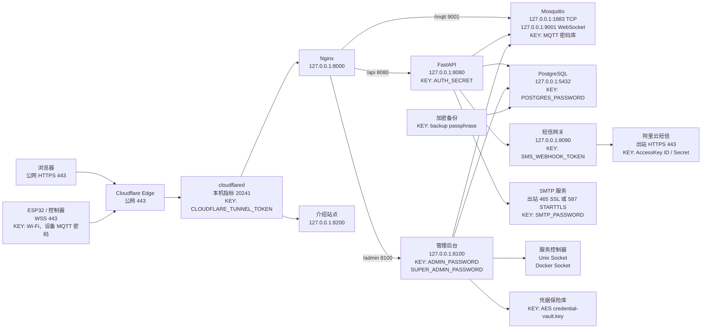

```mermaid
flowchart LR
    Browser["浏览器<br/>公网 HTTPS 443"]
    Device["ESP32 / 控制器<br/>WSS 443<br/>KEY: Wi-Fi、设备 MQTT 密码"]
    CF["Cloudflare Edge<br/>公网 443"]
    Tunnel["cloudflared<br/>本机指标 20241<br/>KEY: CLOUDFLARE_TUNNEL_TOKEN"]
    Nginx["Nginx<br/>127.0.0.1:8000"]
    Intro["介绍站点<br/>127.0.0.1:8200"]
    API["FastAPI<br/>127.0.0.1:8080<br/>KEY: AUTH_SECRET"]
    Admin["管理后台<br/>127.0.0.1:8100<br/>KEY: ADMIN_PASSWORD<br/>SUPER_ADMIN_PASSWORD"]
    MQTT["Mosquitto<br/>127.0.0.1:1883 TCP<br/>127.0.0.1:9001 WebSocket<br/>KEY: MQTT 密码库"]
    DB["PostgreSQL<br/>127.0.0.1:5432<br/>KEY: POSTGRES_PASSWORD"]
    SMS["短信网关<br/>127.0.0.1:8090<br/>KEY: SMS_WEBHOOK_TOKEN"]
    Aliyun["阿里云短信<br/>出站 HTTPS 443<br/>KEY: AccessKey ID / Secret"]
    SMTP["SMTP 服务<br/>出站 465 SSL 或 587 STARTTLS<br/>KEY: SMTP_PASSWORD"]
    Control["服务控制器<br/>Unix Socket<br/>Docker Socket"]
    Vault["凭据保险库<br/>KEY: AES credential-vault.key"]
    Backup["加密备份<br/>KEY: backup passphrase"]

    Browser --> CF
    Device --> CF
    CF --> Tunnel
    Tunnel --> Nginx
    Tunnel --> Intro
    Nginx -->|"/api 8080"| API
    Nginx -->|"/admin 8100"| Admin
    Nginx -->|"/mqtt 9001"| MQTT
    API --> DB
    API --> MQTT
    API --> SMS
    API --> SMTP
    SMS --> Aliyun
    Admin --> DB
    Admin --> MQTT
    Admin --> Control
    Admin --> Vault
    Backup --> DB
```