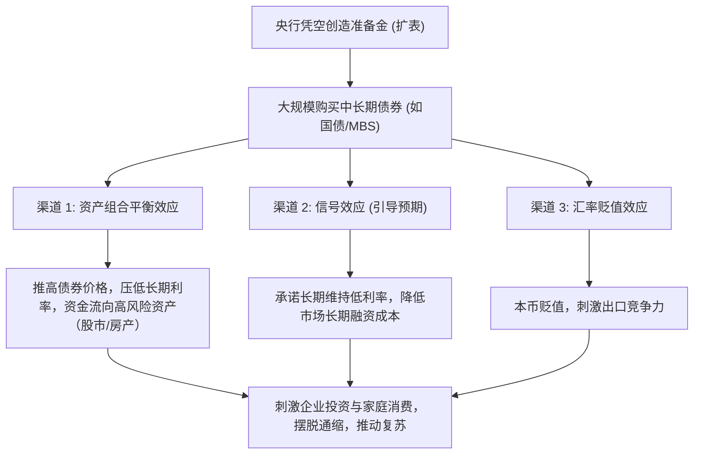
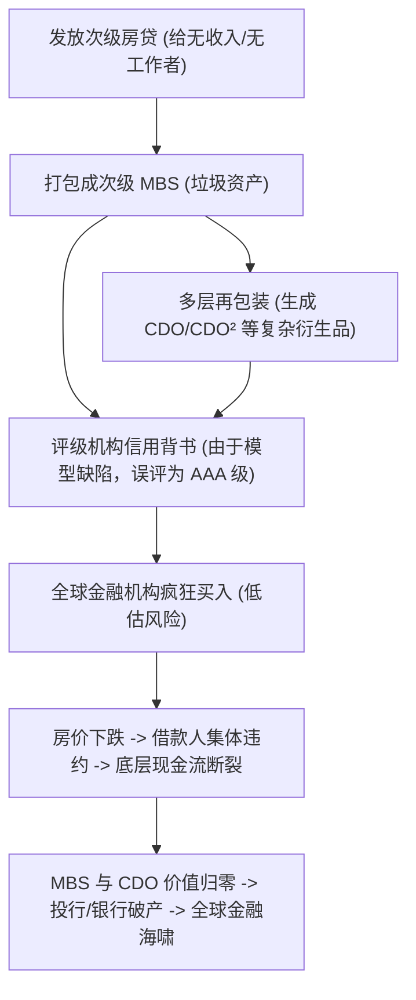

## 图灵陷阱（The Turing Trap）

**图灵陷阱（The Turing Trap）**是指==人工智能研发过度追求“模仿人类、替代人类”（即创造与人无异的类人化AI），而非“增强人类、创造新价值”，从而导致社会偏向于开发替代工人的自动化技术，抑制劳动者工资与谈判筹码，加剧财富集中，最终落入技术与社会的“双重陷阱”==。

该概念由斯坦福大学数字经济实验室主任、著名经济学家**埃里克·布林约尔松（Erik Brynjolfsson）**于 2022 年正式提出。

---

## 一、 概念起源：对“图灵测试”的反思

1950年，计算机科学之父阿兰·图灵（Alan Turing）提出了著名的“图灵测试”（Turing Test），即如果机器在对话中能够欺骗人类，让对方误以为它也是人类，那么就可以认为这台机器具有智能。

图灵测试在过去几十年中极大地激发了AI研究人员的想象力，但也产生了一个潜在的副作用：**将“像人类一样”作为衡量人工智能成功与否的终极标准**。

布林约尔松指出，当企业家、科学家和决策者把全部精力放在“制造能模仿人类的机器”上时，就会忽视AI更具建设性的潜能，进而掉入由图灵测试衍生出的“图灵陷阱”。

---

## 二、 核心机制：替代（Substitution）与增强（Augmentation）

理解图灵陷阱的核心在于区分技术对人类劳动的两种作用机制：

| 维度 | 替代型技术（Substitution） | 增强型技术（Augmentation） |
| :--- | :--- | :--- |
| **技术特征** | 复制并模仿人类已有的技能，将人从流程中剔除。 | 引入机器独有的能力（如海量数据计算、超长跨度预测），补充人类能力的不足。 |
| **对劳动力的影响** | 减少劳动力需求，导致工人失业或转入低薪岗位。 | 创造新任务、新职业，提高工人的劳动边际生产率。 |
| **对薪资的影响** | 压低被替代群体的薪资，削弱劳动者的议价能力。 | 提升劳动者价值，通常能带来薪资的增长。 |
| **财富分配** | 财富向拥有资本 and 核心算法的少数人高度集中。 | 经济收益更广泛地在劳动者、消费者和企业家之间共享。 |

---

## 三、 图灵陷阱的三大社会危害

如果社会资源一味流向“替代型AI”，将引发深远的经济与社会危机：

### 1. 劳动价值被贬低与议价筹码丧失
当AI能够完美替代某项工作时，该岗位的劳动力供给在经济学意义上相当于“无限多”。这会导致：
* 工人失去与雇主谈判工资的筹码，因为随时可以被无成本运行的AI所取代。
* 中产阶级岗位（如客服、基础程序员、初级文员、翻译等）加速流失，导致社会结构极化（Polarization）。

### 2. 财富与权力的极度集中
* **财富流向**：替代型技术带来的超额收益（Rent-seeking）绝大部分被掌握AI技术产权的科技巨头、资本家和少数超级技术精英所垄断。
* **民主机制受损**：布林约尔松指出，经济权力与政治权力是天然同盟。当劳动力的经济价值被剥夺，社会中底层群体的政治话语权也将被极度削弱。

### 3. 创新受阻（“山寨人类”的平庸）
将AI设计为人类的复制品，本质上是在用巨大的资源去“重新发明轮子”。这不仅无法拓展人类的能力边界，反而压制了那些真正能够解决人类未知挑战的“互补型/增强型”AI的研发。

---

## 四、 如何走出“图灵陷阱”？

布林约尔松提出了以下应对路径：

### 1. 改变研究范式：追求“超级智能的互补性”
AI的发展重点应当是从**“模仿人”**转向**“帮助人做不到的事”**。
* **例：** 研发能阅读海量医学文献并找出微弱药理关联的AI诊断助手，而不是研发一个只会机械模仿医生常规问诊的机器人。
* 通过“人机协同”（Human-in-the-loop），让机器负责高速计算、模式识别，人类负责直觉、共情、伦理决策 and 复杂环境适应。

### 2. 调整政策与税收激励机制
在现行的大多数经济体中，税收政策往往更有利于“资本”而非“劳动”：
* **税收不平等**：企业雇佣工人需要缴纳高昂的工资税（Payroll tax），而购买AI软件/设备却能享受折旧扣除和低税率。这变相鼓励了企业用机器替代人工。
* **政策建议**：应当平衡资本与劳动税率，甚至为那些能够**创造新任务、提升员工技能**的企业提供税收减免或研发补贴。

### 3. 赋能劳动者而非取代劳动者
开发更多“用户友好型”的低门槛AI工具（如Low-code/No-code平台、AI辅助编程等），让更多没有深厚技术背景的普通员工能够借助AI提升产出，成为“被增强的劳动者”（Augmented workers），而非被淘汰者。

## 工资税 / 薪工税（Payroll Tax）与中国的“劳动力税负”

**工资税 / 薪工税（Payroll Tax）**是指==政府对雇主的工资总额或雇员的薪资收入直接征收的税，主要用于资助国家社会保障、医疗保险、失业救济等社会福利计划==。

在西方国家（如美国），工资税（如 FICA 税）通常由雇主和雇员各承担一半，专款专用。

**在中国，并没有单一命名为“工资税”的税种。** 在经济学和公共财政学中，中国的实际“工资税”功能是由**“个人所得税（工资薪金所得）”**与**“社会保险费（五险一金）”**共同承担的。这两者共同构成了中国的**“劳动力税收楔子（Labor Tax Wedge）”**。

---

## 一、 中国“工资税”的双重构成

### 1. 个人所得税（直接税）
主要调节居民个人收入，针对工资薪金采用**七级超额累进税率**：
*   **免征额（起征点）**：每月 5,000 元（每年 60,000 元）。
*   **税率区间**：3% 至 45%。
*   **应纳税所得额** = 工资收入 - 免征额 - 专项扣除（个人缴纳的五险一金）- 专项附加扣除（如子女教育、赡养老人、房贷利息等）- 依法确定的其他扣除。

### 2. 社会保险费（“五险一金”，实质上的工资税）
虽然名义上是“费”和“基金”，但在经济学性质上，社保费具有**强制性、比例性、与工资挂钩**的特征，完全符合工资税（Payroll Tax）的经济学定义。
*   **养老保险**：个人约 8%，企业约 16%（全国统一标准）。
*   **医疗保险**：个人约 2%，企业约 6%~10%（各地有差异）。
*   **失业保险**：个人约 0.5%，企业约 0.5%~1%。
*   **工伤与生育保险**：完全由企业承担（合计约 1% 左右）。
*   **住房公积金**：个人与企业各承担 5%~12%。

---

## 二、 经济学概念：税收楔子（Tax Wedge）

在讨论工资税时，经济学家常用**“税收楔子”**来衡量劳动力市场的税负水平：
$$\text{税收楔子} = \frac{\text{雇主实际支付 of 劳动力总成本} - \text{雇员实际到手的税后净收入}}{\text{雇主实际支付 of 劳动力总成本}}$$

### 中国的税收楔子现状：
由于企业端和个人端同时承担了高比例 of 社保和个税：
*   **名义税率高**：如果按实际工资足额缴纳社保，企业和个人名义上的“五险一金”总费率约占工资总额的 **35% - 40%**。
*   **对企业的负效应**：推高了企业的雇佣成本，导致企业在经济下行期倾向于减少招聘、使用劳务派遣或外包（甚至加速引入AI和自动化来替代人工）。
*   **对员工的负效应**：拉大了“企业付出的成本”与“员工实际拿到手的可支配收入”之间的差距，削弱了工薪阶层的边际消费倾向（MPC）。

---

## 三、 中国“工资税”改革与政策演变

近年来，中国政府一直在努力降低“工资税”性质的负担，以激发市场活力：

1. **降费减税（减负）**：
   * 逐步降低企业养老保险缴费比例（从 20% 降至 16%）。
   * 实施个税改革，引入子女教育、赡养老人、大病医疗等**专项附加扣除**，实质性降低了中低收入群体的税负。
2. **社保征收划归税务（规范化）**：
   * 社保费的征收机构由社保经办机构全面转为**税务部门**。
   * **金税四期**上线后，税务部门实现社保和个税的数据联动，企业无法再轻易通过“按最低基数缴社保”来逃避税负，这也迫使企业必须在“合规经营”与“人工成本控制”之间做出抉择。

## 国家、政府与居民资产负债表（National, Government and Household Balance Sheets）

**国家、政府与居民资产负债表**是宏观经济学中用于衡量特定时点上国家整体、政府部门以及家庭（居民）部门的==资产存量、债务存量和净财富（所有者权益）的报表系统==。

与 GDP（反映一年内经济增量的“流量”概念）不同，资产负债表是**“存量”**概念，是衡量经济主体抗风险能力与真实财富积淀的“底账”。

---

## 一、 三大核心宏观资产负债表

### 1. 居民资产负债表（Household Balance Sheet）
反映家庭部门的财富结构与负债状况，直接决定了居民的消费意愿与投资行为。
*   **资产端**：
    *   *非金融资产*：房产（在中国居民资产中占比通常高达 60% 以上）、汽车、其他实物资产。
    *   *金融资产*：现金、银行存款、股票、基金、债券、商业保险及养老金。
*   **负债端**：房贷（最大负债）、消费贷、个人经营贷。
*   **核心指标**：
    *   **居民净资产** = 居民总资产 - 居民总负债
    *   **居民部门杠杆率** = 居民总负债 / GDP（用于衡量居民的债务负担）

### 2. Government Balance Sheet（政府资产负债表）
反映国家各级政府及其控制实体的跨期偿付能力及公共资本结构。
*   **资产端**：
    *   *行政事业单位资产*：公立学校、医院、办公楼等。
    *   *基础设施与公共资产*：公路、铁路、水利设施、未开发的国有土地等。
    *   *国有企业权益*：国家控股的非金融和金融企业股权。
*   **负债端**：
    *   *显性负债*：国债（中央政府债）、地方政府专项债与一般债。
    *   *隐性负债*：地方政府融资平台（LGFV）债务（即城投债）、养老金缺口等。
*   **核心指标**：**政府净资产（政府净财富）**。相比西方发达国家，中国政府控制了大量土地和国有企业股权，因此政府净资产通常为正且规模巨大。

### 3. 国家资产负债表（National Balance Sheet）
将国内所有机构部门（居民、政府、非金融企业、金融机构）的资产与负债进行合并抵消后，再合并**国外净资产**（如外汇储备、对外直接投资减去外资在华资产）所得到的全国总表。
*   **公式**：$\text{国家净财富（National Net Wealth）} = \text{国内非金融资产存量} + \text{对外净资产}$

---

## 二、 关键宏观机制：杠杆率转移（Leverage Shift）

在经济周期的不同阶段，三大部门（居民、企业、政府）之间的债务会在彼此的资产负债表之间进行**转移（加杠杆与去杠杆）**：
*   **居民/企业去杠杆，政府加杠杆**：当私人部门（居民与企业）因为经济衰退而主动收缩债务、减少开支时，政府部门必须通过发行国债（加杠杆）扩大公共开支，来对冲宏观总需求的下滑。
*   **政府去杠杆，居民加杠杆**：例如中国在 2015-2018 年的“棚户区改造货币化安置”期间，通过地产去库存，实质上将部分地方政府/开发商债务转移到了居民部门的资产负债表上（居民通过房贷“加杠杆”买房，政府借此变现土地使用权“去杠杆”）。

---

## 三、 核心经济理论：资产负债表衰退（Balance Sheet Recession）

该理论由日本野村综合研究所首席经济学家**辜朝明（Richard Koo）**提出，用以解释资产价格泡沫破裂后经济长期不振的微观机理。

### 1. 产生机制：
1. **资产泡沫破裂**：股市或楼市暴跌，导致居民 and 企业的资产端大幅缩水，但负债端的债务本息金额依然保持不变。
2. **陷入“资不抵债”**：即使企业和家庭仍有稳定的现金流，但在技术上已经处于破产边缘（资不抵债）。
3. **行为范式转换**：私人部门的目标从常规的**“利润最大化”**转变为**“负债最小化”**。他们会将所有赚到的资金用于偿还债务，而不是用于消费和扩大再生产。
4. **流动性陷阱与通缩螺旋**：因为没有人愿意借钱（大家都忙着还债），即使央行将利率降到零，货币政策也会完全失效。钱留在银行体系出不来，社会总需求急剧萎缩，导致长期经济通缩。

### 2. 破局之道：
在私人部门集体“捂紧钱包”修复资产负债表时，**政府必须扮演“最后的借款人”**。政府通过大规模的财政赤字直接进行基建或消费补贴，把资金重新注入实体经济，直到私人部门的资产负债表修复完成，重新恢复借贷意愿。

## 外汇储备（Foreign Exchange Reserves）

**外汇储备（Foreign Exchange Reserves）**是指==一国货币当局（通常为中央银行）所持有的、以外国货币或外币计价的、具有高度流动性的资产==。

它是衡量一个国家国际清偿能力、调节国际收支以及维护汇率稳定的重要“蓄水池”。

---

## 一、 外汇储备的核心构成

外汇储备并不是通常理解的“外币现金”，而是由多种高安全性、高流动性的官方储备资产组成的集合：
1.  **外币资产**：主要是以美元、欧元、日元等国际主要结算货币计价的**外国政府国债、公司债券、银行存款**等。其中，美国国债（Treasury Bonds）通常是各国储备资产中最核心的配置对象。
2.  **黄金储备（Gold Reserves）**：虽然黄金是传统避险资产，但在现代信用货币体系中，黄金仍被作为“最后防线”纳入国家储备体系。
3.  **特别提款权（SDR）**：国际货币基金组织（IMF）创设的一种账面资产，分配给成员国，可用于偿还 IMF 贷款或在成员国间兑换成硬通货。
4.  **IMF 储备头寸**：成员国在 IMF 的储备资产份额，随时可以无条件提取。

---

## 二、 外汇储备的来源渠道

外汇储备的积累通常是经济内外循环的结果，主要有三个来源：
1.  **经常账户顺差（主要来源之一）**：国家通过商品和服务的“净出口”（出口大于进口）赚取外币。
2.  **资本与金融账户顺差**：外商直接投资（FDI）、境外证券资本流入。
3.  **央行的外汇干预**：
    *   在强制结售汇制度下，或者为了防止本币过度升值以保护出口，央行会在外汇市场主动买入美元（抛售本币）。
    *   央行买入的外汇留在资产端形成**“外汇储备”**，而抛售的本币则转化为**“外汇占款”**，进入国内货币循环。

---

## 三、 外汇储备的“双刃剑”效应

在宏观经济学中，高额的外汇储备并非多多益善，它具有明显的正面防御价值与潜在的负面结构代价：

### 1. 正面效应（为什么国家需要它？）
*   **汇率稳定器**：当本币面临贬值危机和资本外逃时，央行可以抛售外汇储备、买回本币，从而平抑汇率波动，防止金融危机。
*   **国际清偿力**：保障国家能够按时偿还外债、支付进口物资。
*   **信用背书**：充足的储备能向国际投资者证明该国的金融安全度，降低主权融资成本。

### 2. 负面效应与代价（为什么不能无限增长？）
*   **基础货币被动超发（外汇占款压力）**：央行每增加一美元的外汇储备，就必须在国内市场投放等值的人民币（即外汇占款）。这会导致基础货币被动超发，极易引发国内通货膨胀和资产价格泡沫（如楼市、股市暴涨）。
*   **巨大的机会成本**：外汇储备主要投资于低收益、高安全性的外国国债（如美债，收益率通常较低）。如果将这些巨额资金用于国内基建或购买技术设备，可能会产生高得多的边际社会回报率。
*   **贬值与资产缩水风险**：如果主要配置于美元资产，当美元发生长期通胀、量化宽松（QE）或对该国发起金融制裁时，储备的实际购买力将面临严重缩水或被冻结风险。
*   **掩盖内需不足的结构问题**：长期依靠出口导向和积累顺差支撑经济，可能推迟消费驱动型增长模式的转型。

---

## 四、 中国外汇储备概况

中国的外汇储备规模常年位居**全球第一**。
*   **规模现状**：中国外汇储备保持在 **3.2 万亿至 3.4 万亿美元** 之间的充裕水平。
*   **管理机构**：由国家外汇管理局（SAFE）负责日常投资运营。为了追求更高回报，中国在 2007 年成立了**中国投资有限责任公司（CIC，中投）**，将部分储备资金进行主权财富基金式的全球多元化资产配置。
*   **战略方向**：近年来，为防范地缘政治风险和美元信用下行，中国在逐步减持美国国债，同时大幅增加黄金储备及非美元资产的配置。

## 全球三大货币（The Three Major Global Currencies）

**全球三大货币**在国际金融中是指==在全球外汇交易、国际支付结算和各国官方储备中占据绝对主导地位的三种货币==。

在不同的金融衡量维度下，除了**美元（USD）**与**欧元（EUR）**稳居前两位外，第三大货币的定义在**日元（JPY）**、**人民币（CNY）**和**英镑（GBP）**之间因指标不同而有所差异。

---

## 一、 衡量全球货币地位的三大维度

| 维度指标 | 第一名 | 第二名 | 第三名 | 竞争/变动情况 |
| :--- | :--- | :--- | :--- | :--- |
| **外汇市场交易量** (BIS口径) | **美元（USD）** (约 88%) | **欧元（EUR）** (约 31%) | **日元（JPY）** (约 17%) | 日元作为避险货币与高流动性货币，在外汇交易中稳居第三（英镑约为 13% 居第四）。 |
| **国际储备资产** (IMF SDR权重) | **美元（USD）** (43.38%) | **欧元（EUR）** (29.31%) | **人民币（CNY）** (12.28%) | 人民币于 2016 年加入 SDR 篮子，2022 年权重上调后稳居**第三**，超越了日元（7.59%）和英镑（7.44%）。 |
| **国际支付结算** (SWIFT口径) | **美元（USD）** (约 46-48%) | **欧元（EUR）** (约 22-24%) | **英镑（GBP）** (约 6-7%) | 在日常跨境支付中，英镑常年位居第三，人民币与日元在 3.5%-5.5% 之间竞争第四和第五位。 |

*注：BIS（国际清算银行）外汇交易量比例加总为 200%，因为每笔交易涉及两种货币。*

---

## 二、 三大货币的角色与特征

### 1. 美元（USD）—— 全球超级霸权货币
*   **地位**：绝对核心。占全球官方外汇储备约 58-60%，全球近一半的国际贸易和 80% 以上的外汇交易以美元结算。
*   **支撑力量**：美国强大的经济体量、全球第一的军事实力、极度深厚的资本市场（美债）、以及自 1970 年代确立的**“石油-美元”协议**。
*   **属性**：全球终极避险资产（Safe Haven Asset）。

### 2. 欧元（EUR）—— 区域联合的第二大货币
*   **地位**：全球第二大储备与结算货币。占全球官方外汇储备约 20%，是欧元区 20 个国家的法定货币。
*   **支撑力量**：欧洲单一市场的经济实力，以及欧洲央行（ECB）的独立信誉。
*   **属性**：美元最大的制度性替代者，但在地缘政治危机（如俄乌冲突、欧洲能源危机）期间易受拖累。

### 3. 第三名之争：日元 vs 人民币 vs 英镑
#### 选项 A：日元（JPY）—— 传统避险与套利天堂（G3 货币成员）
*   **优势**：日本是全球最大的净债权国，日元流动性极高，且长期处于极低利率（甚至负利率）环境，是全球最主要的**“套利交易（Carry Trade）”**拆借货币。每当全球爆发危机，资金往往回流日本，推升日元，使其成为公认的避险货币。

#### 选项 B：人民币（CNY）—— 增长最快的实体贸易结算与 SDR 第三权重币
*   **优势**：依托中国作为全球第一大货物贸易国的地位。在 IMF 的 SDR（特别提款权）篮子中，人民币权重占 12.28% 位列第三。
*   **限制与趋势**：由于尚未完全实现资本项目下的自由兑换，人民币在资本市场交易中的占比低于日元和英镑，但通过人民币跨境支付系统（CIPS） and 双边本币结算协议，其在实体贸易结算中的使用率正加速上升。

#### 选项 C：英镑（GBP）—— 老牌帝国金融遗产
*   **优势**：得益于伦敦作为全球最大外汇交易中心的地位，以及深厚的普通法系信用和历史渊源。在 SWIFT 支付体系中，英镑在跨境资金流拨中依然保持着极高的市场份额。

## 量化宽松（Quantitative Easing, QE）

**量化宽松（Quantitative Easing, QE）**是指==中央银行在常规货币政策工具（如降低短期利率）已无空间时，通过在公开市场大规模购买中长期国债、企业债券、抵押贷款支持证券（MBS）等资产，直接向金融体系注入大量流动性（基础货币）的非常规货币政策==。

它属于“量化”的操作（即明确设定资产购买的金额规模）和“宽松”的信用导向。

---

## 一、 为什么实施量化宽松？（触发背景）

在正常的经济调控中，央行通过调整**短期基准利率**（如降息）来刺激经济。但当面临重大金融危机或极度通缩时：
1.  **零利率下限（Zero Lower Bound）**：短期利率已经被降至 0% 或负利率，无法再通过降息来刺激贷款。
2.  **流动性陷阱（Liquidity Trap）**：市场陷入极度恐慌，商业银行宁可把资金存回央行，也不愿放贷给企业；企业和个人也不愿借贷投资（即资产负债表衰退状态）。
3.  **常规政策失效**：此时，央行必须跳过商业银行这一中间环节，直接下场买入资产，以增加货币供给。

---

## 二、 量化宽松的运作机制与传导渠道

当央行实施 QE 时，主要通过以下几个核心渠道对宏观经济产生作用：

1.  **资产组合平衡效应（Portfolio Balance Effect）**：
    *   央行买入国债等安全资产，使这些资产的供给减少、价格上升、**收益率（长期利率）下降**。
    *   迫使投资者（如养老基金、保险公司）将资金转移到股票、公司债、房地产等风险较高、回报也更高的资产中，从而推高资产价格，形成**“财富效应”**。
2.  **信号效应（Signaling Effect）**：
    *   QE 向市场发出了强烈的信号：央行将长期维持宽松环境。这降低了市场对未来利率上升的预期，稳定了长期金融预期。
3.  **汇率贬值效应（Exchange Rate Effect）**：
    *   大规模印钞使得本国货币供给增加，同时本国长期利率走低，导致外资流出，本币汇率面临贬值。这有利于提高本国出口商品的国际竞争力。

---

## 三、 量化宽松的“双刃剑”效应

### 1. 正面效应（挽救经济）
*   **防止大萧条**：在 2008 年次贷危机及 2020 年新冠疫情期间，美联储的极速 QE 成功避免了金融市场连环暴雷，维持了市场的基本运转。
*   **降低长期融资成本**：使企业能够以极低的成本发行企业债进行融资度过危机，家庭能享受低息房贷。

### 2. 负面效应与副作用
*   **加剧贫富分化（拉大基尼系数）**：QE 释放的大量资金流入金融资产（股市、楼市），推高了资产价格。而社会的富裕阶层持有绝大多数的金融资产，导致他们的财富在危机中不降反升，而主要依靠劳动收入的中低收入群体则承受着随之而来的物价上涨压力。
*   **通货膨胀螺旋**：如果 QE 的规模过大（例如 2020 年无限量 QE），一旦供应链受阻或经济复苏，极易引发高烧不退的严重通胀。
*   **资产泡沫与债务积聚**：极低的资金成本催生了大量资产泡沫，促使企业和政府过度借贷，推高了宏观杠杆率。
*   **僵尸企业（Zombie Conglomerates）泛滥**：低利率让本该被市场淘汰的低效、高负债企业能够靠借廉价新债还旧债苟延残喘，阻碍了市场的良性“创造性毁灭”。

---

## 四、 退出机制：量化紧缩（QT）

量化宽松不能无限进行，当经济复苏、通胀抬头时，央行必须实施退出策略，即**量化紧缩（Quantitative Tightening, QT）**。
*   **操作方式**：央行通过让持有的债券自然到期不再续买（被动缩表），或在公开市场直接出售债券（主动缩表），来收回金融体系中的基础货币。
*   **风险**：退出过程如果太急，容易引发金融市场的剧烈动荡（如 2013 年的“缩减恐慌” Taper Tantrum），导致资产价格暴跌和新兴市场资金外流。

## 住房抵押贷款支持证券（Mortgage-Backed Securities, MBS）

**住房抵押贷款支持证券（Mortgage-Backed Securities, MBS）**是指==金融机构（通常是商业银行）将流动性较差的个人住房抵押贷款资产打包汇聚成资产池，通过结构化增信与隔离，转化为可在二级市场上交易和流通的证券产品的过程与工具==。

它属于**资产证券化（Asset-Backed Securitization, ABS）**中最具代表性的一类。

---

## 一、 MBS 的核心运作流程

MBS 实现了将“长期低流动性贷款”向“短期高流动性证券”的转换，其标准流程如下：

1.  **贷款发放（Originating）**：商业银行向购房者发放个人住房抵押贷款（即按揭贷款）。
2.  **资产打包（Pooling）**：银行将数千笔期限、利率相近的房贷打包汇聚，形成一个规模庞大的**“资产池（Asset Pool）”**。
3.  **真实出售与隔离（True Sale & SPV）**：
    *   银行将资产池“真实出售”给一个独立的特殊目的机构（Special Purpose Vehicle, **SPV**）。
    *   此步骤的核心是实现**“破产隔离”**——即使发起贷款的银行未来破产，资产池中的房贷本息现金流也仅用于偿付 MBS 投资者，不受银行债务清算影响。
4.  **结构化分层（Tranching）**：SPV 根据风险与收益偏好，将证券划分为不同等级（Tranches）：
    *   **优先级（Senior Tranche）**：信用等级最高（通常为 AAA），最先获得偿付，利率较低，风险极小。
    *   **夹层（Mezzanine Tranche）**：中等风险与收益。
    *   **次级/股权级（Equity Tranche）**：风险最高，最后获得偿付（承担第一笔违约损失），但收益率也最高。
5.  **证券发行与资金回笼**：证券卖给投资人（如基金、保险公司），回笼的资金返还银行。银行可以用这笔资金发放更多的新贷款。

---

## 二、 经济学功能：为什么金融市场需要 MBS？

*   **释放银行资本流动性**：房贷通常长达 20-30 年。通过 MBS，银行可以在几周内收回大部分资金，大幅提高了资金周转率（Velocity of Capital），能支持更多的居民购房。
*   **风险分散与转移**：银行通过把房贷卖出，将长期的信用风险（借款人违约）和利率风险转移给了全球的投资者，分散了银行体系的系统性风险。
*   **为投资者提供多样化工具**：MBS 提供了现金流相对稳定、评级高、且收益率通常高于同期限国债的投资选择。

---

## 三、 MBS 泡沫与 2008 年次贷危机（Subprime Crisis）

MBS 是一种伟大的金融工具，但在缺乏监管和过度逐利的环境下，它成为了次贷危机的核心策源地。其演变出的“有毒资产”链条如下：

1.  **次级贷款（Subprime Lending）滥发**：为了获取高额的证券化发行费，银行向无工作、无财产、无收入的“三无”群体发放房贷（次级贷款）。
2.  **过度衍生化与 CDO**：投行将次级贷款打包成次级 MBS，并进一步将这些 MBS 的劣后级再次打包，包装成更加复杂的**担保债务凭证（CDO）**。
3.  **评级失效（Rating Failure）**：穆迪、标普等信用评级机构使用存在缺陷的关联性数学模型，将实际上由“垃圾房贷”支撑的 CDO 评为最高信用等级（AAA），欺骗了全球的保守型机构投资者。
4.  **崩盘传导**：2006 年起美国房价调头向下，次级贷款违约率飙升，导致资产池现金流瞬间枯竭。价值万亿美元的 MBS 和 CDO 沦为“有毒资产”，直接导致雷曼兄弟破产、美林被收购，引发了自 1929 年大萧条以来最严重的全球金融危机。

---

## 四、 危机后的监管反思

次贷危机后，全球金融界对 MBS 的游戏规则进行了重大重塑：
*   **风险留存机制（Skin in the Game）**：规定证券发起人（银行/投行）必须在自己的资产负债表上保留至少 5% 的所发行证券风险（即不能把烂贷款 100% 卖光，必须同甘共苦），以倒逼其严格审查贷款质量。
*   **底层资产穿透披露**：发行方必须向市场清晰、透明地披露资产池中每一笔贷款的实际借款人信用状况。
